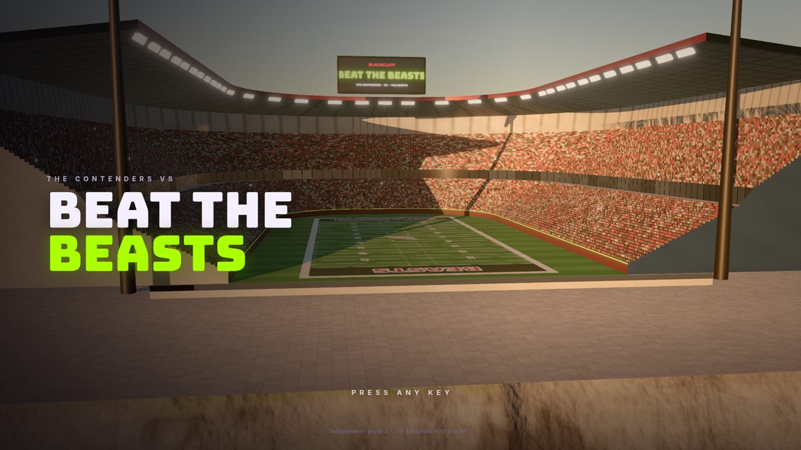
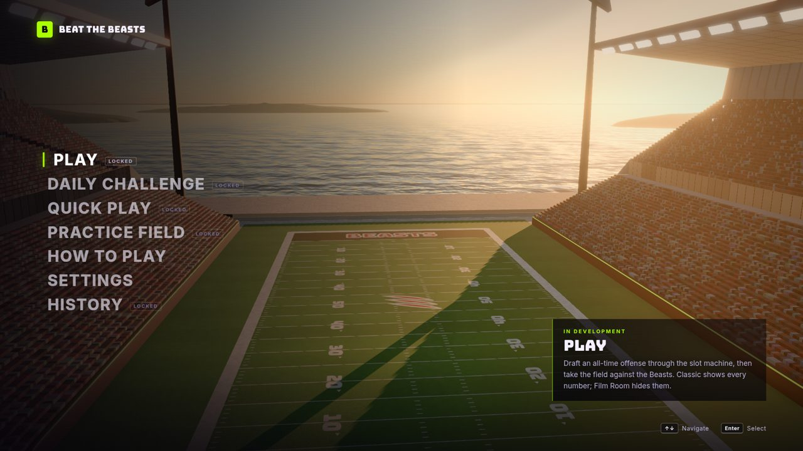
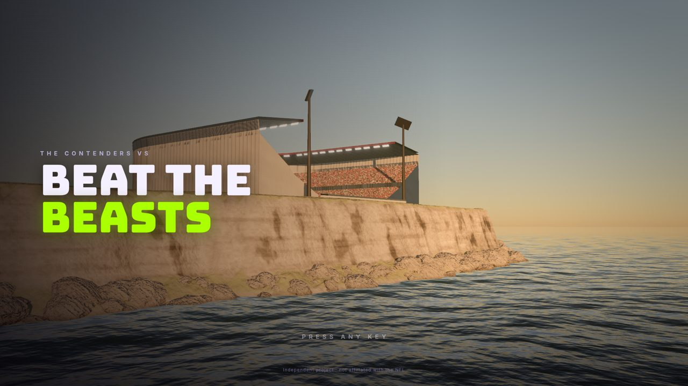
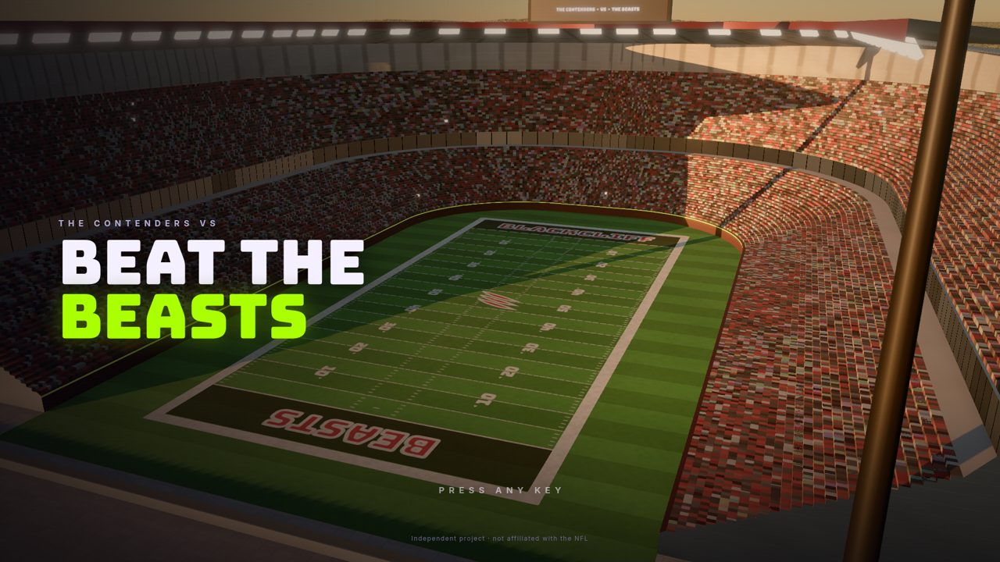
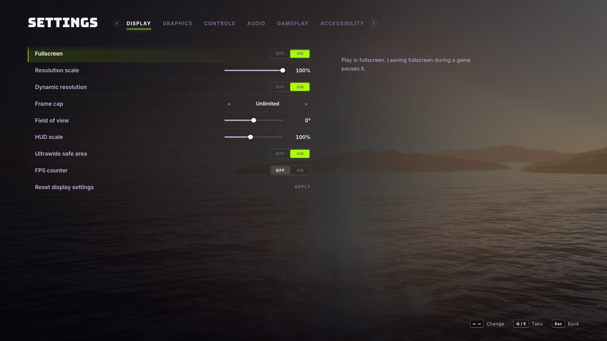
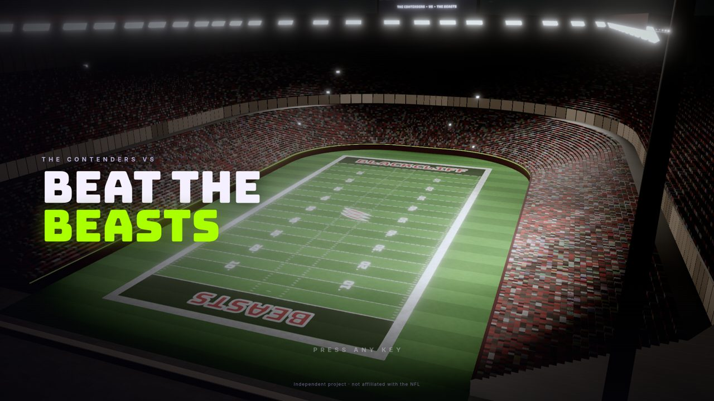
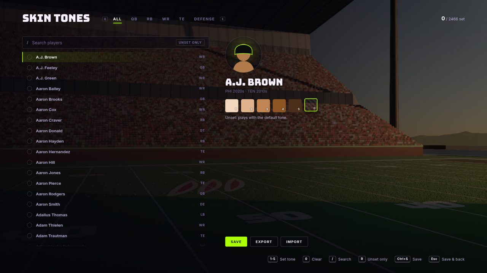

# Progress log

## Current status

- **M1 Foundation:** merged (PR #1).
- **M2 Ratings:** merged (PR #2 and the follow-up PR #3: traits overhaul, Throw Power, consensus check, anchor bands, the approved fixes and round 2).
- **M3 The look:** merged (PR #4). Perf re-test passed on your M1 Pro: Medium at 100% resolution, 80–113 fps in the three menu views.
- **M4 Characters and animation:** merged (PR #5).
- **M4.5 Character and animation quality pass:** merged (PR #6).
- **M5 Core play:** merged (PR #7), with the quick pass (pass camera, 1/2/3 catches, arrows, Q–F moves).
- **M5.5 Game feel:** built on `claude/m5.5-game-feel`, PR open. Prompts in every phase, open receivers, the landing reticle, the tutorial, more pocket time, field boundaries, route preview and hot routes, blended transitions, latency measured, and three feel videos in `docs/screenshots/m5.5/`. **Needs your play test.**
- **Next: M6**, which opens with the draft room (3D draft over the stadium, the video-board slot machine, the ported draft rules, the Scouting panel), with the Practice Field playing the drafted roster. The tunnel reveal and pre-game cinematics stay in M7.

## Known legacy issues (do not rebuild)

These are bugs and dead ends found in `legacy/beat-the-beasts.jsx` during planning. The new game must not reproduce them. Line numbers refer to the legacy file.

| # | Legacy issue | Where | What the new game does instead |
|---|---|---|---|
| L1 | **Daily Auto-Draft guarantees a win.** Auto-Draft is shown in the Daily and loads `daily.perfect`, which matches a `topLineups` entry and sets `forceWin`: a one-click guaranteed win. It also silently throws away picks already made, in every mode | `GameScreen` 9193–9233, `handleRunSim` 9150–9184 | No Auto-Draft in the Daily. No `forceWin` in played games. Auto-Draft (Classic, Film Room, Quick Play) keeps picks already made (GDD §6.2, §15 D3/D8) |
| L2 | **Share Results probably crashes.** `RecapModal` portals with `ReactDOM.createPortal`, but `ReactDOM` is never imported (line 1 imports only React). The card also shows the QB's career passer rating as "QB RATING" (a stat leak in Film Room and Daily), uses today's date instead of the Daily's date, and lists only 4 of the 9 players | `RecapModal` 8610–8750 | A share card rebuilt from scratch: this game's QB line, the Daily's date key, the full lineup (GDD §14) |
| L3 | **The skin-tone editor is unreachable.** `HomeScreen` receives `onOpenEditor` but never renders a button, so `CharacterizationEditor` can't be opened, and `skinHexFor` always returns the default `#b07a4a`. It also stored data in a Claude-artifact API (`window.storage`) rather than anywhere durable | `HomeScreen` 5513, `CharacterizationEditor` 9549, `skinHexFor` 6749 | The editor is carried over, reachable from Settings → Gameplay → Skin-tone editor, and saves to `data/characterization.json` in the repo |
| L4 | "New Beasts" (reveal) and "Face New Beasts" (results) both just go to the home menu | 6449, 8320 | Buttons do what they say |
| L5 | Daily: a round with no legal pick (possible through the duplicate-name rule) has no way out, because skips are hidden in the Daily | `spinSlot` 9053 | A deterministic backup pair from the date seed (GDD §6.1 rule 8) |
| L6 | The duplicate-player rule compares names, so homonyms block each other (for example, three different Mike Williamses) | `getAvailablePicks` 4087 | Person ids (GDD §15 D9) |
| L7 | Film Room and Daily leak information: OL unit blurbs, Beast stats with a hidden "*" footnote, post-game career-stat popups | `PickCard` 5740, `BeastChip` 6285 | Explicit Film Room rules (GDD §15 D11) |
| L8 | Captions can print "null" ("Intercepted by null!") when the sim has no named player | `simulateBeatdown` 5196–5216, `captionFor` 8246 | Caption bank with a fallback for every slot |
| L9 | The Beasts' score is sprinkled randomly across the cinematic timeline, and a 1-point remainder is labeled a field goal | 5326–5384 | Per-possession Beasts results (GDD §7.3) |
| L10 | The slot-tile decade label shows "19'" / "20'" instead of "70'" | 9479 | New UI |
| L11 | The key matchup verdict is hardcoded "WR WON / CB WON" even for TE and safety matchups | `ResultScreen` | "REC WON / DEF WON / EVEN" |
| L12 | Dead code: `YearWheelScreen` and `simulateSeason` (season mode), `WindChip`, `ProgressDots`, `ScoreBoard`, `ClockPanel`, `DnDPill`, `TEAM_COLORS` (never called), the whole Odds Lab | various | Not ported. `TEAM_COLORS` is used for draft accents; the drive strip is revived in the HUD |
| L13 | `todayKey` uses the player's local date | 4606 | Kept on purpose (Wordle-style: the daily flips at local midnight) |

## Milestone log

### M5.5 Game feel (built, PR open)

Your notes from the M5 play test, in the order they affect play: prompts and readability first, then the pocket, the field's edges and the fluidity work, and last the videos so you can judge feel between sessions.

**1. Prompts: always on screen, at the moment they matter.** They follow your bindings and switch with the device.
- **Pre-snap:** the snap key, large; "1–5 are your receivers, in read order"; hold Tab to see the routes; H for a hot route. The icons carry the receiver keys.
- **Pocket:** move, throw (tap/hold), placement, pump, throw away, and an open/covered legend.
- **Ball in the air:** the 1/2/3 catch call, large and centred. The one you press lights and grows; the others fade.
- **Ball carrier:** Q juke, W stiff arm, E spin, Shift sprint and his stamina ride under his feet the whole time he has the ball. Truck, dive and protect sit in the bottom row.

**2. Seeing what to do**
- **Open receivers:** icons glow and pulse when the man is open and dim when he's covered. This uses the sim's own openness estimate, read without touching the play. The thresholds come from 1,200 scripted throws: 1–3 yd of separation completes about 65% with no interceptions; 2+ yd inside the defender completes about 40%, with 7–8% intercepted.
- **Landing reticle:** a lime ring on the turf where the held throw would land, sized to the throw's error cone.
- **Tutorial:** a first-play card in Practice Field walks through snap, read, throw, catch and run once, following the play without waiting. The pause menu can skip it or show it again.
- **Slowed first catch:** the session's first catch plays at 0.6x, eased in and out.

**3. Pocket time.** The rusher's base drift against a pass set went from 0.55 to 0.3. The median sack with no throw is now **4.53 s at Pro (was 3.70)**. The ratings spread holds and widens: the best pass-blocking unit in the snapshot holds 4.40 s and the worst 3.63 s (was 3.68 and 3.25). `tools/sim/sacktime.ts` measures it, and a test pins both the median and the gap.

**4. Fluidity**
- **Carrier moves (sim):**
  - A move's change of velocity builds over its plant (juke 5 ticks, spin 6, dive 3) instead of in one tick.
  - A move pressed during the last one is buffered for 0.15 s and fires when he can start it.
  - A sharp cut at speed slows him into the plant: a 90° cut asks for 77% speed, a reversal 60%.
  - Letting go of the stick coasts him down instead of stopping him dead.
- **Blends (render):** the pop meter (`?pops`) logs any bone turning faster than 30 rad/s (45 for legs) and names the clip and state behind it.
  - It found defensive backs flipping 180° in one frame between the pedal and turning to run (72–94 rad/s). The drawn facing now turns at most 12 rad/s, eased.
  - The gait's speed is eased over 60 ms, so a juke doesn't jolt the stride.
  - Transition fades went from 0.08 to 0.14 s (out 0.16), and overlay fades to 0.13/0.16 s.
  - The sack clip went from 126 spikes to 14. What's left is authored fast motion: the throwing arm, the tackle's wrap, the get-up, and the get-offs' arm punch at 31–34 rad/s. None of it is a cut.
- **Camera:** every change eases through springs. It rides the ball on a pass, settles behind the carrier, and **after a sack now holds on the ball**. The recorded sack caught it flying to the offense's own end zone, which also happened in play.
- **Latency:** see the gate below.

**5. Field boundaries and touchdowns** (your bug reports)
- **Out of bounds:** the carrier is out the moment a foot touches a sideline or an end line, and is spotted where he went out.
- **Catches:** a catch out of bounds (toe-tap only on a possession catch) or behind an end line is incomplete. An interception return out the back is a touchback.
- **Touchdowns:** the lines are taken in the order he met them within the tick. It's a score only if the ball reached the goal line in bounds first. Out before the pylon is out of bounds short of the goal line.
- **AI:**
  - Routes keep 1.5 yd inside the sideline and stop short of the end line, settling along it.
  - Pursuit stays inside the field.
  - AI carriers never pick a lane through the line, and step out rather than take a hit on the sideline.
- **Everyone else** is held within a step of the field while the play is live.
- **Tests:**
  - no player more than a step outside and no live carrier past an end line, across AI plays and users running for the lines;
  - out before the pylon isn't a score, in-then-out is;
  - the ball held past the end line isn't a score;
  - a catch behind the end line is incomplete.

**6. Route preview and hot routes** (pulled from M6)
- **Route preview:** hold Tab (RT on a gamepad) before the snap to draw every route on the turf in the play call's art. It's built from the function the sim runs routes from, so it can't disagree with the play.
- **Hot routes:** H, then the receiver's number, then his route: go, out, in, slant, curl, comeback, flat or hitch. Pick by number, or with the arrows and Enter; on a gamepad, Y, his button, the D-pad and A. The art previews the focused route with the others faded.
- **In the sim:** the call goes in as an input, so a replay has it, and he runs the new route from the snap. "In" and "comeback" are new routes. Flip play moved from Tab to F; settings v4 moves it and keeps a rebound key.

**7. Videos.** `BTB_VIDEO=1 npm run shots` records the scripted clips in `src/game/clips.ts` from the broadcast camera: 30 fps, real speed, encoded with ffmpeg. Each has its pop log next to it.
- `docs/screenshots/m5.5/completion-rac.mp4`: Four Verticals against Cover 3, caught at ~45 yd, 18 more after the catch with a juke.
- `docs/screenshots/m5.5/sack.mp4`: the QB holds it and the four-man rush gets home at 4.4 s.
- `docs/screenshots/m5.5/broken-tackle.mp4`: a stiff arm sheds the first tackler, 13 yd after the catch.
- These are recorded at Low on the software renderer here. The look is judged on the screenshots; the videos are for motion and timing.

**Gate**
- Prompts and open indicators in every phase: pre-snap, pocket, air and carrier (screenshots, and the pre-snap browser test).
- Sack time at target: 4.53 s median at Pro.
- **Latency: every measured key responds under 100 ms** (`e2e/latency.spec.ts`: real key presses on a fixed 60 Hz frame clock, so N frames = N × 16.7 ms on hardware that holds 60 fps; figures in `docs/screenshots/m5.5/latency*.json`).
  - Snap: 1 frame (17 ms).
  - Pocket movement: 3 frames (50 ms, the velocity visibly turning toward the key).
  - Throw hold (the ring): 1 frame. Release to the throw motion: 1 frame.
  - Catch call lit: 2 frames (33 ms).
  - Carrier: movement 1 frame, sprint 2 frames (33 ms), and the juke, stiff arm and spin clips each start 1 frame (17 ms) after the key.
  - Truck, dive and protect weren't measured this run (the play ended before them); they go through the same path as the stiff arm.
  - The test also caught a bug: a receiver tap shorter than a tick was lost. It's fixed.
- The three videos: done.
- `npm run check` passes (427 tests), and the browser suite passes: 8 practice and How to Play tests, plus the 2 latency tests.

**Critique** (from the play-through screenshots and the video contact sheets)
- **What works:**
  - The play now tells you what to do at each moment without a key to remember.
  - The catch call is readable from across the room.
  - The carrier's keys follow him.
  - The route preview reads like the play call's art on the grass.
  - In the videos, the pass camera's ride and push-in, the carrier follow, the tackle and the get-up all read as one continuous play.
- **What's weak:**
  1. Early in a route most icons read as covered: before the break a receiver isn't a target yet (the sim's rule), so the glow mostly appears from the break on. That's right for the read, but the first beat after the snap is mostly grey.
  2. Run after the catch only really happens on deep routes. On the short concepts (stick, smash, mesh) the catch and the tackle are almost the same moment. That's a sim tuning job for M6's play book.
  3. Mesh against Cover 2 is a hole: 88% complete, ~27 yd per attempt in the harness. It was the same on `main` (29.6), so it's not new; it's an M6 coverage fix.
  4. The get-offs' first arm punch is still quick (31–34 rad/s). It's authored that way, but it may read as a twitch at the snap.
  5. The videos are software-rendered at Low, so shadows and crowd are thinner than on your machine.

**Needs you**
- **The play test,** Main menu → Practice Field. What I'd most like your read on:
  - the pocket at ~4.5 s;
  - whether the open/covered glow matches what you see;
  - the landing ring;
  - hot routes;
  - how Q/W/E feel with the plant and the buffer.
- **The perf check on the preview** as before (`?perf`): the new HUD and the route art are cheap, but the icons now update every frame.

**Known issues and limits**
- Openness is judged every 4 frames (cheap, and fast enough for the glow).
- The tutorial is one play long by design. Show it again from the pause menu.

### M5 Core play (merged, PR #7)

Built in the order you asked, so the parts you can't test here didn't wait on the parts I can.

**0. Carried over from M4.5**
- Cris Carter's anchor accepts 96+, kept on Catch in Traffic (38 of 42 anchors pass, as before).
- The two perf cuts for the 60 fps broadcast gate:
  - Medium's ambient occlusion already ran at a quarter of the pixels (half resolution each way); it now also uses the smallest sample set (N8AO 'performance').
  - On Low and Medium, a camera above 7 m draws 75% of the crowd (`CROWD_HIGH_CAMERA`): from there a spectator is a few pixels. The threshold sits under the play's broadcast camera (8.5 m), so the cut applies during play.

**1. The pure simulation (`src/sim`, no GPU, no React)**
- Fixed 60 Hz, seeded streams and the deterministic math only (ESLint now also bans `Math.sin/cos/atan2/exp/log/pow` and `**` in the sim).
- **Ratings to physics** (`effects.ts`): top speed and the sprint time constant are solved from each player's own 40 and 10-yard split (the inverse of the ratings scale), so a 4.30 man runs a 4.30. Cuts and turns come from Agility; release time, arm speed, range and the error cone from the passing ratings (GDD §9.1).
- **The ball:** 3D flight with drag. A throw is solved to a lead point (touch or bullet) and moved by placement and the accuracy cone (depth, on the run, pressure, footwork). A touch pass lofts by distance: ~1.1 s at 15 yd, ~2.3 s at 35 from a 90 arm.
- **Catching:** the closest approach of the ball to the hands, a contest strength from nearby defenders, the catch type and the catching ratings; defenders break up or intercept by position and Ball Skills. Linemen are ineligible.
- **Plays as data:** two formations (Shotgun Trips, Shotgun Doubles), four passes (Stick, Four Verticals, Smash, Mesh), and Cover 1, 2 and 3 from a base 4-3 aligned to the formation.
- **AI:** routes with break sharpness from route running; pass protection; the QB's reads and clock; man coverage on a delayed read of the receiver; zone drops with read steps and pass-offs; pursuit angles; a ball-carrier lane read by Vision.
- **Pass rush vs OL:** engagements whose leverage drifts with the matchup. Bull rushes push the pocket back; speed rushes arc round.
- **Tackling:** separation, then a resolution from the approach, mass and ratings (form tackle, arm tackle, dive, big hit, broken, missed); carrier moves with cooldowns and spam fatigue; fumbles.
- **Harness** (`npm run sim:harness`, 720 AI-vs-AI plays against the all-time defense): 63% completions, 3% interceptions, 3% sacks, 11.1 yards per attempt, no stuck plays. When the QB never throws, the median time to a sack is 3.7 s.
- **Tests:** determinism, the 40 from the rating, the throw solve, every play vs every coverage reaching a whistle, outcome bands, and a measurable 10-point gap for Speed and for pass-rush moves.
- **Designed runs moved to M6.** Inside zone is built and tested, but the run game needs M6's schemes and run fits before it's honest, so the M5 book is passes only.

**2. Input and cameras: the Practice Field (Main menu → Practice Field)**
- **Free play against the Beasts:** pick a play, a start spot (own 25 to the goal line), a down and distance, and a coverage (or let the Beasts choose). The series carries on from each result, and resets on a score, a turnover or a failed fourth down.
- **Play call over the live stadium:** the play art is drawn from the sim's own route data, with the read numbers.
- **Controls** (GDD §8), keyboard, mouse and gamepad:
  - snap;
  - pocket movement (camera-relative);
  - receiver icons 1–5 or A/B/X/Y/RB, or click an icon: a tap throws a touch pass, a hold charges a bullet (the power ring fills);
  - placement from the mouse's offset from the icon, or the left stick (the reticle shows it);
  - pump fake, throw away;
  - catch type while the ball is in the air (aggressive, run after catch, possession);
  - carrier sprint (a stamina bar), juke, spin, stiff arm, truck, dive, protect.
- **Cameras:**
  - Broadcast: behind the offense, pulling up and back while the ball is in the air, following the carrier with look-ahead, and swinging to a high sideline angle on a long run (the controls keep their frame through that swing).
  - All-22 and field level on F2 and F3.
  - Hits shake the camera by their force (Reduce Camera Shake scales it down).
- **HUD:** score bug, the line of scrimmage and the line to gain on the turf, the prompts from your current bindings, the result card (next play, run it back, leave), a pause menu. The crowd reacts to touchdowns, turnovers, sacks and big hits.
- **Runtime:** the sim runs at a fixed 60 Hz in a top-priority frame callback, at most five ticks a frame, and the render interpolates. React only sees stage and phase changes. Every input frame is recorded.

**3. The M5 animation set (`tools/blender/lib/actions.py`; 58 of 58 clips pass, `docs/ANIMATION.md`)**
- **QB:**
  - three- and five-step shotgun drops, planned by distance (each plant stays down while the body passes within 22 cm of it);
  - the pocket set;
  - the throw: load, stride, the elbow at shoulder height, release at frame 11, follow-through across the body. It plays full-body when he's set and upper-body only on the run, and it's time-scaled so the release frame lands on the sim's release.
- **Upper-body overlays** (masked to the arms and trunk, laid over whatever the legs do): the ball tucked high and tight, protect, the QB's two-hand hold, the catch at the chest and overhead (secured at frame 6, timed to the ball's arrival, then tucked), the stiff arm, the truck's forearm shield, the pump fake.
- **Carrier moves out of the run:** jukes both ways (plant wide, sink, push off the other way), the spin (a pivot on the ball of the foot through 360°), the dive.
- **Tackles:** the tackler's form tackle (breakdown, contact at frame 8, wrap, drive, down). The tackled player falls through an **in-house verlet ragdoll** (18 points, torso bracing, knee and elbow limits, the turf with friction), seeded from his pose plus the hit's push along the tackler's line. It blends in over 0.12 s, and once he's down it hands over to the lying clip (face down or on his back) where he came to rest. After the whistle, players on the ground get up (from face down or from the back).
- **Also:** defensive backs use the backpedal cycle instead of turning to run backward, and the ball rides in the hands (between them in the QB's hold, in the fingers through the throw, tucked along the forearm).
- **Ball events:** the snap, the release, a catch secured, a hit's contact. The sim decides each moment; the clips are timed to it.

**4. Close-up polish (from the M4.5 critique)**
- **Shoulder pads:** flat-topped caps with squared corners and a lip over the deltoid, instead of the pool-float ellipsoid.
- **Jersey:** a knit-mesh micro-pattern (a 3D lattice, no UVs, faded out by the pixel footprint so it can't shimmer), and soft folds where the fabric bunches (the tuck and the sleeves).
- **Forearms:** the flexor mass, the brachioradialis ridge and the wrist tendons in the relief, with the grooves slightly darker so the shape reads under flat light.
- **Gloves:** a darker grip palm and a trim-colored cuff, so a hand reads as a hand at mid distance.
- **Sets into stances:** a small hop onto the balls of the feet and a settle a little past the stance (linemen just sink and settle).

**5. The M5 exit (TECH_PLAN §17)**
- **Scripted browser plays** (`e2e/practice.spec.ts`, real keyboard input with the sim stepped tick by tick so the play replays exactly): snap, throw, catch, run, tackle and the result card; a tackle and the next snap at the new spot; a 75-yard catch-and-run touchdown that ends the series.
- **The determinism hash matches Node and the browser:** 24 fixed plays (every play vs every coverage, AI and a scripted user). Node pins the hashes in `tests/golden/sim-hashes.json`, and the browser reproduces them bit for bit.
- `npm run check` passes (409 tests), and the browser suite passes (16 tests). One presets test timed out once while Blender renders were running alongside it, then passed on its own.

**Critique** (`docs/screenshots/m5/`: `practice-*` from the play-through at Golden Hour on High, `contact-*` from Blender, `lab-*` close-ups)
- **What works:**
  - The play reads as a football play from the broadcast camera: the formation at the line with numbered icons over the receivers, the blue line of scrimmage and the yellow line to gain, the pocket forming as the rush engages, the pull-up while the ball is in the air, and a result card with names ("Complete to Brent Jones, +5 yds. Tackled by Taylor at the Own 30").
  - The play call over the live stadium looks like a game menu, and the art is the sim's own routes.
  - Tackles are the most convincing new motion: the tackler's wrap and drive into the turf, the carrier going over through the ragdoll, both lying where they fell, and both getting up after the whistle.
  - The QB's drop and throw read in silhouette at game distance (the release frame is unmistakably a throw).
- **What's weak:**
  1. The pass rush is a scrum: linemen and rushers close together in stances and gaits, with no hands-on engagement pose. That's the M6 line-play set.
  2. The high sideline angle on a long run frames the carrier well now, but the switch to it is a big camera move: from broadcast to across the field in about a second. It may feel abrupt in play; I'd like your read before tuning it.
  3. The ball is small at broadcast distance. It's there (in the hands, on the throw, in flight) but hard to follow on a deep pass. A subtle trail or a larger read scale is an option for M7.
  4. The ragdoll's fall is short and loose in the first frames (a knee can fold oddly for a few frames before he settles); the lying clips then take over cleanly.
  5. Close up, the forearms are better (the ridge and the flexor mass catch light) but still simpler than the rest of the body, and the skin wedge at the sleeve hem is still there.
- **Pads, jersey, gloves:** the pad caps now have a flat top and an edge, which reads as a pad rather than a float. The knit shows within a couple of metres and disappears cleanly beyond that. The glove cuff reads as a band at mid distance.

**Needs you**
- **The perf re-test**, on this preview (it includes M4.5): the Practice Field from the broadcast camera during a play is now the real gate (`?perf` shows the numbers). If it misses 60 at Medium, the perf screen's internal resolution and draw calls will tell me what to cut next.
- **The play test:** Main menu → Practice Field. Things I'd most like your feel on: the pocket timing against the four-man rush, touch against bullet, the catch buttons, the juke and spin timing, and the broadcast camera's height.

**Known issues and limits**
- Designed runs are held to M6, and the play book is four passes (M6 grows it to 30+).
- "Ball in the air: Assist/Full" (taking over the receiver) isn't in yet; the catch buttons work while the ball is in the air. The bullet-hold setting isn't wired to the sim yet (the tap window is 0.18 s).
- The QB can't hand off or run a designed QB run; he can scramble.
- OL and DL engagements use the stances and gaits (the line-play clips are M6).
- No sound for the play yet (M7).

**Quick pass before the play test (your four notes)**
1. **Pass camera:** once the pass is out, the broadcast camera rides behind the ball on its line to the receiver and pushes in (about 20 yd back and 8 m up at the release, about 9 yd and 3.4 m at the catch, the lens narrowing from 50° to 38°), then settles behind the carrier. The line leans downfield, so a throw to the flat never turns the camera round to face the offense. The wide shot stays for the pre-snap read and the pocket, where you need to see every receiver. After the throw the controls keep the pocket's "up", so the camera's move never turns the carrier's arrows.
2. **Catches on 1, 2, 3:** 1 is go up and get it (aggressive), 2 is secure it and go down (possession), 3 is catch and run. A catch-call panel comes up the moment the ball is thrown; the called one lights lime and scales up, and the other two fade. No call means catch and run, and the panel says so. The mouse and Space no longer call catches.
3. **Movement on the arrows**, with sprint on either Shift (the prompts show R-Shift).
4. **Carrier moves on the left hand:** Q juke, W stiff arm, E spin, R truck, F dive, hold C to protect. The one-button juke is new in the sim: it goes to the side you're steering (relative to his heading), or with no steer, away from the nearest free defender in front of him. On a gamepad the directional jukes stay on the right stick. The HUD prompts, How to Play and the GDD's controls table all read the new keys, and rebinding still works. Saved settings move to v3: a binding still on its old default takes the new one, and a key you rebound stays.
- Checks: `npm run check` passes (413 tests: new ones cover the defaults, the v2→v3 migration and the juke side). The browser plays pass on the new keys (arrows, right Shift), including the 75-yard touchdown, and a new test presses 2 in the air and checks the panel.
- **Screenshots** (`BTB_PRACTICE=1 npm run shots`, frames `06a`–`06c`): at release the frame is still close to the broadcast view, mid-flight it has moved downfield with the ball, and at arrival the contested catch fills the right-centre of the frame above the panel. One thing to watch in play: a teammate running under the camera can cross the near foreground at the catch.

**Next:** M6 Full game, after your perf re-test and play test.

### M4.5 Character and animation quality pass (built, PR #6 open)

Your seven priorities, in order, plus the M4 weak spots and the ratings stints (the stints are in the ratings section below).

**1. Running (whole-body gait keyer, `tools/blender/lib/gait.py`)**
- The keyer now moves the whole body, not a marionette's feet:
  - pelvis bob (a spring: runners lowest at mid-stance), side shift and drop, and yaw;
  - the thorax counter-rotates, spread up the spine;
  - trunk lean scales with speed (walk 4°, jog 9°, run 13°, sprint 17.5° keyed);
  - arms swing from the shoulder in the thorax frame with the elbow held near 90° ("cheek to back pocket" at sprint);
  - heel-to-toe roll (heel strike walking, midfoot jogging, forefoot sprinting);
  - knee drive rising with speed; heel recovery;
  - a stabilized head; the pads ride a spring.
- **New gates per cycle, judged against running mechanics** (Novacheck; Schache; Mann's sprint model; Perry & Burnfield for walking): trunk lean, pelvis vertical travel, pelvis and thorax rotation, elbow range, shoulder swing, knee drive, heel recovery, foot strike and the sprint hand path. For example, sprint keys 14° of lean, 5 cm of pelvis travel, 52° of thorax against the pelvis, elbow 74–106°, knee drive 80°. All five cycles pass (`docs/ANIMATION.md`).

**2. Hands.** Gloves are now their own mesh: four thinner tapered fingers and a thumb, with a clean cuff. The finger bones are rolled so flexion closes into the palm. Four hand states that clips key: relaxed, fist (fingers to the palm, thumb across), spread and gripping a ball.

**3. Body**
- A thicker neck on trapezius slopes into the helmet, with neck straps, a chin strap, and a collar band plus undershirt surface closing the opening.
- Skin under the pads and collar is culled (it z-fought through the jersey edge).
- Skin material: roughness variation, no plastic gloss, muscle relief on the arms and neck.
- M4 weak spots:
  - fitted pants with a snug knee band, and a shorter tuck;
  - the pants hem no longer opens at full knee flexion (the crotch weights were blending the inner legs down to the knee);
  - loose, bent idle arms;
  - no hood at the collar (the pads are rigid on the chest);
  - TV numbers on the sleeves.

**4. Diversity (`src/render/players/variety.ts`, tested)**
- Proportions by position and size: shoulder width and arm length through bone rest positions, and morphs for pad size, neck, waist, calves and arms.
- Gear by position plus a seeded pick:
  - pad size, sleeve length, arm sleeves, glove color;
  - visor, sock height and stripes, towel, wrist tape;
  - facemask by position (skill, lineman cage, QB two-bar).

**5. Stances (checked against coaching points; stance gates for hip height, back angle, hand load and eyes)**
- **OL three-point:** hips 0.78 m on the 1.88 m base body (0.81 m on a 6'5" tackle), a flat back tilted gently to the rear, head up, and a light fingertip hand (~25% of the weight) under the shoulder so he can pass-set.
- **DL three-point (new clip) and four-point:** lower, weight forward on loaded hands (~47–50%).
- **QB shotgun:** knees bent, slight lean, hands at the waist with the fingers spread and the palms to the center.
- The arms had to grow to 0.32 + 0.28 m (a 1.05× wingspan, the NFL norm): the old arms couldn't reach the turf at a real stance height.

**6. Transitions (`tools/blender/lib/transitions.py`, 21 clips).**
- Clips: huddle break (with the clap); a set from standing into each of nine stances; the snap get-off from seven stances into the run; a stop from walk, jog, run and sprint.
- They are authored in world space from a footstep plan, so planted feet never move. Swing legs take the gait's leg shape from the actual hip.
- They are exported in place with a per-frame travel curve for root motion.
- Get-offs land on the run cycle's first frame at run speed. Stops decelerate at a constant ~5 m/s² from a sprint over five steps (braking studies report 4–7 m/s²).
- **All 37 clips pass the slide, loop and clearance gates.**
- **Runtime (`src/anim/animator.ts`):** transitions play over the loops with short fades, lock feet from their own contacts, move the player by body-scaled root motion, and hand over to the clip they end on. Stops wait for the next left touch-down.
- **Lab sequence mode** (`/#/dev/anim?mode=sequence&pos=ol_3pt`): huddle → break → jog to the line → stop → set → stance → snap → run → stop → stand, for any position.
- Along the way, the contact gauge was reading a flat foot as a heel strike (the heel rest point sits 1 cm under the ball). Fixed.

**7. Broadcast performance.** I can't time the GPU here: SwiftShader frame times swung 2.2–3.5 s from one sample to the next, so they couldn't rank anything. These changes are targeted at what that camera draws:
- **Pixel ratio capped per tier** (Low 1, Medium 1.25, High 1.5, Ultra 2) on top of the 1080p budget. Your report (2184×1688 at dpr 1.94 on Medium) fits a window rendered against High's budget. A **Custom** preset counted as High. It now keeps the detected tier.
- **The field shader was the big cost from that camera.** The field is ~90% of the frame, and each pixel evaluated 12 octaves of value noise (about 48 hashes). The same noise is now baked once at startup (~0.1 s) into a field-space texture and an 8 m tiling texture: three texture reads. Before/after shots match (`perf-field-noise-before-after.jpg`).
- **Fair weather skips the weather-surface noise** on every lit pixel (a uniform branch).
- **Players pick their detail by height on screen** (High above 240 px, Medium above 64 px). From the broadcast camera all 22 draw Medium or Low.
- **Crowd depth prepass:** the lit crowd pass no longer discards, so each crowd pixel is shaded once and Apple GPUs keep hidden-surface removal. The image is pixel-identical; `?noprepass` gives A/B in dev.
- **Far shadow cascades redraw every third frame** (staggered), or at once when the camera moves. The near cascade still redraws every frame.
- **Startup spike:** the lineup now sets up its shadow cascades and compiles its shaders off-frame before it enters the scene. Before, the skinned, morphing, cascade-shadowed player program compiled on its first drawn frame, which is my best explanation for the 1.8 s spike.
- **Please re-test:** `?lineup&perf&cam=-50,14,-13.7,0,0,-11.5,18` at Medium and 100%, plus the field-level view. If it still misses 60, the perf screen's internal resolution and draw calls will tell me which of these to push further. Next in line: N8AO at quarter resolution on Medium, and a lower crowd density for high cameras.

**Critique** (`docs/screenshots/m4.5/`: `<preset>-lineup-broadcast`, `<preset>-lineup-field`, `contact-*`, `lab-*`; Medium quality)
- **At broadcast distance** (your gate):
  - The line reads as a football game in all five presets. Two kits, a clean neutral zone, and stances you can name: the OL sit higher than the DL, the DBs sit back.
  - The 22 players read as different people. Heights and builds vary, pads are sized by position, and sleeves, gloves, socks and facemasks differ.
  - The gaits are clearly athletes, not marionettes: the runner leans, the arms drive, the knees come up.
  - I'd accept the players at this distance. The scene around them still reads as a game, not a real broadcast: flat turf, no ball, no officials, no sideline.
- **At field level and in the Lab**, closer than your gate, the gaps are real:
  1. Bare forearms are smooth tubes. The muscle relief doesn't read under a flat golden light, and everyone has the default skin tone until tones are assigned in the editor.
  2. The shoulder-pad caps are too round, like a pool float, and the jersey has no mesh texture, seams or wrinkles.
  3. Faces are all the same (the helmet hides most of this at game distance).
  4. Gloves at a few metres read as white shapes, not hands. Up close the fingers, thumb and spread read well (`lab-qb-gun-hands`).
  5. A small skin wedge can show at the underside of a sleeve hem with the arm bent (about a metre from the camera), and the sleeve's hem band is slightly jagged.
- **Transitions:**
  - Get-offs stay low for two steps before rising into the run. Linemen rise late.
  - Stops brake over several shortening steps and settle into the idle stance, with the arm swing dying down first.
  - The huddle break's clap is quick and small at distance.
  - Weakest: the set into the two-point stances is a plain blend with two steps. It's correct but generic, with no small hop or settle.

**Known issues**
- The 60 fps broadcast gate is unverified until your re-test.
- Close-up items 1–5 above.
- The foot-lock residual from M4 still applies mid-blend. Transitions lock from their own contacts.

**Next:** M5 Core play (built; see above).

### M4 Characters and animation (merged, PR #5)

**What's in**
- **Rig and body, built in code** (`tools/blender`, headless Blender 5.0 via the `bpy` module; no downloaded meshes or motion). One skeleton: 52 deform bones in an A-pose at 1.88 m. The body is lofted from measured cross-sections, fused with a voxel remesh, decimated to three LODs (about 20k / 9k / 3.5k triangles) and cut with clean planar hems. Heat-map weights (limited to 4 influences, no bare vertices; the build asserts it), plus hand-fixed seams at the crotch and collar. Covered skin is culled.
- **Gear:** helmet and facemask, shoulder pads under the jersey, jersey, pants, socks, cleats and gloves, all skinned to the same rig, in one mesh and one draw call per player. A part id in the vertex data selects each part's color and finish.
- **Body variety from the roster:** `heavy`, `lean` and `belly` morph targets plus overall scale, all driven by listed height and weight. A 5'10" 185 lb corner and a 6'3" 335 lb tackle come from the same asset.
- **Uniforms:** the six GDD §12.5 kits come from uniforms. Collar, sleeve bands, pants stripe and helmet stripe are drawn procedurally from the rest pose, so they follow the cloth through every animation. The Beasts' crimson helmet stripe is emissive.
- **Numbers and names:** one SDF atlas for every player. Bungee digits and capitals are rasterized at startup and turned into an exact signed distance field. The shader places back and front numbers (outlined in the kit's outline color) and a nameplate: long names are squeezed, accents dropped, and the name takes whichever number color contrasts more with the jersey. They are sharp at any distance.
- **Skin tone** comes from `data/characterization.json` through `skinHexFor`, the same path as the editor. The file is still empty, so every player has the default tone until you assign tones in the editor.
- **Clips** (`docs/ANIMATION.md`): ten stances (idle, OL 3-point, DL 4-point, WR, LB, DB, RB, QB under center, QB gun, huddle) and five locomotion cycles (walk, jog, run, sprint, backpedal). They are keyed with IK controls, placed by the ball of the foot, and baked to FK. The gait keyer rides planted feet at exactly the clip speed. **All 15 clips pass their gates:**
  - foot slide ≤ 0.5 cm;
  - loops ≤ 1°;
  - ankles and knees ≥ 7 cm apart;
  - every stance keeps its centre of mass over the support polygon of its feet and hands.
- **Runtime** (`src/anim`):
  - Locomotion blends the two clips that bracket the speed on one stride-matched phase. Each clip's phase is warped so both plant and lift each foot on the same frame.
  - Foot lock holds the ball of the foot through stance, with analytic two-bone IK.
  - The body leans into turns and pitches with acceleration.
  - The head and neck track a target, within neck limits.
  - The shoulder pads ride a spring.
- **Animation Lab** (`/#/dev/anim`): single, lineup (every body type), compare two clips, onion skin, and contact sheet. The speed blend has foot lock, turn-rate (lean) and look-at controls, plus kit, skin, number, name and LOD pickers. A readout shows phase, planted feet and the foot-lock correction. `npm run shots` with `BTB_CONTACT=1` writes a contact sheet for every clip.
- **Lineup check** (`?lineup`): 22 players at the line of scrimmage in their stances, the Beasts on defense against an offense in the Royal kit, placed by the front of the helmet or hands so the neutral zone is right. Added to the screenshot matrix from the broadcast camera and at field level, in all five presets.
- **Hands:** walking uses relaxed open hands; jog, run, sprint and backpedal use a loose fist. Open, flat hands at speed read as palms held up in the first contact sheets.

**Bugs found and fixed along the way**
- **Lean compounding.** three's mixer only writes a bone when its mixed value changes. The root's clip value never changes, so the lean was re-applied on top of last frame's lean until the player lay on the ground. The animator now restores the pure clip pose before every mixer update. This also protects look-at, IK and the pads on any held pose.
- **Blend foot lock.** Planted feet were being dragged up to 22 cm in walk/jog and jog/run blends. Two causes:
  - the lock followed the dominant clip's contact windows, and the other clip disagreed;
  - it locked the ankle, which rises with the heel.
  Both clips' phases are now warped so they plant and lift together, and the lock holds the ball of the foot. The worst case in the sweep is 6 cm (see known issues).
- **Late objects missed the shadow cascades.** The cascade rig set up new materials only every 120 frames, about a minute under software GL. Players mounted after startup rendered with wrong shadows and orange rims. New objects are now attached on the next frame.

**Performance** (SwiftShader, 1080p, Medium, Golden Hour; geometry counts, not GPU time)

| View | Draw calls | Triangles |
|---|---|---|
| Broadcast camera, empty field | 81 | 1.27 M |
| Broadcast camera, 22 players | 169 | 1.67 M |
| Field level, empty field | 90 | 1.26 M |
| Field level, 22 players | 178 | 1.93 M |

- Players cast shadows from their Low LOD (a proxy that draws nothing on screen). That halved the field-level cost: it was +1.31 M triangles with full-detail casters.
- Each player is one draw call per pass: the camera, the proxy, and each cascade.
- LODs switch at 22 m and 55 m.
- The animator costs a few dozen bone operations per player per frame on the CPU. A 22-player field hasn't been profiled on real hardware.
- **Please re-test on the M1 Pro** with `?lineup&perf` (broadcast camera: `&cam=-50,14,-13.7,0,0,-11.5,18`).

**Critique** (`docs/screenshots/m4/`: `<preset>-lineup-broadcast`, `<preset>-lineup-field`, `contact-*`)
- **Against ref-02 (broadcast football):**
  - The line reads as football in every preset: two teams, a clean neutral zone, and stances you can name at a glance.
  - Numbers and nameplates are sharp at field level and legible from the broadcast camera. The Beasts' black-and-crimson and the Royal kit separate clearly, even at night and in snow.
  - Gaps, biggest first:
    1. **Silhouette.** The pants are baggy at the hips and seat, which reads as padding in the 3-point stance. ref-02's pants are fitted, with a tight knee and a high sock line. The fix is a slimmer hip shell and a tighter knee in `gear.py`.
    2. **Surface detail.** No fabric normal detail, mesh texture or wrinkles, and the skin is a flat, slightly orange plastic under golden light. ref-02 has sheen on the shells, mesh jerseys and specular skin.
    3. **Proportions:** shoulders and pads are a touch narrow for linemen.
    4. **No ball** yet, so the center's hand rests on nothing (M5).
- **Contact sheets:**
  - The gaits read correctly side on: contact, loading, toe-off and flight get longer from jog to sprint. The arm swing counters the legs, and the backpedal stays low with a flat back.
  - Stances are recognizable on every body type, from the 5'10" corner to the 335 lb tackle. The 4-point stance puts weight on the hands, and the QB gun stance is upright.
  - Weaker spots:
    - Idle arms hang stiffly.
    - In run and sprint at peak knee lift, you can see into the pants hem, which is dark.
    - A small hump at the back of the collar (the pad arch) reads like a hood in profile.
    - Hands are mitten-like up close.
- **Skin tone:** everyone has the default tone because `data/characterization.json` is still empty. Assigning tones in the editor will show up here directly.

**Known issues**
- **Foot-lock residual.**
  - Mid-blend the lock still corrects up to about 6 cm (jog/run at 4.6 m/s). That's the second-order stride mismatch between two clips.
  - A hard lean (20° at 5.8 m/s) needs about 10 cm, because the lean pivots at the feet rather than over the stance foot.
  - Both are hidden by IK, but a knee can straighten.
- Numbers are front and back only; no sleeve (TV) numbers yet.
- The dev-only `?lineup` view is the only in-stadium use until M5 puts players in plays.

**Next:** M5 Core play.

### M3 The look (merged, PR #4)

**What's in**
- **Night** (your M1 request): the moon is the key light (a dim, cool physical sky with the same shape as day), stars, floodlights carrying the field, and the lit bowl glowing in the haze and on the sea.
- **Crowd:** a procedural person (built here: head, hair, torso, arms, legs; seated, standing, arms-up and clapping poses) rendered at startup into mask and normal atlases from 8 directions; every one of ~40,000 seats gets a camera-facing card with its own palette (weighted to Beasts crimson and black), pose, and real lighting and shadows. One draw call. Reactions (touchdown, turnover, big play, stop, kickoff, groan) drive the crowd's energy through a pure, tested envelope; `__btbCrowd.trigger('touchdown', t)` in dev. Night phone flashes; ponchos and hoods in rain, coats and beanies in snow.
- **Coastline:** a swept cliff-face mesh (the heightfield can't hold a near-vertical wall) with buttresses, columnar joints, bedding ledges and fractured blocks; dark basalt with lichen, algae, seepage streaks and a wet band; faceted boulders; procedural scrub, wind-sculpted cypress groves and ledge plants; surf keyed to distance from the rock (a new shore-distance channel in the seabed texture) with wash lines surging shoreward.
- **Stadium kit:** banded exterior (basalt plinth with lit gates, glazed concourse ribbon, charcoal aluminum fins with a night uplight wash, crimson band with an LED line, the same cladding on the stands' south ends); plaza paving trimmed back from the cliff; plaza lamps with light pools; BEASTS in both end zones and on the video board (GDD §12.4; Blackcliff is only the venue name on the intro title card).
- **Field:** grass shells near low cameras on High and Ultra (turf depth, blades carry the paint, lean with the mowing bands), the field color shared between the surface and the shells.
- **Sky:** a self-shadowed stratus deck under overcast; the sun hides behind cloud.
- **Weather** (all five presets now complete): wet surfaces darken and gloss with puddles on flat ground, snow settles on upward faces (none under the roofs), the field's lines and paint are swept clear in snow, rain streaks and snowflakes around the camera, a darker, rougher sea in rain.
- **Shadows:** cascaded shadow maps (High: 4 × 2048² to 700 m with cascade blending; Medium: 2 × 2048² to 350 m; Low: 2 × 1024² to 250 m), fixed-pattern PCF (the default per-pixel noise needs TAA we don't run).
- **VFX base:** one GPU particle pool (ring buffer, closed-form motion in the vertex shader) with turf kick-up, hit dust, confetti, pyro and breath; bursts are pure and seeded (tested). Dev preview `?vfx=<id>&vfxAge=<s>`.
- **Quality:** tiers now drive crowd density, vegetation, grass shells, weather particles and shadow cascades; dynamic resolution steps the render scale by frame time (probe up, back off; pure, tested); the first launch times the menu scene and moves the GPU-name guess one tier when the evidence is clear.
- **Tools:** `?fly` free camera (P logs a `?cam=` pose), `?cam=`, `?crowd=`, `?noshadow`; the screenshot harness now advances shader time a fixed 1/60 s per frame, so captures are reproducible. The matrix gained field, crowd, cliff and exterior shots.

**Critique against the references** (honest; `docs/screenshots/m3/`)
- **ref-01 (golden-hour ocean):** the closest match. The flyover-sea frame has the warm gradient, the glitter path and headlands layering into haze. Gap: the swell is short-period chop; ref-01's long, slow swell lines aren't there. Next pass on the ocean.
- **ref-02 (broadcast football):** the bowl now reads as a packed, noisy crowd from every broadcast angle, the turf has stripes and depth at field level, and the lighting presets hold together. Gaps: no players yet (M4); up close the spectators are clearly low-poly (faceted limbs, flat shirts, no faces), fine at broadcast distance but not in a tight crowd shot; the roof underside and light banks are still simple boxes; no depth-of-field softness on the stands.
- **ref-03 (open-world coast):** the cliffs finally read as rock with structure, the rim has scrub and cypress, and the surf hugs the rock. Gaps, biggest first: (1) the rock reads warm brown under the golden sun instead of dark basalt, and it's smooth and painterly up close where ref-03 is crisp; (2) no turquoise shallows, because Blackcliff's walls plunge into deep water (a design choice, but a cove or reef shelf somewhere in the flyover would buy that color); (3) the vegetation is blobby at close range; (4) the headland grass has no blade detail (only the field does).
- **Presets:** Night is the strongest frame after Golden; Overcast reads as a real stratus day; Rain reads (streaks, darker pitch and sea) but the wet sheen on the turf is subtle; Snow reads well (swept lines, patchy cover, flurries). Night's moon disc is a little too large and bright.

**Performance pass** (your M1 Pro report: Medium, Golden Hour, 28-60 fps with dynamic resolution at 60%)

What made it slow, biggest first:
1. **Render size.** "100%" meant the display's own pixel density. A 1920×1080 window at DPR 2 renders 3840×2160: four times the pixels of 1080p. Every per-pixel cost (lighting, shadows, AO, bloom, the crowd) scaled with it, and 60% of that is still 1.4× 1080p. Each tier now has a pixel budget: Medium renders at most 1920×1080 worth of pixels, High 2560×1440, Ultra the display's own density (DPR capped at 2). The HTML menus stay at full density. The perf screen's "Canvas / internal res" line shows the actual render size.
2. **Why the field-level views (Practice Field, How to Play) cost about twice the bowl view:** they look straight into the stands at close range. Crowd cards were full 1.1 × 2.2 m quads, alpha-tested, overlapping many rows deep, and every covered pixel ran the full lit shader (the alpha test turns off early depth rejection). Grass shells added 8 more alpha-tested layers over the turf in the bottom half of the frame. The bowl view sees both from far away and small. Fixes: each card now shrinks to its atlas cell's person (bounds computed from the same geometry the atlas is baked from; a seated fan fills about a third of the old card), and grass shells are High/Ultra only.
3. **Lights.** Every light in the scene is a pass through the per-pixel light loop, even at zero intensity. The six floodlights now exist only when lit (every other bank at double power on Low/Medium), and the plain sun is hidden while the cascade rig carries it.
4. **Shadows.** Medium drops from 3 cascades to 2 (2048², out to 350 m, no blend band), and the crowd no longer casts (it was the costliest caster in every cascade; the seating steps already cast the row shadows).
5. **Geometry.** Vegetation and boulders are split into 180 m chunks, so the camera and each cascade draw only what they can see. Scrub switches to an 80-triangle LOD (from 220) past 50 m, and boulders cast only on High. Crowd density on Medium went from 80% to 60% of seats (High 100% → 85%), and precipitation and vegetation are budgeted per tier.
6. **Startup spike (1.8 s).** It was almost certainly a first-use shader compile: anything hidden at the first frame, such as effects that appear later or the far vegetation LOD, compiled mid-frame on first sight. The whole scene, hidden meshes included, now compiles with `compileAsync` before the menu shows.
7. **Dynamic resolution never made the effects cheaper.** The post-processing chain (AO, bloom, color, SMAA) resized its buffers only when the window size changed, not the pixel ratio. When dynamic resolution stepped down, every effect pass kept running at the old resolution. After a preset switch they ran at the wrong size (a soft image). The chain now resizes whenever the pixel ratio changes.
8. **Dynamic resolution** no longer goes below 75% (it was 60%, which you saw as blurry and washed out). With the budget, Medium should rarely need it.

Measured here (SwiftShader, 1080p; this measures geometry, not GPU time):

| Medium, Golden Hour | Draw calls | Triangles (before → now) |
|---|---|---|
| Menu (bowl) | 90 | 4.55 M (your report) → 1.22 M |
| Practice Field | 118 | → 1.39 M |
| How to Play | 134 | → 1.51 M |

Frame times can't be measured here (software rendering), so the 60 fps at 100% target on your M1 Pro is still unconfirmed. **Re-test:** open the PR #4 preview with `?perf`, and set Medium (or reset to auto). For each of the three menu views, send fps / average / p99, the dynamic resolution %, and the "Canvas / internal res" line.

**Preview fixes** (your M3 feedback)
- **How to Play → The Draft went black and dead.** Root cause (found after your re-test still showed the error screen):
  - `HowToScreen` reset the page's scroll with `useEffect(() => scroller.current?.scrollTo({ top: 0 }), [page])`. That arrow returns whatever `scrollTo` returns.
  - Current Chrome implements the updated CSSOM View spec, where `scrollTo` returns a Promise. React kept that Promise as the effect's cleanup and called it on the first page change, and it isn't a function. So the click on The Draft threw.
  - My tests passed because the test browser's older Chromium returns `undefined` from `scrollTo`.
  - Fixed with a block body. An ESLint rule now rejects any concise-arrow effect in the codebase; it found four more, all harmless.
  - `e2e/howto.spec.ts` now emulates current Chrome's Promise-returning scroll methods. It checks that each page's own content is visible and that no error screen is up. It fails on the old code.
  - The crash-recovery work from the first report stays:
    - the 3D stage remounts after an error or a lost WebGL context;
    - repeated failures step the preset down one tier;
    - anything else shows an error screen with the message and a Reload button, never a black page.
- **Preset switch glitches.** Root cause found: the shadow rig's `dispose()` left each material flagged as attached, so the next rig (after the switch) skipped every material. They rendered with the old rig's cascade defines and no working shadows. The rig now records the materials it patched and restores them exactly. Browser tests (`e2e/presets.spec.ts`):
  - walk all 12 directed transitions between Low, Medium, High and Ultra;
  - after each switch, check the cascade count, that no material carries another rig's cascades, and that the plain sun is hidden;
  - compare a thumbnail of the frame to a fresh load at that preset;
  - repeat your exact path (Settings → Graphics → Quality preset, High → Medium → High).
  With the old `shadows.ts` restored, the Settings test fails exactly as you saw it. The walk also found four more switch bugs, now fixed:
  - three reused a rebuilt rig's cached program with the old rig's uniforms, because the program cache key didn't change;
  - CSM's own `dispose()` deleted every material's shader hook, so switched materials lost their look;
  - the post-processing buffers stayed at the old resolution (item 7 above);
  - boulder count and terrain resolution were fixed at load, so a switch didn't apply them.
- **Fullscreen** is a Display setting, off by default (existing saves are migrated to off), toggled with F11 or Alt+Enter. The title keypress enters fullscreen only if the setting is on. Shortcut capture (Tab, F1-F3, arrows, Backspace) works the same in a window.
- **Branding:** BEASTS in both end zones and on the video board; the studio is Comfortable Cave Interactive on the intro, in the page metadata, `package.json` and `CREDITS.md`.
- **CLAUDE.md rule 9:** stability and frame rate beat visual fidelity.

**Known issues**
- Rock color and close-up crispness (above). Moon size. Scrub and cypress up close. Ocean swell period.
- Soft-particle depth fades wait for a depth prepass (M5); hit dust stays small until then.
- The crowd atlas bakes at startup (~30 ms on a real GPU).
- Medium is now plainer at field level (no grass shells, 60% crowd, 2 cascades). If your re-test shows headroom, grass shells are the first thing to bring back.

**Next:** M4 Characters and animation.

### Ratings follow-up (after the M2 review)

The curve and calibration are unchanged. Formula changes, all user-approved: QB Throw Power (below), then four fixes after the consensus review (next paragraph), which also changed the WR/TE OVR weights. Anchors, traits, the Explorer and a consensus check moved too.

**M4.5 added stints** (you: "from the 47 missing stints add only these: Deion Sanders ATL/SF 1990–94, Randy Moss MIN 2000–04, Terrell Owens SF 2000–03, Charles Woodson LV. Sourced like White's"; report: "Added in M4.5" under round 2 item 5):
- *Added stints*: same file, tool and loader as White's, which now take offensive stints too. Season lines come from each player's Wikipedia career table (revision pinned). The build checks the table against its own Career row, the stated values, and nflverse roster seasons. Seasons from 1999 on are checked season by season against nflverse (all equal), and the ratings read nflverse's stats for them. `imp` comes from the same franchise's legacy stint in the adjacent decade, else the nearest one in time. Results:
  - Deion Sanders ATL 1990s (1990–93: 3, 6, 3, 7 INT; imp from ATL 1980s): CB #11, 95.6.
  - Deion Sanders SF 1990s (1994: 6 INT, 3 TD; imp from DAL 1990s, since he has no SF stint): CB #1, 98.2 (one season, medium confidence).
  - Randy Moss MIN 2000s (2000–04: 425 rec, 6,416 yds, 62 TD; imp from MIN 1990s): WR #26, 93.1.
  - Terrell Owens SF 2000s (2000–03: 370 rec, 5,265 yds, 51 TD; imp from SF 1990s): WR #3, 96.7.
  - Charles Woodson LV 1990s (1998–99: 6 INT; imp from GB 2000s): CB #21, 93.4.
  - Charles Woodson LV 2000s (2000–05: 11 INT): CB #44, 87.0.
  
  A stint is one franchise in one decade, so "ATL/SF" became two stints and Woodson's 1998–2005 Raiders run also became two. His 2013–15 return (safety, ages 37–39) is not added. 44 gaps are left in the report.
  
  Side effect: the larger WR pool moves Cris Carter's Catch in Traffic from 96.7 to 96.4. You accepted 96+ (M5), so the band is now 96+ on the same attribute and the anchor passes: 38 of 42. Revis's NYJ 2000s Press reads 92.6 and passes (flag kept). Lamar's flag and the six uncited M2 40 times are untouched.

**Round 2 (your decisions on PR #3)** (report: "Approved fixes, round 2"; every stint before round 2 frozen in `data/ratings/round2.before.json` by `tools/ratings/round2-before.ts`):
- *TE block grade*: the per-player cap is dropped, the 20% weight cap stays (`PLAYER_CAPPED_SIGNALS` is `imp` only; the test now checks the grade is never per-player capped). Kittle Run Block 77.7 → 93.6, TE 94.6 (#12) → 97.2 (#3); Winslow Run Block 95.7 → 91.5, TE 98.2 (#1) → 97.0 (#4). Winslow's Run Block stays high because round 1 moved the grade's lost weight onto size (0.361) and strength (0.217) and his 251 lb frame reads about 271 today; reported, not changed.
- *Marino*: Release anchor band 97+ (97.9 passes); the anchor stays on Release.
- *Ball Security era-adjusted*: fumbles per touch vs the league RB fumble rate for its seasons (`r_fum`), like every other rate. League rates in `data/augment/league_fumbles.json` (`tools/augment/fumbles.ts`): nflverse 1999+ (verified), the Fantasy Index 1970–2019 season table for 1970–98 (reference, parsed from the cached page and checked row by row; it agrees with nflverse to 0.05 points on 1999–2019), the 1970–72 level held for the 1960s (estimated). Merged into `era_baselines.json` by `merge-baselines.ts`. Payton 1970s Ball Security 32.8 → 62.7, OVR 92.6 (#25) → 94.7 (#12); 1980s 92.5 → 94.2; Dickerson 94.8 → 95.5; Sanders 96.8 → 97.5 (RB #2); Barkley 97.4 → 96.4 (#5).
- *Cited 40 times for legends*: `data/augment/forty_times.json` (`tools/augment/forty.ts`, curated quotes in `tools/augment/forty-sources.ts`, the arm-strength method: each quote checked verbatim against the cached Wikipedia page, a missing quote refuses the build). Targets: top 50 by OVR per position without a measured time (431 people). 22 got a cited time (estimated; Speed confidence 0.55, between the body prior and a table time; hand-time correction by stated timing), 39 a measured one (Wikipedia pre-draft tables, and 698 OL starters from the nflverse combine, which the OL pool never read before), 6 keep an uncited M2 estimate (O.J. Simpson, Dickerson, Herschel Walker, Emmitt Smith, Cliff Branch, Darrell Green: your call), 364 stay on the body prior (listed in AUGMENT_REPORT): Wikipedia almost never gives a pre-combine player's 40. Side effect: Lamar Jackson's reported 4.34 now gets the standard +0.06 correction, Speed 96.5 → 94.5, a hair under his approved 95+ (flagged).
- *Added stints*: `data/augment/added_stints.json` (`tools/augment/added-stints.ts`; loaded and validated by `src/engine/data/addedStints.ts`; legacy untouched). Reggie White PHI 1990s (1990–92: 14, 15, 14 sacks checked against his Wikipedia career table; imp from his PHI 1980s stint): DE #9, 95.8. 47 other honors gaps listed in the report for you (e.g. Deion Sanders ATL/SF 1990–94, Charles Woodson LV, Randy Moss MIN 2000–04, Ted Hendricks IND/GB, Terrell Owens SF 2000–03); none added.
- *Left as is*: the estimated 1970s–80s WR stints ranked 12–21.
- *Anchors*: **37 of 42 pass.** Flagged: Favre (no band proposed), Rice 1990s deep route (unchanged), Tyreek Hill (MIA Acceleration 92.2 vs 93), Revis (NYJ 2000s Press 92.5 vs 93), Lamar Jackson (Speed 94.5 vs 95, above).
- Key stints now: Rice SF 1980s 97.7 (WR #1), Kittle 97.2 (TE #3), Winslow 97.0 (TE #4), Reggie White PHI 1980s 96.8 (DE #5) and PHI 1990s 95.8 (#9), Bruce Smith BUF 1990s 96.6 (#6), Payton CHI 1970s 94.7 (RB #12), Garrett 98.1 (DE #1).

**Approved fixes after the consensus review** (report: "Approved fixes (ratings follow-up)" and "Diagnosis (for review)"; before values frozen in `data/ratings/approved-fixes.before.json` by `tools/ratings/approved-fixes-before.ts`):
- *WR/TE physicals cap* (`ovrWeights.ts`, PHYSICAL_OVR_CAP 0.08): raw physical attributes may carry at most 8% of WR and TE OVR, counted both where they sit in the weights (WR Speed 0.12 + Acceleration 0.06, TE Speed 0.08) and inside the skills whose formulas read them (Run After Catch is half speed and agility; Spectacular Catch, Release and the blocking skills read jumping, agility or strength). That matches how the review counted "~25%" for WR. The physical part of each term is scaled by one factor, the rest goes to the pure skills in proportion; physical attributes are unchanged. WR Speed is now 0.021, Acceleration 0.011; TE Speed 0.006 (most of the TE budget is blocking strength; a one-line change if you'd rather exempt it). Jerry Rice 1980s 94.5 (#15) → 97.7 (#1), 1990s 92.7 → 97.1 (#2).
- *TE block-grade cap* (round 2 dropped the per-player part, above): the legacy hand-set `b` followed the `imp` rule (`CAPPED_SIGNALS` in `attributes/types.ts`): at most 20% of each TE blocking formula (was 40/35/25%, excess to the other inputs, never to reputation) and per player at most a quarter of the same-direction uncapped evidence. Tests extended (weights and every TE's contributions). **Side effect for your review:** TE blocking is now mostly body and strength, so Kittle (grade 92, 18-rep bench) drops to Run Block 78 and OVR 98.4 → 94.6 (#12), while Winslow (grade 70, 251 lb ≈ 271 today) rises to Run Block 96 and TE #1 (94.4 → 98.2). The alternative is the 20% weight cap without the per-player cap.
- *Anthony Munoz TE row excluded* (`data/corrections.json`; he was a tackle; it rated 97.2, TE #4).
- *Sack-rate split*: sack rate is Pocket Presence's stat (0.35 → 0.5), 0.1 of Under Pressure (was 0.3), out of Release (was 0.35). Release now reads completion % 0.4, passing volume 0.2, INT rate 0.1, honors 0.15, `imp` 0.15 (no time-to-throw data: NGS rejected, no license). Eli Manning Release 88.6 → 81.9 (2010s), 81.4 → 71.8 (2000s). Marino's Release 99 anchor now fails (97.9, rank 4): flagged with a proposed band for you.
- *Anchors*: every proposed band applied (old band and reason on each anchor's `approved` note; checks can now target one stint), Moss moved to his MIN stint, Rice's 1990s deep-route flag untouched. **37 of 42 pass.** Still flagged: Marino (Release, new), Favre (no band was proposed), Rice (unchanged), Tyreek Hill (MIA Acceleration 92.2 vs the proposed 93) and Revis (NYJ 2000s Press 92.4 vs the proposed 93).
- *Consensus*: 16 of 36 top-3 players in the set (was 14), 20 disagreements (was 23); the Rice 99 anchor now agrees.
- *Diagnosis, nothing changed*: estimated pre-1999 inputs are never discounted (confidence is a label; shrinkage is by games only), the estimated 1976–77 yardage baselines are 2–4% low (about 1% over a 1970s stint), fumbles per touch was not era-adjusted (median RB Ball Security 52 for 1970s stints vs 77 for 2020s: a modern edge; fixed in round 2), and at DE the top-3 edge over White and Smith is verified measurables against body priors plus Smith's long-stint sack rate. White's 1990–92 Eagles seasons were in no stint (added in round 2).

**Throw Power, with arm inputs** (user-approved: "add air yards per attempt from 2006 on and a sourced big-arm list for earlier QBs, flagged estimated"). Merged `wip/arm-data` (`data/augment/arm_strength.json`, `tools/augment/arm*.ts`, `tests/arm-strength.test.ts`). Two new signals: `q_air`, log of intended air yards per attempt vs the attempt-weighted league (verified, 2006+, standardized in the QB pool, shrunk by attempts; a stint spanning pre-2006 seasons keeps it only if 2006+ is at least 40% of the stint), and `q_arm`, our cited arm grade mapped to a fixed z (cannon +2, strong +1, average −0.5, weak −1.5) times an evidence weight (pro 1, comparison 0.75, pre-pro 0.5), estimated, any era, shown as a new `scouting` contribution kind. Throw Power is now deep share 0.3, air yards 0.2, arm grade 0.2, Y/A 0.1, volume 0.05, `imp` 0.15; missing air yards or grade regress to the average and move part of their weight to the other evidence, as everywhere. Deep Accuracy is unchanged (air yards say where, not how well). Marino 88 → 96 (his anchor now passes: 23 of 42), Bradshaw 91 → 97, Allen 90/75 → 97/95, Elway 89/82 → 94/91, Lamonica 77 → 95, Mahomes 97/87 → 99/91; Favre 79–83 → 83–84 (graded "strong" on comparison evidence only; flag kept, note updated), Pennington 70–72 → 57–59, Alex Smith 71 → 56, Brees 89 → 73 (NO 2000s). Arm traits on QBs: Cannon 26 → 29, Bomb Squad 36 → 34, Laser 40 → 30, Gunslinger 15 → 22, Riverboat Gambler 12 → 14, Noodle Arm 63 → 63; nothing fell under five holders or started riding along with another trait, so no cut. Known limit: air yards reward all-or-nothing deep passers (Tebow 87 → 94). Before/after tables: report "Throw Power (ratings follow-up)"; the M2 values are frozen in `data/ratings/throw-power.m2.json` (`tools/ratings/throw-power-m2.ts`). The Marino, Mahomes and Favre anchor notes were rewritten to describe the new inputs; all 18 flags stay.

**Consensus check** (user-approved; stats stay primary). `data/consensus.json`: per position (OL split into tackle, guard, center), the NFL 100th Anniversary All-Time Team members, plus a deliberately short "modern" tier with a countable record only All-Time Team members share (Mahomes: three Super Bowl MVPs; J. J. Watt and Aaron Donald: three DPOYs), every entry cited (Wikipedia permalinks, NFL.com articles as cited there); consensus OVR anchors Jerry Rice 99 (1980s SF) and Lawrence Taylor 99 (1980s NYG). `tools/ratings/consensus.ts` reads a finished run and never changes a rating; the report's "Consensus check" section lists each position's top 3 distinct players, whether each is in the set, and every disagreement. Now: 14 of 36 in the set, 23 disagreements (e.g. Steve Young and Aaron Rodgers top the QBs, Faulk and Saquon Barkley the RBs, Julio Jones, Calvin Johnson and James Lofton the WRs; Rice's 1980s stint is 94.5, 15th among WRs, gap −4.5); Lawrence Taylor agrees (98.2, first among LBs, within the 99 rule). `tests/ratings-consensus.test.ts` checks the section is current, that no disagreement is dropped, and that the ratings are identical with and without the layer; it never fails because a disagreement exists. Nothing was changed to resolve a disagreement.

**Anchors** (`tools/ratings/anchors.ts`): Manning's 97+ band moved from Decision Making to Awareness (passes, 98); his Scramble check stays and still fails (61, 16th percentile), so his flag stays with an updated note. Fitzgerald's "speed below 88" check is gone (his measured 4.48 stands); Catch in Traffic (94.6, want 97) keeps its flag. Still 22 of 42 anchors passing, with fewer failing checks.

**Traits, rebuilt** (`src/engine/ratings/traits/`, docs in `docs/TRAITS.md`, numbers in the report's new "Traits" section):
- 120 trait definitions: QB 24, RB 25, WR 26, TE 20 (four shared with WR), and 29 defensive ones (DE 9, DT 9, LB 13, CB 12, S 13, many shared); 20 of them negative. Plus 25 combinations, 7 OL unit traits and 14 roster synergies. Each has an icon (in-house SVG set, `src/ui/scouting/traitIcons.tsx`), a one-line gameplay effect and a "why he earned it" line with the player's own numbers ("Speed 97 (top 2% of WRs)").
- Gates are percentiles of the position pool: elite at the top 10%, standard at the top 25%, negatives at the bottom 10–15%. Three kinds of signal: physical (measurables, era-translated body), technical (attributes) and production signatures (share of the team's catches as the target-share proxy, yards per catch, TDs per touch, attempts vs the league, carries per game). No gate reads age, experience or seasons.
- Up to 4 shown per player, at most 2 negatives. Combinations replace their parts. The best trait of each facet (for a QB: arm, pocket and legs, mind, style) is shown first, and the rank adds how rare a trait is among players of similar OVR, so stars read as different kinds of star: Montana is Maestro + Efficiency King + Off-Platform, Marino Air Raid + Bomb Squad + Unflappable + Climber, Mahomes Backyard Ball + Bomb Squad, Brady (NE 2010s) Maestro + Air Raid + Statue.
- 42–46% of every position has no trait. Every kept trait is held by 5+ players and none rides along with another 95%+ of the time (tested in `tests/ratings-traits.test.ts`, 17 tests).
- **Cut:** Touch Passer and Small but Mighty (under five holders), Separator (97% were Route Technicians), Rhythm Passer (95% overlap with Ice in His Veins; Point Guard went with it, Unflappable replaced it), Edge Setter (all holders were Wrecking Balls), Volume Target (same signal as Alpha), Return Man (no return gameplay and return stats only from 1999), and no career-arc traits. Four combinations were redefined while tuning (listed in the report).
- **Synergies** are data with a bounded effect (≤ 5%, 0.15 s or 0.5 yd, for the pair only) and a pure `detectSynergies(roster)`. OL units read the mean of their five linemen and carry unit traits (Road Graders, Pass-Pro Wall, Athletic Line, Smart Line, Ground and Pound, Turnstile, Sack-Prone). The sim applies them from M5; the matchup preview and pre-game will show them in M7.
- The snapshot (`ratings.v1.json`) now carries each trait with its why line, and each OL unit its block aggregates and unit traits.

**UI:** reusable `TraitBadge`/`TraitList`/`SynergyBadge` (`src/ui/scouting/TraitBadge.tsx`). The Scouting panel shows icon, label and why line (Film Room hides the why numbers). The Explorer shows the same on the card, trait icons in the pool table, a trait filter per position (plus "any"/"no traits"), OL unit traits on a lineman's card, and the roster synergies of the two compared players.

**Explorer fix:** the OVR block sat 19–23 px from the right edge of the page, where preview deployments float Vercel's round toolbar button. The detail pane and header now keep a 4rem right-edge gutter (the OVR sits 72 px in) and the OVR block can't shrink. Checked with Playwright at 1920×1080 and 1440×900, single and compare, with three mock 44 px toolbar buttons pinned to the right edge: no overlap (`docs/screenshots/m2-followup/`).

**Honest notes:** why lines for combinations are long (both parts' numbers). Traits inherit the ratings' data limits: e.g. Ed Reed (2000s BAL) shows Arm Tackler because his 3.9 tackles per game are the lowest of the modern safeties and he was 200 lb; that is the Tackle formula reading real data, not a trait bug. Synergies read the traits a player shows, so a trait dropped by the four-trait cap (Barry Sanders' Patient Runner) doesn't trigger one.

### M2 Ratings (merged)

**How to review**
- `docs/RATINGS_REPORT.md`: method, anchor pass/fail with my flags, era parity, legacy comparison with the 50 biggest risers and fallers and why, distribution charts, top 25 per attribute and OVR, every correction, low-confidence ratings among the top 200, and the legacy-sim adapter fit.
- **Ratings Explorer**, `/#/dev/ratings` on any build: search any stint, sort/filter the pool by any attribute, click an attribute for its contribution breakdown, see the real stats, sources and the era baseline behind it, percentiles all-time and within the era, pin a second player to compare, export CSV. It rates live from the assembled inputs, so it shows exactly what the engine produces. The in-game Scouting panel (trimmed card) is previewed on every player.

**What's in**
- **Data, all sourced** (`data/augment/`, credited in `CREDITS.md`):
  - nflverse (CC-BY-4.0): a person id for every entry (homonyms split: three Mike Williamses, both Alex Smiths), seasons and games per stint, height/weight/birth date, combine results, 1999–2025 regular-season stats per stint (mid-season trades split by weekly rows), OL rosters per unit, league baselines 1999+. Match rate 97–99%. `docs/AUGMENT_REPORT.md`.
  - Wikipedia (MediaWiki API, throttled and cached): per-season honors for 99.9% of the targeted players (100% of imp ≥ 85), and pre-draft measurables (40, 10-yard split, vertical, broad, shuttle, cone, bench) for 578 players. `docs/REFERENCE_NOTES.md`.
  - Estimated from knowledge, flagged `estimated`: pre-1999 league baselines, pre-1999 stint rates (completion %, Y/A, sack rate, carries, receptions…) for the notable stints, and pre-1999 defender stint totals (65% of legacy defender rows held career totals). 12 commonly cited 40 times.
- **Corrections** (`data/corrections.json`, 276, the loader refuses any whose `old` doesn't match): the 7 catch-% counts, the 4 schema-broken rows, 3 LA Raiders filed as Rams, 80 exclusions (stints that never happened, filler rows, duplicate spellings; 26 marked REVIEW), and 179 defender sack/INT stint totals.
- **Era baselines** per season 1960–2025 (`data/era_baselines.json`); each stint is compared to the seasons it actually covers, weighted by games.
- **The engine** (`src/engine/ratings/`, pure): 60+ signals (rates vs league, honors per season blended with peak, body, measurables), one declarative formula per attribute for every position, sample-size shrinkage by plays, a per-player 20% cap on `imp`, physicals from measurements with aging across stints, OL units split into five real linemen (key-list names first), OVR per position, 22 traits with documented gameplay effects, confidence on everything, and a pool calibration for the elite defensive pools.
- **Outputs:** `data/ratings/ratings.v1.json` (the snapshot the game ships; the Daily will pin a version), `data/ratings/adapter.v1.json` (legacy-sim adapter, fitted not tuned).
- **Commands:** `npm run ratings` rebuilds everything and the report; `npm run augment` rebuilds the nflverse layer.

**Validation** (automated, `tests/ratings-*.test.ts`)
- **Anchors: 22 of 42 pass; the other 20 are flagged with reasons** (listed in the report). The flags fall into four groups:
  1. **The data can't see it:** Throw Power for Favre/Marino (no box-score trace of arm strength), Payton's stiff arm, Deion's tackling, Campbell's trucking at 232 lb.
  2. **Aging:** Moss at NE and Tyreek at MIA were 30+; their younger stints meet the bands.
  3. **Honors dilution:** Revis's stints include non-peak years.
  4. **Near misses** within 1–2 points, and two I think are wrong: Manning's 97+ belongs on Awareness (99), not Decision Making (INT rate 2.5% vs league 3.0%), and Fitzgerald's "speed below 88" contradicts his measured 4.48.
- **Era parity:** every position within ±3 in every decade except 1990s safeties (−3.1; the defensive pools are 3–15 players per decade, so top-N there is noisy).
- **No pileups** (≤ 5 at 99 anywhere), **monotonicity** (better production never lowers a rating), **cross-stint consistency** exact, **Spearman vs legacy imp 0.80** (target 0.75–0.9), `imp` ≤ 20% of every attribute for every player.

**Decisions for you**
1. The flagged anchors (the report's "Flagged anchors" list). Tell me which bands to change and which formulas to revisit.
2. Throw Power: accept it as data-limited, or add air yards per attempt (nflverse play-by-play, 2006+) plus a sourced "cannon" list for earlier QBs.
3. The 26 exclusions marked REVIEW in the corrections (never on that franchise in nflverse rosters).
4. The pool calibration for the defensive pools (the median Beast is ~90, the best ~98); it's the biggest single modeling choice after the curve.

**Known limits**
- Tackles and passes defensed start in 1999; before that, tackling and coverage lean on honors, body and reputation (low/medium confidence, shown everywhere).
- Pre-1999 stint rates are estimates (flagged); most stints before 1970 have only legacy per-game numbers.
- OL individual ratings separate linemen mainly by honors and body; the unit stats are shared.

**Next:** M3 The look (the Night request is in the backlog: moon and stadium glow on the water, the sea and sky readable at low light).

### M1 Foundation (merged)

**What's in**

- **Project:** Vite 8 + React 19 + TypeScript 6 (strict), ESLint with purity rules (`src/engine` and `src/sim` can't import React, three or DOM, and can't use `Math.random`, `Date` or `performance.now`), Vitest, Playwright, `CLAUDE.md`, `CREDITS.md`.
- **Data:**
  - `npm run extract` parses the legacy file and writes typed modules to `data/legacy/`, byte-identical values, one entry per line.
  - Ids are stable, frozen in `ids.json`.
  - `UNITS` is split into 184 OL units and 71 DEF units.
  - A drift test checks counts, SHA-256 per dataset, and 60 entries field by field.
  - `docs/DATA_VALIDATION.md` reports every schema mismatch, impossible value, duplicate and homonym found (the brief's audit list plus Ron Howard's WR fields and the four defenders duplicated as RB filler rows).
- **Engine:**
  - A line-for-line port of the legacy rating, Beasts, daily and sim functions, the grade functions and the caption and analysis text generators.
  - Proven **deep-equal to the original file** (loaded straight from `legacy/` at test time) over 5,000 seeded rosters and every daily of 2026.
  - Also: seeded RNG streams, fdlibm-derived deterministic math, and the nickel/dime sub package (+1 CB, +1 S) drawn after the legacy base 11 without changing it.
- **The scene (first pass):** Blackcliff at golden hour.
  - A physically based atmosphere (single scattering, ozone) baked into a sky LUT that drives the sky, the aerial perspective on every material, the ocean reflections and the IBL.
  - A Gerstner ocean with a sun glint path, depth-tinted shallows and shoreline foam.
  - Cliff terrain with triplanar fractured rock and boulders; distant headlands in the haze.
  - The stadium bowl at final proportions: two tiers, club glass, roof, light banks, video board, south masts, open end with terrace.
  - The field shader: mowing stripes with view-dependent sheen, analytic lines and hashes, painted numbers, end zones and the midfield claw.
  - Post chain: N8AO, bloom, AgX plus a per-preset grade and vignette, SMAA.
  - Five lighting presets (Golden Hour tuned; Night, Overcast, Rain and Snow as first passes).
  - A 150-second title flyover and per-menu camera shots.
- **Front end:**
  - Studio intro, then "Press any key" (requests fullscreen, unlocks audio), then the main menu with a live Daily preview (today's Beasts and threat level from the ported engine).
  - Settings: Display, Graphics, Controls with per-context keyboard and gamepad rebinding and conflict moves, Audio, Gameplay, Accessibility.
  - How to Play reference pages, and the skin-tone editor (Settings → Gameplay).
  - Toasts for modes that arrive in later milestones, and the phone/tablet gate plus a no-WebGL2 screen.
- **Input:** an action map with contexts (GDD §8 defaults), keyboard, mouse and gamepad (standard mapping, stick repeat), Keyboard Lock in fullscreen on Chromium, and browser shortcuts captured (context menu, Space/arrow scroll, Backspace, Tab, F1–F3, ctrl+wheel zoom).
- **Audio:** a Web Audio graph with master/music/SFX/crowd/UI buses and a compressor. Synthesized UI sounds, a title sting, and a coastal ambience (surf, wind, crowd murmur). Muted when unfocused (setting).
- **Perf tools:**
  - **Settings → Display → FPS counter.**
  - **The hidden perf screen:** press ` (backquote) or open with `?perf`. It shows the frame-time graph, avg/p95/p99/min/max, draw calls, triangles, geometries, textures, shader programs, JS heap (Chromium), canvas and internal resolution, quality tier, lighting, GPU string and browser, plus a "Copy report" button.
- **Quality:** first launch picks Low/Medium/High/Ultra from the GPU name. The in-scene benchmark that refines it comes in milestone 3.
- **Skin tones:** everyone starts at the legacy default tone. The editor saves to `data/characterization.json` in the repo:
  - in `npm run dev`, directly;
  - on a deployment, through `api/characterization.ts`, which commits via the GitHub API once `EDITOR_KEY` and `GITHUB_TOKEN` are set in Vercel.

**Tests:** 63 unit tests (data drift, validation, legacy differential, detmath, RNG, sub package, grades, input map, characterization schema, quality guess) and 5 Playwright browser tests:
- intro → title → menu → settings → FPS counter → perf screen → back;
- locked modes toast instead of opening a stand-in screen;
- rebinding moves a clashing key and persists;
- the skin-tone editor opens from Settings and edits;
- phones get the gate.

**Settings wired now vs. later.** Every setting is stored and survives reloads. These take effect now: fullscreen, resolution scale, frame cap, FOV, FPS counter, quality preset, shadows, AO, anti-aliasing, bloom, vignette, all audio sliders, mute when unfocused, lighting, skip intros, interface scale, reduce flashing (bloom), and every binding. The rest act on systems that don't exist yet and switch on as they land: dynamic resolution, HUD scale and safe area (M3/M6), crowd density and grass detail (M3), replay DOF and motion blur (M7), weather particles (M3), difficulty, game length, camera, auto-replay, colorblind icons, captions, shake, hold-to-toggle (M5–M8).

**Screenshots** (`npm run shots`, 1920×1080, High preset, SwiftShader; curated copies in `docs/screenshots/m1/`)

| | |
|---|---|
|  |  |
|  |  |
|  |  |
|  |  |

**Honest critique against the references**

What holds up:
- **The signature composition works.** Looking down the field from the north deck, the open end frames the sea, the headlands and the low sun. The golden light rakes across the stands, and the west stand's shadow slices diagonally over the field. That is the ref-01 + ref-02 marriage the brief asked for.
- **The sunset-over-sea shot is close to ref-01**: the glint path on the water, the warm horizon glow, haze layering the headlands.
- **The front end looks like a sports-game menu**, not a web page: full-screen, left-aligned, live camera behind, restrained lime accent, device-aware button prompts.

Where it falls short, biggest gap first:
1. **The crowd.** At mid distance the per-seat shader reads as colored pixel noise ("mosaic"), not people. ref-02's crowd has shape, depth and soft focus. This is the biggest gap in every stadium shot. *Fix (M3):* instanced VAT spectators near and impostor cards far, with per-instance color variety and depth-of-field softness in the broadcast lens.
2. **The cliff up close.** It's procedural rock on a heightfield: it reads at flyover distance but is soft and plasticky near the camera, with no overhangs, vegetation or sculpted form. It's nowhere near ref-03's crisp foreground detail. *Fix (M3):* bpy-sculpted cliff meshes plus CC0 scanned rock textures (Poly Haven/ambientCG are now reachable), and scattered vegetation on the plateau and ledges.
3. **Materials are blockout-grade.** The concrete, roof and plaza are flat. The exterior facade and the west end cap are big blank planes, and the terrace paving dominates the foreground of the title shot. *Fix (M3):* modular stadium kit with real facade articulation, signage, railings, props; texture detail on concrete.
4. **Lighting presets beyond Golden Hour are first passes.**
   - Night lights the bowl (floodlights added for M1), but the sky and sea go nearly black and the lights have no light shafts or haze.
   - Overcast, Rain and Snow are visually near-identical, because rain/snow particles, wet-field reflections and snow cover don't exist yet.
   - *Fix (M3):* light-tower banks, volumetric haze, wet and snow material layers, particles, a moonlit sea.
5. **The grass is flat.** Mowing stripes read, but the turf has no blade detail near the camera and the green goes slightly neon under floodlights and overcast grades. *Fix (M3):* instanced near-camera blades, per-preset grass response.
6. **The sky lacks drama.** The atmosphere is physically plausible but the cloud layer is thin and the golden-hour gradient is less saturated than ref-01. *Fix (M3):* richer cloud shapes, a stronger Mie glow, grade tuning.

The biggest gap (the crowd) is milestone 3 work by plan: the M1 scope was a lit, post-processed blockout.

**Next (M2 Ratings, then M3 The look in parallel while you review ratings):** validation → `corrections.json`, nflverse-sourced augmentation (now reachable), era baselines, the attribute set with contributions, OVR, traits, Ratings Explorer, validation suite, `RATINGS_REPORT.md`. Then stop for your ratings review.

**Known issues**

- Performance numbers from this container are meaningless (no GPU; Chromium renders through SwiftShader at a few frames per second). Frame rate on your Mac is the real check.
- The main JS bundle is 618 KB gzipped (three.js, R3F and all player data). Under the 1.5 MB boot budget; code-splitting the editor and dev pages comes later.
- `THREE.Clock` deprecation warnings in the console come from React Three Fiber internals, not our code.
