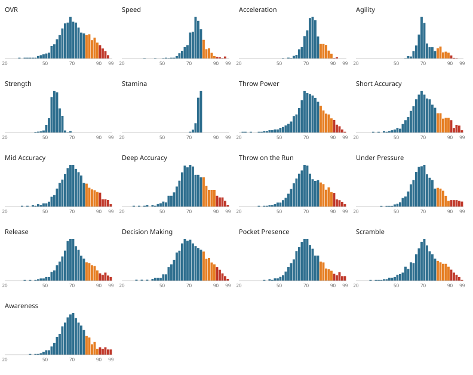
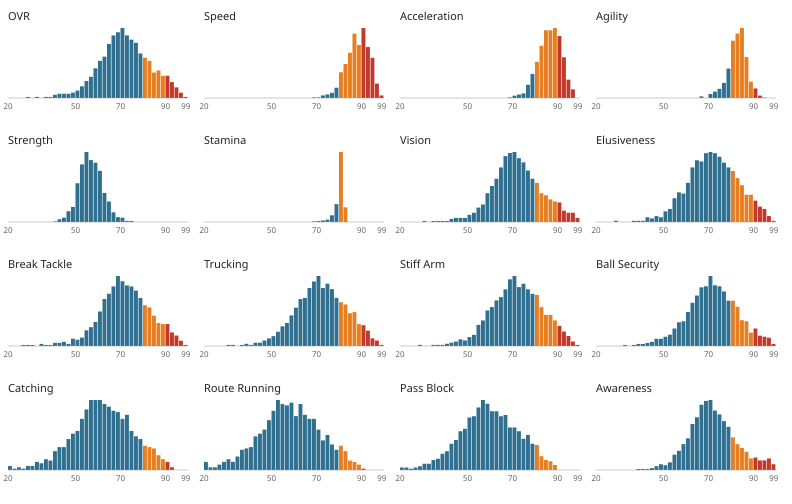
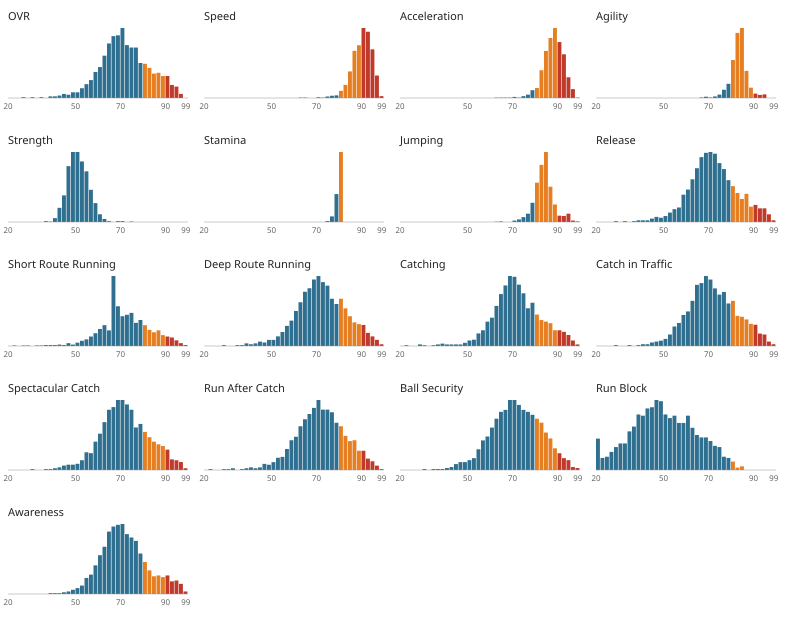
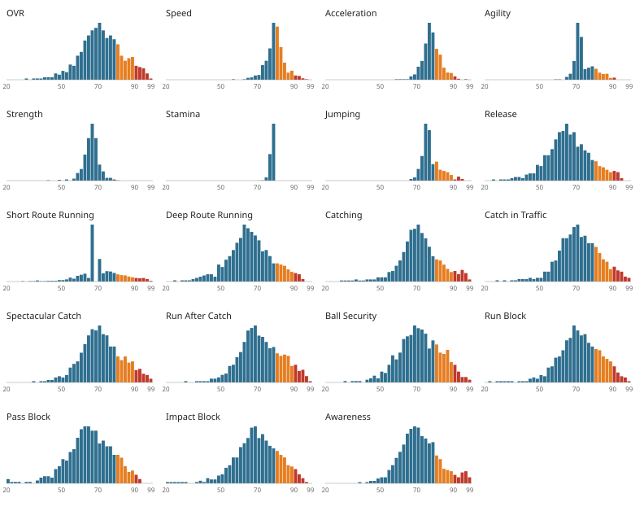
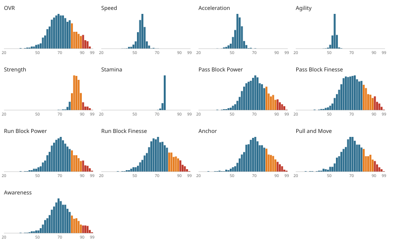
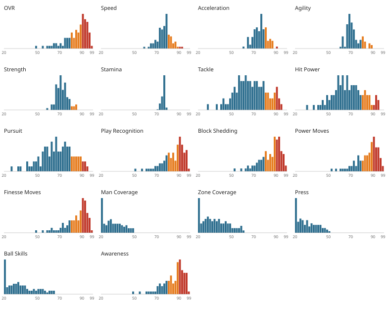
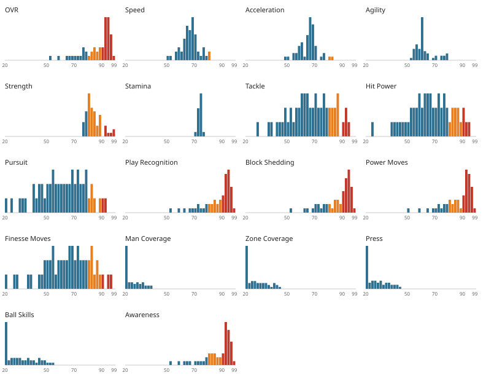
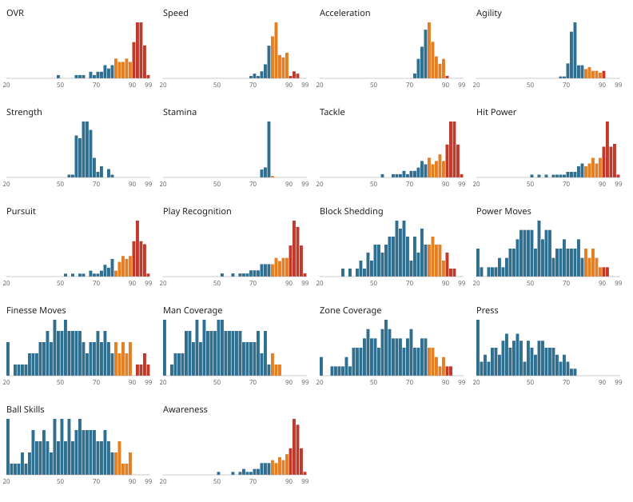
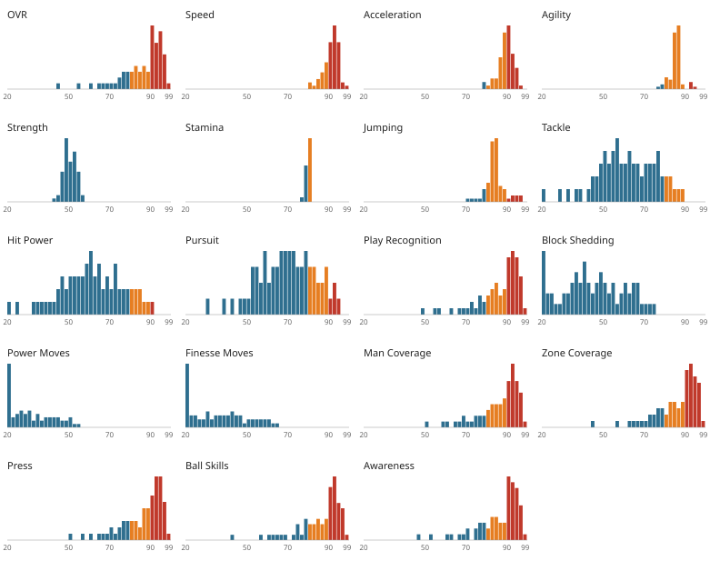
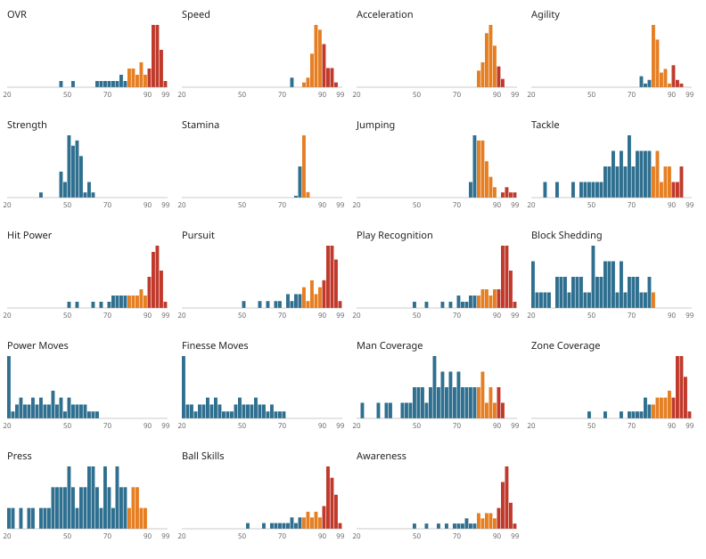

# Ratings report (M2)

_Generated by `node tools/run-ts.mjs tools/ratings/report.ts`. Do not edit by hand._

Rated entries: **4290** (QB 634, RB 822, WR 973, TE 560, OL 920, DE 98, DT 54, LB 105, CB 69, S 55). OL units are split into five linemen each.
Excluded by corrections: 80. Corrections applied: 276.
OVR confidence: high 1692, medium 1883, low 715.

## How ratings are built

- **Signals.** Every stat is compared to the league average over the seasons the player actually played (`data/era_baselines.json`, weighted by his games per season), as a log ratio (rates, volumes) or a difference (completion %, passer rating). Honors count per season in the stint (AP First-Team 1.0, Second-Team 0.5, Pro Bowl 0.35, MVP 1.2, OPOY/DPOY 0.8); the signal is half the stint average and half the average of its best three seasons, so a rookie year or an injury season doesn't bury a peak.
- **Samples.** Each signal becomes a z-score within the position pool (all decades together; the signals are already era-relative) and is shrunk toward 0 by n / (n + k). n is games for per-game stats and plays for rate stats (attempts / 30, carries / 15, targets / 7, receptions / 4), so a backup's 150 attempts don't make an elite decision-maker. A verified slice covering under 40% of a stint (for example only the 1999 season of a 1990s stint) doesn't speak for the whole stint.
- **Attributes.** Each skill attribute is a weighted sum of signals (`src/engine/ratings/attributes/*.ts`, one declarative formula per attribute). Missing evidence contributes 0 (the position average) and moves part of its weight to the player's other evidence (stats, honors; never body or reputation), so data-poor eras aren't dragged to the middle. The sum is standardized, rescaled for pool size, blended with the player's rank in the pool (60% rank-based normal score, 40% distance from the mean; skewed honors would otherwise pile players up at 99), and mapped through one curve: median 72, top 25% → 80+, top 5% → 90+, the expected best of the pool → 98.
- **Reputation cap.** Legacy `imp` is at most 20% of an attribute's formula weight and, for every player, at most 20% of the attribute's movement: it can amplify what the evidence says by a quarter at most, and can't move an attribute on its own (tested for every player and attribute).
- **Occasional skills** (a linebacker's pass rush, a back's catching) have a position average below 72 and their own ceiling for the best at that position, so the best pass-rushing linebacker rates with the elite ends while the best cover linebacker stays below the elite corners.
- **Pool calibration.** The defensive pools are the curated Beasts candidates: about 90% have honors, a median of 0.5–0.75 per season. The offensive pools show what rating that honors level earns (median OVR by honors band), so those pools are re-centered on it while the best stays at the top. It shows as its own line in every contribution breakdown.
- **Physical attributes** are absolute (they feed physics): measured combine data first (40, bench, vertical, broad, cone, shuttle), with partial hand-timing corrections for older and pro-day times, else a position prior adjusted by body (weight relative to the era, translated to the modern game) and production signatures, flagged `estimated`. They are computed once per person and aged per stint with a position-specific curve (`src/engine/ratings/physical.ts`).
- **OVR** is a weighted blend of the position's attributes (`src/engine/ratings/ovrWeights.ts`), standardized within the position, mapped through the same curve and calibrated the same way.
- **Confidence** is the weight-averaged provenance of the inputs: verified 1.0, reference 0.9, legacy 0.55, estimated 0.4, prior 0. High ≥ 0.7, medium ≥ 0.4.
- **99** is kept for true outliers (no pileups), so an anchor band of 99 passes at ≥ 98.5 or at rank 1–3 in the position pool.

## Anchor tests

**21 of 42 anchors pass.** Each check shows the value and the band. Flags are anchors I think are wrong or can't be met honestly by the data; they are listed for your review rather than bent into the formulas.

| Anchor | Result | Checks |
|---|---|---|
| Joe Montana (1980s SF) | PASS | ✓ shortAcc 98.8 (want ≥ 95) ✓ midAcc 98.6 (want ≥ 95) ✓ underPressure 98.8 (want ≥ 95) ✓ throwPower 77.5 (want < 88) |
| Dan Marino (1980s MIA) | **FLAG** | ✓ release 99.0 (want ≥ 99) ✗ throwPower 87.7 (want ≥ 95) ✓ scramble 40.0, percentile 1 among 634 QBs (want bottom 10%) |
| Peyton Manning (2000s IND) | **FLAG** | ✓ awareness 98.2 (want ≥ 97) ✗ decision 91.4 (want ≥ 97) ✗ scramble 59.9, percentile 13 among 634 QBs (want bottom 10%) |
| Tom Brady (2010s NE) | PASS | ✓ decision 98.4 (want ≥ 97) ✓ shortAcc 96.7 (want ≥ 95) ✓ midAcc 96.6 (want ≥ 95) ✓ speed 45.6, percentile 0 among 634 QBs (want bottom 10%) |
| Patrick Mahomes (KC) | **FLAG** | ✓ throwOnRun 98.3 (want ≥ 97) [KC 2010s] ✓ throwPower 97.0 (want ≥ 95) [KC 2010s] ✓ throwOnRun 97.7 (want ≥ 97) [KC 2020s] ✗ throwPower 86.7 (want ≥ 95) [KC 2020s] |
| Brett Favre (1990s GB) | **FLAG** | ✗ throwPower 78.6 (want ≥ 97) ✓ decision 81.9 (want < 90) |
| Michael Vick (2000s ATL) | PASS | ✓ speed 96.7 (want ≥ 97) ✓ shortAcc 65.4 (want < 85) ✓ midAcc 68.4 (want < 85) |
| Lamar Jackson (BAL) | FAIL | ✗ speed 96.5 (want ≥ 97) [BAL 2010s] ✗ speed 96.5 (want ≥ 97) [BAL 2020s] |
| Barry Sanders (DET) | FAIL | ✓ elusiveness 98.7 (want ≥ 99) ✗ agility 92.0 (want ≥ 99), rank 4 of 822 ✓ trucking 69.8 (want < 80) |
| Earl Campbell (1970s TEN) | **FLAG** | ✗ trucking 91.0 (want ≥ 97) |
| Derrick Henry (2020s TEN) | PASS | ✓ trucking 97.1 (want ≥ 97) |
| Jerome Bettis (1990s PIT) | **FLAG** | ✗ trucking 94.3 (want ≥ 95) ✓ speed 82.2 (want < 85) |
| Walter Payton (CHI) | **FLAG** | ✗ stiffArm 86.4 (want ≥ 95) [CHI 1970s] ✓ breakTackle 94.6 (want ≥ 95) [CHI 1970s] ✗ stiffArm 82.5 (want ≥ 95) [CHI 1980s] ✗ breakTackle 92.5 (want ≥ 95) [CHI 1980s] |
| Eric Dickerson (1980s LAR) | PASS | ✓ speed 96.2 (want ≥ 95) |
| Marshall Faulk (LAR) | PASS | ✓ catching 93.0, rank 1 of 822 RBs (want top 5) [LAR 1990s] ✓ routeRunning 90.0, rank 1 of 822 RBs (want top 5) [LAR 1990s] ✓ catching 91.7, rank 4 of 822 RBs (want top 5) [LAR 2000s] ✓ routeRunning 88.5, rank 4 of 822 RBs (want top 5) [LAR 2000s] |
| Christian McCaffrey (2020s SF) | PASS | ✓ catching 92.0, rank 3 of 822 RBs (want top 5) ✓ routeRunning 88.9, rank 3 of 822 RBs (want top 5) |
| Jerry Rice (SF) | **FLAG** | ✓ shortRoute 97.3 (want ≥ 99), rank 3 of 973 [SF 1980s] ✓ deepRoute 98.3 (want ≥ 99), rank 2 of 973 [SF 1980s] ✓ catching 97.6 (want ≥ 95) [SF 1980s] ✓ speed 80.5 (want < 92) [SF 1980s] ✓ shortRoute 98.3 (want ≥ 99), rank 2 of 973 [SF 1990s] ✗ deepRoute 95.1 (want ≥ 99), rank 13 of 973 [SF 1990s] ✓ catching 98.8 (want ≥ 95) [SF 1990s] ✓ speed 75.4 (want < 92) [SF 1990s] |
| Randy Moss (2000s NE) | FAIL | ✗ speed 93.2 (want ≥ 97) ✗ spectacular 93.1 (want ≥ 99), rank 27 of 973 ✗ jumping 82.9 (want ≥ 99), rank 612 of 973 |
| Calvin Johnson (2010s DET) | FAIL | ✓ catchInTraffic 98.7 (want ≥ 99) ✓ heightIn 77", rank 8 of 967 WRs (want top 10) ✗ jumping 83.9, rank 520 of 973 WRs (want top 10) |
| Tyreek Hill (2020s MIA) | FAIL | ✗ speed 93.7 (want ≥ 99), rank 205 of 973 ✗ acceleration 92.6 (want ≥ 99), rank 155 of 973 |
| Larry Fitzgerald (2000s ARI) | **FLAG** | ✗ catchInTraffic 94.6 (want ≥ 97) ✗ speed 90.9 (want < 88) |
| Cris Carter (1990s MIN) | PASS | ✓ catchInTraffic 96.7 (want ≥ 97) ✓ speed 86.2 (want < 88) |
| Wes Welker (NE) | **FLAG** | ✓ shortRoute 97.0 (want ≥ 97) [NE 2000s] ✗ shortRoute 95.1 (want ≥ 97) [NE 2010s] |
| Antonio Brown (2010s PIT) | **FLAG** | ✗ shortRoute 96.3 (want ≥ 97) |
| Tony Gonzalez (2000s KC) | PASS | ✓ catching 94.9 (want ≥ 95) ✓ shortRoute 95.3 (want ≥ 95) |
| Travis Kelce (KC) | PASS | ✓ catching 96.3 (want ≥ 95) [KC 2010s] ✓ shortRoute 96.4 (want ≥ 95) [KC 2010s] ✓ catching 95.9 (want ≥ 95) [KC 2020s] ✓ shortRoute 96.2 (want ≥ 95) [KC 2020s] |
| Rob Gronkowski (2010s NE) | PASS | ✓ runBlock 98.4 (want ≥ 90) ✓ catchInTraffic 97.8 (want ≥ 95) |
| Lawrence Taylor (1980s NYG) | PASS | ✓ finesseMoves 96.5 (want ≥ 99), rank 3 of 105 ✓ pursuit 98.3 (want ≥ 99), rank 1 of 105 |
| Reggie White (PHI, GB) | PASS | ✓ powerMoves 98.2 (want ≥ 97) [PHI 1980s] ✓ powerMoves 97.2 (want ≥ 97) [GB 1990s] |
| Bruce Smith (1990s BUF) | PASS | ✓ powerMoves 96.8 (want ≥ 97) |
| Aaron Donald (2010s LAR) | PASS | ✓ blockShed 98.3 (want ≥ 99), rank 1 of 54 ✓ finesseMoves 96.4, rank 1 of 54 DTs (want top 3) |
| Deacon Jones (1960s LAR) | PASS | ✓ finesseMoves 97.0 (want ≥ 97) |
| Deion Sanders (1990s DAL) | **FLAG** | ✓ manCov 97.7 (want ≥ 99), rank 2 of 69 ✗ speed 93.3 (want ≥ 99), rank 25 of 69 ✗ tackle 76.5 (want < 70) |
| Darrelle Revis (NYJ) | **FLAG** | ✗ manCov 94.7 (want ≥ 97) [NYJ 2000s] ✗ press 92.4 (want ≥ 97) [NYJ 2000s] ✗ manCov 93.8 (want ≥ 97) [NYJ 2010s] ✗ press 93.2 (want ≥ 97) [NYJ 2010s] |
| Sauce Gardner (2020s NYJ) | PASS | ✓ manCov 93.3 (want ≥ 90) |
| Patrick Surtain II (2020s DEN) | PASS | ✓ manCov 96.3 (want ≥ 90) |
| Mel Blount (1970s PIT) | **FLAG** | ✗ press 96.1 (want ≥ 97) |
| Ed Reed (2000s BAL) | PASS | ✓ ballSkills 98.4 (want ≥ 99), rank 1 of 55 ✓ zoneCov 98.4 (want ≥ 99), rank 1 of 55 |
| Ray Lewis (2000s BAL) | PASS | ✓ tackle 97.8 (want ≥ 95) ✓ pursuit 96.1 (want ≥ 95) ✓ playRec 98.0 (want ≥ 95) |
| Dick Butkus (1960s CHI) | **FLAG** | ✓ tackle 96.4 (want ≥ 95) ✗ pursuit 94.0 (want ≥ 95) ✓ playRec 95.4 (want ≥ 95) ✓ hitPower 97.6 (want ≥ 99), rank 3 of 105 |
| Mike Singletary (1980s CHI) | PASS | ✓ tackle 97.2 (want ≥ 95) ✓ pursuit 96.5 (want ≥ 95) ✓ playRec 97.2 (want ≥ 95) |
| Ronnie Lott (1980s SF) | **FLAG** | ✗ hitPower 94.6 (want ≥ 97) |

### Flagged anchors

- **Dan Marino (1980s MIA)**: Throw Power: arm strength has no box-score trace. The formula reads yards per completion (deep share), yards per attempt and passing volume vs league, plus capped reputation. Marino's deep share was above average, not extreme, so he lands in the high 80s. Options: accept that Throw Power is data-limited, or add air yards per attempt (nflverse play-by-play, 2006 on) plus a sourced, flagged 'cannon' list for older QBs. Release 99 and bottom-10% Scramble pass.
- **Peyton Manning (2000s IND)**: Decision Making is interception avoidance (the brief's definition). Manning's 2000s INT rate was 2.5% against a 3.0% league: good, not extreme; Rodgers and Brady in the 2010s, Montana and Young rank above him. His reputation is pre-snap command, which Awareness captures (99, passes). Scramble lands at the 13th percentile; everyone below him is a backup with near-zero rushing. I'd move the 97+ to Awareness and accept Scramble.
- **Patrick Mahomes (KC)**: Throw Power passes for the 2010s stint (97) but not 2020s: his 2020s yards per completion is close to league average (a shorter passing game), and the stats can't see arm talent. Same data limit as Marino/Favre; Throw on the Run passes for both stints.
- **Brett Favre (1990s GB)**: Throw Power: Favre's 1990s Green Bay yards per completion was about league average in a West Coast offense, so no stat separates his arm; only capped reputation can, and it may add at most 20%. I think 97+ can't be met honestly without an arm-specific input (see Marino). Decision Making below elite passes.
- **Earl Campbell (1970s TEN)**: Trucking is mostly mass (the brief's body-type split) plus workload and goal-line scoring. Campbell was 232 lb; the 250–265 lb backs (Kinnebrew, Okoye, Jacobs, Bettis, Henry) rank above him. His legend is the violence of his running, which no stat records. I'd accept 90+.
- **Jerome Bettis (1990s PIT)**: Near miss (Trucking 94, want 95; Speed passes).
- **Walter Payton (CHI)**: Stiff Arm has no statistical trace: the formula uses size, strength and production, and Payton (5'10", 200 lb) lands in the 80s. His stiff arm is technique the data can't see. Break Tackle is within a point or two (94.5 for the 1970s). I'd accept, or you can supply a technique input if you want one.
- **Jerry Rice (SF)**: Rice's 1980s stint is Deep Route 99, Catching 99 and Short Route rank 4 (97). The 1990s stint covers ages 28–37: short routes rank 1 (99), but his deep game (about 14 yards per catch) ranks 13th behind deep specialists. I think 97+ deep for the 1990s stint over-rates it; the 1980s stint is the 99.
- **Larry Fitzgerald (2000s ARI)**: Catch in Traffic lands at 94–95 (height, TDs per catch, volume, honors); the pool's top includes Calvin Johnson, Rice and T.O. Speed comes from his measured time; see the value.
- **Wes Welker (NE)**: Near miss: the 2000s stint passes (97); the 2010s stint (2010–12, ages 29–31) is 95.
- **Antonio Brown (2010s PIT)**: Near miss (96, want 97).
- **Deion Sanders (1990s DAL)**: Man Coverage passes (rank 2 of 69 all-time CBs). Speed: his 4.27 (1989, hand-timed) becomes about 4.33 after the hand-timing correction, and he was 28–32 in Dallas, so aging takes a few points: mid-90s, not 99. Tackle: no tackle data exists before 1999, so a pre-1999 DB's tackling is body and experience (plus capped reputation), and Deion lands in the 70s. His poor-tackler reputation isn't in any dataset we can use. I'd accept Speed 95+ and flag Tackle as data-limited.
- **Darrelle Revis (NYJ)**: Revis rates 94–95 in Man Coverage and 92–93 in Press: the top ten of 69 all-time corners. Both NYJ stints include non-peak seasons (2007–08, 2012, 2015–16), and even with the best-three-seasons blend his honors density trails Woodson, Deion, Bailey and Gilmore. I think 97+ fits his 2009–11 peak, not his stints as a whole. I'd accept 93+.
- **Mel Blount (1970s PIT)**: Near miss (Press 96, want 97). Press has no stat trace; it's honors, strength and length.
- **Dick Butkus (1960s CHI)**: Near miss (Pursuit 94, want 95); Tackle, Play Recognition and Hit Power pass. No tackle data exists for his era.
- **Ronnie Lott (1980s SF)**: Hit Power reads mass, forced fumbles (not tracked before ~1990) and honors. Lott was 203 lb, so he lands mid-90s, not 97. Near miss.

## Era parity

Average OVR of the top N per position in each decade, minus the all-decade average of those top-Ns. N is 10 where every decade has 20+ players; the defensive pools hold 5–15 players per decade, so N is half the smallest decade there (column N). Decades with fewer than 6 players are skipped. Flag: more than 3 points off.

| Pos | N | All | 1960s | 1970s | 1980s | 1990s | 2000s | 2010s | 2020s |
|---|---|---|---|---|---|---|---|---|---|
| QB | 10 | 91.5 | – | -1.2 | -0.8 | -0.1 | +0.7 | +1.7 | -0.3 |
| RB | 10 | 92.2 | – | -1.7 | +0.8 | +0.8 | +1.1 | +0.1 | -1.1 |
| WR | 10 | 92.8 | – | +1.0 | +0.0 | +0.1 | -1.4 | -0.2 | +0.5 |
| TE | 10 | 91.5 | – | +1.4 | +1.4 | -1.2 | -1.2 | +0.7 | -1.1 |
| OL | 10 | 92.7 | – | -1.8 | +0.2 | +0.7 | -0.6 | +0.9 | +0.6 |
| DE | 5 | 93.9 | -0.8 | -0.3 | -0.0 | -0.1 | +0.7 | -0.4 | +1.0 |
| DT | 3 | 95.1 | +0.2 | +1.4 | -0.3 | +0.4 | -2.4 | +1.0 | -0.3 |
| LB | 6 | 94.6 | -1.6 | +0.1 | +0.2 | +0.3 | +1.8 | +0.8 | -1.6 |
| CB | 4 | 94.4 | +0.3 | -0.9 | -1.6 | +1.2 | +1.3 | +0.6 | -1.0 |
| S | 3 | 95.5 | +0.8 | +0.4 | +1.2 | -1.4 | +0.7 | -0.8 | -0.8 |

## Legacy comparison

Spearman correlation of new OVR with legacy `imp` (within-position percentiles): **0.802** (target 0.75–0.9). By position: QB 0.82, RB 0.81, WR 0.79, TE 0.74, OL 0.84, DE 0.90, DT 0.77, LB 0.72, CB 0.77, S 0.70.

Movers compare the percentile of OVR with the percentile of `imp` inside the position. The reason lists the inputs that moved OVR most (weighted through the OVR blend).

Top 50 risers

| Player | Pos | imp (pct) | OVR (pct) | Why |
|---|---|---|---|---|
| Gale Gillingham (GB 1970s) | OL | 74 (3) | 81 (80) | Honors per season (2× All-Pro, 2× 2nd-team, 4× Pro Bowl in 5 seasons) +14.4; Mass: 255 lb (≈314 in today's game) (255 lb) +6.8; Pool-shape adjustment (rank blend) +0.6 |
| Forrest Blue (SF 1970s) | OL | 77 (19) | 85 (86) | Honors per season (3× All-Pro, 4× Pro Bowl in 5 seasons) +15.7; Mass: 261 lb (≈320 in today's game) (261 lb) +7.0; Strength (87.0) +0.7 |
| Eric Metcalf (LAC 1990s) | RB | 70 (21) | 85 (87) | RB prior (typical 40 of 4.50) +10.8; Honors per season (1× All-Pro, 1× Pro Bowl in 1 season) +8.4; From speed (70%) +5.5 |
| George Kunz (ATL 1970s) | OL | 74 (3) | 76 (65) | Honors per season (2× All-Pro, 3× Pro Bowl in 5 seasons) +10.7; Mass: 257 lb (≈316 in today's game) (257 lb) +6.9; Pool-shape adjustment (rank blend) +0.8 |
| Malik Willis (GB 2020s) | QB | 69 (20) | 83 (80) | TD:INT ratio vs league (674.16 vs league 2.11) +3.0; Passer rating vs league (134.6 vs league 91.9) +2.4; Yards per completion vs league (deep share) (13.9 vs league 10.9) +2.1 |
| Willie Anderson (CIN 2000s) | OL | 78 (30) | 87 (90) | Honors per season (3× All-Pro, 1× 2nd-team, 4× Pro Bowl in 8 seasons) +12.9; Mass: 340 lb (340 lb) +7.5; Strength (93.2) +2.8 |
| Willie Roaf (NO 1990s) | OL | 78 (30) | 87 (89) | Honors per season (2× All-Pro, 2× 2nd-team, 6× Pro Bowl in 7 seasons) +12.8; Mass: 307 lb (≈321 in today's game) (307 lb) +7.0; Unit rushing yards/game vs league (120 vs league 106) +0.9 |
| Billy Masters (DEN 1970s) | TE | 67 (10) | 77 (69) | TE prior (typical 40 of 4.72) +6.4; Weight (240 lb (≈265 today)) +1.9; Strength (70.5) +0.9 |
| Don Hasselbeck (NYG 1980s) | TE | 66 (5) | 76 (63) | TE prior (typical 40 of 4.72) +6.4; Weight (245 lb (≈264 today)) +1.7; Height (6'7") +1.5 |
| John Jefferson (GB 1980s) | WR | 68 (10) | 77 (68) | WR prior (typical 40 of 4.48) +10.9; From speed (70%) +3.9; From agility (30%) +1.5 |
| Paul Seymour (BUF 1970s) | TE | 68 (18) | 79 (74) | TE prior (typical 40 of 4.72) +6.4; Weight (252 lb (≈277 today)) +3.3; Legacy block grade (hand-set) (80) +1.7 |
| Orlando Pace (LAR 2000s) | OL | 78 (30) | 85 (86) | Honors per season (2× All-Pro, 2× 2nd-team, 6× Pro Bowl in 9 seasons) +11.6; Mass: 324 lb (≈330 in today's game) (324 lb) +7.2; Strength (89.9) +1.8 |
| Billy Masters (KC 1970s) | TE | 67 (10) | 76 (65) | TE prior (typical 40 of 4.72) +6.4; Weight (240 lb (≈265 today)) +1.9; Experience (10.0 yrs in league) +1.1 |
| Joe Fortunato (CHI 1960s) | LB | 79 (7) | 93 (61) | Honors per season (3× All-Pro, 1× 2nd-team, 4× Pro Bowl in 7 seasons) +8.1; Pool calibration (elite pool: median 0.69 honors/season ≈ 91 on offense) +6.7; LB prior (typical 40 of 4.68) +6.6 |
| Daryl Hobbs (LV 1990s) | WR | 66 (3) | 73 (58) | WR prior (typical 40 of 4.48) +10.9; From speed (70%) +4.0; Yards per target vs league (13.5 vs league 6.8) +1.9 |
| Dan Sullivan (IND 1970s) | TE | 66 (5) | 74 (60) | TE prior (typical 40 of 4.72) +6.4; Weight (250 lb (≈275 today)) +3.0; Legacy block grade (hand-set) (80) +1.7 |
| Andrew Whitworth (CIN 2010s) | OL | 78 (30) | 84 (84) | Mass: 331 lb (331 lb) +7.2; Honors per season (1× All-Pro, 1× 2nd-team, 3× Pro Bowl in 7 seasons) +6.3; Strength (90.2) +1.9 |
| Lincoln Kennedy (LV 2000s) | OL | 78 (30) | 84 (84) | Honors per season (1× All-Pro, 1× 2nd-team, 3× Pro Bowl in 4 seasons) +9.2; Mass: 335 lb (335 lb) +7.3; Strength (91.7) +2.4 |
| Robb Thomas (SEA 1990s) | WR | 67 (6) | 74 (59) | WR prior (typical 40 of 4.48) +10.9; From speed (70%) +4.0; Yards per target vs league (13.0 vs league 6.8) +1.8 |
| Joe Thomas (CLE 2000s) | OL | 77 (19) | 79 (72) | Honors per season (1× All-Pro, 1× 2nd-team, 3× Pro Bowl in 3 seasons) +11.0; Mass: 312 lb (312 lb) +6.8; Pool-shape adjustment (rank blend) +0.6 |
| Don Hasselbeck (NE 1970s) | TE | 68 (18) | 78 (70) | TE prior (typical 40 of 4.72) +6.4; Weight (245 lb (≈270 today)) +2.6; Height (6'7") +1.6 |
| Devaughn Vele (DEN 2020s) | WR | 69 (15) | 76 (67) | 40-yard dash 4.47 (4.47 s) +11.0; From speed (70%) +3.8; From agility (30%) +1.5 |
| George Kunz (IND 1970s) | OL | 78 (30) | 83 (82) | Honors per season (1× All-Pro, 2× 2nd-team, 2× Pro Bowl in 4 seasons) +10.4; Mass: 257 lb (≈316 in today's game) (257 lb) +6.9; Pool-shape adjustment (rank blend) +0.6 |
| Jason Peters (BUF 2000s) | OL | 76 (11) | 75 (62) | Mass: 330 lb (330 lb) +7.2; Honors per season (2× 2nd-team, 2× Pro Bowl in 4 seasons) +5.2; Strength (90.0) +1.8 |
| Kevin Mawae (NYJ 1990s) | OL | 79 (40) | 88 (91) | Honors per season (1× All-Pro, 1× 2nd-team, 1× Pro Bowl in 2 seasons) +12.2; Mass: 305 lb (≈327 in today's game) (305 lb) +7.1; Strength (89.0) +1.4 |
| Gary Johnson (LAC 1980s) | DT | 81 (18) | 94 (68) | Mass: 257 lb (≈298 in today's game) (257 lb) +8.0; Pool calibration (elite pool: median 0.73 honors/season ≈ 92 on offense) +7.7; Honors per season (2× All-Pro, 1× 2nd-team, 3× Pro Bowl in 5 seasons) +4.7 |
| George Andrie (DAL 1960s) | DE | 79 (7) | 89 (56) | Pool calibration (elite pool: median 0.47 honors/season ≈ 89 on offense) +10.6; DE prior (typical 40 of 4.78) +6.2; Honors per season (1× All-Pro, 3× 2nd-team, 5× Pro Bowl in 8 seasons) +3.7 |
| Pat Curran (LAC 1970s) | TE | 68 (18) | 77 (66) | TE prior (typical 40 of 4.72) +6.4; Weight (238 lb (≈263 today)) +1.6; Experience (9.5 yrs in league) +1.0 |
| Bill Fralic (ATL 1980s) | OL | 80 (46) | 91 (94) | Honors per season (2× All-Pro, 1× 2nd-team, 4× Pro Bowl in 5 seasons) +12.5; Mass: 285 lb (≈334 in today's game) (285 lb) +7.3; Strength (91.1) +1.9 |
| Louis Vasquez (DEN 2010s) | OL | 77 (19) | 77 (68) | Mass: 335 lb (335 lb) +7.3; Honors per season (1× All-Pro, 1× Pro Bowl in 4 seasons) +3.7; Strength (91.5) +2.4 |
| Andy Russell (PIT 1970s) | LB | 80 (9) | 92 (57) | Pool calibration (elite pool: median 0.69 honors/season ≈ 91 on offense) +8.4; LB prior (typical 40 of 4.68) +6.6; Honors per season (1× All-Pro, 2× 2nd-team, 6× Pro Bowl in 7 seasons) +3.2 |
| Vern Den Herder (MIA 1970s) | TE | 70 (33) | 82 (81) | TE prior (typical 40 of 4.72) +6.4; Weight (250 lb (≈275 today)) +3.0; Legacy block grade (hand-set) (80) +1.7 |
| Gary Zimmerman (MIN 1980s) | OL | 79 (40) | 86 (88) | Honors per season (2× All-Pro, 3× Pro Bowl in 4 seasons) +12.0; Mass: 281 lb (≈314 in today's game) (281 lb) +6.8; Pool-shape adjustment (rank blend) +0.3 |
| Merton Hanks (SF 1990s) | S | 82 (14) | 93 (61) | Pool calibration (elite pool: median 0.73 honors/season ≈ 92 on offense) +8.5; S prior (typical 40 of 4.54) +7.1; Honors per season (2× All-Pro, 2× 2nd-team, 4× Pro Bowl in 8 seasons) +4.3 |
| Quincy Carter (NYJ 2000s) | QB | 68 (14) | 75 (61) | Yards per completion vs league (deep share) (14.2 vs league 11.8) +1.3; Passer rating vs league (98.2 vs league 82.8) +0.6; INT % vs league (1.7% vs league 3.2%) +0.6 |
| Wilber Marshall (WAS 1990s) | LB | 81 (13) | 92 (60) | Pool calibration (elite pool: median 0.69 honors/season ≈ 91 on offense) +9.7; LB prior (typical 40 of 4.68) +6.6; Experience (7.5 yrs in league) +2.0 |
| D.J. Hackett (SEA 2000s) | WR | 70 (20) | 76 (67) | 40-yard dash 4.53 (4.53 s) +10.6; From speed (70%) +3.7; From agility (30%) +1.6 |
| Tom Beer (NE 1970s) | TE | 67 (10) | 73 (56) | TE prior (typical 40 of 4.72) +6.4; Weight (235 lb (≈260 today)) +1.2; Strength (69.0) +0.6 |
| Mike Munchak (TEN 1980s) | OL | 80 (46) | 89 (92) | Honors per season (3× All-Pro, 1× 2nd-team, 5× Pro Bowl in 8 seasons) +13.1; Mass: 263 lb (≈302 in today's game) (263 lb) +6.5; Unit sacks allowed/game vs league (1.6 vs league 2.79) +2.6 |
| Mike Rae (LV 1970s) | QB | 65 (4) | 71 (49) | Passer rating vs league (66.0 vs league 63.6) +1.0; Passing TD/game vs league team (0.90 vs league 1.08) +0.3; Pool-shape adjustment (rank blend) +0.2 |
| Ryan Clady (DEN 2010s) | OL | 77 (19) | 76 (65) | Mass: 315 lb (315 lb) +6.8; Honors per season (1× All-Pro, 3× Pro Bowl in 5 seasons) +6.2; Pool-shape adjustment (rank blend) +0.9 |
| John Beasley (NO 1970s) | TE | 66 (5) | 72 (50) | TE prior (typical 40 of 4.72) +6.4; Legacy block grade (hand-set) (78) +0.8; Experience (7.0 yrs in league) +0.6 |
| Ricky Pearsall (SF 2020s) | WR | 71 (28) | 78 (73) | 40-yard dash 4.41 (4.41 s) +11.3; From speed (70%) +4.0; From agility (30%) +1.7 |
| Jake Scott (MIA 1970s) | S | 84 (42) | 96 (86) | Honors per season (2× All-Pro, 3× 2nd-team, 5× Pro Bowl in 6 seasons) +7.9; S prior (typical 40 of 4.54) +7.1; Pool calibration (elite pool: median 0.73 honors/season ≈ 92 on offense) +5.3 |
| Mike Kenn (ATL 1980s) | OL | 80 (46) | 88 (90) | Honors per season (2× All-Pro, 2× 2nd-team, 5× Pro Bowl in 10 seasons) +10.7; Mass: 257 lb (≈306 in today's game) (257 lb) +6.6; Unit sacks allowed/game vs league (1.7 vs league 2.75) +2.0 |
| Ron Rivers (DET 1990s) | RB | 69 (13) | 74 (58) | RB prior (typical 40 of 4.50) +10.8; From speed (70%) +5.2; From agility (30%) +2.1 |
| Ronnie Coleman (TEN 1970s) | RB | 69 (13) | 74 (57) | RB prior (typical 40 of 4.50) +10.8; From speed (70%) +5.3; From agility (30%) +2.1 |
| Wayne Walker (DET 1960s) | LB | 78 (4) | 91 (48) | Pool calibration (elite pool: median 0.69 honors/season ≈ 91 on offense) +10.0; LB prior (typical 40 of 4.68) +6.6; Experience (6.5 yrs in league) +1.4 |
| Derek Tennell (CLE 1980s) | TE | 66 (5) | 71 (49) | TE prior (typical 40 of 4.72) +6.4; Weight (245 lb (≈264 today)) +1.8; Strength (70.2) +0.8 |
| Donnie Shell (PIT 1980s) | S | 82 (14) | 93 (57) | Pool calibration (elite pool: median 0.73 honors/season ≈ 92 on offense) +8.9; S prior (typical 40 of 4.54) +7.1; Experience (9.6 yrs in league) +2.9 |

Top 50 fallers

| Player | Pos | imp (pct) | OVR (pct) | Why |
|---|---|---|---|---|
| Willie Lanier (KC 1960s) | LB | 89 (80) | 61 (2) | Honors per season (no honors in 3 seasons) -15.2; Experience (1.1 yrs in league) -4.0; Pool-shape adjustment (rank blend) -2.3 |
| Josh Allen (BUF 2010s) | QB | 84 (89) | 60 (13) | Pool-shape adjustment (rank blend) -2.3; Completion % vs league (56.3% vs league 64.1%) -2.2; Passer rating vs league (78.0 vs league 91.5) -1.7 |
| Buck Buchanan (KC 1960s) | DT | 90 (83) | 69 (8) | Honors per season (no honors in 7 seasons) -13.7; Sacks/game vs league team (0.41 vs league 3.10 (unofficial, pre-1982)) -2.5; Pool-shape adjustment (rank blend) -1.0 |
| Bobby Bell (KC 1960s) | LB | 90 (85) | 74 (11) | Honors per season (no honors in 7 seasons) -14.5; Sacks/game vs league team (0.15 vs league 3.10 (unofficial, pre-1982)) -0.7; Strength (62.0) -0.3 |
| Emmitt Smith (ARI 2000s) | RB | 78 (79) | 57 (8) | Yards per carry vs league (3.34 vs league 4.15) -3.2; Aging (age 34.9) (34.9) -2.5; Agility (75.4) -1.7 |
| Donovan McNabb (PHI 1990s) | QB | 78 (74) | 56 (7) | Yards per completion vs league (deep share) (8.9 vs league 11.8) -2.4; Yards per attempt vs league (4.39 vs league 6.77) -2.1; Pool-shape adjustment (rank blend) -1.7 |
| Frank Gore (BUF 2010s) | RB | 77 (75) | 58 (9) | Aging (age 36.4) (36.4) -3.0; Agility (71.8) -2.6; Yards per carry vs league (3.61 vs league 4.32) -2.1 |
| Terrell Owens (BUF 2000s) | WR | 82 (90) | 65 (26) | Aging (age 35.8) (35.8) -1.7; Agility (74.4) -1.5; Catch % vs league (50.5% vs league 61.7%) -1.4 |
| Aaron Hernandez (NE 2010s) | TE | 80 (91) | 66 (28) | Legacy block grade (hand-set) (70) -3.3; Experience (0.0 yrs in league) -2.3; Height (6'1") -1.4 |
| Ashton Jeanty (LV 2020s) | RB | 80 (86) | 64 (24) | Experience (0.0 yrs in league) -2.8; Yards per carry vs league (3.67 vs league 4.36) -2.3; Honors per season (no honors in 1 season) -0.7 |
| Johnny Robinson (KC 1960s) | S | 86 (68) | 67 (6) | Honors per season (no honors in 10 seasons) -16.7; Interceptions/game vs league team (0.31 vs league 2.06) -1.3; Speed (85.0) -1.2 |
| Jerry Rice (SEA 2000s) | WR | 76 (68) | 57 (7) | Aging (age 42.0) (42.0) -3.1; Agility (67.5) -2.6; Speed (63.1) -1.4 |
| Alex Smith (SF 2000s) | QB | 76 (67) | 56 (7) | Pool-shape adjustment (rank blend) -2.7; Passer rating vs league (69.7 vs league 83.3) -1.9; Completion % vs league (56.4% vs league 61.6%) -1.4 |
| Keenan Allen (CHI 2020s) | WR | 79 (81) | 64 (22) | Catch % vs league (57.9% vs league 68.3%) -1.2; Honors per season (no honors in 1 season) -1.2; Yards per reception vs league (10.6 vs league 10.9) -1.0 |
| Mike Gesicki (MIA 2010s) | TE | 74 (71) | 61 (15) | Legacy block grade (hand-set) (68) -4.3; Catch % vs league (60.3% vs league 66.4%) -1.5; Pool-shape adjustment (rank blend) -1.3 |
| Mark Ingram II (BAL 2020s) | RB | 76 (71) | 61 (15) | Agility (70.7) -2.9; Aging (age 30.8) (30.8) -1.1; Receiving yards/game vs league team passing (5 vs league 255) -0.9 |
| Shannon Sharpe (DEN 2000s) | TE | 78 (87) | 67 (32) | Weight (228 lb (≈224 today)) -4.1; Legacy block grade (hand-set) (70) -3.6; Strength (58.3) -2.0 |
| Tim Brown (TB 2000s) | WR | 74 (57) | 52 (3) | Yards per reception vs league (8.3 vs league 11.8) -2.7; Aging (age 38.2) (38.2) -2.3; Agility (74.6) -1.5 |
| Justin Fields (CHI 2020s) | QB | 76 (67) | 60 (14) | Pool-shape adjustment (rank blend) -3.1; INT % vs league (3.1% vs league 2.3%) -2.4; Sack rate vs league (12.4% vs league 6.7%) -2.2 |
| Deshaun Watson (CLE 2020s) | QB | 76 (67) | 60 (14) | Pool-shape adjustment (rank blend) -1.9; Completion % vs league (61.2% vs league 68.1%) -1.7; Passer rating vs league (80.7 vs league 95.1) -1.6 |
| Larry Fitzgerald (ARI 2020s) | WR | 76 (68) | 62 (15) | Yards per reception vs league (7.6 vs league 11.1) -2.9; Aging (age 37.1) (37.1) -2.0; Agility (74.0) -1.6 |
| Ted Hendricks (LV 1970s) | LB | 89 (80) | 82 (27) | Honors per season (1× 2nd-team in 5 seasons) -11.4; Weight (220 lb (≈232 today)) -0.6; Strength (60.6) -0.5 |
| Cam Newton (CAR 2020s) | QB | 78 (74) | 63 (21) | Passer rating vs league (64.4 vs league 90.8) -1.4; Pool-shape adjustment (rank blend) -1.2; Completion % vs league (54.8% vs league 64.8%) -1.2 |
| Gerald Everett (LAR 2010s) | TE | 73 (65) | 59 (12) | Legacy block grade (hand-set) (72) -2.2; Catch % vs league (60.6% vs league 65.3%) -1.4; Pool-shape adjustment (rank blend) -1.4 |
| Jermichael Finley (GB 2010s) | TE | 75 (75) | 64 (23) | Legacy block grade (hand-set) (60) -8.9; Weight (247 lb (≈245 today)) -1.0; Honors per season (no honors in 4 seasons) -1.0 |
| Gerald Everett (CHI 2020s) | TE | 72 (56) | 51 (4) | Receptions/game vs league team completions (0.8 vs league 21.4) -4.7; Legacy block grade (hand-set) (72) -2.2; Receiving yards/game vs league team passing (4 vs league 234) -2.1 |
| Hayden Hurst (CAR 2020s) | TE | 73 (65) | 60 (13) | Legacy block grade (hand-set) (72) -2.2; Catch % vs league (56.2% vs league 67.5%) -1.2; Pool-shape adjustment (rank blend) -1.0 |
| Devin Singletary (NYG 2020s) | RB | 74 (58) | 55 (6) | Agility (74.0) -2.1; Yards per carry vs league (3.77 vs league 4.39) -2.0; Weight (203 lb (≈204 today)) -1.1 |
| Steve Smith Sr. (BAL 2010s) | WR | 80 (85) | 67 (33) | Agility (67.4) -2.7; Aging (age 36.4) (36.4) -1.8; Honors per season (no honors in 3 seasons) -1.2 |
| Randy McMichael (LAR 2000s) | TE | 73 (65) | 60 (14) | Catch % vs league (54.8% vs league 61.7%) -1.2; Pool-shape adjustment (rank blend) -1.2; Honors per season (no honors in 3 seasons) -0.9 |
| DeAndre Hopkins (TEN 2020s) | WR | 80 (85) | 67 (34) | Catch % vs league (57.0% vs league 67.8%) -1.5; Honors per season (no honors in 2 seasons) -1.2; Agility (76.4) -1.1 |
| Tyrann Mathieu (ARI 2010s) | S | 85 (55) | 65 (5) | Honors per season (1× All-Pro, 1× Pro Bowl in 5 seasons) -6.4; Weight (186 lb (≈184 today)) -4.8; Experience (1.4 yrs in league) -3.3 |
| Quinshon Judkins (CLE 2020s) | RB | 78 (79) | 66 (29) | Experience (0.0 yrs in league) -2.9; Yards per carry vs league (3.60 vs league 4.36) -2.5; Honors per season (no honors in 1 season) -0.7 |
| Cris Carter (MIA 2000s) | WR | 74 (57) | 56 (6) | Receptions/game vs league team completions (1.6 vs league 20.1) -2.4; Aging (age 36.8) (36.8) -1.9; Receiving yards/game vs league team passing (13 vs league 227) -1.6 |
| Daunte Culpepper (MIN 1990s) | QB | 80 (79) | 65 (28) | Honors per season (no honors in 1 season) -2.8; Experience (0.7 yrs in league) -1.2; Pool-shape adjustment (rank blend) -1.0 |
| Trey Burton (CHI 2010s) | TE | 73 (65) | 61 (14) | Legacy block grade (hand-set) (72) -2.3; Weight (237 lb (≈235 today)) -2.3; Strength (61.2) -1.2 |
| Trey Burton (PHI 2010s) | TE | 72 (56) | 54 (6) | Weight (235 lb (≈233 today)) -2.6; Legacy block grade (hand-set) (72) -2.3; Receptions/game vs league team completions (1.4 vs league 22.0) -1.5 |
| Tom Brahaney (ARI 1970s) | OL | 86 (79) | 65 (29) | Strength (76.2) -3.2; Honors per season (no honors in 7 seasons) -2.5; Weight (225 lb (≈284 today)) -2.2 |
| Larry Brown (PIT 1970s) | OL | 88 (89) | 68 (38) | Strength (77.4) -2.7; Honors per season (no honors in 5 seasons) -2.5; Weight (229 lb (≈288 today)) -1.9 |
| LenDale White (TEN 2000s) | RB | 75 (64) | 61 (14) | Yards per carry vs league (3.73 vs league 4.16) -1.7; Receiving yards/game vs league team passing (4 vs league 226) -1.5; Experience (1.3 yrs in league) -1.2 |
| Blake Bortles (JAX 2010s) | QB | 76 (67) | 62 (18) | INT % vs league (2.8% vs league 2.4%) -2.1; Pool-shape adjustment (rank blend) -1.8; Passer rating vs league (80.6 vs league 89.5) -1.3 |
| Isaac Bruce (SF 2000s) | WR | 75 (62) | 61 (13) | Aging (age 36.4) (36.4) -1.8; Catch % vs league (42.9% vs league 61.7%) -1.8; Honors per season (no honors in 2 seasons) -1.2 |
| Derek Anderson (CLE 2000s) | QB | 75 (61) | 59 (12) | Completion % vs league (52.9% vs league 62.5%) -3.1; INT % vs league (4.1% vs league 3.1%) -2.3; Passer rating vs league (69.7 vs league 84.7) -2.2 |
| Tony Gonzalez (ATL 2000s) | TE | 84 (96) | 71 (47) | Legacy block grade (hand-set) (72) -2.2; Weight (243 lb (≈239 today)) -1.7; Honors per season (no honors in 1 season) -1.0 |
| Daniel Brunskill (SF 2020s) | OL | 90 (94) | 70 (45) | Strength (69.0) -5.9; Weight (260 lb) -4.2; Honors per season (no honors in 3 seasons) -2.4 |
| Evan Engram (NYG 2010s) | TE | 76 (80) | 67 (32) | Legacy block grade (hand-set) (70) -3.5; Weight (236 lb (≈234 today)) -2.5; Catch % vs league (61.9% vs league 65.0%) -1.3 |
| LeRon McClain (BAL 2000s) | RB | 74 (58) | 58 (10) | Agility (77.5) -1.3; Light frame (260 lb (≈255 today)) -1.2; Yards per carry vs league (3.88 vs league 4.18) -1.0 |
| Kareem Hunt (KC 2020s) | RB | 76 (71) | 64 (23) | Yards per carry vs league (3.69 vs league 4.39) -2.6; Agility (78.7) -1.0; Aging (age 29.7) (29.7) -0.8 |
| Marquise Brown (ARI 2020s) | WR | 78 (76) | 66 (28) | Catch % vs league (56.7% vs league 67.3%) -1.5; Honors per season (no honors in 2 seasons) -1.2; Yards per reception vs league (10.9 vs league 10.9) -1.1 |
| Noah Fant (DEN 2010s) | TE | 75 (75) | 65 (27) | Experience (0.0 yrs in league) -2.3; Legacy block grade (hand-set) (72) -2.2; Catch % vs league (60.6% vs league 66.1%) -1.1 |

## Distributions

Histograms of every attribute per position (2-point bins from 20 to 99; orange 80–89, red 90+).

QB

RB

WR

TE

OL

DE

DT

LB

CB

S

### Cap pileups

No attribute has more than 5 players at 99.

## Top 25 by OVR

QB

| # | Player | OVR | Conf | Short Accuracy | Mid Accuracy | Decision Making | Deep Accuracy | Awareness | Traits |
|---|---|---|---|---|---|---|---|---|---|
| 1 | Steve Young (SF 1990s) | 98 | medium | 99 | 99 | 97 | 99 | 99 | Scrambler, Field General |
| 2 | Aaron Rodgers (GB 2010s) | 97 | high | 97 | 98 | 99 | 97 | 99 | Field General |
| 3 | Patrick Mahomes (KC 2010s) | 97 | high | 94 | 96 | 92 | 98 | 97 | Field General |
| 4 | Joe Montana (SF 1980s) | 96 | medium | 99 | 99 | 98 | 95 | 98 | Field General |
| 5 | Peyton Manning (IND 2000s) | 96 | high | 98 | 98 | 91 | 98 | 98 | Pocket Passer, Field General |
| 6 | Aaron Rodgers (GB 2020s) | 96 | high | 97 | 97 | 97 | 96 | 99 | Pocket Passer, Field General |
| 7 | Tom Brady (NE 2010s) | 95 | high | 97 | 97 | 98 | 95 | 99 | Pocket Passer, Field General |
| 8 | Drew Brees (NO 2000s) | 95 | high | 97 | 97 | 90 | 95 | 97 | Pocket Passer |
| 9 | Dan Marino (MIA 1980s) | 95 | medium | 97 | 97 | 93 | 97 | 98 | Pocket Passer, Field General |
| 10 | Rich Gannon (LV 2000s) | 95 | high | 96 | 95 | 96 | 92 | 98 | Field General |
| 11 | Tom Brady (NE 2000s) | 94 | high | 95 | 95 | 93 | 94 | 96 | Pocket Passer, Field General |
| 12 | Boomer Esiason (CIN 1980s) | 94 | medium | 92 | 93 | 91 | 96 | 93 | Field General |
| 13 | Fran Tarkenton (MIN 1970s) | 94 | medium | 98 | 96 | 94 | 89 | 97 | Field General |
| 14 | Lamar Jackson (BAL 2020s) | 94 | high | 91 | 93 | 85 | 97 | 95 | Gunslinger, Scrambler |
| 15 | Lamar Jackson (BAL 2010s) | 94 | high | 92 | 92 | 91 | 94 | 96 | Scrambler, Field General |
| 16 | Patrick Mahomes (KC 2020s) | 93 | high | 92 | 92 | 87 | 92 | 95 | Scrambler |
| 17 | Roger Staubach (DAL 1970s) | 93 | medium | 94 | 95 | 95 | 93 | 91 |  |
| 18 | Drew Brees (NO 2010s) | 93 | high | 97 | 96 | 90 | 92 | 95 | Pocket Passer |
| 19 | Brett Favre (GB 1990s) | 93 | medium | 95 | 95 | 82 | 95 | 97 |  |
| 20 | Bert Jones (IND 1970s) | 93 | medium | 94 | 93 | 92 | 92 | 94 | Field General |
| 21 | Peyton Manning (DEN 2010s) | 93 | high | 96 | 96 | 83 | 97 | 98 | Pocket Passer |
| 22 | Bob Griese (MIA 1970s) | 93 | medium | 94 | 94 | 87 | 94 | 93 |  |
| 23 | Ken Stabler (LV 1970s) | 93 | medium | 96 | 96 | 78 | 96 | 95 |  |
| 24 | Matt Ryan (ATL 2010s) | 92 | high | 94 | 94 | 87 | 91 | 95 | Pocket Passer |
| 25 | Warren Moon (TEN 1990s) | 92 | medium | 93 | 93 | 85 | 91 | 94 |  |

RB

| # | Player | OVR | Conf | Vision | Break Tackle | Elusiveness | Speed | Acceleration | Traits |
|---|---|---|---|---|---|---|---|---|---|
| 1 | Marshall Faulk (LAR 1990s) | 98 | high | 98 | 97 | 97 | 96 | 94 | YAC Monster, Elusive, Receiving Back |
| 2 | Saquon Barkley (PHI 2020s) | 97 | high | 95 | 95 | 88 | 92 | 89 | Bruiser |
| 3 | Marshall Faulk (LAR 2000s) | 97 | high | 97 | 93 | 94 | 92 | 91 | YAC Monster, Receiving Back |
| 4 | Barry Sanders (DET 1990s) | 97 | medium | 99 | 98 | 99 | 93 | 93 | YAC Monster, Elusive, Receiving Back |
| 5 | LaDainian Tomlinson (LAC 2000s) | 96 | high | 95 | 94 | 91 | 92 | 90 | YAC Monster, Receiving Back |
| 6 | Terrell Davis (DEN 1990s) | 96 | medium | 98 | 97 | 98 | 97 | 96 | YAC Monster, Elusive, Receiving Back |
| 7 | Chris Johnson (TEN 2000s) | 96 | high | 97 | 95 | 98 | 98 | 98 | YAC Monster, Elusive, Receiving Back |
| 8 | Priest Holmes (KC 2000s) | 96 | high | 96 | 94 | 90 | 89 | 87 | YAC Monster, Receiving Back |
| 9 | O.J. Simpson (BUF 1970s) | 95 | medium | 99 | 98 | 95 | 94 | 91 | YAC Monster |
| 10 | Le'Veon Bell (PIT 2010s) | 95 | high | 91 | 92 | 85 | 86 | 85 | Bruiser, Receiving Back |
| 11 | Christian McCaffrey (SF 2020s) | 95 | high | 93 | 89 | 94 | 89 | 90 | YAC Monster, Elusive, Receiving Back |
| 12 | Thurman Thomas (BUF 1990s) | 95 | medium | 96 | 94 | 95 | 93 | 93 | YAC Monster, Receiving Back |
| 13 | Eric Dickerson (LAR 1980s) | 94 | medium | 97 | 97 | 91 | 96 | 93 | YAC Monster |
| 14 | Marcus Allen (LV 1980s) | 94 | medium | 95 | 92 | 91 | 93 | 91 | YAC Monster, Receiving Back |
| 15 | Roger Craig (SF 1980s) | 94 | medium | 92 | 91 | 85 | 89 | 87 | Receiving Back |
| 16 | Eric Dickerson (IND 1980s) | 94 | medium | 93 | 92 | 84 | 94 | 91 |  |
| 17 | Emmitt Smith (DAL 1990s) | 94 | medium | 96 | 95 | 92 | 85 | 86 | YAC Monster, Receiving Back |
| 18 | Adrian Peterson (MIN 2010s) | 94 | high | 98 | 96 | 85 | 92 | 87 |  |
| 19 | Herschel Walker (DAL 1980s) | 93 | medium | 90 | 91 | 83 | 96 | 93 | Receiving Back |
| 20 | Robert Smith (MIN 2000s) | 93 | high | 94 | 92 | 93 | 92 | 91 |  |
| 21 | Jamaal Charles (KC 2010s) | 93 | high | 96 | 94 | 96 | 94 | 93 | YAC Monster, Receiving Back |
| 22 | Marshall Faulk (IND 1990s) | 93 | medium | 91 | 90 | 92 | 96 | 95 | YAC Monster, Elusive, Receiving Back |
| 23 | Bo Jackson (LV 1980s) | 93 | medium | 91 | 93 | 91 | 99 | 97 | Elusive, Bruiser |
| 24 | Walter Payton (CHI 1970s) | 93 | medium | 96 | 95 | 95 | 94 | 93 | YAC Monster, Receiving Back |
| 25 | Walter Payton (CHI 1980s) | 93 | medium | 95 | 93 | 90 | 90 | 89 | YAC Monster, Receiving Back |

WR

| # | Player | OVR | Conf | Catching | Short Route Running | Deep Route Running | Speed | Catch in Traffic | Traits |
|---|---|---|---|---|---|---|---|---|---|
| 1 | Julio Jones (ATL 2010s) | 98 | high | 94 | 94 | 95 | 96 | 95 | Deep Threat, Route Technician, Contested Catch, YAC Monster |
| 2 | Calvin Johnson (DET 2010s) | 97 | high | 93 | 93 | 96 | 96 | 99 | Deep Threat, Route Technician, Contested Catch, YAC Monster |
| 3 | James Lofton (GB 1980s) | 97 | medium | 95 | 95 | 98 | 93 | 95 | Deep Threat, Route Technician, Contested Catch, YAC Monster |
| 4 | Paul Warfield (MIA 1970s) | 96 | medium | 94 | 93 | 99 | 92 | 95 | Deep Threat, Route Technician, Contested Catch, YAC Monster |
| 5 | Ja'Marr Chase (CIN 2020s) | 96 | high | 95 | 95 | 93 | 96 | 92 | Deep Threat, Route Technician, Contested Catch, YAC Monster |
| 6 | Cliff Branch (LV 1970s) | 96 | medium | 93 | 92 | 96 | 97 | 91 | Deep Threat, Route Technician, Contested Catch, YAC Monster |
| 7 | Justin Jefferson (MIN 2020s) | 96 | high | 95 | 95 | 96 | 93 | 92 | Deep Threat, Route Technician, Contested Catch, YAC Monster |
| 8 | Michael Thomas (NO 2010s) | 96 | high | 98 | 99 | 90 | 87 | 96 | Route Technician, Possession, Contested Catch |
| 9 | Drew Pearson (DAL 1970s) | 95 | medium | 95 | 94 | 95 | 96 | 90 | Deep Threat, Route Technician, Contested Catch, YAC Monster |
| 10 | Mike Quick (PHI 1980s) | 95 | medium | 93 | 92 | 97 | 92 | 94 | Deep Threat, Route Technician, Contested Catch, YAC Monster |
| 11 | John Jefferson (LAC 1970s) | 95 | medium | 95 | 94 | 96 | 92 | 93 | Deep Threat, Route Technician, Contested Catch, YAC Monster |
| 12 | Randy Moss (MIN 1990s) | 95 | medium | 91 | 91 | 97 | 97 | 96 | Deep Threat, Route Technician, Contested Catch, YAC Monster |
| 13 | Lynn Swann (PIT 1970s) | 95 | medium | 94 | 93 | 95 | 95 | 91 | Deep Threat, Route Technician, Contested Catch, YAC Monster |
| 14 | Jerry Rice (SF 1980s) | 95 | medium | 98 | 97 | 98 | 81 | 98 | Route Technician, Possession, Contested Catch |
| 15 | Marvin Harrison (IND 2000s) | 94 | high | 97 | 97 | 92 | 91 | 91 | Deep Threat, Route Technician, Contested Catch |
| 16 | Andre Rison (ATL 1990s) | 94 | medium | 95 | 95 | 93 | 91 | 94 | Deep Threat, Route Technician, Contested Catch |
| 17 | Amon-Ra St. Brown (DET 2020s) | 94 | high | 97 | 97 | 88 | 90 | 90 | Route Technician, Possession, Contested Catch |
| 18 | Steve Largent (SEA 1980s) | 94 | medium | 95 | 94 | 93 | 90 | 92 | Deep Threat, Route Technician, Contested Catch |
| 19 | Gene Washington (SF 1970s) | 94 | medium | 92 | 91 | 95 | 94 | 92 | Deep Threat, Route Technician, Contested Catch, YAC Monster |
| 20 | Andre Johnson (HOU 2000s) | 94 | high | 91 | 92 | 91 | 94 | 94 | Deep Threat, Route Technician, Contested Catch |
| 21 | Herman Moore (DET 1990s) | 94 | medium | 96 | 96 | 92 | 86 | 97 | Route Technician, Possession, Contested Catch |
| 22 | Tyreek Hill (MIA 2020s) | 94 | high | 93 | 93 | 93 | 94 | 83 | Deep Threat, Route Technician, YAC Monster |
| 23 | Sterling Sharpe (GB 1990s) | 93 | medium | 96 | 96 | 91 | 87 | 93 | Route Technician, Possession, Contested Catch |
| 24 | Michael Irvin (DAL 1990s) | 93 | medium | 93 | 93 | 95 | 87 | 93 | Route Technician, Possession, Contested Catch |
| 25 | Cris Carter (MIN 1990s) | 93 | medium | 96 | 96 | 86 | 86 | 97 | Route Technician, Possession, Contested Catch |

TE

| # | Player | OVR | Conf | Catching | Run Block | Short Route Running | Catch in Traffic | Speed | Traits |
|---|---|---|---|---|---|---|---|---|---|
| 1 | George Kittle (SF 2020s) | 98 | high | 97 | 98 | 97 | 92 | 88 | Route Technician, Possession, Contested Catch, YAC Monster |
| 2 | Rob Gronkowski (NE 2010s) | 98 | high | 95 | 98 | 95 | 98 | 82 | Route Technician, Possession, Contested Catch, YAC Monster |
| 3 | Dave Casper (LV 1970s) | 97 | medium | 97 | 98 | 96 | 98 | 75 | Route Technician, Possession, Contested Catch |
| 4 | Anthony Munoz...  (CIN 1980s) | 97 | low | 97 | 99 | 98 | 99 | 69 | Route Technician, Possession, Contested Catch |
| 5 | Mark Bavaro (NYG 1980s) | 97 | medium | 95 | 97 | 95 | 94 | 79 | Route Technician, Possession, Contested Catch |
| 6 | Jason Witten (DAL 2000s) | 96 | high | 95 | 96 | 95 | 91 | 83 | Route Technician, Possession, Contested Catch |
| 7 | Jason Witten (DAL 2010s) | 96 | high | 94 | 96 | 93 | 93 | 79 | Possession |
| 8 | Travis Kelce (KC 2020s) | 96 | high | 96 | 88 | 96 | 95 | 79 | Route Technician, Possession, Contested Catch |
| 9 | Travis Kelce (KC 2010s) | 95 | high | 96 | 87 | 96 | 94 | 84 | Route Technician, Possession, Contested Catch, YAC Monster |
| 10 | Charle Young (PHI 1970s) | 95 | low | 97 | 86 | 98 | 97 | 79 | Route Technician, Possession, Contested Catch |
| 11 | Charlie Sanders (DET 1970s) | 95 | medium | 94 | 89 | 94 | 94 | 82 | Route Technician, Possession, Contested Catch |
| 12 | George Kittle (SF 2010s) | 95 | high | 94 | 87 | 94 | 87 | 89 | Route Technician, Possession, YAC Monster |
| 13 | Riley Odoms (DEN 1970s) | 95 | medium | 95 | 88 | 94 | 93 | 81 | Route Technician, Possession, Contested Catch |
| 14 | Kellen Winslow (LAC 1980s) | 94 | medium | 99 | 77 | 99 | 98 | 76 | Route Technician, Possession, Contested Catch |
| 15 | Tony Gonzalez (KC 2000s) | 94 | high | 95 | 79 | 95 | 95 | 81 | Route Technician, Possession, Contested Catch |
| 16 | Keith Jackson (PHI 1980s) | 94 | medium | 98 | 87 | 96 | 93 | 79 | Possession, Contested Catch |
| 17 | Antonio Gates (LAC 2000s) | 94 | high | 97 | 78 | 97 | 96 | 81 | Route Technician, Possession, Contested Catch |
| 18 | Ben Coates (NE 1990s) | 94 | medium | 95 | 84 | 94 | 96 | 81 | Possession, Contested Catch |
| 19 | Raymond Chester (LV 1970s) | 93 | medium | 93 | 85 | 92 | 92 | 82 | Route Technician, Possession, Contested Catch |
| 20 | Wesley Walls (CAR 1990s) | 93 | medium | 95 | 80 | 94 | 95 | 78 | Route Technician, Possession, Contested Catch |
| 21 | Russ Francis (NE 1970s) | 93 | low | 91 | 87 | 91 | 96 | 78 | Route Technician, Possession, Contested Catch |
| 22 | Ferrell Edmunds (MIA 1980s) | 93 | low | 90 | 90 | 90 | 94 | 79 | Possession, Contested Catch |
| 23 | Ozzie Newsome (CLE 1980s) | 93 | medium | 96 | 80 | 94 | 90 | 79 | Possession |
| 24 | Eric Green (PIT 1990s) | 92 | medium | 88 | 92 | 89 | 92 | 75 | Possession, Contested Catch |
| 25 | Greg Olsen (CAR 2010s) | 92 | high | 86 | 82 | 87 | 88 | 88 | YAC Monster |

OL

| # | Player | OVR | Conf | Pass Block Power | Pass Block Finesse | Run Block Power | Run Block Finesse | Anchor | Traits |
|---|---|---|---|---|---|---|---|---|---|
| 1 | Larry Allen (DAL 1990s) | 98 | medium | 98 | 96 | 99 | 97 | 99 |  |
| 2 | Zack Martin (DAL 2010s) | 97 | medium | 98 | 98 | 97 | 98 | 91 |  |
| 3 | Erik Williams (DAL 1990s) | 97 | medium | 97 | 93 | 98 | 94 | 98 |  |
| 4 | Joe Jacoby (WAS 1980s) | 96 | medium | 98 | 94 | 97 | 90 | 98 |  |
| 5 | Russ Grimm (WAS 1980s) | 96 | medium | 97 | 96 | 94 | 94 | 93 |  |
| 6 | Penei Sewell (DET 2020s) | 96 | medium | 97 | 95 | 96 | 95 | 95 |  |
| 7 | Tyron Smith (DAL 2010s) | 95 | medium | 96 | 96 | 95 | 96 | 92 |  |
| 8 | Jonathan Ogden (BAL 2000s) | 95 | medium | 96 | 90 | 98 | 92 | 97 |  |
| 9 | Anthony Munoz (CIN 1980s) | 95 | medium | 95 | 95 | 95 | 94 | 94 |  |
| 10 | Jason Kelce (PHI 2020s) | 95 | medium | 96 | 98 | 94 | 98 | 83 |  |
| 11 | Nate Newton (DAL 1990s) | 95 | medium | 96 | 90 | 97 | 90 | 97 |  |
| 12 | Willie Roaf (KC 2000s) | 95 | medium | 94 | 92 | 96 | 93 | 91 |  |
| 13 | Quenton Nelson (IND 2010s) | 94 | medium | 95 | 93 | 96 | 93 | 95 |  |
| 14 | Trent Williams (SF 2020s) | 94 | medium | 95 | 93 | 95 | 91 | 93 |  |
| 15 | Lane Johnson (PHI 2020s) | 94 | medium | 95 | 95 | 93 | 93 | 90 |  |
| 16 | Larry Little (MIA 1970s) | 94 | medium | 95 | 94 | 92 | 90 | 93 |  |
| 17 | Will Shields (KC 2000s) | 94 | medium | 94 | 92 | 94 | 93 | 90 |  |
| 18 | Jahri Evans (NO 2010s) | 94 | medium | 96 | 96 | 90 | 91 | 92 |  |
| 19 | Travis Frederick (DAL 2010s) | 94 | medium | 94 | 95 | 93 | 95 | 89 |  |
| 20 | Joe Thomas (CLE 2010s) | 94 | medium | 94 | 94 | 93 | 95 | 88 |  |
| 21 | Jason Peters (PHI 2010s) | 94 | medium | 95 | 91 | 95 | 89 | 94 |  |
| 22 | Quenton Nelson (IND 2020s) | 93 | medium | 94 | 90 | 94 | 91 | 93 |  |
| 23 | Lomas Brown (DET 1990s) | 93 | medium | 92 | 92 | 95 | 96 | 85 |  |
| 24 | John Hannah (NE 1980s) | 93 | medium | 93 | 92 | 93 | 91 | 89 |  |
| 25 | Zack Martin (DAL 2020s) | 93 | medium | 92 | 92 | 92 | 93 | 88 |  |

DE

| # | Player | OVR | Conf | Finesse Moves | Power Moves | Block Shedding | Pursuit | Tackle | Traits |
|---|---|---|---|---|---|---|---|---|---|
| 1 | Myles Garrett (CLE 2020s) | 98 | high | 98 | 98 | 98 | 95 | 89 | Speed Rusher, Power Rusher, Run Stuffer |
| 2 | J.J. Watt (HOU 2010s) | 98 | high | 98 | 98 | 98 | 93 | 95 | Power Rusher, Run Stuffer |
| 3 | T.J. Watt (PIT 2020s) | 97 | high | 98 | 96 | 96 | 92 | 91 | Speed Rusher, Run Stuffer |
| 4 | Deacon Jones (LAR 1960s) | 97 | medium | 97 | 98 | 98 | 91 | 93 | Run Stuffer |
| 5 | Bruce Smith (BUF 1990s) | 97 | medium | 95 | 97 | 97 | 89 | 94 | Run Stuffer |
| 6 | Reggie White (PHI 1980s) | 96 | medium | 96 | 98 | 98 | 86 | 91 | Power Rusher, Run Stuffer |
| 7 | Jason Taylor (MIA 2000s) | 96 | high | 96 | 93 | 95 | 92 | 90 | Speed Rusher, Run Stuffer |
| 8 | Jack Youngblood (LAR 1970s) | 96 | medium | 96 | 95 | 95 | 90 | 86 | Speed Rusher |
| 9 | Michael Strahan (NYG 2000s) | 96 | high | 94 | 95 | 96 | 85 | 89 | Run Stuffer |
| 10 | Mark Gastineau (NYJ 1980s) | 95 | medium | 95 | 94 | 95 | 87 | 83 |  |
| 11 | Dwight Freeney (IND 2000s) | 95 | high | 97 | 95 | 93 | 88 | 70 | Speed Rusher |
| 12 | Claude Humphrey (ATL 1970s) | 95 | medium | 93 | 94 | 95 | 85 | 87 |  |
| 13 | Reggie White (GB 1990s) | 95 | medium | 91 | 97 | 97 | 74 | 92 | Power Rusher, Run Stuffer |
| 14 | Harvey Martin (DAL 1970s) | 94 | medium | 94 | 95 | 94 | 79 | 81 |  |
| 15 | Julius Peppers (CAR 2000s) | 94 | high | 94 | 94 | 93 | 80 | 78 |  |
| 16 | Willie Davis (GB 1960s) | 94 | medium | 92 | 92 | 93 | 84 | 86 |  |
| 17 | Nick Bosa (SF 2020s) | 94 | high | 95 | 95 | 95 | 73 | 76 |  |
| 18 | Chandler Jones (ARI 2010s) | 94 | high | 95 | 93 | 92 | 75 | 79 |  |
| 19 | Bruce Smith (BUF 1980s) | 94 | medium | 91 | 96 | 94 | 79 | 80 |  |
| 20 | Gino Marchetti (IND 1960s) | 93 | medium | 89 | 91 | 94 | 82 | 90 | Run Stuffer |
| 21 | Maxx Crosby (LV 2020s) | 93 | high | 94 | 89 | 91 | 86 | 79 | Speed Rusher |
| 22 | Chris Doleman (MIN 1990s) | 93 | medium | 91 | 90 | 91 | 80 | 84 |  |
| 23 | Lee Roy Selmon (TB 1980s) | 93 | medium | 90 | 91 | 92 | 83 | 83 |  |
| 24 | Cameron Jordan (NO 2010s) | 93 | high | 92 | 93 | 92 | 76 | 70 |  |
| 25 | Neil Smith (KC 1990s) | 92 | medium | 92 | 92 | 92 | 79 | 76 |  |

DT

| # | Player | OVR | Conf | Power Moves | Block Shedding | Finesse Moves | Tackle | Strength | Traits |
|---|---|---|---|---|---|---|---|---|---|
| 1 | Aaron Donald (LAR 2010s) | 98 | high | 98 | 98 | 96 | 91 | 86 | Power Rusher, Interior Wrecker, Run Stuffer |
| 2 | Aaron Donald (LAR 2020s) | 98 | high | 97 | 98 | 95 | 94 | 86 | Power Rusher, Interior Wrecker, Run Stuffer |
| 3 | Alan Page (MIN 1970s) | 97 | medium | 98 | 98 | 92 | 95 | 80 | Interior Wrecker, Run Stuffer |
| 4 | Joe Greene (PIT 1970s) | 97 | medium | 98 | 98 | 79 | 92 | 89 | Power Rusher, Interior Wrecker, Run Stuffer |
| 5 | John Randle (MIN 1990s) | 97 | medium | 96 | 96 | 90 | 88 | 77 | Interior Wrecker |
| 6 | Warren Sapp (TB 2000s) | 96 | high | 96 | 96 | 86 | 80 | 80 | Power Rusher, Interior Wrecker |
| 7 | Merlin Olsen (LAR 1960s) | 96 | medium | 96 | 96 | 75 | 85 | 83 | Power Rusher, Interior Wrecker |
| 8 | Randy White (DAL 1980s) | 96 | medium | 95 | 96 | 72 | 87 | 84 | Power Rusher, Interior Wrecker |
| 9 | Ndamukong Suh (DET 2010s) | 96 | high | 96 | 96 | 85 | 70 | 88 | Power Rusher, Interior Wrecker |
| 10 | Alex Karras (DET 1960s) | 95 | medium | 94 | 94 | 83 | 83 | 79 | Interior Wrecker |
| 11 | Kevin Williams (MIN 2000s) | 95 | high | 95 | 94 | 84 | 75 | 79 | Interior Wrecker |
| 12 | Warren Sapp (TB 1990s) | 95 | medium | 94 | 95 | 80 | 81 | 80 | Power Rusher, Interior Wrecker |
| 13 | Curley Culp (TEN 1970s) | 95 | medium | 95 | 95 | 67 | 82 | 86 | Power Rusher, Interior Wrecker |
| 14 | Cortez Kennedy (SEA 1990s) | 95 | medium | 94 | 95 | 68 | 79 | 83 | Power Rusher, Interior Wrecker |
| 15 | Geno Atkins (CIN 2010s) | 95 | high | 95 | 94 | 88 | 65 | 89 | Power Rusher, Interior Wrecker |
| 16 | Keith Millard (MIN 1980s) | 94 | medium | 94 | 95 | 81 | 76 | 81 | Power Rusher, Interior Wrecker |
| 17 | Bob Lilly (DAL 1960s) | 94 | medium | 93 | 94 | 72 | 84 | 80 | Power Rusher, Interior Wrecker |
| 18 | Gary Johnson (LAC 1980s) | 94 | medium | 93 | 93 | 78 | 78 | 80 | Power Rusher, Interior Wrecker |
| 19 | Cameron Heyward (PIT 2020s) | 94 | high | 92 | 94 | 66 | 86 | 78 | Interior Wrecker |
| 20 | Roger Brown (DET 1960s) | 94 | medium | 97 | 95 | 61 | 73 | 92 | Power Rusher, Interior Wrecker |
| 21 | Dana Stubblefield (SF 1990s) | 93 | medium | 93 | 93 | 74 | 72 | 82 | Power Rusher, Interior Wrecker |
| 22 | Chris Jones (KC 2020s) | 93 | high | 95 | 90 | 82 | 59 | 82 | Power Rusher, Interior Wrecker |
| 23 | Wally Chambers (CHI 1970s) | 93 | medium | 94 | 93 | 78 | 66 | 81 | Power Rusher, Interior Wrecker |
| 24 | Henry Jordan (GB 1960s) | 93 | medium | 85 | 92 | 65 | 82 | 77 |  |
| 25 | Jeffery Simmons (TEN 2020s) | 92 | high | 91 | 93 | 69 | 75 | 81 | Power Rusher, Interior Wrecker |

LB

| # | Player | OVR | Conf | Tackle | Pursuit | Play Recognition | Block Shedding | Zone Coverage | Traits |
|---|---|---|---|---|---|---|---|---|---|
| 1 | Lawrence Taylor (NYG 1980s) | 98 | medium | 98 | 98 | 98 | 96 | 91 | Speed Rusher, Enforcer, Run Stuffer, Sideline to Sideline, Coverage Linebacker |
| 2 | Ray Lewis (BAL 2000s) | 98 | high | 98 | 96 | 98 | 90 | 92 | Enforcer, Run Stuffer, Sideline to Sideline, Coverage Linebacker |
| 3 | Luke Kuechly (CAR 2010s) | 97 | high | 97 | 97 | 97 | 92 | 89 | Enforcer, Run Stuffer, Sideline to Sideline, Coverage Linebacker |
| 4 | Brian Urlacher (CHI 2000s) | 97 | high | 95 | 96 | 96 | 91 | 86 | Speed Rusher, Enforcer, Run Stuffer, Sideline to Sideline, Coverage Linebacker |
| 5 | Pat Swilling (NO 1990s) | 97 | medium | 97 | 95 | 96 | 93 | 73 | Speed Rusher, Enforcer, Run Stuffer, Sideline to Sideline |
| 6 | Mike Singletary (CHI 1980s) | 97 | medium | 97 | 96 | 97 | 88 | 82 | Enforcer, Run Stuffer, Sideline to Sideline |
| 7 | Patrick Willis (SF 2000s) | 97 | high | 96 | 98 | 94 | 87 | 78 | Enforcer, Run Stuffer, Sideline to Sideline |
| 8 | Patrick Willis (SF 2010s) | 96 | high | 95 | 97 | 95 | 82 | 79 | Enforcer, Sideline to Sideline |
| 9 | Jack Ham (PIT 1970s) | 96 | medium | 96 | 96 | 96 | 81 | 87 | Enforcer, Sideline to Sideline, Coverage Linebacker |
| 10 | Roquan Smith (BAL 2020s) | 96 | high | 96 | 98 | 96 | 80 | 79 | Sideline to Sideline |
| 11 | Derrick Brooks (TB 2000s) | 96 | high | 97 | 95 | 98 | 78 | 88 | Enforcer, Sideline to Sideline, Coverage Linebacker |
| 12 | Dick Butkus (CHI 1960s) | 96 | medium | 96 | 94 | 95 | 85 | 84 | Enforcer, Coverage Linebacker |
| 13 | Fred Warner (SF 2020s) | 96 | high | 96 | 95 | 95 | 80 | 85 | Enforcer, Sideline to Sideline, Coverage Linebacker |
| 14 | Jack Lambert (PIT 1970s) | 96 | medium | 96 | 97 | 95 | 78 | 83 | Enforcer, Sideline to Sideline, Coverage Linebacker |
| 15 | DeMarcus Ware (DAL 2000s) | 96 | high | 93 | 96 | 92 | 91 | 60 | Speed Rusher, Enforcer, Run Stuffer, Sideline to Sideline |
| 16 | Bobby Wagner (SEA 2010s) | 95 | high | 95 | 95 | 95 | 84 | 81 | Enforcer, Sideline to Sideline |
| 17 | Zach Thomas (MIA 2000s) | 95 | high | 97 | 95 | 97 | 79 | 80 | Sideline to Sideline |
| 18 | Junior Seau (LAC 1990s) | 95 | medium | 95 | 93 | 95 | 88 | 78 | Enforcer, Run Stuffer |
| 19 | Von Miller (DEN 2010s) | 95 | high | 92 | 97 | 93 | 85 | 58 | Speed Rusher, Enforcer, Sideline to Sideline |
| 20 | Jack Lambert (PIT 1980s) | 95 | medium | 95 | 95 | 97 | 75 | 83 | Sideline to Sideline, Coverage Linebacker |
| 21 | Greg Lloyd (PIT 1990s) | 95 | medium | 95 | 95 | 95 | 76 | 75 | Enforcer, Sideline to Sideline |
| 22 | Bobby Wagner (SEA 2020s) | 95 | high | 96 | 93 | 96 | 81 | 72 | Enforcer |
| 23 | Bryce Paup (BUF 1990s) | 95 | medium | 95 | 92 | 94 | 84 | 68 | Enforcer |
| 24 | Derrick Thomas (KC 1990s) | 94 | medium | 95 | 92 | 93 | 86 | 57 | Enforcer, Run Stuffer |
| 25 | Khalil Mack (LV 2010s) | 94 | high | 92 | 94 | 93 | 88 | 59 | Speed Rusher, Enforcer, Run Stuffer, Sideline to Sideline |

CB

| # | Player | OVR | Conf | Man Coverage | Zone Coverage | Press | Ball Skills | Speed | Traits |
|---|---|---|---|---|---|---|---|---|---|
| 1 | Rod Woodson (PIT 1990s) | 98 | medium | 98 | 98 | 98 | 97 | 94 | Ballhawk, Shutdown Corner |
| 2 | Champ Bailey (DEN 2000s) | 98 | high | 97 | 98 | 96 | 97 | 95 | Ballhawk, Shutdown Corner |
| 3 | Deion Sanders (DAL 1990s) | 97 | medium | 98 | 97 | 97 | 95 | 93 | Ballhawk, Shutdown Corner |
| 4 | Stephon Gilmore (NE 2010s) | 97 | high | 97 | 97 | 96 | 96 | 94 | Ballhawk, Shutdown Corner |
| 5 | Lem Barney (DET 1960s) | 97 | medium | 97 | 96 | 95 | 98 | 94 | Ballhawk, Shutdown Corner |
| 6 | Lester Hayes (LV 1980s) | 96 | medium | 96 | 96 | 98 | 92 | 85 | Ballhawk, Shutdown Corner |
| 7 | Charles Woodson (GB 2000s) | 96 | high | 93 | 97 | 95 | 98 | 85 | Ballhawk, Shutdown Corner |
| 8 | Jalen Ramsey (LAR 2020s) | 96 | high | 96 | 96 | 95 | 93 | 94 | Ballhawk, Shutdown Corner |
| 9 | Richard Sherman (SEA 2010s) | 96 | high | 95 | 97 | 96 | 97 | 88 | Ballhawk, Shutdown Corner |
| 10 | Herb Adderley (GB 1960s) | 96 | medium | 96 | 95 | 97 | 92 | 89 | Ballhawk, Shutdown Corner |
| 11 | Ronde Barber (TB 2000s) | 95 | high | 94 | 95 | 93 | 93 | 91 | Ballhawk, Shutdown Corner |
| 12 | Patrick Surtain II (DEN 2020s) | 95 | high | 96 | 94 | 97 | 91 | 94 | Ballhawk, Shutdown Corner |
| 13 | Aeneas Williams (ARI 1990s) | 95 | medium | 94 | 95 | 94 | 94 | 91 | Ballhawk, Shutdown Corner |
| 14 | Roger Wehrli (ARI 1970s) | 95 | medium | 96 | 94 | 95 | 83 | 91 | Shutdown Corner |
| 15 | Mel Blount (PIT 1970s) | 94 | medium | 93 | 94 | 96 | 91 | 88 | Ballhawk, Shutdown Corner |
| 16 | Bobby Boyd (IND 1960s) | 94 | medium | 94 | 95 | 92 | 95 | 92 | Ballhawk, Shutdown Corner |
| 17 | Patrick Peterson (ARI 2010s) | 94 | high | 95 | 92 | 95 | 85 | 97 | Shutdown Corner |
| 18 | Darrelle Revis (NYJ 2000s) | 94 | high | 95 | 93 | 92 | 96 | 95 | Ballhawk, Shutdown Corner |
| 19 | Everson Walls (DAL 1980s) | 94 | medium | 94 | 94 | 94 | 92 | 91 | Ballhawk, Shutdown Corner |
| 20 | Darrelle Revis (NYJ 2010s) | 93 | high | 94 | 93 | 93 | 91 | 94 | Ballhawk, Shutdown Corner |
| 21 | Emmitt Thomas (KC 1970s) | 93 | medium | 91 | 93 | 93 | 92 | 87 | Ballhawk |
| 22 | Mel Renfro (DAL 1960s) | 93 | medium | 92 | 92 | 91 | 93 | 93 | Ballhawk, Shutdown Corner |
| 23 | Sam Madison (MIA 1990s) | 92 | medium | 91 | 92 | 90 | 95 | 93 | Ballhawk |
| 24 | Lemar Parrish (CIN 1970s) | 92 | medium | 93 | 91 | 91 | 89 | 93 | Shutdown Corner |
| 25 | Xavien Howard (MIA 2020s) | 92 | high | 87 | 94 | 89 | 96 | 84 | Ballhawk |

S

| # | Player | OVR | Conf | Zone Coverage | Ball Skills | Tackle | Play Recognition | Man Coverage | Traits |
|---|---|---|---|---|---|---|---|---|---|
| 1 | Kenny Easley (SEA 1980s) | 98 | medium | 97 | 97 | 82 | 98 | 90 | Ballhawk, Enforcer, Sideline to Sideline |
| 2 | Larry Wilson (ARI 1960s) | 98 | medium | 97 | 96 | 67 | 97 | 91 | Ballhawk, Sideline to Sideline |
| 3 | Ronnie Lott (SF 1980s) | 97 | medium | 98 | 98 | 71 | 97 | 88 | Ballhawk, Sideline to Sideline |
| 4 | Brian Dawkins (PHI 2000s) | 97 | high | 97 | 95 | 77 | 96 | 86 | Ballhawk, Sideline to Sideline |
| 5 | Ken Houston (WAS 1970s) | 97 | medium | 96 | 93 | 79 | 97 | 81 | Ballhawk, Sideline to Sideline |
| 6 | Willie Wood (GB 1960s) | 97 | medium | 96 | 94 | 69 | 97 | 87 | Ballhawk, Sideline to Sideline |
| 7 | Ed Reed (BAL 2000s) | 96 | high | 98 | 98 | 33 | 98 | 93 | Ballhawk, Sideline to Sideline |
| 8 | Jake Scott (MIA 1970s) | 96 | medium | 97 | 97 | 62 | 96 | 82 | Ballhawk, Sideline to Sideline |
| 9 | Earl Thomas (SEA 2010s) | 96 | high | 96 | 96 | 60 | 95 | 85 | Ballhawk, Sideline to Sideline |
| 10 | Derwin James (LAC 2020s) | 96 | high | 92 | 84 | 96 | 94 | 72 | Enforcer, Sideline to Sideline |
| 11 | Troy Polamalu (PIT 2000s) | 95 | high | 96 | 96 | 54 | 93 | 89 | Ballhawk, Sideline to Sideline |
| 12 | LeRoy Butler (GB 1990s) | 95 | medium | 95 | 94 | 68 | 95 | 79 | Ballhawk, Sideline to Sideline |
| 13 | Dick Anderson (MIA 1970s) | 95 | medium | 94 | 92 | 71 | 95 | 79 | Ballhawk, Sideline to Sideline |
| 14 | Minkah Fitzpatrick (PIT 2020s) | 95 | high | 94 | 95 | 79 | 94 | 74 | Ballhawk, Sideline to Sideline |
| 15 | Paul Krause (WAS 1960s) | 95 | medium | 95 | 97 | 76 | 92 | 70 | Ballhawk, Sideline to Sideline |
| 16 | Joey Browner (MIN 1980s) | 94 | medium | 94 | 92 | 74 | 94 | 76 | Ballhawk, Sideline to Sideline |
| 17 | Eric Berry (KC 2010s) | 94 | high | 94 | 94 | 61 | 93 | 83 | Ballhawk, Sideline to Sideline |
| 18 | Eric Weddle (LAC 2010s) | 94 | high | 94 | 93 | 69 | 96 | 78 | Ballhawk, Sideline to Sideline |
| 19 | Steve Atwater (DEN 1990s) | 94 | medium | 93 | 82 | 89 | 94 | 71 | Enforcer |
| 20 | Kyle Hamilton (BAL 2020s) | 94 | high | 92 | 86 | 87 | 92 | 77 | Enforcer, Sideline to Sideline |
| 21 | Cliff Harris (DAL 1970s) | 93 | medium | 93 | 87 | 57 | 94 | 83 | Sideline to Sideline |
| 22 | Merton Hanks (SF 1990s) | 93 | medium | 95 | 95 | 51 | 94 | 77 | Ballhawk, Sideline to Sideline |
| 23 | Harrison Smith (MIN 2010s) | 93 | high | 93 | 94 | 80 | 92 | 62 | Ballhawk |
| 24 | Donnie Shell (PIT 1980s) | 93 | medium | 95 | 93 | 57 | 95 | 69 | Ballhawk |
| 25 | John Lynch (TB 2000s) | 93 | high | 94 | 90 | 64 | 95 | 68 |  |

## Top 25 per attribute

QB

**Speed**: Michael Vick ATL 00s 97 · Robert Griffin III WAS 10s 97 · Robert Griffin III BAL 10s 97 · Lamar Jackson BAL 20s 96 · Lamar Jackson BAL 10s 96 · Michael Vick PHI 10s 95 · Anthony Richardson IND 20s 93 · Justin Fields CHI 20s 92 · Justin Fields PIT 20s 92 · Michael Vick NYJ 10s 92 · Tyrod Taylor BUF 10s 91 · Tyrod Taylor CLE 10s 91 · Vince Young TEN 00s 91 · Michael Vick PIT 10s 90 · Marcus Mariota TEN 10s 89 · Marcus Mariota ATL 20s 89 · Desmond Ridder ATL 20s 89 · Russell Wilson SEA 10s 89 · Colin Kaepernick SF 10s 89 · Cam Newton CAR 10s 87 · Seneca Wallace SEA 00s 87 · Dorian Thompson-Robinson CLE 20s 87 · Tyrod Taylor NYG 20s 87 · Doug Flutie NE 80s 87 · Doug Flutie CHI 80s 87

**Acceleration**: Michael Vick ATL 00s 93 · Lamar Jackson BAL 20s 93* · Lamar Jackson BAL 10s 93* · Robert Griffin III WAS 10s 92 · Robert Griffin III BAL 10s 92 · Tyrod Taylor BUF 10s 91 · Tyrod Taylor CLE 10s 91 · Michael Vick PHI 10s 91 · Marcus Mariota TEN 10s 89 · Marcus Mariota ATL 20s 89 · Russell Wilson SEA 10s 89 · Seneca Wallace SEA 00s 88 · Josh McCown ARI 00s 88 · Michael Vick NYJ 10s 88 · Colin Kaepernick SF 10s 88 · Justin Fields CHI 20s 88 · Justin Fields PIT 20s 88 · Tyrod Taylor NYG 20s 87 · Anthony Richardson IND 20s 87 · Desmond Ridder ATL 20s 87 · Michael Vick PIT 10s 86 · Quincy Carter DAL 00s 86 · Quincy Carter NYJ 00s 86 · Russell Wilson SEA 20s 86 · Cam Newton CAR 10s 86

**Agility**: Josh McCown ARI 00s 92 · Alex Smith SF 00s 91 · Tim Tebow DEN 10s 91 · Tyrod Taylor BUF 10s 90 · Tyrod Taylor CLE 10s 90 · Alex Smith KC 10s 90 · Derek Carr LV 10s 89 · Brett Hundley GB 10s 89 · Josh McCown CHI 10s 89 · Luke McCown TB 00s 89 · Luke McCown CLE 00s 89 · Christian Ponder MIN 10s 89 · Patrick Mahomes KC 10s 88 · Patrick Mahomes KC 20s 88 · Scott Tolzien IND 10s 88 · Marcus Mariota TEN 10s 88 · Marcus Mariota ATL 20s 88 · Carson Wentz PHI 10s 88 · Carson Wentz IND 20s 88 · Colin Kaepernick SF 10s 87 · Charlie Frye CLE 00s 87 · Charlie Frye LV 00s 87 · J.J. McCarthy MIN 20s 87 · Joshua Dobbs MIN 20s 87 · Joshua Dobbs ARI 20s 87

**Strength**: Daunte Culpepper MIN 00s 70 · Daunte Culpepper MIN 90s 70 · Daunte Culpepper MIA 00s 70 · Daunte Culpepper LV 00s 70 · Daunte Culpepper DET 00s 69 · Dan McGwire SEA 90s 67 · Kerry Collins CAR 90s 65 · Kerry Collins NYG 00s 65 · Mark Rypien WAS 80s 65 · Mark Rypien WAS 90s 65 · Tony Sacca ARI 90s 64 · Cam Newton CAR 10s 64 · Cam Newton NE 20s 64 · Joe Flacco BAL 10s 64 · Bobby Douglass CHI 70s 64 · Bobby Douglass NO 70s 64 · Cam Newton CAR 20s 64 · Tarvaris Jackson MIN 00s 64 · Ryan Mallett HOU 10s 64 · Trent Dilfer TB 90s 64 · Trent Dilfer BAL 00s 64 · Kerry Collins TEN 00s 64 · David Garrard JAX 00s 64 · Scott Mitchell DET 90s 64 · Scott Mitchell MIA 90s 64

**Stamina**: Dan Pastorini TEN 70s 79 · Peyton Manning IND 00s 79 · Patrick Mahomes KC 10s 79 · Patrick Mahomes KC 20s 79 · Drew Brees NO 00s 79 · Drew Brees LAC 00s 79 · James Harris LAR 70s 79 · Dan Marino MIA 80s 79 · Joe Burrow CIN 20s 79 · Matthew Stafford DET 10s 79 · Tom Brady NE 00s 79 · Matt Ryan ATL 10s 79 · Greg Cook CIN 70s 79 · Trent Green LAR 90s 79 · Justin Herbert LAC 20s 79 · Jared Goff DET 20s 79 · Jared Goff LAR 10s 79 · Andrew Luck IND 10s 79 · Philip Rivers LAC 00s 79 · Brett Favre GB 90s 79 · Dan Fouts LAC 70s 79 · Ben Roethlisberger PIT 00s 79 · Matt Schaub HOU 00s 79 · Tony Romo DAL 00s 79 · Steve Bartkowski ATL 70s 79

**Throw Power**: Chris Chandler ATL 90s 98 · Brock Purdy SF 20s 98 · Patrick Mahomes KC 10s 97 · Boomer Esiason CIN 80s 97 · Kurt Warner LAR 00s 96 · Tony Romo DAL 00s 96 · Ben Roethlisberger PIT 00s 95 · Trent Green KC 00s 95 · Jameis Winston TB 10s 95 · Lamar Jackson BAL 20s 95 · Ryan Tannehill TEN 10s 94 · Sam Darnold SEA 20s 94 · Joe Namath NYJ 70s 94 · Lynn Dickey GB 80s 94 · Jeff George MIN 90s 94 · Randall Cunningham MIN 90s 94 · Jimmy Garoppolo SF 20s 93 · Philip Rivers LAC 00s 93 · Warren Moon TEN 80s 93 · Roger Staubach DAL 70s 93 · Michael Vick PHI 10s 93 · Jimmy Garoppolo SF 10s 92 · Matthew Stafford LAR 20s 92 · Steve Young SF 90s 92 · Jim Everett LAR 80s 92

**Short Accuracy**: Steve Young SF 90s 99 · Joe Montana SF 80s 99 · Peyton Manning IND 00s 98 · Fran Tarkenton MIN 70s 98 · Aaron Rodgers GB 10s 97 · Dan Marino MIA 80s 97 · Drew Brees NO 00s 97 · Aaron Rodgers GB 20s 97 · Tom Brady NE 10s 97 · Drew Brees NO 10s 97 · Rich Gannon LV 00s 96 · Ken Anderson CIN 80s 96 · Peyton Manning DEN 10s 96 · Ken Stabler LV 70s 96 · Brett Favre GB 90s 95 · Tom Brady NE 00s 95 · Kurt Warner LAR 00s 95 · Patrick Mahomes KC 10s 94 · Bob Griese MIA 70s 94 · Roger Staubach DAL 70s 94 · Matt Ryan ATL 10s 94 · Brett Favre MIN 00s 94 · Bert Jones IND 70s 94 · Joe Theismann WAS 80s 93 · Warren Moon TEN 90s 93

**Mid Accuracy**: Steve Young SF 90s 99 · Joe Montana SF 80s 99 · Peyton Manning IND 00s 98 · Aaron Rodgers GB 10s 98 · Dan Marino MIA 80s 97 · Drew Brees NO 00s 97 · Aaron Rodgers GB 20s 97 · Tom Brady NE 10s 97 · Peyton Manning DEN 10s 96 · Drew Brees NO 10s 96 · Fran Tarkenton MIN 70s 96 · Patrick Mahomes KC 10s 96 · Ken Stabler LV 70s 96 · Brett Favre GB 90s 95 · Rich Gannon LV 00s 95 · Tom Brady NE 00s 95 · Ken Anderson CIN 80s 95 · Kurt Warner LAR 00s 95 · Roger Staubach DAL 70s 95 · Bob Griese MIA 70s 94 · Brett Favre MIN 00s 94 · Matt Ryan ATL 10s 94 · Bert Jones IND 70s 93 · Warren Moon TEN 90s 93 · Boomer Esiason CIN 80s 93

**Deep Accuracy**: Steve Young SF 90s 99 · Peyton Manning IND 00s 98 · Patrick Mahomes KC 10s 98 · Aaron Rodgers GB 10s 97 · Lamar Jackson BAL 20s 97 · Peyton Manning DEN 10s 97 · Kurt Warner LAR 00s 97 · Dan Marino MIA 80s 97 · Aaron Rodgers GB 20s 96 · Ken Stabler LV 70s 96 · Boomer Esiason CIN 80s 96 · Drew Brees NO 00s 95 · Tom Brady NE 10s 95 · Brett Favre GB 90s 95 · Joe Montana SF 80s 95 · Chris Chandler ATL 90s 95 · Brock Purdy SF 20s 95 · Randall Cunningham MIN 90s 94 · Lamar Jackson BAL 10s 94 · Tom Brady NE 00s 94 · Bob Griese MIA 70s 94 · Josh Allen BUF 20s 94 · Matthew Stafford LAR 20s 94 · Jim Kelly BUF 90s 93 · Tony Romo DAL 00s 93

**Throw on the Run**: Lamar Jackson BAL 10s 99 · Lamar Jackson BAL 20s 98 · Patrick Mahomes KC 10s 98 · Steve Young SF 90s 98 · Patrick Mahomes KC 20s 98 · Russell Wilson SEA 10s 97 · Josh Allen BUF 20s 97 · Cam Newton CAR 10s 97 · Alex Smith KC 10s 96 · Deshaun Watson HOU 10s 96 · Russell Wilson SEA 20s 95 · Joe Montana SF 80s 95 · Tyrod Taylor BUF 10s 95 · Fran Tarkenton MIN 70s 94 · Aaron Rodgers GB 10s 94 · Jalen Hurts PHI 20s 94 · Colin Kaepernick SF 10s 94 · Drew Brees NO 00s 93 · Andrew Luck IND 10s 93 · Drake Maye NE 20s 93 · Carson Wentz PHI 10s 93 · Rich Gannon LV 00s 93 · Michael Vick ATL 00s 93 · Michael Vick PHI 10s 93 · Baker Mayfield TB 20s 92

**Under Pressure**: Dan Marino MIA 80s 99 · Peyton Manning IND 00s 99 · Joe Montana SF 80s 99 · Peyton Manning DEN 10s 99 · Drew Brees NO 00s 98 · Tom Brady NE 10s 98 · Patrick Mahomes KC 10s 98 · Aaron Rodgers GB 20s 98 · Steve Young SF 90s 98 · Aaron Rodgers GB 10s 97 · Brett Favre GB 90s 97 · Tom Brady NE 00s 97 · Fran Tarkenton MIN 70s 97 · Rich Gannon LV 00s 96 · Lamar Jackson BAL 10s 96 · Patrick Mahomes KC 20s 96 · Drew Brees NO 10s 96 · Ken Stabler LV 70s 95 · Dan Marino MIA 90s 95 · Josh Allen BUF 20s 95 · Matt Ryan ATL 10s 95 · Boomer Esiason CIN 80s 94 · Ken Anderson CIN 80s 94 · Joe Theismann WAS 80s 94 · Lamar Jackson BAL 20s 94

**Release**: Dan Marino MIA 80s 99 · Peyton Manning IND 00s 99 · Drew Brees NO 00s 99 · Peyton Manning DEN 10s 99 · Joe Montana SF 80s 98 · Patrick Mahomes KC 10s 98 · Tom Brady NE 10s 97 · Drew Brees NO 10s 97 · Fran Tarkenton MIN 70s 97 · Brett Favre GB 90s 97 · Aaron Rodgers GB 20s 96 · Patrick Mahomes KC 20s 96 · Steve Young SF 90s 96 · Dan Marino MIA 90s 96 · Brett Favre GB 00s 96 · Ken Stabler LV 70s 95 · Tom Brady NE 00s 95 · Rich Gannon LV 00s 95 · Brian Sipe CLE 80s 95 · Tom Brady TB 20s 95 · Josh Allen BUF 20s 94 · Warren Moon TEN 90s 94 · Matt Ryan ATL 10s 94 · Aaron Rodgers GB 10s 94 · Joe Theismann WAS 80s 93

**Decision Making**: Aaron Rodgers GB 10s 99 · Tom Brady NE 10s 98 · Joe Montana SF 80s 98 · Aaron Rodgers GB 20s 97 · Brett Favre MIN 00s 97 · Steve Young SF 90s 97 · Rich Gannon LV 00s 96 · Sam Bradford MIN 10s 96 · Alex Smith KC 10s 95 · Roger Staubach DAL 70s 95 · Malik Willis GB 20s 95 · Bernie Kosar CLE 80s 95 · Phil Simms NYG 90s 94 · Donovan McNabb PHI 00s 94 · Aaron Rodgers GB 00s 94 · Fran Tarkenton MIN 70s 94 · Neil Lomax ARI 80s 94 · Russell Wilson SEA 10s 93 · Caleb Williams CHI 20s 93 · Vinny Testaverde NYJ 90s 93 · Ken Anderson CIN 70s 93 · Tom Brady NE 00s 93 · Dan Marino MIA 80s 93 · Tyrod Taylor BUF 10s 92 · Bert Jones IND 70s 92

**Pocket Presence**: Dan Marino MIA 80s 99 · Peyton Manning IND 00s 99 · Peyton Manning DEN 10s 99 · Tom Brady NE 10s 99 · Drew Brees NO 00s 98 · Aaron Rodgers GB 20s 98 · Joe Montana SF 80s 98 · Rich Gannon LV 00s 97 · Fran Tarkenton MIN 70s 97 · Aaron Rodgers GB 10s 97 · Patrick Mahomes KC 10s 97 · Steve Young SF 90s 96 · Drew Brees NO 10s 96 · Dan Marino MIA 90s 96 · Brett Favre GB 90s 96 · Tom Brady TB 20s 95 · Tom Brady NE 00s 95 · Patrick Mahomes KC 20s 95 · Brian Sipe CLE 80s 95 · Brett Favre GB 00s 95 · Joe Theismann WAS 80s 94 · Ken Stabler LV 70s 94 · Ken Anderson CIN 80s 94 · Warren Moon TEN 90s 94 · Matthew Stafford LAR 20s 94

**Scramble**: Lamar Jackson BAL 20s 98 · Michael Vick ATL 00s 98 · Lamar Jackson BAL 10s 98 · Justin Fields CHI 20s 97 · Michael Vick PHI 10s 97 · Robert Griffin III WAS 10s 96 · Tyrod Taylor BUF 10s 96 · Cam Newton CAR 10s 96 · Colin Kaepernick SF 10s 95 · Russell Wilson SEA 10s 95 · Jalen Hurts PHI 20s 95 · Kyler Murray ARI 20s 94 · Anthony Richardson IND 20s 94 · Jayden Daniels WAS 20s 94 · Tim Tebow DEN 10s 94 · Randall Cunningham PHI 80s 94 · Josh Allen BUF 20s 93 · Marcus Mariota ATL 20s 93 · Bobby Douglass CHI 70s 93 · Vince Young TEN 00s 93 · Cam Newton NE 20s 93 · Marcus Mariota TEN 10s 93 · Deshaun Watson HOU 10s 92 · Josh Allen BUF 10s 92 · Randall Cunningham PHI 90s 92

**Awareness**: Steve Young SF 90s 99 · Tom Brady NE 10s 99 · Aaron Rodgers GB 10s 99 · Aaron Rodgers GB 20s 99 · Joe Montana SF 80s 98 · Peyton Manning DEN 10s 98 · Peyton Manning IND 00s 98 · Dan Marino MIA 80s 98 · Rich Gannon LV 00s 98 · Brett Favre GB 90s 97 · Drew Brees NO 00s 97 · Fran Tarkenton MIN 70s 97 · Patrick Mahomes KC 10s 97 · Tom Brady NE 00s 96 · Lamar Jackson BAL 10s 96 · Ken Anderson CIN 80s 96 · Lamar Jackson BAL 20s 95 · Ken Stabler LV 70s 95 · Joe Theismann WAS 80s 95 · Matt Ryan ATL 10s 95 · Patrick Mahomes KC 20s 95 · Drew Brees NO 10s 95 · Matthew Stafford LAR 20s 94 · Warren Moon TEN 90s 94 · Kurt Warner LAR 00s 94

_* low confidence_

RB

**Speed**: Bo Jackson LV 80s 99 · Chris Johnson TEN 00s 98 · Lionel James LAC 80s 98 · James Brooks LAC 80s 98 · Warrick Dunn TB 90s 98 · Napoleon Kaufman LV 90s 98 · Charlie Garner PHI 90s 98 · Chris Johnson TEN 10s 98 · Johnny Bailey ARI 90s 98 · Gary Anderson LAC 80s 97 · Eric Metcalf CLE 90s 97 · Karl Williams TB 90s 97 · Jaleel McLaughlin DEN 20s 97 · Joe Washington IND 70s 97 · Terry Metcalf ARI 70s 97 · De'Von Achane MIA 20s 97 · Bobby Hammond NYG 70s 97 · Greg Pruitt CLE 70s 97 · Phillip Lindsay DEN 10s 97 · Taiwan Jones LV 10s 97 · Isaac Guerendo SF 20s 97 · Herman Heard KC 80s 97 · Eric Pegram ATL 90s 97 · Allen Pinkett TEN 80s 97 · Terrell Davis DEN 90s 97

**Acceleration**: James Brooks LAC 80s 98* · Warrick Dunn TB 90s 98* · Lionel James LAC 80s 98* · Chris Johnson TEN 00s 98 · Napoleon Kaufman LV 90s 98* · Charlie Garner PHI 90s 98* · Bo Jackson LV 80s 97* · De'Von Achane MIA 20s 97 · Johnny Bailey ARI 90s 97* · Karl Williams TB 90s 97* · Chris Johnson TEN 10s 97 · Gary Anderson LAC 80s 97* · Jaleel McLaughlin DEN 20s 97* · Eric Metcalf CLE 90s 97* · Phillip Lindsay DEN 10s 96* · Greg Pruitt CLE 70s 96* · Joe Washington IND 70s 96* · Bobby Hammond NYG 70s 96* · Terry Metcalf ARI 70s 96* · Herman Heard KC 80s 96* · Eric Pegram ATL 90s 96* · Terrell Davis DEN 90s 96* · Charlie Garner SF 90s 96* · Allen Pinkett TEN 80s 96* · Taiwan Jones LV 10s 96

**Agility**: De'Von Achane MIA 20s 95 · Quentin Griffin DEN 00s 93 · Bishop Sankey TEN 10s 92 · Barry Sanders DET 90s 92 · Christian McCaffrey CAR 10s 92 · James Brooks LAC 80s 92 · Jahmyr Gibbs DET 20s 92 · Ahmad Bradshaw NYG 00s 91 · Ahmad Bradshaw NYG 10s 91 · Charlie Garner PHI 90s 91 · Michael Carter ARI 20s 91 · Napoleon Kaufman LV 90s 91 · Tre Mason LAR 10s 91 · James Cook BUF 20s 91 · CJ Spiller BUF 10s 91 · Ray Rice BAL 10s 91 · Chris Johnson TEN 00s 91 · Terrell Davis DEN 90s 91 · Mercury Morris MIA 70s 90 · Bo Jackson LV 80s 90 · Chris Thompson WAS 10s 90 · Zac Stacy LAR 10s 90 · Chris Johnson TEN 10s 90 · Christian McCaffrey SF 20s 90 · Tyrone Tracy Jr. NYG 20s 90

**Strength**: Anthony Sherman KC 10s 76 · Samaje Perine CIN 20s 74 · Larry Kinnebrew CIN 80s 73 · Knile Davis KC 10s 72 · Saquon Barkley NYG 20s 71 · Saquon Barkley PHI 20s 71 · Saquon Barkley NYG 10s 71 · Peyton Hillis CLE 10s 71 · Peyton Hillis KC 10s 71 · Nick Chubb CLE 20s 70 · Jonathan Stewart CAR 00s 70 · Jonathan Stewart CAR 10s 70 · Braelon Allen NYJ 20s 69 · Jerick McKinnon MIN 10s 69 · AJ Dillon GB 20s 69 · Mike James TB 10s 68 · Robert Turbin SEA 10s 68 · Robert Turbin IND 10s 68 · Rock Cartwright WAS 00s 68 · Shane Vereen NE 10s 68 · Doug Martin TB 10s 68 · Zac Stacy LAR 10s 68 · Derrick Henry TEN 20s 68 · Robin Earl CHI 70s 68 · Christian Okoye KC 80s 68

**Stamina**: Eric Dickerson LAR 80s 83 · Eric Dickerson IND 80s 83 · Terrell Davis DEN 90s 83 · Eddie George TEN 90s 83 · Eddie George TEN 00s 83 · Barry Sanders DET 90s 83 · Earl Campbell TEN 70s 83 · Earl Campbell TEN 80s 83 · Earl Campbell NO 80s 83 · Walter Payton CHI 70s 83 · Walter Payton CHI 80s 83 · Edgerrin James IND 90s 83 · Edgerrin James IND 00s 83 · Edgerrin James ARI 00s 83 · Emmitt Smith DAL 90s 83 · Curtis Martin NE 90s 83 · Curtis Martin NYJ 00s 83 · Priest Holmes BAL 90s 83 · Arian Foster HOU 10s 83 · O.J. Simpson BUF 70s 83 · Clinton Portis DEN 00s 83 · Clinton Portis WAS 00s 83 · Derrick Henry TEN 20s 83 · Jamal Lewis BAL 00s 83 · Jamal Lewis CLE 00s 83

**Vision**: Barry Sanders DET 90s 99 · O.J. Simpson BUF 70s 99 · Marshall Faulk LAR 90s 98 · Terrell Davis DEN 90s 98 · Adrian Peterson MIN 10s 98 · Chris Johnson TEN 00s 97 · Eric Dickerson LAR 80s 97 · Marshall Faulk LAR 00s 97 · Earl Campbell TEN 70s 97 · Emmitt Smith DAL 90s 96 · Thurman Thomas BUF 90s 96 · Jamaal Charles KC 10s 96 · Walter Payton CHI 70s 96 · Priest Holmes KC 00s 96 · Adrian Peterson MIN 00s 96 · LaDainian Tomlinson LAC 00s 95 · Saquon Barkley PHI 20s 95 · Marcus Allen LV 80s 95 · Walter Payton CHI 80s 95 · Robert Smith MIN 00s 94 · Derrick Henry BAL 20s 94 · Edgerrin James IND 90s 94 · Shaun Alexander SEA 00s 94 · Christian McCaffrey SF 20s 93 · DeMarco Murray DAL 10s 93

**Elusiveness**: Barry Sanders DET 90s 99 · Terrell Davis DEN 90s 98 · Chris Johnson TEN 00s 98 · Marshall Faulk LAR 90s 97 · De'Von Achane MIA 20s 97 · Jamaal Charles KC 10s 96 · Jahmyr Gibbs DET 20s 96 · James Cook BUF 20s 96 · O.J. Simpson BUF 70s 95 · Thurman Thomas BUF 90s 95 · James Brooks CIN 80s 95 · Walter Payton CHI 70s 95 · Tiki Barber NYG 00s 95 · Napoleon Kaufman LV 90s 94 · Charlie Garner PHI 90s 94 · Marshall Faulk LAR 00s 94 · Christian McCaffrey CAR 10s 94 · Mercury Morris MIA 70s 94 · Christian McCaffrey SF 20s 94 · Clinton Portis DEN 00s 93 · Robert Smith MIN 00s 93 · Charlie Garner SF 90s 93 · Ahmad Bradshaw NYG 00s 93 · Greg Pruitt CLE 70s 93 · James Brooks LAC 80s 92

**Break Tackle**: Barry Sanders DET 90s 98 · O.J. Simpson BUF 70s 98 · Terrell Davis DEN 90s 97 · Marshall Faulk LAR 90s 97 · Eric Dickerson LAR 80s 97 · Earl Campbell TEN 70s 96 · Derrick Henry BAL 20s 96 · Adrian Peterson MIN 10s 96 · Chris Johnson TEN 00s 95 · Saquon Barkley PHI 20s 95 · Adrian Peterson MIN 00s 95 · Emmitt Smith DAL 90s 95 · Walter Payton CHI 70s 95 · Derrick Henry TEN 20s 94 · LaDainian Tomlinson LAC 00s 94 · Priest Holmes KC 00s 94 · Jamaal Charles KC 10s 94 · Thurman Thomas BUF 90s 94 · Edgerrin James IND 90s 93 · Marshall Faulk LAR 00s 93 · Bo Jackson LV 80s 93 · Michael Turner ATL 00s 93 · Ezekiel Elliott DAL 10s 93 · Walter Payton CHI 80s 93 · Eric Dickerson IND 80s 92

**Trucking**: Larry Kinnebrew CIN 80s 98 · Derrick Henry BAL 20s 98 · Derrick Henry TEN 20s 97 · Brandon Jacobs NYG 00s 97 · Christian Okoye KC 80s 96 · Brandon Jacobs NYG 10s 96 · Jerome Bettis PIT 00s 95 · Pete Johnson LAC 80s 95 · Michael Turner ATL 00s 95 · Marion Butts LAC 80s 95 · Christian Okoye KC 90s 94 · Jerome Bettis PIT 90s 94 · Larry Csonka MIA 70s 94 · Boobie Clark CIN 70s 94 · Jim Braxton BUF 70s 94 · Robin Earl CHI 70s 94 · Mike Alstott TB 90s 93 · Franco Harris PIT 70s 93 · Michael Turner ATL 10s 93 · Natrone Means LAC 90s 93 · LeRon McClain BAL 00s 93 · Pete Johnson CIN 80s 93 · T.J. Duckett ATL 00s 93 · John Riggins WAS 80s 92 · Jerome Bettis LAR 90s 92

**Stiff Arm**: Derrick Henry TEN 20s 98 · Saquon Barkley PHI 20s 98 · Derrick Henry BAL 20s 97 · Mike Alstott TB 90s 97 · Jerome Bettis PIT 90s 96 · Larry Csonka MIA 70s 96 · Michael Turner ATL 00s 96 · Earl Campbell TEN 70s 95 · Le'Veon Bell PIT 10s 95 · Christian Okoye KC 80s 95 · Larry Kinnebrew CIN 80s 95 · Jerome Bettis LAR 90s 95 · Eric Dickerson LAR 80s 94 · Franco Harris PIT 70s 94 · Eddie George TEN 90s 94 · Jerome Bettis PIT 00s 94 · Brandon Jacobs NYG 00s 93 · Peyton Hillis CLE 10s 93 · Jamal Lewis BAL 00s 93 · Christian Okoye KC 90s 93 · Saquon Barkley NYG 20s 93 · Nick Chubb CLE 20s 93 · O.J. Simpson BUF 70s 93 · Ottis Anderson ARI 70s 92 · Michael Turner ATL 10s 92

**Ball Security**: James White NE 10s 99 · Steven Jackson ATL 10s 98 · Tyler Allgeier ATL 20s 98 · Joe Mixon HOU 20s 97 · Mike Tolbert CAR 10s 97 · Frank Gore BUF 10s 97 · Donald Brown IND 10s 97 · BenJarvus Green-Ellis NE 10s 96 · Phillip Lindsay DEN 10s 96 · Zach Charbonnet SEA 20s 96 · Errict Rhett BAL 90s 95 · Justin Forsett BAL 10s 95 · Elijah Mitchell SF 20s 95 · J.K. Dobbins LAC 20s 95 · Steven Jackson LAR 10s 95 · Joe Mixon CIN 20s 94 · Jamaal Williams GB 10s 94 · Latavius Murray NO 10s 94 · Curtis Martin NYJ 00s 94 · Zack Moss IND 20s 94 · Najee Harris PIT 20s 93 · Pierre Thomas NO 10s 93 · Branden Oliver LAC 10s 93 · Ty Chandler MIN 20s 92 · Mike Davis SEA 10s 92

**Catching**: Marshall Faulk LAR 90s 93 · Christian McCaffrey CAR 10s 92 · Christian McCaffrey SF 20s 92 · Marshall Faulk LAR 00s 92 · Roger Craig SF 80s 91 · Le'Veon Bell PIT 10s 91 · Marshall Faulk IND 90s 90 · Marcus Allen LV 80s 90 · Chuck Foreman MIN 70s 90 · LaDainian Tomlinson LAC 00s 90 · Priest Holmes KC 00s 89 · Alvin Kamara NO 10s 89 · Thurman Thomas BUF 90s 89 · William Andrews ATL 80s 88 · Tiki Barber NYG 00s 88 · Barry Sanders DET 90s 88 · Lydell Mitchell IND 70s 88 · Edgerrin James IND 90s 88 · Herschel Walker DAL 80s 87 · Terrell Davis DEN 90s 87 · Ray Rice BAL 10s 87 · Bijan Robinson ATL 20s 87 · Chris Johnson TEN 00s 87 · Walter Payton CHI 70s 87 · Austin Ekeler LAC 20s 86

**Route Running**: Marshall Faulk LAR 90s 90 · Christian McCaffrey CAR 10s 89 · Christian McCaffrey SF 20s 89 · Marshall Faulk LAR 00s 89 · Marshall Faulk IND 90s 88 · Roger Craig SF 80s 88 · Chuck Foreman MIN 70s 87 · Le'Veon Bell PIT 10s 87 · Marcus Allen LV 80s 87 · LaDainian Tomlinson LAC 00s 86 · Thurman Thomas BUF 90s 86 · Barry Sanders DET 90s 86 · William Andrews ATL 80s 85 · Priest Holmes KC 00s 85 · Alvin Kamara NO 10s 85 · Lydell Mitchell IND 70s 85 · Tiki Barber NYG 00s 85 · Terrell Davis DEN 90s 85 · Walter Payton CHI 70s 84 · Chris Johnson TEN 00s 84 · Edgerrin James IND 90s 84 · De'Von Achane MIA 20s 84 · Ray Rice BAL 10s 84 · Bijan Robinson ATL 20s 83 · Jahmyr Gibbs DET 20s 83

**Pass Block**: Derrick Henry BAL 20s 90 · Derrick Henry TEN 20s 89 · Larry Kinnebrew CIN 80s 89 · Saquon Barkley PHI 20s 88 · Larry Csonka MIA 70s 88 · Christian Okoye KC 80s 88 · Brandon Jacobs NYG 10s 87 · Jerome Bettis PIT 00s 87 · Christian Okoye KC 90s 86 · Michael Turner ATL 00s 86 · Pete Johnson LAC 80s 86 · Mike Alstott TB 90s 86 · Brandon Jacobs NYG 00s 85 · Jerome Bettis PIT 90s 85 · Michael Turner ATL 10s 85 · Anthony Sherman KC 10s 85 · John Riggins WAS 80s 84 · Pete Johnson CIN 80s 84 · Peyton Hillis KC 10s 84 · Franco Harris PIT 70s 84 · Boobie Clark CIN 70s 84 · Jamal Lewis CLE 00s 83 · Samaje Perine CIN 20s 83 · Mike Alstott TB 00s 83 · Peyton Hillis CLE 10s 83

**Awareness**: Marshall Faulk LAR 00s 99 · Marshall Faulk LAR 90s 99 · Barry Sanders DET 90s 99 · O.J. Simpson BUF 70s 99 · Adrian Peterson MIN 10s 98 · Terrell Davis DEN 90s 98 · Priest Holmes KC 00s 98 · LaDainian Tomlinson LAC 00s 98 · Thurman Thomas BUF 90s 98 · Eric Dickerson LAR 80s 98 · Earl Campbell TEN 70s 97 · Emmitt Smith DAL 90s 97 · Marcus Allen LV 80s 97 · Walter Payton CHI 70s 97 · Saquon Barkley PHI 20s 97 · Walter Payton CHI 80s 96 · Christian McCaffrey SF 20s 96 · Shaun Alexander SEA 00s 96 · Chris Johnson TEN 00s 96 · Eric Metcalf LAC 90s 96 · Larry Brown WAS 70s 96 · Eric Dickerson IND 80s 95 · Jamaal Charles KC 10s 95 · Adrian Peterson MIN 00s 95 · Robert Smith MIN 00s 95

_* low confidence_

WR

**Speed**: Xavier Worthy KC 20s 99 · Donte' Stallworth NO 00s 99 · Joey Galloway SEA 90s 98 · Willie Gault CHI 80s 98 · KaVontae Turpin DAL 20s 98 · Marquise Goodwin BUF 10s 98 · Taylor Gabriel CLE 10s 98 · Taylor Gabriel ATL 10s 98 · J.J. Nelson ARI 10s 98 · Anthony Carter MIN 80s 98 · DeVonta Smith PHI 20s 98 · Marquise Goodwin SF 10s 97 · Eddie Bell NYJ 70s 97* · Randy Moss MIN 90s 97 · Santana Moss NYJ 00s 97 · Travis Benjamin CLE 10s 97 · Curtis Samuel WAS 20s 97 · Jakeem Grant MIA 10s 97 · Stephen Baker NYG 90s 97* · Calvin Austin III PIT 20s 97 · Will Fuller HOU 10s 97 · Troy Williamson MIN 00s 97 · Cliff Branch LV 70s 97 · DK Metcalf SEA 20s 97 · Mike Wallace PIT 00s 97

**Acceleration**: Xavier Worthy KC 20s 98 · KaVontae Turpin DAL 20s 98* · Calvin Austin III PIT 20s 97 · Taylor Gabriel CLE 10s 97* · Taylor Gabriel ATL 10s 97* · Donte' Stallworth NO 00s 97 · Tavon Austin LAR 10s 97 · DeVonta Smith PHI 20s 97* · Marquise Goodwin BUF 10s 97 · J.J. Nelson ARI 10s 97 · Anthony Carter MIN 80s 97* · Brandin Cooks NO 10s 97 · Brandin Cooks NE 10s 97 · Brandin Cooks LAR 10s 97 · Willie Gault CHI 80s 97* · Joey Galloway SEA 90s 97* · Travis Benjamin CLE 10s 97 · Eddie Bell NYJ 70s 96* · Stephen Baker NYG 90s 96* · Marquise Goodwin SF 10s 96 · Phillip Dorsett IND 10s 96 · Aldrick Robinson WAS 10s 96 · Jakeem Grant MIA 10s 96* · Chris Chambers MIA 00s 96 · Elijah Moore CLE 20s 96

**Agility**: Jaxon Smith-Njigba SEA 20s 96 · Deion Branch NE 00s 96 · Chris Chambers MIA 00s 96 · Courtney Roby TEN 00s 95 · Tavon Austin LAR 10s 95 · Marqise Lee JAX 10s 95 · Austin Pettis LAR 10s 95 · Brandin Cooks NO 10s 95 · Brandin Cooks NE 10s 95 · Brandin Cooks LAR 10s 95 · Deion Branch SEA 00s 95 · Anthony Gonzalez IND 00s 94 · Brandin Cooks HOU 20s 94 · Odell Beckham Jr. NYG 10s 94 · Chris Chambers LAC 00s 94 · Ricky Pearsall SF 20s 93 · Courtland Sutton DEN 20s 93 · Amari Cooper LV 10s 93 · Amari Cooper DAL 10s 93 · Elijah Moore CLE 20s 93 · Calvin Austin III PIT 20s 93 · Brandin Cooks DAL 20s 93 · Emmanuel Sanders PIT 10s 92 · Aldrick Robinson WAS 10s 92 · Johnny Wilson PHI 20s 92

**Strength**: Damon Jones JAX 90s 75 · Tyrone Davis GB 90s 71 · Joe Campbell NO 70s 70 · DK Metcalf SEA 20s 70 · DK Metcalf SEA 10s 70 · Reese McCall IND 80s 65 · Brad Muster CHI 80s 65 · Jonathan Mingo CAR 20s 64 · Lawyer Tillman CLE 90s 63 · Johnny Wilson PHI 20s 63 · Kenny Britt TEN 10s 62 · Kenny Britt LAR 10s 62 · Rich Caster TEN 70s 62 · Sanders Shiver IND 70s 62 · Michael Wilson ARI 20s 62 · Harold Carmichael PHI 70s 62 · Dave Logan CLE 70s 62 · Ron Wolfley ARI 80s 62 · Cody Latimer DEN 10s 62 · Calvin Johnson DET 00s 62 · Calvin Johnson DET 10s 62 · Vincent Jackson LAC 00s 61 · Sammy Johnson MIN 70s 61 · Noah Brown HOU 20s 61 · A.J. Brown PHI 20s 61

**Stamina**: Puka Nacua LAR 20s 82 · Amon-Ra St. Brown DET 20s 82 · Ja'Marr Chase CIN 20s 82 · Marvin Harrison IND 90s 82 · Antonio Brown PIT 10s 82 · Julio Jones ATL 10s 82 · Andre Rison ATL 90s 82 · Andre Rison CLE 90s 82 · Michael Thomas NO 10s 82 · Michael Thomas NO 20s 82 · Odell Beckham Jr. NYG 10s 82 · Ahmad Rashad MIN 70s 82 · Bobby Moore BUF 70s 82 · Al Toon NYJ 80s 82 · Justin Jefferson MIN 20s 82 · Sterling Sharpe GB 90s 82 · Sterling Sharpe GB 80s 82 · Keenan Allen LAC 10s 82 · CeeDee Lamb DAL 20s 82 · Jarvis Landry MIA 10s 82 · Jerry Rice SF 80s 82 · Andre Johnson HOU 00s 82 · Malik Nabers NYG 20s 82 · Torry Holt LAR 00s 81 · Torry Holt LAR 90s 81

**Jumping**: Chris Conley KC 10s 99 · Chris Chambers MIA 00s 98 · Darius Slayton NYG 20s 96 · DK Metcalf SEA 20s 96 · Quentin Johnston LAC 20s 96 · DK Metcalf SEA 10s 96 · Devontez Walker BAL 20s 96 · Jalin Hyatt NYG 20s 96 · Justin Hunter TEN 10s 96 · Kadarius Toney NYG 20s 96 · Adonai Mitchell IND 20s 96 · Ja'Marr Chase CIN 20s 96 · Chris Chambers LAC 00s 96 · Jalen Coker CAR 20s 96 · Ricky Pearsall SF 20s 96 · Reche Caldwell LAC 00s 96 · Xavier Worthy KC 20s 95 · D.J. Hackett SEA 00s 95 · Marquise Goodwin BUF 10s 95 · DeMario Douglas NE 20s 95 · Calvin Austin III PIT 20s 95 · Reche Caldwell NE 00s 95 · Christian Watson GB 20s 95 · Nate Burleson MIN 00s 95 · Nate Burleson SEA 00s 95

**Release**: Michael Thomas NO 10s 99 · Calvin Johnson DET 10s 98 · Julio Jones ATL 10s 98 · Ja'Marr Chase CIN 20s 98 · Justin Jefferson MIN 20s 98 · Amon-Ra St. Brown DET 20s 97 · Jerry Rice SF 80s 97 · Jerry Rice SF 90s 97 · Antonio Brown PIT 10s 97 · Jaxon Smith-Njigba SEA 20s 97 · Andre Johnson HOU 00s 96 · DeAndre Hopkins HOU 10s 96 · Marvin Harrison IND 00s 96 · Andre Rison ATL 90s 96 · Sterling Sharpe GB 90s 95 · John Jefferson LAC 70s 95 · Randy Moss MIN 90s 95 · Herman Moore DET 90s 95 · Puka Nacua LAR 20s 95 · Wes Welker NE 00s 95 · James Lofton GB 80s 95 · Cris Carter MIN 90s 95 · Paul Warfield MIA 70s 94 · Tyreek Hill MIA 20s 94 · CeeDee Lamb DAL 20s 94

**Short Route Running**: Michael Thomas NO 10s 99 · Jerry Rice SF 90s 98 · Jerry Rice SF 80s 97 · Amon-Ra St. Brown DET 20s 97 · Wes Welker NE 00s 97 · Marvin Harrison IND 00s 97 · Antonio Brown PIT 10s 96 · Cris Carter MIN 90s 96 · Herman Moore DET 90s 96 · Sterling Sharpe GB 90s 96 · Ja'Marr Chase CIN 20s 95 · Wes Welker NE 10s 95 · Puka Nacua LAR 20s 95 · Andre Rison ATL 90s 95 · Justin Jefferson MIN 20s 95 · James Lofton GB 80s 95 · John Jefferson LAC 70s 94 · Julio Jones ATL 10s 94 · Terrell Owens PHI 00s 94 · Jimmy Smith JAX 90s 94 · Steve Largent SEA 80s 94 · Drew Pearson DAL 70s 94 · Jaxon Smith-Njigba SEA 20s 94 · Stefon Diggs BUF 20s 93 · Paul Warfield MIA 70s 93

**Deep Route Running**: Paul Warfield MIA 70s 99 · Jerry Rice SF 80s 98 · James Lofton GB 80s 98 · Wesley Walker NYJ 70s 97 · Mike Quick PHI 80s 97 · Randy Moss MIN 90s 97 · Calvin Johnson DET 10s 96 · Justin Jefferson MIN 20s 96 · John Jefferson LAC 70s 96 · Cliff Branch LV 70s 96 · Drew Pearson DAL 70s 95 · Gene Washington SF 70s 95 · Jerry Rice SF 90s 95 · Julio Jones ATL 10s 95 · Michael Irvin DAL 90s 95 · Lynn Swann PIT 70s 95 · Stanley Morgan NE 70s 94 · George Pickens DAL 20s 94 · Louis Lipps PIT 80s 94 · Terrell Owens PHI 00s 94 · Mel Gray ARI 70s 94 · Harold Jackson LAR 70s 94* · Stanley Morgan NE 80s 94 · Steve Largent SEA 80s 93 · Ja'Marr Chase CIN 20s 93

**Catching**: Jerry Rice SF 90s 99 · Michael Thomas NO 10s 98 · Jerry Rice SF 80s 98 · Amon-Ra St. Brown DET 20s 97 · Marvin Harrison IND 00s 97 · Wes Welker NE 00s 97 · Antonio Brown PIT 10s 97 · Cris Carter MIN 90s 96 · Herman Moore DET 90s 96 · Sterling Sharpe GB 90s 96 · John Jefferson LAC 70s 95 · Steve Largent SEA 80s 95 · James Lofton GB 80s 95 · Justin Jefferson MIN 20s 95 · Ja'Marr Chase CIN 20s 95 · Andre Rison ATL 90s 95 · Terrell Owens PHI 00s 95 · Wes Welker NE 10s 95 · Drew Pearson DAL 70s 95 · Puka Nacua LAR 20s 94 · Jaxon Smith-Njigba SEA 20s 94 · Julio Jones ATL 10s 94 · Jimmy Smith JAX 90s 94 · Al Toon NYJ 80s 94 · Haywood Jeffires TEN 90s 94

**Catch in Traffic**: Calvin Johnson DET 10s 99 · Jerry Rice SF 80s 98 · Harold Carmichael PHI 70s 98 · Jerry Rice SF 90s 97 · Herman Moore DET 90s 97 · Cris Carter MIN 90s 97 · Randy Moss MIN 90s 96 · Michael Thomas NO 10s 96 · Mike Evans TB 20s 96 · Terrell Owens PHI 00s 95 · James Lofton GB 80s 95 · Brandon Marshall CHI 10s 95 · Otis Taylor KC 70s 95 · Paul Warfield MIA 70s 95 · Julio Jones ATL 10s 95 · Larry Fitzgerald ARI 00s 95 · Andre Johnson HOU 00s 94 · Mike Quick PHI 80s 94 · Randy Moss NE 00s 94 · Mike Evans TB 10s 94 · Andre Rison ATL 90s 94 · Art Monk WAS 80s 94 · Al Toon NYJ 80s 94 · John Jefferson LAC 70s 93 · Sterling Sharpe GB 90s 93

**Spectacular Catch**: Julio Jones ATL 10s 99 · Randy Moss MIN 90s 98 · Ja'Marr Chase CIN 20s 98 · Calvin Johnson DET 10s 98 · Jerry Rice SF 80s 97 · Paul Warfield MIA 70s 97 · Andre Johnson HOU 00s 97 · James Lofton GB 80s 97 · Justin Jefferson MIN 20s 97 · DK Metcalf SEA 20s 96 · Cliff Branch LV 70s 96 · Mike Quick PHI 80s 96 · John Jefferson LAC 70s 95 · Gene Washington SF 70s 95 · Lynn Swann PIT 70s 95 · Drew Pearson DAL 70s 95 · Vincent Jackson LAC 00s 95 · Mike Evans TB 10s 95 · Michael Thomas NO 10s 94 · George Pickens DAL 20s 94 · Amon-Ra St. Brown DET 20s 94 · Wesley Walker NYJ 70s 94 · Mike Evans TB 20s 94 · Herman Moore DET 90s 94 · Andre Rison ATL 90s 93

**Run After Catch**: Jaxon Smith-Njigba SEA 20s 98 · Odell Beckham Jr. NYG 10s 98 · Julio Jones ATL 10s 97 · Cliff Branch LV 70s 97 · Brandin Cooks NE 10s 96 · Brandin Cooks LAR 10s 96 · Chris Chambers MIA 00s 96 · Ja'Marr Chase CIN 20s 96 · Amari Cooper DAL 10s 95 · Randy Moss MIN 90s 95 · DeSean Jackson PHI 00s 95 · Drew Pearson DAL 70s 95 · Brandin Cooks NO 10s 94 · Amari Cooper LV 10s 94 · Tyreek Hill KC 10s 94 · Lynn Swann PIT 70s 94 · T.Y. Hilton IND 10s 94 · DeSean Jackson PHI 10s 94 · Justin Jefferson MIN 20s 94 · Anthony Carter MIN 80s 93 · Wesley Walker NYJ 70s 93 · Amari Cooper CLE 20s 93 · Henry Ellard LAR 80s 93 · Aldrick Robinson WAS 10s 93 · Greg Jennings GB 00s 93

**Ball Security**: Tim Brown LV 00s 99 · Mike Evans TB 20s 98 · Joey Galloway TB 00s 98 · Wes Welker DEN 10s 97 · Terrell Owens CIN 10s 96 · Marvin Jones Jr. DET 10s 96 · Mike Williams LAC 20s 96 · Terrell Owens BUF 00s 95 · Brandin Cooks HOU 20s 95 · DeAndre Hopkins TEN 20s 95 · Isaac Bruce SF 00s 95 · DeSean Jackson WAS 10s 95 · Michael Crabtree SF 10s 94 · Larry Fitzgerald ARI 20s 94 · Jakobi Meyers LV 20s 94 · Ted Ginn Jr. CAR 10s 94 · Marvin Jones Jr. JAX 20s 94 · Derrick Mason TEN 00s 93 · Davante Adams NYJ 20s 93 · Anquan Boldin DET 10s 93 · Deion Branch SEA 00s 93 · Anquan Boldin SF 10s 93 · Terrell Owens DAL 00s 93 · Randy Moss LV 00s 93 · Jerry Rice SEA 00s 93*

**Run Block**: Tyrone Davis GB 90s 85 · Damon Jones JAX 90s 85 · Calvin Johnson DET 10s 84 · Joe Campbell NO 70s 84 · DK Metcalf SEA 20s 83 · A.J. Brown PHI 20s 82 · Brandon Marshall CHI 10s 82 · Harold Carmichael PHI 70s 81 · Terrell Owens PHI 00s 81 · Reese McCall IND 80s 81 · Andre Johnson HOU 10s 80 · Harold Carmichael PHI 80s 80 · Vincent Jackson LAC 00s 80 · Rich Caster TEN 70s 80 · Demaryius Thomas DEN 10s 80 · Brandon Marshall NYJ 10s 79 · Lawyer Tillman CLE 90s 79 · Brad Muster CHI 80s 79 · Calvin Johnson DET 00s 79 · Mike Evans TB 20s 79 · Vincent Jackson TB 10s 78 · Art Monk WAS 80s 78 · Otis Taylor KC 70s 78 · Andre Johnson HOU 00s 78 · Plaxico Burress NYG 00s 78

**Awareness**: Jerry Rice SF 90s 99 · Marvin Harrison IND 00s 99 · Michael Thomas NO 10s 98 · Paul Warfield MIA 70s 98 · Calvin Johnson DET 10s 98 · Antonio Brown PIT 10s 98 · Steve Largent SEA 80s 98 · Jerry Rice SF 80s 97 · Cris Carter MIN 90s 97 · Wes Welker NE 00s 97 · James Lofton GB 80s 97 · Cliff Branch LV 70s 97 · Justin Jefferson MIN 20s 96 · Julio Jones ATL 10s 96 · Herman Moore DET 90s 96 · Tyreek Hill MIA 20s 96 · Sterling Sharpe GB 90s 96 · Andre Rison ATL 90s 96 · Amon-Ra St. Brown DET 20s 96 · Mike Quick PHI 80s 96 · DeAndre Hopkins HOU 10s 95 · Stefon Diggs BUF 20s 95 · Terrell Owens PHI 00s 95 · Drew Pearson DAL 70s 95 · Wes Welker NE 10s 95

_* low confidence_

TE

**Speed**: Pat Coleman TEN 90s 98* · Vernon Davis SF 00s 95 · Vernon Davis SF 10s 94 · Alfred Jackson ATL 80s 94* · Ronnie Harmon LAC 90s 94* · Evan Engram NYG 10s 94 · Evan Engram JAX 20s 93 · Kyle Pitts ATL 20s 93 · Bobby Watkins DET 80s 92* · Mike Akiu TEN 80s 92* · Ladarius Green LAC 10s 92 · Niles Paul WAS 10s 92 · Pat Hunter SEA 80s 92* · Rob Housler ARI 10s 92 · Darren Waller LV 20s 91 · Delanie Walker SF 10s 90 · Jared Cook TEN 10s 90 · Jared Cook LAR 10s 90 · Noah Fant DEN 10s 90 · Noah Fant SEA 20s 90 · Ben Watson NE 00s 90 · Greg Olsen CHI 00s 90 · Coby Fleener IND 10s 90 · Greg Olsen CHI 10s 90 · O.J. Howard TB 10s 90

**Acceleration**: Pat Coleman TEN 90s 97* · Alfred Jackson ATL 80s 93* · Ronnie Harmon LAC 90s 93* · Vernon Davis SF 00s 93 · Evan Engram NYG 10s 92 · Niles Paul WAS 10s 92 · Vernon Davis SF 10s 92 · Evan Engram JAX 20s 91 · Bobby Watkins DET 80s 91* · Mike Akiu TEN 80s 91* · Pat Hunter SEA 80s 91* · Rob Housler ARI 10s 90 · Jordan Cameron CLE 10s 90 · Noah Fant DEN 10s 89 · Noah Fant SEA 20s 89 · Tony Scheffler DEN 00s 89 · O.J. Howard TB 10s 89 · Kyle Pitts ATL 20s 89 · Mike Gesicki MIA 10s 89 · Mike Gesicki NE 20s 89 · Ladarius Green LAC 10s 89 · Dustin Keller NYJ 00s 89 · Dustin Keller NYJ 10s 89 · Darren Waller LV 20s 88 · Mike Gesicki CIN 20s 88

**Agility**: Tony Scheffler DEN 00s 91 · Jordan Cameron CLE 10s 90 · Mike Gesicki MIA 10s 90 · Mike Gesicki NE 20s 90 · Jonnu Smith ATL 20s 90 · Dennis Pitta BAL 10s 90 · Jonnu Smith MIA 20s 89 · Mike Gesicki CIN 20s 89 · Owen Daniels HOU 00s 88 · L.J. Smith PHI 00s 88 · Kris Wilson KC 00s 88 · O.J. Howard TB 10s 88 · Dustin Keller NYJ 00s 87 · Dustin Keller NYJ 10s 87 · Noah Fant DEN 10s 87 · Noah Fant SEA 20s 87 · Owen Daniels HOU 10s 87 · Anthony Becht NYJ 00s 87 · Luke Schoonmaker DAL 20s 87 · Adam Trautman DEN 20s 87 · Adam Trautman NO 20s 87 · Niles Paul WAS 10s 87 · Ben Sinnott WAS 20s 87 · Anthony Becht TB 00s 87 · Doug Jolley NYJ 00s 86

**Strength**: Daniel Coats CIN 00s 81 · Anthony Munoz...  CIN 80s 80 · Ben Watson NE 00s 80 · Vance McDonald SF 10s 79 · Vance McDonald PIT 10s 79 · Vernon Davis SF 00s 78 · Vernon Davis SF 10s 78 · Tip Reiman ARI 20s 78 · Ben Watson NO 10s 78 · Ben Watson BAL 10s 77 · Brandon Manumaleuna LAC 00s 76 · Vernon Davis WAS 10s 76 · Troy Niklas ARI 10s 76 · Bennie Cunningham PIT 80s 75 · Bennie Cunningham PIT 70s 75 · Eric Green PIT 90s 75 · Eric Green BAL 90s 75 · Dwayne Allen IND 10s 75 · Robert Awalt ARI 80s 74 · Paul Seymour BUF 70s 74 · Alex Smith TB 00s 74 · Pat Freiermuth PIT 20s 74 · Orson Mobley DEN 80s 74 · Dave Casper LV 70s 74 · Vern Den Herder MIA 70s 74

**Stamina**: Kellen Winslow LAC 80s 80 · Brock Bowers LV 20s 79 · Travis Kelce KC 10s 79 · Trey McBride ARI 20s 79 · Bob Tucker NYG 70s 79 · Tony Gonzalez KC 90s 79 · Tony Gonzalez KC 00s 79 · Kellen Winslow II CLE 00s 79 · Jason Witten DAL 00s 79 · Darren Waller LV 20s 79 · Jordan Reed WAS 10s 79 · Evan Engram JAX 20s 79 · Evan Engram NYG 10s 79 · Jeremy Shockey NYG 00s 79 · Jeremy Shockey NO 00s 79 · George Kittle SF 20s 79 · George Kittle SF 10s 79 · Zach Ertz PHI 10s 79 · Todd Christensen LV 80s 79 · Aaron Hernandez NE 10s 79 · Riley Odoms DEN 70s 79 · T.J. Hockenson MIN 20s 79 · T.J. Hockenson DET 20s 79 · Shannon Sharpe DEN 90s 79 · Chris Cooley WAS 00s 79

**Jumping**: Vernon Davis SF 00s 95 · Mike Gesicki MIA 10s 95 · Mike Gesicki NE 20s 95 · Vernon Davis SF 10s 94 · Mike Gesicki CIN 20s 94 · David Njoku CLE 20s 93 · David Njoku CLE 10s 93 · Dustin Keller NYJ 00s 92 · Dustin Keller NYJ 10s 92 · Ben Sinnott WAS 20s 92 · Noah Fant DEN 10s 92 · Noah Fant SEA 20s 92 · Jared Cook TEN 10s 92 · Jared Cook LAR 10s 92 · Jared Cook GB 10s 91 · Jonnu Smith ATL 20s 90 · Davis Allen LAR 20s 90 · Jared Cook LV 10s 90 · Jonnu Smith MIA 20s 90 · Gerald Everett LAR 10s 90 · George Kittle SF 10s 90 · Vernon Davis WAS 10s 89 · Visanthe Shiancoe NYG 00s 89 · Gerald Everett LAC 20s 89 · Visanthe Shiancoe MIN 00s 89

**Release**: Kellen Winslow LAC 80s 95 · Rob Gronkowski NE 10s 94 · Tony Gonzalez KC 00s 94 · Travis Kelce KC 20s 93 · Antonio Gates LAC 00s 93 · Travis Kelce KC 10s 93 · Dave Casper LV 70s 93 · Jimmy Graham NO 10s 92 · Shannon Sharpe DEN 90s 92 · Todd Christensen LV 80s 92 · Keith Jackson PHI 80s 92 · Brock Bowers LV 20s 91 · Jason Witten DAL 00s 91 · George Kittle SF 20s 91 · Charle Young PHI 70s 91 · George Kittle SF 10s 90 · Anthony Munoz...  CIN 80s 90 · Mark Bavaro NYG 80s 90 · Ben Coates NE 90s 90 · Ozzie Newsome CLE 80s 89 · Riley Odoms DEN 70s 89 · Jason Witten DAL 10s 89 · Wesley Walls CAR 90s 89 · Charlie Sanders DET 70s 89 · Keith Jackson PHI 90s 88

**Short Route Running**: Kellen Winslow LAC 80s 99 · Anthony Munoz...  CIN 80s 98* · Charle Young PHI 70s 98* · Shannon Sharpe DEN 90s 97 · George Kittle SF 20s 97 · Antonio Gates LAC 00s 97 · Todd Christensen LV 80s 97 · Travis Kelce KC 10s 96 · Travis Kelce KC 20s 96 · Dave Casper LV 70s 96 · Keith Jackson PHI 80s 96 · Jason Witten DAL 00s 95 · Tony Gonzalez KC 00s 95 · Rob Gronkowski NE 10s 95 · Brock Bowers LV 20s 95 · Mark Bavaro NYG 80s 95 · Riley Odoms DEN 70s 94 · Wesley Walls CAR 90s 94 · Ozzie Newsome CLE 80s 94 · George Kittle SF 10s 94 · Charlie Sanders DET 70s 94 · Ben Coates NE 90s 94 · Jason Witten DAL 10s 93 · Tony Gonzalez ATL 10s 93 · Trey McBride ARI 20s 93

**Deep Route Running**: Rob Gronkowski NE 10s 95 · George Kittle SF 20s 94 · Antonio Gates LAC 00s 94 · Travis Kelce KC 10s 93 · George Kittle SF 10s 93 · Tony Gonzalez KC 00s 93 · Shannon Sharpe DEN 90s 92 · Travis Kelce KC 20s 92 · Charle Young PHI 70s 92* · Rich Caster NYJ 70s 91 · Mark Bavaro NYG 80s 91 · Kellen Winslow LAC 80s 91 · Dave Casper LV 70s 91 · Charlie Sanders DET 70s 90 · Anthony Munoz...  CIN 80s 90* · Todd Christensen LV 80s 90 · Jimmy Graham NO 10s 90 · Jimmie Giles TB 80s 89 · Ozzie Newsome CLE 70s 89 · Riley Odoms DEN 70s 89 · Raymond Chester LV 70s 89 · Brock Bowers LV 20s 88 · Jason Witten DAL 00s 88 · Wesley Walls CAR 90s 88 · Jared Cook NO 10s 88

**Catching**: Kellen Winslow LAC 80s 99 · Shannon Sharpe DEN 90s 98 · Todd Christensen LV 80s 98 · Keith Jackson PHI 80s 98 · Charle Young PHI 70s 97* · Anthony Munoz...  CIN 80s 97* · Dave Casper LV 70s 97 · George Kittle SF 20s 97 · Antonio Gates LAC 00s 97 · Travis Kelce KC 10s 96 · Travis Kelce KC 20s 96 · Ozzie Newsome CLE 80s 96 · Jason Witten DAL 00s 95 · Rob Gronkowski NE 10s 95 · Ben Coates NE 90s 95 · Mark Bavaro NYG 80s 95 · Tony Gonzalez KC 00s 95 · Wesley Walls CAR 90s 95 · Riley Odoms DEN 70s 95 · Brock Bowers LV 20s 94 · Charlie Sanders DET 70s 94 · Jay Novacek DAL 90s 94 · George Kittle SF 10s 94 · Jason Witten DAL 10s 94 · Tony Gonzalez ATL 10s 93

**Catch in Traffic**: Anthony Munoz...  CIN 80s 99 · Dave Casper LV 70s 98 · Kellen Winslow LAC 80s 98 · Rob Gronkowski NE 10s 98 · Charle Young PHI 70s 97 · Jimmy Graham NO 10s 97 · Antonio Gates LAC 00s 96 · Ben Coates NE 90s 96 · Russ Francis NE 70s 96 · Travis Kelce KC 20s 95 · Wesley Walls CAR 90s 95 · Tony Gonzalez KC 00s 95 · Travis Kelce KC 10s 94 · Mark Bavaro NYG 80s 94 · Todd Christensen LV 80s 94 · Ferrell Edmunds MIA 80s 94 · Charlie Sanders DET 70s 94 · Riley Odoms DEN 70s 93 · Rich Caster NYJ 70s 93 · Doug Cosbie DAL 80s 93 · Keith Jackson PHI 80s 93 · Jason Witten DAL 10s 93 · Raymond Chester LV 70s 92 · Eric Green PIT 90s 92 · George Kittle SF 20s 92

**Spectacular Catch**: Jimmy Graham NO 10s 99 · Rob Gronkowski NE 10s 99 · George Kittle SF 20s 98 · George Kittle SF 10s 97 · Antonio Gates LAC 00s 97 · Tony Gonzalez KC 00s 97 · Kellen Winslow LAC 80s 96 · Shannon Sharpe DEN 90s 96 · Dave Casper LV 70s 96 · Jared Cook NO 10s 95 · Travis Kelce KC 10s 95 · Rich Caster NYJ 70s 95 · Charle Young PHI 70s 95 · Vernon Davis SF 10s 95 · Todd Christensen LV 80s 95 · Ben Coates NE 90s 94 · Vernon Davis SF 00s 94 · Charlie Sanders DET 70s 94 · Jimmy Graham SEA 10s 94 · Darren Waller LV 20s 93 · Wesley Walls CAR 90s 93 · Kyle Pitts ATL 20s 93 · Mark Bavaro NYG 80s 93 · Dallas Clark IND 00s 93 · Travis Kelce KC 20s 93

**Run After Catch**: Vernon Davis SF 10s 98 · Vernon Davis SF 00s 98 · O.J. Howard TB 10s 97 · Jimmy Graham NO 10s 97 · Tony Scheffler DEN 00s 96 · Kyle Pitts ATL 20s 96 · Jordan Cameron CLE 10s 96 · Noah Fant DEN 10s 95 · Evan Engram NYG 10s 95 · Owen Daniels HOU 00s 95 · Sam LaPorta DET 20s 95 · Niles Paul WAS 10s 95 · George Kittle SF 10s 94 · Darren Waller LV 20s 94 · Evan Engram JAX 20s 94 · Dustin Keller NYJ 10s 94 · Jonnu Smith ATL 20s 94 · George Kittle SF 20s 94 · Mike Gesicki MIA 10s 94 · Jonnu Smith MIA 20s 94 · Noah Fant SEA 20s 93 · Dustin Keller NYJ 00s 93 · Shannon Sharpe DEN 90s 93 · Mike Gesicki CIN 20s 92 · Rob Housler ARI 10s 92

**Ball Security**: Tony Gonzalez ATL 10s 99 · Tony Gonzalez KC 00s 98 · Shannon Sharpe DEN 00s 98 · Wesley Walls CAR 00s 97 · Zach Ertz ARI 20s 97 · Tony Gonzalez ATL 00s 96 · Owen Daniels HOU 10s 96 · Zach Miller CHI 10s 95 · Kris Mangum CAR 00s 94 · Jared Cook NO 10s 94 · Owen Daniels DEN 10s 94 · Owen Daniels BAL 10s 94 · Freddie Jones ARI 00s 93 · Tyler Eifert CIN 10s 93 · Marcedes Lewis CHI 20s 93* · Martellus Bennett NE 10s 93 · Ben Watson NO 10s 92 · Jacob Tamme ATL 10s 92 · Tyler Higbee LAR 20s 92 · Jackie Smith ARI 70s 92* · Cameron Brate TB 20s 91 · Daniel Graham DEN 00s 91 · Pete Metzelaars DET 90s 91* · Randy McMichael LAR 00s 91 · Ed West ATL 90s 91*

**Run Block**: Anthony Munoz...  CIN 80s 99 · Rob Gronkowski NE 10s 98 · George Kittle SF 20s 98 · Dave Casper LV 70s 98 · Mark Bavaro NYG 80s 97 · Jason Witten DAL 00s 96 · Jason Witten DAL 10s 96 · Mark Bruener PIT 90s 95 · Marcedes Lewis GB 10s 95 · Brandon Manumaleuna LAC 00s 94 · Marcedes Lewis GB 20s 94 · Bennie Cunningham PIT 70s 94 · Bennie Cunningham PIT 80s 93 · Marcedes Lewis JAX 10s 93 · Kyle Brady JAX 00s 93 · Marcedes Lewis JAX 00s 93 · Heath Miller PIT 00s 93 · Heath Miller PIT 10s 92 · Tip Reiman ARI 20s 92 · Jason Dunn KC 00s 92 · Paul Seymour BUF 70s 92 · Eric Green PIT 90s 92 · Jim Kleinsasser MIN 00s 92 · Howard Cross NYG 90s 91 · Vern Den Herder MIA 70s 91

**Pass Block**: Anthony Munoz...  CIN 80s 95 · George Kittle SF 20s 94 · Dave Casper LV 70s 93 · Rob Gronkowski NE 10s 93 · Mark Bavaro NYG 80s 92 · Marcedes Lewis GB 10s 92 · Jason Witten DAL 10s 91 · Marcedes Lewis GB 20s 91 · Brandon Manumaleuna LAC 00s 90 · Mark Bruener PIT 90s 90 · Kyle Brady JAX 00s 90 · Jason Witten DAL 00s 90 · Marcedes Lewis JAX 10s 89 · Bennie Cunningham PIT 80s 89 · Jason Dunn KC 00s 89 · Marcedes Lewis CHI 20s 88 · Dan Sullivan IND 70s 88 · Bennie Cunningham PIT 70s 88 · Rob Gronkowski TB 20s 88 · Heath Miller PIT 10s 88 · Jim Kleinsasser MIN 00s 87 · Paul Seymour BUF 70s 87 · Vern Den Herder MIA 70s 87 · Eric Green BAL 90s 87 · Eric Green PIT 90s 87

**Impact Block**: Anthony Munoz...  CIN 80s 98 · Dave Casper LV 70s 96 · Rob Gronkowski NE 10s 95 · Brandon Manumaleuna LAC 00s 95 · Bennie Cunningham PIT 70s 95 · Mark Bavaro NYG 80s 94 · Bennie Cunningham PIT 80s 94 · Tip Reiman ARI 20s 93 · Eric Green PIT 90s 93 · Jason Witten DAL 10s 93 · Eric Green BAL 90s 93 · Jason Witten DAL 00s 92 · Paul Seymour BUF 70s 92 · Marcedes Lewis GB 10s 92 · Marcedes Lewis JAX 10s 92 · Kyle Brady JAX 00s 91 · Vern Den Herder MIA 70s 91 · Dan Sullivan IND 70s 91 · Mark Bruener PIT 90s 91 · Marcedes Lewis JAX 00s 91 · Jason Dunn KC 00s 90 · Marcedes Lewis GB 20s 90 · Vernon Davis SF 00s 90 · Jim Kleinsasser MIN 00s 90 · Dwayne Allen IND 10s 90

**Awareness**: Travis Kelce KC 20s 99 · Kellen Winslow LAC 80s 99 · Shannon Sharpe DEN 90s 98 · Tony Gonzalez KC 00s 98 · Todd Christensen LV 80s 98 · Anthony Munoz...  CIN 80s 98 · Antonio Gates LAC 00s 98 · Dave Casper LV 70s 98 · George Kittle SF 20s 97 · Travis Kelce KC 10s 97 · Wesley Walls CAR 90s 97 · Rob Gronkowski NE 10s 97 · Tony Gonzalez ATL 10s 97 · Ozzie Newsome CLE 80s 96 · Ben Coates NE 90s 96 · Jason Witten DAL 10s 96 · Jay Novacek DAL 90s 96 · Keith Jackson PHI 80s 96 · Charle Young PHI 70s 95 · Charlie Sanders DET 70s 95 · Riley Odoms DEN 70s 95 · Raymond Chester LV 70s 94 · Brent Jones SF 90s 94 · Keith Jackson PHI 90s 94 · George Kittle SF 10s 94

_* low confidence_

OL

**Speed**: Antone Davis PHI 90s 71* · Daniel Brunskill SF 20s 70* · Patrick Mannelly CHI 00s 67* · Aaron Brewer TEN 20s 67* · Joel Hilgenberg NO 90s 67* · David Carter TEN 80s 66* · D'Ante Smith CIN 20s 66* · Kent Hull BUF 80s 65* · Ray Brown WAS 90s 65* · Ben Hamilton DEN 00s 64* · Tom Brahaney ARI 70s 64* · Dan Turk LV 90s 64* · Coleman Shelton LAR 20s 63* · Dylan Parham LV 20s 63* · Dan Neil DEN 00s 63* · Jeff Bostic WAS 80s 63* · Todd McClure ATL 00s 63* · Don Maggs TEN 90s 63* · Kent Hull BUF 90s 63* · Larry Brown PIT 70s 63* · Fred Quillan SF 80s 63* · Ray Pinney PIT 80s 63* · Paul Ryczek ATL 70s 62* · Casey Wiegmann KC 00s 62* · Dennis Swilley MIN 80s 62*

**Acceleration**: Antone Davis PHI 90s 71* · Daniel Brunskill SF 20s 70* · Patrick Mannelly CHI 00s 68* · Aaron Brewer TEN 20s 68* · Joel Hilgenberg NO 90s 67* · David Carter TEN 80s 67* · D'Ante Smith CIN 20s 67* · Kent Hull BUF 80s 66* · Ray Brown WAS 90s 65* · Ben Hamilton DEN 00s 64* · Tom Brahaney ARI 70s 64* · Dan Turk LV 90s 64* · Coleman Shelton LAR 20s 64* · Dylan Parham LV 20s 64* · Dan Neil DEN 00s 64* · Jeff Bostic WAS 80s 64* · Kent Hull BUF 90s 63* · Todd McClure ATL 00s 63* · Don Maggs TEN 90s 63* · Larry Brown PIT 70s 63* · Fred Quillan SF 80s 63* · Ray Pinney PIT 80s 63* · Paul Ryczek ATL 70s 63* · Casey Wiegmann KC 00s 63* · Dennis Swilley MIN 80s 63*

**Agility**: Antone Davis PHI 90s 62* · Daniel Brunskill SF 20s 61* · Patrick Mannelly CHI 00s 60* · Aaron Brewer TEN 20s 60* · Joel Hilgenberg NO 90s 60* · David Carter TEN 80s 60* · D'Ante Smith CIN 20s 60* · Kent Hull BUF 80s 59* · Ray Brown WAS 90s 59* · Ben Hamilton DEN 00s 59* · Tom Brahaney ARI 70s 59* · Coleman Shelton LAR 20s 58* · Dylan Parham LV 20s 58* · Dan Neil DEN 00s 58* · Jeff Bostic WAS 80s 58* · Todd McClure ATL 00s 58* · Don Maggs TEN 90s 58* · Dan Turk LV 90s 58* · Larry Brown PIT 70s 58* · Fred Quillan SF 80s 58* · Ray Pinney PIT 80s 58* · Paul Ryczek ATL 70s 58* · Dennis Swilley MIN 80s 58* · Tyler Linderbaum BAL 20s 58* · Matt Hennessy ATL 20s 58*

**Strength**: Trenton Brown NE 20s 99 · Leonard Davis DAL 00s 98 · Leonard Davis ARI 00s 98 · Orlando Brown BAL 90s 98 · Orlando Brown CLE 90s 98 · James O. Williams CHI 90s 98 · Evan Neal NYG 20s 97 · Brian Jozwiak KC 80s 97 · Brian Blados CIN 80s 97 · Mekhi Becton NYJ 20s 97 · Tra Thomas PHI 00s 96 · Tra Thomas PHI 90s 96 · Stockar McDougle DET 00s 96 · Michael Onwenu NE 20s 96 · Ben Coleman JAX 90s 96 · Russ Washington LAC 70s 95 · Howard Ballard BUF 80s 95 · Howard Ballard SEA 90s 95 · Greg Skrepenak CAR 90s 95 · Ernest Dye ARI 90s 95 · Bobbie Williams CIN 00s 95 · Langston Walker LV 00s 95 · Orlando Brown CIN 20s 95 · Cordy Glenn BUF 10s 94 · Lester Holmes ARI 90s 94

**Stamina**: Jon Kolb PIT 70s 76* · Mike Webster PIT 70s 76* · Gerry Mullins PIT 70s 76* · Larry Brown PIT 70s 76* · Bob Kuechenberg MIA 70s 76* · Larry Little MIA 70s 76* · Jim Langer MIA 70s 76* · Ed Newman MIA 70s 76* · Wayne Moore MIA 70s 76* · Rayfield Wright DAL 70s 76* · Blaine Nye DAL 70s 76* · John Fitzgerald DAL 70s 76* · Pat Donovan DAL 70s 76* · Art Shell LV 70s 76* · Gene Upshaw LV 70s 76* · Dave Dalby LV 70s 76* · George Buehler LV 70s 76* · John Vella LV 70s 76* · George Starke WAS 70s 76* · Paul Laaveg WAS 70s 76* · Terry Hermeling WAS 70s 76* · Ron Yary MIN 70s 76* · Ed White MIN 70s 76* · Steve Riley MIN 70s 76* · Charlie Goodrum MIN 70s 76*

**Pass Block Power**: Larry Allen DAL 90s 98 · Joe Jacoby WAS 80s 98 · Zack Martin DAL 10s 98 · Erik Williams DAL 90s 97 · Russ Grimm WAS 80s 97 · Penei Sewell DET 20s 97 · Nate Newton DAL 90s 96 · Tyron Smith DAL 10s 96 · Jason Kelce PHI 20s 96 · Jahri Evans NO 10s 96 · Jonathan Ogden BAL 00s 96 · Trent Williams SF 20s 95 · Anthony Munoz CIN 80s 95 · Lane Johnson PHI 20s 95 · Quenton Nelson IND 10s 95 · Jason Peters PHI 10s 95 · Larry Little MIA 70s 95 · Dwight Stephenson MIA 80s 95 · Willie Roaf KC 00s 94 · Travis Frederick DAL 10s 94 · Will Shields KC 00s 94 · Randy Cross SF 80s 94 · Joe Thomas CLE 10s 94 · Quenton Nelson IND 20s 94 · Tarik Glenn IND 00s 94

**Pass Block Finesse**: Zack Martin DAL 10s 98 · Jason Kelce PHI 20s 98 · Dwight Stephenson MIA 80s 97 · Jeff Saturday IND 00s 97 · Ed Newman MIA 80s 97 · Russ Grimm WAS 80s 96 · Larry Allen DAL 90s 96 · Tyron Smith DAL 10s 96 · Jahri Evans NO 10s 96 · Travis Frederick DAL 10s 95 · Penei Sewell DET 20s 95 · Mark Stepnoski DAL 90s 95 · Jason Kelce PHI 10s 95 · Anthony Munoz CIN 80s 95 · Randall McDaniel MIN 90s 95 · Lane Johnson PHI 20s 95 · Jim Langer MIA 70s 94 · Joe Thomas CLE 10s 94 · Larry Little MIA 70s 94 · Joe Jacoby WAS 80s 94 · Randy Cross SF 80s 94 · Joe Thuney KC 20s 94 · Frank Ragnow DET 20s 93 · Maurkice Pouncey PIT 10s 93 · Bob Kuechenberg MIA 70s 93

**Run Block Power**: Larry Allen DAL 90s 99 · Erik Williams DAL 90s 98 · Jonathan Ogden BAL 00s 98 · Nate Newton DAL 90s 97 · Joe Jacoby WAS 80s 97 · Zack Martin DAL 10s 97 · Tony Boselli JAX 90s 97 · Penei Sewell DET 20s 96 · Quenton Nelson IND 10s 96 · Willie Roaf KC 00s 96 · Tyron Smith DAL 10s 95 · Gary Zimmerman DEN 90s 95 · Jason Peters PHI 10s 95 · Trent Williams SF 20s 95 · Jonathan Ogden BAL 90s 95 · Anthony Munoz CIN 80s 95 · Lomas Brown DET 90s 95 · Will Shields KC 00s 94 · Quenton Nelson IND 20s 94 · Russ Grimm WAS 80s 94 · Leonard Davis DAL 00s 94 · Ben Cleveland BAL 20s 94 · Jason Kelce PHI 20s 94 · Lane Johnson PHI 20s 93 · Dermontti Dawson PIT 90s 93

**Run Block Finesse**: Zack Martin DAL 10s 98 · Jason Kelce PHI 20s 98 · Larry Allen DAL 90s 97 · Mark Stepnoski DAL 90s 97 · Randall McDaniel MIN 90s 97 · Lomas Brown DET 90s 96 · Dermontti Dawson PIT 90s 96 · Tyron Smith DAL 10s 96 · Penei Sewell DET 20s 95 · Jason Kelce PHI 10s 95 · Tom Nalen DEN 90s 95 · Travis Frederick DAL 10s 95 · Alan Faneca PIT 00s 95 · Joe Thomas CLE 10s 95 · Russ Grimm WAS 80s 94 · Tyler Linderbaum BAL 20s 94 · Gary Zimmerman DEN 90s 94 · Anthony Munoz CIN 80s 94 · Erik Williams DAL 90s 94 · Frank Ragnow DET 20s 94 · Walter Jones SEA 00s 93 · Will Shields KC 00s 93 · Maurkice Pouncey PIT 10s 93 · Lane Johnson PHI 20s 93 · Steve Hutchinson SEA 00s 93

**Anchor**: Larry Allen DAL 90s 99 · Joe Jacoby WAS 80s 98 · Erik Williams DAL 90s 98 · Jonathan Ogden BAL 00s 97 · Nate Newton DAL 90s 97 · Brian Blados CIN 80s 96 · Orlando Brown BAL 90s 96 · Jordan Mailata PHI 20s 96 · Trenton Brown NE 20s 96 · Leonard Davis DAL 00s 95 · Tony Boselli JAX 90s 95 · Penei Sewell DET 20s 95 · Quenton Nelson IND 10s 95 · Tra Thomas PHI 00s 95 · Jason Peters PHI 10s 94 · Anthony Munoz CIN 80s 94 · Tarik Glenn IND 00s 94 · Jonathan Ogden BAL 90s 94 · Tra Thomas PHI 90s 94 · Dan Dierdorf ARI 70s 94 · Russ Grimm WAS 80s 93 · Russ Washington LAC 70s 93 · Larry Little MIA 70s 93 · Quenton Nelson IND 20s 93 · Bubba Paris SF 80s 93

**Pull and Move**: Zack Martin DAL 10s 98 · Mark Stepnoski DAL 90s 98 · Randall McDaniel MIN 90s 97 · Jason Kelce PHI 20s 97 · Jason Kelce PHI 10s 96 · Dermontti Dawson PIT 90s 96 · Tom Nalen DEN 90s 96 · Lomas Brown DET 90s 96 · Alan Faneca PIT 00s 96 · Daniel Brunskill SF 20s 95 · Tyler Linderbaum BAL 20s 95 · Joe Thomas CLE 10s 95 · Larry Allen DAL 90s 95 · Maurkice Pouncey PIT 10s 94 · Penei Sewell DET 20s 94 · Kent Hull BUF 80s 94 · Dwight Stephenson MIA 80s 94 · Anthony Munoz CIN 80s 94 · Tyron Smith DAL 10s 93 · Travis Frederick DAL 10s 93 · Antone Davis PHI 90s 93 · Ryan Kalil CAR 10s 93 · Jeff Saturday IND 00s 93 · Kent Hull BUF 90s 93 · Steve Hutchinson SEA 00s 93

**Awareness**: Jason Kelce PHI 20s 99 · Willie Roaf KC 00s 98 · Will Shields KC 00s 97 · Zack Martin DAL 10s 97 · Trent Williams SF 20s 97 · Jason Peters PHI 10s 97 · Nate Newton DAL 90s 97 · Larry Little MIA 70s 96 · Lane Johnson PHI 20s 96 · Zack Martin DAL 20s 96 · Ed Newman MIA 80s 96 · John Hannah NE 80s 95 · Larry Allen DAL 90s 95 · Gene Upshaw LV 70s 95 · Jonathan Ogden BAL 00s 95 · Joe Thomas CLE 10s 95 · Randall McDaniel MIN 90s 95 · Gary Zimmerman DEN 90s 95 · Jahri Evans NO 10s 95 · Walter Jones SEA 00s 94 · Bruce Matthews TEN 90s 94 · Bruce Matthews TEN 90s 94 · Steve Hutchinson MIN 00s 94 · Randy Cross SF 80s 94 · Alan Faneca PIT 00s 94

_* low confidence_

DE

**Speed**: Montez Sweat CHI 20s 94 · Dwight Freeney IND 00s 91 · Brian Burns CAR 20s 89 · Danielle Hunter MIN 20s 87 · Rashan Gary GB 20s 86 · Robert Mathis IND 00s 86 · John Abraham ATL 00s 86 · Will Anderson Jr. HOU 20s 86 · Robert Quinn LAR 10s 85 · Josh Allen JAX 20s 84 · Myles Garrett CLE 20s 84 · Everson Griffen MIN 10s 83 · Maxx Crosby LV 20s 83 · Jason Taylor MIA 00s 83 · Trey Hendrickson CIN 20s 83 · Clyde Simmons PHI 90s 83 · Fred Dean SF 80s 82 · Richard Dent CHI 80s 82 · Carlos Dunlap CIN 10s 82 · Leslie O'Neal LAC 90s 82 · Jack Youngblood LAR 70s 82 · Greg Townsend LV 80s 81 · T.J. Watt PIT 20s 81 · Mario Williams HOU 00s 81 · Justin Tuck NYG 00s 81

**Acceleration**: Montez Sweat CHI 20s 91 · Dwight Freeney IND 00s 87 · Brian Burns CAR 20s 87 · Maxx Crosby LV 20s 85 · Robert Mathis IND 00s 85* · T.J. Watt PIT 20s 84 · Danielle Hunter MIN 20s 84 · Robert Quinn LAR 10s 84 · Will Anderson Jr. HOU 20s 84 · Josh Allen JAX 20s 83 · John Abraham ATL 00s 83 · Rashan Gary GB 20s 83 · Trey Hendrickson CIN 20s 82 · Aidan Hutchinson DET 20s 82 · Jason Taylor MIA 00s 81* · Fred Dean SF 80s 81* · Clyde Simmons PHI 90s 81* · Jared Allen KC 00s 81 · Cameron Wake MIA 10s 80 · Richard Dent CHI 80s 80* · Everson Griffen MIN 10s 80 · Myles Garrett CLE 20s 80 · Leslie O'Neal LAC 90s 80* · Mario Williams HOU 00s 79 · Greg Townsend LV 80s 79*

**Agility**: Aidan Hutchinson DET 20s 90 · T.J. Watt PIT 20s 89 · Maxx Crosby LV 20s 87 · J.J. Watt HOU 10s 86 · Joey Bosa LAC 10s 86 · Nick Bosa SF 20s 83 · Trey Hendrickson CIN 20s 83 · Montez Sweat CHI 20s 83 · Josh Allen JAX 20s 81 · Cameron Wake MIA 10s 80 · Cameron Jordan NO 10s 80 · Chandler Jones ARI 10s 80 · Jared Allen KC 00s 80 · Jonathan Greenard MIN 20s 80 · Brian Burns CAR 20s 79 · Robert Quinn LAR 10s 79 · Mario Williams HOU 00s 78 · Rashan Gary GB 20s 78 · Cameron Jordan NO 20s 76 · Dwight Freeney IND 00s 76 · Will Anderson Jr. HOU 20s 75 · Danielle Hunter MIN 20s 75 · Robert Mathis IND 00s 74 · DeMarcus Lawrence DAL 10s 74 · Carlos Dunlap CIN 10s 74

**Strength**: Mario Williams HOU 00s 86 · J.J. Watt HOU 10s 85 · Myles Garrett CLE 20s 84 · Muhammad Wilkerson NYJ 10s 82 · Richard Seymour NE 00s 82 · Reggie White PHI 80s 82 · Reggie White GB 90s 80 · Everson Griffen MIN 10s 80 · Nick Bosa SF 20s 79 · Sean Jones LV 80s 79 · Aaron Smith PIT 00s 79 · Rashan Gary GB 20s 78 · Sean Jones GB 90s 78 · Verlon Biggs NYJ 60s 78 · Trevor Pryce DEN 00s 78 · Josh Allen JAX 20s 78 · Cameron Jordan NO 10s 77 · Deacon Jones LAR 60s 77 · Hugh Douglas PHI 90s 77 · Doug Atkins CHI 60s 76 · Coy Bacon CIN 70s 76 · Bruce Smith BUF 80s 76 · Cameron Jordan NO 20s 75 · Bruce Smith BUF 90s 75 · Harvey Martin DAL 70s 75

**Stamina**: Michael Strahan NYG 90s 78 · Danielle Hunter MIN 20s 78 · J.J. Watt HOU 10s 78 · Maxx Crosby LV 20s 78 · Jason Taylor MIA 00s 78 · Joey Bosa LAC 10s 77 · T.J. Watt PIT 20s 77 · Muhammad Wilkerson NYJ 10s 77 · Calais Campbell ARI 10s 77 · Jared Allen KC 00s 77 · Michael Strahan NYG 00s 77 · Justin Tuck NYG 00s 77 · Brian Burns CAR 20s 77 · Shaun Ellis NYJ 00s 77 · Nick Bosa SF 20s 77 · Richard Seymour NE 00s 76 · Josh Allen JAX 20s 76 · DeMarcus Lawrence DAL 10s 76 · Jonathan Greenard MIN 20s 76 · Osi Umenyiora NYG 00s 76 · Myles Garrett CLE 20s 76 · Chandler Jones ARI 10s 76 · Cameron Jordan NO 10s 76 · Carlos Dunlap CIN 10s 76 · Aaron Smith PIT 00s 76

**Tackle**: J.J. Watt HOU 10s 95 · Bruce Smith BUF 90s 94 · Deacon Jones LAR 60s 93 · Reggie White GB 90s 92 · T.J. Watt PIT 20s 91 · Reggie White PHI 80s 91 · Jason Taylor MIA 00s 90 · Gino Marchetti IND 60s 90 · Michael Strahan NYG 00s 89 · Myles Garrett CLE 20s 89 · Claude Humphrey ATL 70s 87 · Willie Davis GB 60s 86 · Jack Youngblood LAR 70s 86 · Chris Doleman MIN 90s 84 · Carl Eller MIN 70s 84 · Mark Gastineau NYJ 80s 83 · Lee Roy Selmon TB 80s 83 · Doug Atkins CHI 60s 81 · Harvey Martin DAL 70s 81 · Bruce Smith BUF 80s 80 · Howie Long LV 80s 80 · Kevin Greene PIT 90s 79 · Maxx Crosby LV 20s 79 · Chandler Jones ARI 10s 79 · Julius Peppers CAR 00s 78

**Hit Power**: Reggie White GB 90s 95 · Reggie White PHI 80s 95 · J.J. Watt HOU 10s 94 · Deacon Jones LAR 60s 93 · Myles Garrett CLE 20s 92 · Bruce Smith BUF 90s 90 · Bruce Smith BUF 80s 89 · Julius Peppers CAR 00s 87 · Doug Atkins CHI 60s 87 · Muhammad Wilkerson NYJ 10s 86 · Richard Seymour NE 00s 85 · Mario Williams HOU 00s 85 · Harvey Martin DAL 70s 84 · Claude Humphrey ATL 70s 84 · Dwight Freeney IND 00s 83 · Coy Bacon CIN 70s 83 · Sean Jones GB 90s 82 · Nick Bosa SF 20s 81 · Julius Peppers CHI 10s 81 · T.J. Watt PIT 20s 80 · Hugh Douglas PHI 90s 80 · Howie Long LV 80s 79 · Sean Jones LV 80s 79 · Jack Youngblood LAR 70s 78 · Trey Hendrickson CIN 20s 78

**Pursuit**: Myles Garrett CLE 20s 95 · J.J. Watt HOU 10s 93 · T.J. Watt PIT 20s 92 · Jason Taylor MIA 00s 92 · Deacon Jones LAR 60s 91 · Jack Youngblood LAR 70s 90 · Bruce Smith BUF 90s 89 · Dwight Freeney IND 00s 88 · Mark Gastineau NYJ 80s 87 · Reggie White PHI 80s 86 · Maxx Crosby LV 20s 86 · Claude Humphrey ATL 70s 85 · Michael Strahan NYG 00s 85 · Willie Davis GB 60s 84 · Danielle Hunter MIN 20s 84 · Lee Roy Selmon TB 80s 83 · Clyde Simmons PHI 90s 82 · Gino Marchetti IND 60s 82 · Richard Dent CHI 80s 81 · Julius Peppers CAR 00s 80 · Chris Doleman MIN 90s 80 · Bruce Smith BUF 80s 79 · Harvey Martin DAL 70s 79 · Neil Smith KC 90s 79 · Carl Eller MIN 60s 78

**Play Recognition**: Reggie White GB 90s 98 · Bruce Smith BUF 90s 98 · T.J. Watt PIT 20s 98 · J.J. Watt HOU 10s 97 · Myles Garrett CLE 20s 97 · Jason Taylor MIA 00s 97 · Deacon Jones LAR 60s 97 · Gino Marchetti IND 60s 96 · Michael Strahan NYG 00s 96 · Reggie White PHI 80s 96 · Claude Humphrey ATL 70s 95 · Willie Davis GB 60s 95 · Mark Gastineau NYJ 80s 95 · Julius Peppers CHI 10s 94 · Carl Eller MIN 70s 94 · Chris Doleman MIN 90s 94 · Jack Youngblood LAR 70s 94 · Lee Roy Selmon TB 80s 94 · Julius Peppers CAR 00s 94 · Doug Atkins CHI 60s 93 · Richard Seymour NE 00s 93 · Cameron Wake MIA 10s 93 · Howie Long LV 80s 93 · Chandler Jones ARI 10s 92 · Coy Bacon CIN 70s 92

**Block Shedding**: J.J. Watt HOU 10s 98 · Myles Garrett CLE 20s 98 · Reggie White PHI 80s 98 · Deacon Jones LAR 60s 98 · Bruce Smith BUF 90s 97 · Reggie White GB 90s 97 · T.J. Watt PIT 20s 96 · Michael Strahan NYG 00s 96 · Jack Youngblood LAR 70s 95 · Jason Taylor MIA 00s 95 · Claude Humphrey ATL 70s 95 · Mark Gastineau NYJ 80s 95 · Nick Bosa SF 20s 95 · Bruce Smith BUF 80s 94 · Harvey Martin DAL 70s 94 · Gino Marchetti IND 60s 94 · Richard Seymour NE 00s 94 · Mario Williams HOU 00s 94 · Julius Peppers CAR 00s 93 · Dwight Freeney IND 00s 93 · Willie Davis GB 60s 93 · Howie Long LV 80s 93 · Chandler Jones ARI 10s 92 · Lee Roy Selmon TB 80s 92 · Doug Atkins CHI 60s 92

**Power Moves**: Myles Garrett CLE 20s 98 · Reggie White PHI 80s 98 · J.J. Watt HOU 10s 98 · Deacon Jones LAR 60s 98 · Reggie White GB 90s 97 · Bruce Smith BUF 90s 97 · T.J. Watt PIT 20s 96 · Bruce Smith BUF 80s 96 · Michael Strahan NYG 00s 95 · Harvey Martin DAL 70s 95 · Dwight Freeney IND 00s 95 · Nick Bosa SF 20s 95 · Jack Youngblood LAR 70s 95 · Julius Peppers CAR 00s 94 · Mark Gastineau NYJ 80s 94 · Coy Bacon CIN 70s 94 · Mario Williams HOU 00s 94 · Claude Humphrey ATL 70s 94 · Jason Taylor MIA 00s 93 · Trey Hendrickson CIN 20s 93 · Richard Seymour NE 00s 93 · Chandler Jones ARI 10s 93 · Cameron Jordan NO 10s 93 · Doug Atkins CHI 60s 92 · Julius Peppers CHI 10s 92

**Finesse Moves**: Myles Garrett CLE 20s 98 · T.J. Watt PIT 20s 98 · J.J. Watt HOU 10s 98 · Deacon Jones LAR 60s 97 · Dwight Freeney IND 00s 97 · Reggie White PHI 80s 96 · Jason Taylor MIA 00s 96 · Jack Youngblood LAR 70s 96 · Chandler Jones ARI 10s 95 · Bruce Smith BUF 90s 95 · Trey Hendrickson CIN 20s 95 · Nick Bosa SF 20s 95 · Mark Gastineau NYJ 80s 95 · Michael Strahan NYG 00s 94 · Maxx Crosby LV 20s 94 · Cameron Wake MIA 10s 94 · Julius Peppers CAR 00s 94 · Harvey Martin DAL 70s 94 · Aidan Hutchinson DET 20s 93 · Leslie O'Neal LAC 90s 93 · Claude Humphrey ATL 70s 93 · Jared Allen KC 00s 93 · Mario Williams HOU 00s 93 · Cameron Jordan NO 10s 92 · Robert Quinn LAR 10s 92

**Man Coverage**: Myles Garrett CLE 20s 50 · J.J. Watt HOU 10s 49 · T.J. Watt PIT 20s 48 · Bruce Smith BUF 90s 48 · Deacon Jones LAR 60s 47 · Jason Taylor MIA 00s 47 · Reggie White PHI 80s 46 · Jack Youngblood LAR 70s 45 · Claude Humphrey ATL 70s 44 · Mark Gastineau NYJ 80s 44 · Reggie White GB 90s 44 · Gino Marchetti IND 60s 43 · Dwight Freeney IND 00s 43 · Willie Davis GB 60s 42 · Julius Peppers CAR 00s 42 · Lee Roy Selmon TB 80s 42 · Howie Long LV 80s 41 · Bruce Smith BUF 80s 40 · Michael Strahan NYG 00s 40 · Harvey Martin DAL 70s 39 · Carl Eller MIN 70s 39 · Cameron Jordan NO 10s 39 · Chris Doleman MIN 90s 38 · Clyde Simmons PHI 90s 38 · Richard Seymour NE 00s 38

**Zone Coverage**: T.J. Watt PIT 20s 60 · Reggie White GB 90s 59 · J.J. Watt HOU 10s 59 · Jason Taylor MIA 00s 58 · Myles Garrett CLE 20s 56 · Deacon Jones LAR 60s 56 · Bruce Smith BUF 90s 56 · Julius Peppers CAR 00s 55 · Julius Peppers CHI 10s 53 · Reggie White PHI 80s 52 · Gino Marchetti IND 60s 52 · Richard Seymour NE 00s 51 · Michael Strahan NYG 00s 50 · Cameron Jordan NO 10s 50 · Claude Humphrey ATL 70s 49 · Calais Campbell ARI 10s 48 · Willie Davis GB 60s 47 · Jack Youngblood LAR 70s 47 · Mark Gastineau NYJ 80s 47 · Aidan Hutchinson DET 20s 46 · Cameron Wake MIA 10s 46 · Nick Bosa SF 20s 45 · Maxx Crosby LV 20s 45 · Lee Roy Selmon TB 80s 45 · Chandler Jones ARI 10s 44

**Press**: J.J. Watt HOU 10s 50 · Myles Garrett CLE 20s 50 · Reggie White PHI 80s 49 · Bruce Smith BUF 90s 48 · Deacon Jones LAR 60s 48 · Reggie White GB 90s 47 · T.J. Watt PIT 20s 45 · Richard Seymour NE 00s 45 · Jason Taylor MIA 00s 44 · Claude Humphrey ATL 70s 44 · Julius Peppers CAR 00s 43 · Howie Long LV 80s 43 · Jack Youngblood LAR 70s 42 · Mark Gastineau NYJ 80s 42 · Gino Marchetti IND 60s 42 · Doug Atkins CHI 60s 41 · Michael Strahan NYG 00s 41 · Bruce Smith BUF 80s 41 · Harvey Martin DAL 70s 40 · Julius Peppers CHI 10s 40 · Carl Eller MIN 70s 39 · Mario Williams HOU 00s 39 · Lee Roy Selmon TB 80s 38 · Willie Davis GB 60s 38 · Cameron Jordan NO 10s 38

**Ball Skills**: T.J. Watt PIT 20s 66 · Jason Taylor MIA 00s 65 · Julius Peppers CAR 00s 64 · Reggie White GB 90s 62 · Aidan Hutchinson DET 20s 61 · J.J. Watt HOU 10s 61 · Julius Peppers CHI 10s 59 · Calais Campbell ARI 10s 58 · Cameron Jordan NO 10s 57 · Carlos Dunlap CIN 10s 56 · Yannick Ngakoue JAX 10s 55 · Richard Seymour NE 00s 54 · Demarcus Lawrence DAL 20s 54 · Maxx Crosby LV 20s 53 · Jared Allen KC 00s 53 · Deacon Jones LAR 60s 52 · Muhammad Wilkerson NYJ 10s 51 · Nick Bosa SF 20s 51 · Justin Tuck NYG 00s 50 · Josh Allen JAX 20s 49 · Everson Griffen MIN 10s 48 · Cameron Jordan NO 20s 47 · Myles Garrett CLE 20s 46 · Cameron Wake MIA 10s 45 · Ron McDole BUF 60s 44

**Awareness**: Bruce Smith BUF 90s 98 · Reggie White GB 90s 98 · Gino Marchetti IND 60s 97 · J.J. Watt HOU 10s 97 · Michael Strahan NYG 00s 97 · Myles Garrett CLE 20s 97 · T.J. Watt PIT 20s 96 · Jason Taylor MIA 00s 96 · Deacon Jones LAR 60s 96 · Claude Humphrey ATL 70s 96 · Reggie White PHI 80s 95 · Willie Davis GB 60s 95 · Carl Eller MIN 70s 95 · Mark Gastineau NYJ 80s 95 · Chris Doleman MIN 90s 94 · Doug Atkins CHI 60s 94 · Lee Roy Selmon TB 80s 94 · Jack Youngblood LAR 70s 94 · Ed Jones DAL 80s 93 · Coy Bacon CIN 70s 93 · Julius Peppers CHI 10s 93 · Cameron Wake MIA 10s 93 · Kevin Greene PIT 90s 93 · Howie Long LV 80s 92 · Chandler Jones ARI 10s 92

_* low confidence_

DT

**Speed**: Aaron Donald LAR 10s 82 · Aaron Donald LAR 20s 80 · Geno Atkins CIN 10s 79 · Fletcher Cox PHI 10s 78 · Tommie Harris CHI 00s 77 · Kevin Williams MIN 00s 76 · Quinnen Williams NYJ 20s 75 · John Randle MIN 90s 73 · Steve McMichael CHI 80s 72 · La'Roi Glover NO 90s 71 · Alan Page MIN 70s 71 · Alex Karras DET 60s 71 · La'Roi Glover DAL 00s 71 · Henry Jordan GB 60s 71 · Dan Hampton CHI 80s 70 · Warren Sapp TB 90s 70 · Warren Sapp TB 00s 70 · Wally Chambers CHI 70s 70 · Keith Millard MIN 80s 70 · Gary Johnson LAC 80s 69 · Jeffery Simmons TEN 20s 69 · Bob Lilly DAL 60s 69 · Bob Brown GB 60s 69 · Mike Reid CIN 70s 69 · Dana Stubblefield SF 90s 68

**Acceleration**: Aaron Donald LAR 10s 83 · Aaron Donald LAR 20s 81 · Geno Atkins CIN 10s 78 · Fletcher Cox PHI 10s 78 · Tommie Harris CHI 00s 74 · Quinnen Williams NYJ 20s 72 · John Randle MIN 90s 71* · Steve McMichael CHI 80s 71* · Kevin Williams MIN 00s 71 · La'Roi Glover NO 90s 70* · Ndamukong Suh DET 10s 69 · Henry Jordan GB 60s 69* · Christian Wilkins MIA 20s 69 · La'Roi Glover DAL 00s 69* · Alex Karras DET 60s 69* · Alan Page MIN 70s 69* · Gerald McCoy TB 10s 69 · Dan Hampton CHI 80s 68* · Warren Sapp TB 90s 68* · Warren Sapp TB 00s 68* · Bob Lilly DAL 60s 68* · Wally Chambers CHI 70s 68* · Jeffery Simmons TEN 20s 68* · DeForest Buckner IND 20s 67 · Gary Johnson LAC 80s 67*

**Agility**: Aaron Donald LAR 10s 79 · Christian Wilkins MIA 20s 78 · Aaron Donald LAR 20s 78 · Fletcher Cox PHI 10s 78 · Ndamukong Suh DET 10s 77 · Geno Atkins CIN 10s 75 · Gerald McCoy TB 10s 74 · Grady Jarrett ATL 10s 72 · DeForest Buckner IND 20s 71 · Chris Jones KC 20s 70 · Jurrell Casey TEN 10s 66 · Kris Jenkins CAR 00s 66 · Tommie Harris CHI 00s 64 · Quinnen Williams NYJ 20s 63 · Steve McMichael CHI 80s 63* · John Randle MIN 90s 62* · La'Roi Glover NO 90s 62* · Henry Jordan GB 60s 62* · La'Roi Glover DAL 00s 62* · Dan Hampton CHI 80s 62* · Alan Page MIN 70s 61* · Alex Karras DET 60s 61* · Bob Lilly DAL 60s 61* · Bob Brown GB 60s 61* · Warren Sapp TB 90s 61*

**Strength**: Vita Vea TB 20s 99 · William Perry CHI 80s 98 · Dexter Lawrence NYG 20s 97 · Damon Harrison NYG 10s 96 · Kris Jenkins CAR 00s 94 · Ted Washington BUF 90s 93 · Roger Brown DET 60s 92 · Sean Gilbert LAR 90s 90 · Ernie Ladd LAC 60s 89 · Geno Atkins CIN 10s 89 · Rosey Grier LAR 60s 89 · Joe Greene PIT 70s 89 · Ndamukong Suh DET 10s 88 · Albert Haynesworth TEN 00s 87 · Aaron Donald LAR 10s 86 · Aaron Donald LAR 20s 86 · Fletcher Cox PHI 10s 86 · Kawann Short CAR 10s 86 · Grady Jarrett ATL 10s 86 · Curley Culp TEN 70s 86 · Christian Wilkins MIA 20s 85 · Pat Williams MIN 00s 84 · Ernie Holmes PIT 70s 84 · Randy White DAL 80s 84 · Merlin Olsen LAR 60s 83

**Stamina**: Damon Harrison NYG 10s 77 · Christian Wilkins MIA 20s 76 · DeForest Buckner IND 20s 76 · Jeffery Simmons TEN 20s 75 · Jurrell Casey TEN 10s 75 · Aaron Donald LAR 10s 75 · Quinnen Williams NYJ 20s 74 · Grady Jarrett ATL 10s 74 · Dexter Lawrence NYG 20s 74 · Aaron Donald LAR 20s 74 · Bob Lilly DAL 60s 74* · Merlin Olsen LAR 60s 74* · Buck Buchanan KC 60s 74* · Alex Karras DET 60s 74* · Roger Brown DET 60s 74* · Ernie Ladd LAC 60s 74* · Bob Brown GB 60s 74* · Joe Greene PIT 70s 74* · Alan Page MIN 70s 74* · Ernie Holmes PIT 70s 74* · Wally Chambers CHI 70s 74* · Mike Reid CIN 70s 74* · Larry Brooks LAR 70s 74* · Dan Hampton CHI 80s 74* · Steve McMichael CHI 80s 74*

**Tackle**: Alan Page MIN 70s 95 · Aaron Donald LAR 20s 94 · Joe Greene PIT 70s 92 · Aaron Donald LAR 10s 91 · John Randle MIN 90s 88 · Randy White DAL 80s 87 · Cameron Heyward PIT 20s 86 · Merlin Olsen LAR 60s 85 · Bob Lilly DAL 60s 84 · Alex Karras DET 60s 83 · Curley Culp TEN 70s 82 · Henry Jordan GB 60s 82 · Warren Sapp TB 90s 81 · Warren Sapp TB 00s 80 · Cortez Kennedy SEA 90s 79 · Gary Johnson LAC 80s 78 · DeForest Buckner IND 20s 77 · Keith Millard MIN 80s 76 · Kevin Williams MIN 00s 75 · Jeffery Simmons TEN 20s 75 · Damon Harrison NYG 10s 74 · Roger Brown DET 60s 73 · Dana Stubblefield SF 90s 72 · Larry Brooks LAR 70s 71 · Ndamukong Suh DET 10s 70

**Hit Power**: Joe Greene PIT 70s 95 · Roger Brown DET 60s 93 · Aaron Donald LAR 10s 91 · William Perry CHI 80s 91 · Damon Harrison NYG 10s 89 · Dexter Lawrence NYG 20s 88 · Alan Page MIN 70s 87 · Aaron Donald LAR 20s 85 · Vita Vea TB 20s 84 · Merlin Olsen LAR 60s 84 · Curley Culp TEN 70s 83 · Ted Washington BUF 90s 81 · Randy White DAL 80s 79 · Warren Sapp TB 00s 78 · Sean Gilbert LAR 90s 78 · Albert Haynesworth TEN 00s 77 · Warren Sapp TB 90s 76 · John Randle MIN 90s 76 · Bob Lilly DAL 60s 74 · Kevin Williams MIN 00s 74 · Fletcher Cox PHI 10s 73 · Kawann Short CAR 10s 72 · Dana Stubblefield SF 90s 71 · Larry Brooks LAR 70s 70 · Keith Millard MIN 80s 69

**Pursuit**: Aaron Donald LAR 10s 92 · Aaron Donald LAR 20s 91 · Alan Page MIN 70s 88 · John Randle MIN 90s 85 · Kevin Williams MIN 00s 84 · Joe Greene PIT 70s 82 · Bob Lilly DAL 60s 81 · Warren Sapp TB 90s 80 · Merlin Olsen LAR 60s 79 · Alex Karras DET 60s 78 · Geno Atkins CIN 10s 77 · Cortez Kennedy SEA 90s 77 · Warren Sapp TB 00s 75 · Henry Jordan GB 60s 75 · Fletcher Cox PHI 10s 74 · Keith Millard MIN 80s 73 · Cameron Heyward PIT 20s 72 · Randy White DAL 80s 71 · Gary Johnson LAC 80s 70 · Quinnen Williams NYJ 20s 69 · Jeffery Simmons TEN 20s 69 · Dana Stubblefield SF 90s 68 · Ndamukong Suh DET 10s 67 · Steve McMichael CHI 80s 67 · Dan Hampton CHI 80s 66

**Play Recognition**: Alan Page MIN 70s 98 · Aaron Donald LAR 20s 98 · Joe Greene PIT 70s 98 · Cameron Heyward PIT 20s 97 · Aaron Donald LAR 10s 97 · Warren Sapp TB 00s 97 · Randy White DAL 80s 96 · Kevin Williams MIN 00s 96 · Cortez Kennedy SEA 90s 96 · Alex Karras DET 60s 95 · Curley Culp TEN 70s 95 · Merlin Olsen LAR 60s 95 · Bob Lilly DAL 60s 95 · John Randle MIN 90s 95 · Ndamukong Suh DET 10s 94 · Henry Jordan GB 60s 94 · Gary Johnson LAC 80s 94 · Warren Sapp TB 90s 94 · Pat Williams MIN 00s 93 · La'Roi Glover DAL 00s 93 · Chris Jones KC 20s 93 · Keith Millard MIN 80s 93 · Geno Atkins CIN 10s 93 · Damon Harrison NYG 10s 92 · DeForest Buckner IND 20s 92

**Block Shedding**: Aaron Donald LAR 10s 98 · Aaron Donald LAR 20s 98 · Joe Greene PIT 70s 98 · Alan Page MIN 70s 98 · Merlin Olsen LAR 60s 96 · Ndamukong Suh DET 10s 96 · John Randle MIN 90s 96 · Randy White DAL 80s 96 · Warren Sapp TB 00s 96 · Cortez Kennedy SEA 90s 95 · Warren Sapp TB 90s 95 · Roger Brown DET 60s 95 · Curley Culp TEN 70s 95 · Keith Millard MIN 80s 95 · Alex Karras DET 60s 94 · Bob Lilly DAL 60s 94 · Kevin Williams MIN 00s 94 · Cameron Heyward PIT 20s 94 · Geno Atkins CIN 10s 94 · Dana Stubblefield SF 90s 93 · Gary Johnson LAC 80s 93 · Dexter Lawrence NYG 20s 93 · Wally Chambers CHI 70s 93 · Jeffery Simmons TEN 20s 93 · Mike Reid CIN 70s 92

**Power Moves**: Aaron Donald LAR 10s 98 · Joe Greene PIT 70s 98 · Alan Page MIN 70s 98 · Aaron Donald LAR 20s 97 · Roger Brown DET 60s 97 · Warren Sapp TB 00s 96 · Ndamukong Suh DET 10s 96 · John Randle MIN 90s 96 · Merlin Olsen LAR 60s 96 · Randy White DAL 80s 95 · Kevin Williams MIN 00s 95 · Curley Culp TEN 70s 95 · Geno Atkins CIN 10s 95 · Chris Jones KC 20s 95 · Keith Millard MIN 80s 94 · Warren Sapp TB 90s 94 · Alex Karras DET 60s 94 · Cortez Kennedy SEA 90s 94 · Wally Chambers CHI 70s 94 · Gary Johnson LAC 80s 93 · Dexter Lawrence NYG 20s 93 · Mike Reid CIN 70s 93 · Dana Stubblefield SF 90s 93 · Vita Vea TB 20s 93 · Bob Lilly DAL 60s 93

**Finesse Moves**: Aaron Donald LAR 10s 96 · Aaron Donald LAR 20s 95 · Alan Page MIN 70s 92 · John Randle MIN 90s 90 · Geno Atkins CIN 10s 88 · Warren Sapp TB 00s 86 · Ndamukong Suh DET 10s 85 · Kevin Williams MIN 00s 84 · Alex Karras DET 60s 83 · Chris Jones KC 20s 82 · Keith Millard MIN 80s 81 · Warren Sapp TB 90s 80 · Joe Greene PIT 70s 79 · Gary Johnson LAC 80s 78 · Wally Chambers CHI 70s 78 · Fletcher Cox PHI 10s 77 · Mike Reid CIN 70s 75 · Merlin Olsen LAR 60s 75 · Dana Stubblefield SF 90s 74 · Gerald McCoy TB 10s 73 · Bob Lilly DAL 60s 72 · Randy White DAL 80s 72 · Dan Hampton CHI 80s 71 · Jeffery Simmons TEN 20s 69 · Quinnen Williams NYJ 20s 69

**Man Coverage**: Aaron Donald LAR 10s 40 · Alan Page MIN 70s 39 · Aaron Donald LAR 20s 38 · Joe Greene PIT 70s 37 · Kevin Williams MIN 00s 36 · John Randle MIN 90s 34 · Merlin Olsen LAR 60s 34 · Bob Lilly DAL 60s 33 · Cortez Kennedy SEA 90s 33 · Warren Sapp TB 00s 32 · Warren Sapp TB 90s 31 · Randy White DAL 80s 31 · Ndamukong Suh DET 10s 30 · Alex Karras DET 60s 30 · Cameron Heyward PIT 20s 29 · Keith Millard MIN 80s 29 · Henry Jordan GB 60s 28 · Gary Johnson LAC 80s 27 · Dana Stubblefield SF 90s 27 · Jeffery Simmons TEN 20s 26 · Curley Culp TEN 70s 26 · Geno Atkins CIN 10s 25 · Chris Jones KC 20s 25 · Larry Brooks LAR 70s 24 · Fletcher Cox PHI 10s 24

**Zone Coverage**: Alan Page MIN 70s 45 · Kevin Williams MIN 00s 43 · Cameron Heyward PIT 20s 42 · Warren Sapp TB 00s 42 · Aaron Donald LAR 20s 41 · Joe Greene PIT 70s 40 · Aaron Donald LAR 10s 39 · Ndamukong Suh DET 10s 38 · Warren Sapp TB 90s 36 · Merlin Olsen LAR 60s 36 · Bob Lilly DAL 60s 35 · Randy White DAL 80s 34 · Cortez Kennedy SEA 90s 34 · Chris Jones KC 20s 33 · John Randle MIN 90s 32 · Pat Williams MIN 00s 31 · Curley Culp TEN 70s 31 · Alex Karras DET 60s 30 · Jeffery Simmons TEN 20s 29 · Dexter Lawrence NYG 20s 29 · Quinnen Williams NYJ 20s 28 · La'Roi Glover DAL 00s 28 · Henry Jordan GB 60s 27 · Damon Harrison NYG 10s 27 · Gary Johnson LAC 80s 26

**Press**: Joe Greene PIT 70s 45 · Aaron Donald LAR 10s 44 · Alan Page MIN 70s 43 · Aaron Donald LAR 20s 41 · Ndamukong Suh DET 10s 40 · Cortez Kennedy SEA 90s 39 · Merlin Olsen LAR 60s 39 · Kevin Williams MIN 00s 38 · Randy White DAL 80s 37 · Bob Lilly DAL 60s 36 · Keith Millard MIN 80s 35 · Roger Brown DET 60s 35 · Warren Sapp TB 00s 34 · Warren Sapp TB 90s 33 · Cameron Heyward PIT 20s 32 · Curley Culp TEN 70s 32 · Kris Jenkins CAR 00s 31 · Chris Jones KC 20s 31 · John Randle MIN 90s 30 · Dexter Lawrence NYG 20s 30 · Albert Haynesworth TEN 00s 29 · Dana Stubblefield SF 90s 28 · Geno Atkins CIN 10s 28 · Alex Karras DET 60s 27 · Wally Chambers CHI 70s 27

**Ball Skills**: Kevin Williams MIN 00s 56 · Cameron Heyward PIT 20s 53 · Warren Sapp TB 00s 52 · Alan Page MIN 70s 50 · Ndamukong Suh DET 10s 48 · Warren Sapp TB 90s 47 · Dexter Lawrence NYG 20s 46 · Christian Wilkins MIA 20s 45 · Quinnen Williams NYJ 20s 45 · Damon Harrison NYG 10s 44 · Pat Williams MIN 00s 43 · Wally Chambers CHI 70s 41 · Aaron Donald LAR 20s 40 · Joe Greene PIT 70s 40 · Jeffery Simmons TEN 20s 39 · Aaron Donald LAR 10s 38 · Chris Jones KC 20s 37 · La'Roi Glover DAL 00s 36 · Merlin Olsen LAR 60s 36 · Bob Lilly DAL 60s 35* · DeForest Buckner IND 20s 34 · Gerald McCoy TB 10s 33 · Albert Haynesworth TEN 00s 31 · Tommie Harris CHI 00s 31 · Cortez Kennedy SEA 90s 30

**Awareness**: Aaron Donald LAR 20s 98 · Alan Page MIN 70s 98 · Joe Greene PIT 70s 98 · Randy White DAL 80s 97 · Cameron Heyward PIT 20s 97 · Aaron Donald LAR 10s 96 · Curley Culp TEN 70s 96 · Alex Karras DET 60s 96 · Warren Sapp TB 00s 96 · Henry Jordan GB 60s 96 · Gary Johnson LAC 80s 95 · Cortez Kennedy SEA 90s 95 · John Randle MIN 90s 95 · Pat Williams MIN 00s 95 · Bob Lilly DAL 60s 94 · Merlin Olsen LAR 60s 94 · Kevin Williams MIN 00s 94 · Ndamukong Suh DET 10s 94 · DeForest Buckner IND 20s 93 · Steve McMichael CHI 80s 93 · Dan Hampton CHI 80s 93 · Damon Harrison NYG 10s 93 · La'Roi Glover DAL 00s 93 · Roger Brown DET 60s 93 · Chris Jones KC 20s 92

_* low confidence_

LB

**Speed**: Micah Parsons DAL 20s 95 · Von Miller DEN 10s 94 · Devin White TB 20s 94 · Keith Bulluck TEN 00s 91 · Patrick Willis SF 00s 90 · Patrick Willis SF 10s 90 · Roquan Smith BAL 20s 90 · Telvin Smith JAX 10s 89 · Quay Walker GB 20s 89 · Haason Reddick PHI 20s 89 · Demario Davis NO 10s 89 · Tremaine Edmunds BUF 20s 88 · DeMarcus Ware DAL 00s 87 · Adalius Thomas BAL 00s 87 · Foyesade Oluokun JAX 20s 87 · Lavonte David TB 10s 87 · Mike Merriweather PIT 80s 87 · Karlos Dansby ARI 00s 86 · Luke Kuechly CAR 10s 86 · Jack Lambert PIT 70s 86 · Brian Urlacher CHI 00s 86 · Deion Jones ATL 10s 86 · Nick Bolton KC 20s 86 · Nick Buoniconti NE 60s 85 · Greg Lloyd PIT 90s 85

**Acceleration**: Von Miller DEN 10s 93 · Micah Parsons DAL 20s 91 · Devin White TB 20s 91 · Keith Bulluck TEN 00s 88 · Telvin Smith JAX 10s 87 · DeMarcus Ware DAL 00s 87 · Luke Kuechly CAR 10s 87 · Haason Reddick PHI 20s 87 · Roquan Smith BAL 20s 86 · Patrick Willis SF 00s 86 · Patrick Willis SF 10s 86 · Foyesade Oluokun JAX 20s 85* · Brian Urlacher CHI 00s 85 · Demario Davis NO 10s 85 · Lavonte David TB 10s 85 · Quay Walker GB 20s 85 · Mike Merriweather PIT 80s 85* · Deion Jones ATL 10s 85 · Adalius Thomas BAL 00s 84 · Fred Warner SF 20s 84 · Jack Lambert PIT 70s 84* · Jonathan Vilma NYJ 00s 83 · Tremaine Edmunds BUF 20s 83 · Justin Houston KC 10s 83 · Nick Buoniconti NE 60s 83*

**Agility**: Von Miller DEN 10s 92 · DeMarcus Ware DAL 00s 89 · Luke Kuechly CAR 10s 87 · Brian Urlacher CHI 00s 86 · Fred Warner SF 20s 85 · Devin White TB 20s 84 · Khalil Mack LV 10s 83 · Micah Parsons DAL 20s 83 · Justin Houston KC 10s 82 · Adalius Thomas BAL 00s 82 · DeMeco Ryans HOU 00s 81 · Haason Reddick PHI 20s 81 · NaVorro Bowman SF 10s 80 · Keith Bulluck TEN 00s 79 · Lofa Tatupu SEA 00s 79 · Lavonte David TB 10s 79 · Telvin Smith JAX 10s 79 · Demario Davis NO 10s 78 · Ryan Kerrigan WAS 10s 78 · Deion Jones ATL 10s 78 · Roquan Smith BAL 20s 77 · Foyesade Oluokun JAX 20s 77 · Jonathan Vilma NYJ 00s 77 · Mike Merriweather PIT 80s 76* · Patrick Willis SF 00s 76

**Strength**: Matthew Judon BAL 20s 78 · Ryan Kerrigan WAS 10s 78 · Demario Davis NO 10s 77 · Justin Houston KC 10s 77 · Shawne Merriman LAC 00s 73 · Brian Urlacher CHI 00s 72 · DeMarcus Ware DAL 00s 72 · Adalius Thomas BAL 00s 70 · Luke Kuechly CAR 10s 70 · NaVorro Bowman SF 10s 70 · Levon Kirkland PIT 90s 70 · Karl Mecklenburg DEN 80s 69 · Matt Millen LV 80s 69 · Khalil Mack LV 10s 68 · Sean Lee DAL 10s 68 · Brian Bosworth SEA 80s 68 · Willie Lanier KC 60s 68 · Willie Lanier KC 70s 68 · Haason Reddick PHI 20s 67 · Lance Briggs CHI 00s 67 · Junior Seau LAC 90s 67 · Dick Butkus CHI 60s 67 · Dave Robinson GB 60s 67 · Bill Bergey PHI 70s 67 · Nick Bolton KC 20s 67

**Stamina**: Zach Thomas MIA 90s 80 · Zach Thomas MIA 00s 80 · Luke Kuechly CAR 10s 80 · Foyesade Oluokun JAX 20s 80 · Bobby Wagner SEA 10s 80 · Roquan Smith BAL 20s 80 · London Fletcher BUF 00s 80 · Ray Lewis BAL 00s 80 · Patrick Willis SF 00s 79 · Patrick Willis SF 10s 79 · Lavonte David TB 10s 79 · Nick Bolton KC 20s 79 · NaVorro Bowman SF 10s 79 · DeMeco Ryans HOU 00s 79 · Fred Warner SF 20s 79 · Quay Walker GB 20s 79 · Jonathan Vilma NYJ 00s 79 · Brian Urlacher CHI 00s 79 · Bobby Wagner SEA 20s 79 · Telvin Smith JAX 10s 79 · Sean Lee DAL 10s 79 · Deion Jones ATL 10s 79 · C.J. Mosley BAL 10s 79 · Tremaine Edmunds BUF 20s 79 · Devin White TB 20s 79

**Tackle**: Lawrence Taylor NYG 80s 98 · Ray Lewis BAL 00s 98 · Pat Swilling NO 90s 97 · Mike Singletary CHI 80s 97 · Derrick Brooks TB 00s 97 · Zach Thomas MIA 00s 97 · Luke Kuechly CAR 10s 97 · Dick Butkus CHI 60s 96 · Jack Ham PIT 70s 96 · Bobby Wagner SEA 20s 96 · Roquan Smith BAL 20s 96 · Patrick Willis SF 00s 96 · Jack Lambert PIT 70s 96 · Fred Warner SF 20s 96 · Patrick Willis SF 10s 95 · Bobby Wagner SEA 10s 95 · Jack Lambert PIT 80s 95 · Joe Fortunato CHI 60s 95 · Chris Hanburger WAS 70s 95 · Derrick Thomas KC 90s 95 · Bryce Paup BUF 90s 95 · Greg Lloyd PIT 90s 95 · Brian Urlacher CHI 00s 95 · Chuck Howley DAL 60s 95 · Junior Seau LAC 90s 95

**Hit Power**: Lawrence Taylor NYG 80s 98 · DeMarcus Ware DAL 00s 98 · Dick Butkus CHI 60s 98 · Shawne Merriman LAC 00s 97 · Pat Swilling NO 90s 97 · Karl Mecklenburg DEN 80s 97 · Bryce Paup BUF 90s 97 · Derrick Thomas KC 90s 97 · Von Miller DEN 10s 96 · Khalil Mack LV 10s 96 · Adalius Thomas BAL 00s 96 · Ryan Kerrigan WAS 10s 96 · Brian Urlacher CHI 00s 96 · Justin Houston KC 10s 96 · Junior Seau LAC 90s 96 · Bill Bergey PHI 70s 96 · Dave Robinson GB 60s 95 · Micah Parsons DAL 20s 95 · Robert Brazile TEN 70s 95 · Randy Gradishar DEN 70s 95 · Matthew Judon BAL 20s 95 · Levon Kirkland PIT 90s 94 · Willie Lanier KC 70s 94 · Patrick Willis SF 10s 94 · Ray Lewis BAL 00s 94

**Pursuit**: Lawrence Taylor NYG 80s 98 · Micah Parsons DAL 20s 98 · Patrick Willis SF 00s 98 · Roquan Smith BAL 20s 98 · Luke Kuechly CAR 10s 97 · Von Miller DEN 10s 97 · Patrick Willis SF 10s 97 · Jack Lambert PIT 70s 97 · Mike Singletary CHI 80s 96 · Brian Urlacher CHI 00s 96 · Ray Lewis BAL 00s 96 · DeMarcus Ware DAL 00s 96 · Keith Bulluck TEN 00s 96 · Jack Ham PIT 70s 96 · Jack Lambert PIT 80s 95 · Fred Warner SF 20s 95 · Pat Swilling NO 90s 95 · Devin White TB 20s 95 · Bobby Wagner SEA 10s 95 · Zach Thomas MIA 00s 95 · Derrick Brooks TB 00s 95 · Greg Lloyd PIT 90s 95 · Isiah Robertson LAR 70s 94 · Chuck Howley DAL 60s 94 · Dick Butkus CHI 60s 94

**Play Recognition**: Lawrence Taylor NYG 80s 98 · Ray Lewis BAL 00s 98 · Derrick Brooks TB 00s 98 · Mike Singletary CHI 80s 97 · Luke Kuechly CAR 10s 97 · Jack Lambert PIT 80s 97 · Zach Thomas MIA 00s 97 · Jack Ham PIT 70s 96 · Bobby Wagner SEA 20s 96 · Roquan Smith BAL 20s 96 · Brian Urlacher CHI 00s 96 · Chris Hanburger WAS 70s 96 · Pat Swilling NO 90s 96 · Joe Fortunato CHI 60s 96 · Bill Bergey PHI 70s 96 · Fred Warner SF 20s 95 · Dick Butkus CHI 60s 95 · Bobby Wagner SEA 10s 95 · Patrick Willis SF 10s 95 · Chuck Howley DAL 60s 95 · Jack Lambert PIT 70s 95 · Hardy Nickerson TB 90s 95 · Junior Seau LAC 90s 95 · Greg Lloyd PIT 90s 95 · Andy Russell PIT 70s 94

**Block Shedding**: Lawrence Taylor NYG 80s 96 · Pat Swilling NO 90s 93 · Luke Kuechly CAR 10s 92 · Brian Urlacher CHI 00s 91 · DeMarcus Ware DAL 00s 91 · Ray Lewis BAL 00s 90 · Mike Singletary CHI 80s 88 · Khalil Mack LV 10s 88 · Junior Seau LAC 90s 88 · Patrick Willis SF 00s 87 · Derrick Thomas KC 90s 86 · Karl Mecklenburg DEN 80s 86 · Von Miller DEN 10s 85 · Dick Butkus CHI 60s 85 · Bobby Wagner SEA 10s 84 · Bryce Paup BUF 90s 84 · Robert Brazile TEN 70s 83 · Andre Tippett NE 80s 83 · Micah Parsons DAL 20s 83 · Patrick Willis SF 10s 82 · NaVorro Bowman SF 10s 82 · Jack Ham PIT 70s 81 · Bobby Wagner SEA 20s 81 · Roquan Smith BAL 20s 80 · Fred Warner SF 20s 80

**Power Moves**: Lawrence Taylor NYG 80s 93 · DeMarcus Ware DAL 00s 90 · Von Miller DEN 10s 89 · Khalil Mack LV 10s 87 · Pat Swilling NO 90s 87 · Shawne Merriman LAC 00s 86 · Micah Parsons DAL 20s 85 · Brian Urlacher CHI 00s 84 · Derrick Thomas KC 90s 84 · Justin Houston KC 10s 83 · Karl Mecklenburg DEN 80s 82 · Junior Seau LAC 90s 82 · Bryce Paup BUF 90s 81 · Ryan Kerrigan WAS 10s 79 · Andre Tippett NE 80s 78 · Ray Lewis BAL 00s 78 · Matthew Judon BAL 20s 77 · Robert Brazile TEN 70s 77 · Adalius Thomas BAL 00s 76 · Luke Kuechly CAR 10s 75 · Dick Butkus CHI 60s 75 · Joey Porter PIT 00s 74 · Patrick Willis SF 00s 73 · Mike Singletary CHI 80s 72 · Haason Reddick PHI 20s 72

**Finesse Moves**: Von Miller DEN 10s 99 · Micah Parsons DAL 20s 97 · Lawrence Taylor NYG 80s 96 · DeMarcus Ware DAL 00s 95 · Khalil Mack LV 10s 92 · Brian Urlacher CHI 00s 90 · Pat Swilling NO 90s 89 · Haason Reddick PHI 20s 88 · Luke Kuechly CAR 10s 87 · Patrick Willis SF 00s 87 · Justin Houston KC 10s 86 · Derrick Thomas KC 90s 85 · Andre Tippett NE 80s 84 · Greg Lloyd PIT 90s 83 · Patrick Willis SF 10s 82 · Devin White TB 20s 81 · Adalius Thomas BAL 00s 80 · Shawne Merriman LAC 00s 80 · Ray Lewis BAL 00s 79 · Joey Porter PIT 00s 78 · Bryce Paup BUF 90s 78 · Jack Lambert PIT 70s 77 · Roquan Smith BAL 20s 77 · Rickey Jackson NO 80s 76 · Mike Merriweather PIT 80s 75

**Man Coverage**: Lawrence Taylor NYG 80s 86 · Luke Kuechly CAR 10s 83 · Mike Singletary CHI 80s 82 · Ray Lewis BAL 00s 81 · Patrick Willis SF 00s 80 · Brian Urlacher CHI 00s 78 · Jack Lambert PIT 70s 77 · Patrick Willis SF 10s 77 · Roquan Smith BAL 20s 76 · Pat Swilling NO 90s 76 · Derrick Brooks TB 00s 75 · Jack Ham PIT 70s 74 · Fred Warner SF 20s 73 · Micah Parsons DAL 20s 73 · Dick Butkus CHI 60s 72 · Jack Lambert PIT 80s 72 · Von Miller DEN 10s 71 · DeMarcus Ware DAL 00s 71 · Bobby Wagner SEA 10s 70 · Junior Seau LAC 90s 69 · Isiah Robertson LAR 70s 68 · Randy Gradishar DEN 70s 67 · Greg Lloyd PIT 90s 67 · Chuck Howley DAL 60s 66 · Zach Thomas MIA 00s 66

**Zone Coverage**: Ray Lewis BAL 00s 92 · Lawrence Taylor NYG 80s 91 · Luke Kuechly CAR 10s 89 · Derrick Brooks TB 00s 88 · Jack Ham PIT 70s 87 · Brian Urlacher CHI 00s 86 · Fred Warner SF 20s 85 · Dick Butkus CHI 60s 84 · Jack Lambert PIT 80s 83 · Jack Lambert PIT 70s 83 · Mike Singletary CHI 80s 82 · Bobby Wagner SEA 10s 81 · Bill Bergey PHI 70s 81 · Zach Thomas MIA 00s 80 · Roquan Smith BAL 20s 79 · Patrick Willis SF 10s 79 · Patrick Willis SF 00s 78 · Junior Seau LAC 90s 78 · Chuck Howley DAL 60s 77 · Chris Hanburger WAS 70s 77 · Isiah Robertson LAR 70s 76 · Hardy Nickerson TB 90s 76 · Greg Lloyd PIT 90s 75 · Joe Fortunato CHI 60s 74 · Randy Gradishar DEN 70s 74

**Press**: Lawrence Taylor NYG 80s 76 · Luke Kuechly CAR 10s 73 · Brian Urlacher CHI 00s 72 · Ray Lewis BAL 00s 71 · Pat Swilling NO 90s 70 · Dick Butkus CHI 60s 69 · DeMarcus Ware DAL 00s 69 · Mike Singletary CHI 80s 68 · Junior Seau LAC 90s 67 · Fred Warner SF 20s 66 · Patrick Willis SF 00s 65 · Khalil Mack LV 10s 64 · Karl Mecklenburg DEN 80s 64 · Jack Lambert PIT 70s 63 · Derrick Brooks TB 00s 62 · Robert Brazile TEN 70s 62 · Bryce Paup BUF 90s 62 · Randy Gradishar DEN 70s 61 · Patrick Willis SF 10s 61 · Von Miller DEN 10s 60 · Jack Ham PIT 70s 60 · Derrick Thomas KC 90s 59 · Roquan Smith BAL 20s 59 · Bobby Wagner SEA 10s 58 · Jack Lambert PIT 80s 58

**Ball Skills**: Ray Lewis BAL 00s 89 · Luke Kuechly CAR 10s 88 · Jack Ham PIT 70s 86* · Derrick Brooks TB 00s 85 · Fred Warner SF 20s 84 · Jack Lambert PIT 70s 83* · Deion Jones ATL 10s 82 · Brian Urlacher CHI 00s 81 · Dick Butkus CHI 60s 80* · Bill Bergey PHI 70s 79* · Patrick Willis SF 00s 78 · C.J. Mosley BAL 10s 78 · Jack Lambert PIT 80s 77* · Bobby Wagner SEA 10s 76 · Lofa Tatupu SEA 00s 76 · Lance Briggs CHI 00s 75 · Willie Lanier KC 70s 75* · Dave Robinson GB 60s 74* · Keith Bulluck TEN 00s 73 · Isiah Robertson LAR 70s 73* · Wilber Marshall WAS 90s 72* · Telvin Smith JAX 10s 72 · Sean Lee DAL 10s 71 · Zach Thomas MIA 90s 70* · Ray Nitschke GB 60s 70*

**Awareness**: Lawrence Taylor NYG 80s 98 · Ray Lewis BAL 00s 98 · Derrick Brooks TB 00s 98 · Mike Singletary CHI 80s 97 · Bobby Wagner SEA 20s 97 · Zach Thomas MIA 00s 97 · Joe Fortunato CHI 60s 97 · Chris Hanburger WAS 70s 97 · Jack Lambert PIT 80s 96 · Pat Swilling NO 90s 96 · Roquan Smith BAL 20s 96 · Bill Bergey PHI 70s 96 · Hardy Nickerson TB 90s 96 · Chuck Howley DAL 60s 96 · Jack Ham PIT 70s 95 · Luke Kuechly CAR 10s 95 · Patrick Willis SF 10s 95 · Brian Urlacher CHI 00s 95 · Sam Mills NO 90s 95 · Andy Russell PIT 70s 95 · Greg Lloyd PIT 90s 95 · Junior Seau LAC 90s 95 · Derrick Thomas KC 90s 95 · Bobby Wagner SEA 10s 94 · Fred Warner SF 20s 94

_* low confidence_

CB

**Speed**: Tariq Woolen SEA 20s 98 · Patrick Peterson ARI 10s 97 · Deion Sanders ATL 80s 97 · Marshon Lattimore NO 10s 96 · L'Jarius Sneed KC 20s 96 · Devon Witherspoon SEA 20s 96 · Darrelle Revis NYJ 00s 95 · Jaire Alexander GB 20s 95 · Terrell Buckley GB 90s 95 · Champ Bailey DEN 00s 95 · Rod Woodson PIT 90s 94 · Darrelle Revis NYJ 10s 94 · Stephon Gilmore NE 10s 94 · Jalen Ramsey LAR 20s 94 · Sauce Gardner NYJ 20s 94 · Marlon Humphrey BAL 20s 94 · Lem Barney DET 60s 94 · Eddie Lewis SF 70s 94 · Eric Allen PHI 90s 94 · Patrick Surtain II DEN 20s 94 · Dick LeBeau DET 60s 94 · Kermit Alexander SF 60s 94 · Ken Riley CIN 70s 93 · Hanford Dixon CLE 80s 93 · Deion Sanders DAL 90s 93

**Acceleration**: Tariq Woolen SEA 20s 96 · Patrick Peterson ARI 10s 96 · Jaire Alexander GB 20s 95 · Stephon Gilmore NE 10s 95 · Devon Witherspoon SEA 20s 95* · Marshon Lattimore NO 10s 95 · Deion Sanders ATL 80s 94* · Terrell Buckley GB 90s 94* · L'Jarius Sneed KC 20s 94 · Eddie Lewis SF 70s 93* · Darrelle Revis NYJ 00s 93 · Champ Bailey DEN 00s 93* · Marlon Humphrey BAL 20s 92 · Lem Barney DET 60s 92* · Dick LeBeau DET 60s 92* · Eric Allen PHI 90s 92* · Kermit Alexander SF 60s 92* · Hanford Dixon CLE 80s 92* · Frank Minnifield CLE 80s 92* · Ken Riley CIN 70s 92* · Sauce Gardner NYJ 20s 92 · Darrelle Revis NYJ 10s 92 · Mel Renfro DAL 60s 91* · Lemar Parrish CIN 70s 91* · Sam Madison MIA 90s 91*

**Agility**: Stephon Gilmore NE 10s 94 · Patrick Peterson ARI 10s 94 · Jaire Alexander GB 20s 93 · Casey Hayward LAC 10s 92 · Marshon Lattimore NO 10s 89 · Marlon Humphrey BAL 20s 88 · Devon Witherspoon SEA 20s 88 · Terrell Buckley GB 90s 88* · Tariq Woolen SEA 20s 88 · Eddie Lewis SF 70s 88* · Darrelle Revis NYJ 00s 87 · L'Jarius Sneed KC 20s 87 · Frank Minnifield CLE 80s 87* · Kermit Alexander SF 60s 87* · Hanford Dixon CLE 80s 87* · Deion Sanders ATL 80s 87 · Eric Allen PHI 90s 87* · Lem Barney DET 60s 87* · Dick LeBeau DET 60s 87* · Lemar Parrish CIN 70s 87* · Champ Bailey DEN 00s 87 · Mel Renfro DAL 60s 87* · Ken Riley CIN 70s 87* · Mark Haynes NYG 80s 87* · Sauce Gardner NYJ 20s 87

**Strength**: Nnamdi Asomugha LV 00s 57 · Lester Hayes LV 80s 57 · Butch Byrd BUF 60s 56 · Mel Blount PIT 70s 55 · Patrick Surtain II DEN 20s 55 · Rod Woodson PIT 90s 55 · Cornell Green DAL 60s 55 · Patrick Peterson ARI 10s 55 · Ty Law NE 90s 55 · Casey Hayward LAC 10s 54 · Herb Adderley GB 60s 54 · Louis Wright DEN 70s 54 · Xavier Rhodes MIN 10s 54 · Darrelle Revis NYJ 00s 54 · Darrelle Revis NYJ 10s 54 · Joe Haden CLE 10s 53 · Trevon Diggs DAL 20s 53 · Charles Woodson GB 00s 53 · Ray Buchanan ATL 90s 53 · DaRon Bland DAL 20s 53 · Tariq Woolen SEA 20s 53 · Deion Sanders ATL 80s 52 · Deion Sanders DAL 90s 52 · Everson Walls DAL 80s 52 · Jalen Ramsey LAR 20s 52

**Stamina**: Antoine Winfield MIN 00s 82 · Devon Witherspoon SEA 20s 82 · Ronde Barber TB 00s 81 · L'Jarius Sneed KC 20s 81 · Champ Bailey DEN 00s 81 · Cortland Finnegan TEN 00s 81 · DaRon Bland DAL 20s 81 · Marlon Humphrey BAL 20s 81 · Jalen Ramsey LAR 20s 80 · Joe Haden CLE 10s 80 · Marshon Lattimore NO 10s 80 · Herb Adderley GB 60s 80* · Mel Renfro DAL 60s 80* · Lem Barney DET 60s 80* · Jimmy Johnson SF 60s 80* · Bobby Boyd IND 60s 80* · Cornell Green DAL 60s 80* · Kermit Alexander SF 60s 80* · Butch Byrd BUF 60s 80* · Dick LeBeau DET 60s 80* · Mel Blount PIT 70s 80* · Roger Wehrli ARI 70s 80* · Louis Wright DEN 70s 80* · Lemar Parrish CIN 70s 80* · Eddie Lewis SF 70s 80*

**Jumping**: Tariq Woolen SEA 20s 97 · Jalen Ramsey LAR 20s 97 · L'Jarius Sneed KC 20s 95 · Xavier Rhodes MIN 10s 95 · Patrick Surtain II DEN 20s 93 · Marshon Lattimore NO 10s 93 · Patrick Peterson ARI 10s 90 · Richard Sherman SEA 10s 90 · Marlon Humphrey BAL 20s 89 · Aqib Talib DEN 10s 89 · Nnamdi Asomugha LV 00s 89 · Jaire Alexander GB 20s 87 · Lito Sheppard PHI 00s 87 · Joe Haden CLE 10s 86 · Lem Barney DET 60s 86 · Terrell Buckley GB 90s 86 · Deion Sanders ATL 80s 86 · Stephon Gilmore NE 10s 85 · Sam Madison MIA 90s 85 · Eric Allen PHI 90s 85 · Nathan Vasher CHI 00s 85 · Darrelle Revis NYJ 00s 85 · Mel Renfro DAL 60s 85 · Devon Witherspoon SEA 20s 85 · Dick LeBeau DET 60s 85

**Tackle**: Rod Woodson PIT 90s 88 · Charles Woodson GB 00s 87 · Lester Hayes LV 80s 85* · Jalen Ramsey LAR 20s 84 · Mel Blount PIT 70s 83* · Champ Bailey DEN 00s 82 · Antoine Winfield MIN 00s 81 · Butch Byrd BUF 60s 80* · Ronde Barber TB 00s 79 · Cornell Green DAL 60s 78* · Herb Adderley GB 60s 77* · Marlon Humphrey BAL 20s 77 · Deion Sanders DAL 90s 76* · Willie Brown LV 70s 76* · Xavier Rhodes MIN 10s 75 · DaRon Bland DAL 20s 74 · Darrelle Revis NYJ 00s 73 · Mike Haynes LV 80s 73* · Ty Law NE 90s 72* · Ray Buchanan ATL 90s 71* · L'Jarius Sneed KC 20s 71 · Louis Wright DEN 70s 70* · Patrick Peterson ARI 10s 69 · Emmitt Thomas KC 70s 69* · Everson Walls DAL 80s 68*

**Hit Power**: Rod Woodson PIT 90s 90 · Lester Hayes LV 80s 89 · Mel Blount PIT 70s 86 · Charles Woodson GB 00s 86 · Herb Adderley GB 60s 85 · Deion Sanders DAL 90s 84 · Jalen Ramsey LAR 20s 82 · Cornell Green DAL 60s 82 · Patrick Peterson ARI 10s 81 · Louis Wright DEN 70s 80 · Nnamdi Asomugha LV 00s 78 · Patrick Surtain II DEN 20s 78 · Roger Wehrli ARI 70s 77 · Everson Walls DAL 80s 76 · Xavier Rhodes MIN 10s 75 · Aeneas Williams ARI 90s 74 · Darrelle Revis NYJ 00s 73 · Willie Brown LV 70s 73 · Champ Bailey DEN 00s 72 · Lem Barney DET 60s 71 · Ty Law NE 90s 71 · Bobby Boyd IND 60s 70 · Emmitt Thomas KC 70s 69 · Mike Haynes LV 80s 68 · Marlon Humphrey BAL 20s 68

**Pursuit**: Rod Woodson PIT 90s 95 · Champ Bailey DEN 00s 94 · Deion Sanders DAL 90s 92 · Lem Barney DET 60s 91 · Patrick Peterson ARI 10s 90 · Jalen Ramsey LAR 20s 89 · Patrick Surtain II DEN 20s 88 · Stephon Gilmore NE 10s 88 · Roger Wehrli ARI 70s 87 · Ronde Barber TB 00s 86 · Devon Witherspoon SEA 20s 85 · Herb Adderley GB 60s 84 · Darrelle Revis NYJ 00s 83 · Sauce Gardner NYJ 20s 82 · Lester Hayes LV 80s 81 · Darrelle Revis NYJ 10s 81 · Bobby Boyd IND 60s 80 · Everson Walls DAL 80s 80 · Mel Renfro DAL 60s 79 · Aeneas Williams ARI 90s 79 · Lemar Parrish CIN 70s 78 · Marlon Humphrey BAL 20s 78 · LeRoy Irvin LAR 80s 77 · Hanford Dixon CLE 80s 76 · Eric Allen PHI 90s 75

**Play Recognition**: Rod Woodson PIT 90s 98 · Champ Bailey DEN 00s 98 · Deion Sanders DAL 90s 97 · Lester Hayes LV 80s 97 · Charles Woodson GB 00s 97 · Stephon Gilmore NE 10s 96 · Ronde Barber TB 00s 96 · Jimmy Johnson SF 70s 96 · Jalen Ramsey LAR 20s 96 · Herb Adderley GB 60s 95 · Roger Wehrli ARI 70s 95 · Richard Sherman SEA 10s 95 · Willie Brown LV 70s 95 · Lem Barney DET 60s 95 · Aeneas Williams ARI 90s 94 · Emmitt Thomas KC 70s 94 · Mel Blount PIT 70s 94 · Patrick Surtain II DEN 20s 94 · Mike Haynes LV 80s 94 · Bobby Boyd IND 60s 93 · Everson Walls DAL 80s 93 · Darrell Green WAS 90s 93 · Patrick Peterson ARI 10s 93 · Darrelle Revis NYJ 10s 93 · Xavien Howard MIA 20s 92

**Block Shedding**: Rod Woodson PIT 90s 75 · Lester Hayes LV 80s 73 · Deion Sanders DAL 90s 71 · Herb Adderley GB 60s 70 · Champ Bailey DEN 00s 68 · Ronde Barber TB 00s 67 · Charles Woodson GB 00s 66 · Lem Barney DET 60s 66 · Roger Wehrli ARI 70s 65 · Mel Blount PIT 70s 64 · Patrick Surtain II DEN 20s 64 · Jalen Ramsey LAR 20s 63 · Patrick Peterson ARI 10s 62 · Louis Wright DEN 70s 61 · Cornell Green DAL 60s 60 · Everson Walls DAL 80s 59 · Stephon Gilmore NE 10s 59 · Aeneas Williams ARI 90s 58 · Bobby Boyd IND 60s 56 · Richard Sherman SEA 10s 55 · Willie Brown LV 70s 54 · Emmitt Thomas KC 70s 53 · Jimmy Johnson SF 70s 53 · Darrelle Revis NYJ 00s 52 · Darrelle Revis NYJ 10s 51

**Power Moves**: Rod Woodson PIT 90s 55 · Lester Hayes LV 80s 54 · Charles Woodson GB 00s 52 · Deion Sanders DAL 90s 51 · Herb Adderley GB 60s 50 · Patrick Peterson ARI 10s 49 · Mel Blount PIT 70s 48 · Jalen Ramsey LAR 20s 47 · Ronde Barber TB 00s 46 · Cornell Green DAL 60s 46 · Roger Wehrli ARI 70s 45 · Louis Wright DEN 70s 45 · Lem Barney DET 60s 44 · Champ Bailey DEN 00s 43 · Patrick Surtain II DEN 20s 42 · Everson Walls DAL 80s 42 · Aeneas Williams ARI 90s 41 · Nnamdi Asomugha LV 00s 40 · Willie Brown LV 70s 39 · Stephon Gilmore NE 10s 39 · Darrelle Revis NYJ 00s 38 · Bobby Boyd IND 60s 38 · Emmitt Thomas KC 70s 37 · Jimmy Johnson SF 70s 36 · Mike Haynes LV 80s 35

**Finesse Moves**: Rod Woodson PIT 90s 65 · Patrick Peterson ARI 10s 63 · Ronde Barber TB 00s 61 · Lem Barney DET 60s 60 · Stephon Gilmore NE 10s 60 · Deion Sanders DAL 90s 59 · Jalen Ramsey LAR 20s 57 · Champ Bailey DEN 00s 56 · Roger Wehrli ARI 70s 55 · Devon Witherspoon SEA 20s 54 · Marlon Humphrey BAL 20s 53 · Herb Adderley GB 60s 53 · Lester Hayes LV 80s 52 · Charles Woodson GB 00s 51 · Everson Walls DAL 80s 49 · Bobby Boyd IND 60s 48 · Aeneas Williams ARI 90s 47 · Jaire Alexander GB 20s 46 · Mel Renfro DAL 60s 46 · Lemar Parrish CIN 70s 45 · Darrelle Revis NYJ 00s 45 · L'Jarius Sneed KC 20s 44 · Sauce Gardner NYJ 20s 43 · Patrick Surtain II DEN 20s 43 · Mel Blount PIT 70s 42

**Man Coverage**: Rod Woodson PIT 90s 98 · Deion Sanders DAL 90s 98 · Champ Bailey DEN 00s 97 · Stephon Gilmore NE 10s 97 · Lem Barney DET 60s 97 · Lester Hayes LV 80s 96 · Patrick Surtain II DEN 20s 96 · Roger Wehrli ARI 70s 96 · Jalen Ramsey LAR 20s 96 · Herb Adderley GB 60s 96 · Patrick Peterson ARI 10s 95 · Richard Sherman SEA 10s 95 · Darrelle Revis NYJ 00s 95 · Ronde Barber TB 00s 94 · Everson Walls DAL 80s 94 · Aeneas Williams ARI 90s 94 · Darrelle Revis NYJ 10s 94 · Bobby Boyd IND 60s 94 · Mel Blount PIT 70s 93 · Sauce Gardner NYJ 20s 93 · Louis Wright DEN 70s 93 · Charles Woodson GB 00s 93 · Lemar Parrish CIN 70s 93 · Mel Renfro DAL 60s 92 · LeRoy Irvin LAR 80s 92

**Zone Coverage**: Rod Woodson PIT 90s 98 · Champ Bailey DEN 00s 98 · Charles Woodson GB 00s 97 · Stephon Gilmore NE 10s 97 · Deion Sanders DAL 90s 97 · Richard Sherman SEA 10s 97 · Lem Barney DET 60s 96 · Lester Hayes LV 80s 96 · Jalen Ramsey LAR 20s 96 · Herb Adderley GB 60s 95 · Ronde Barber TB 00s 95 · Aeneas Williams ARI 90s 95 · Bobby Boyd IND 60s 95 · Patrick Surtain II DEN 20s 94 · Xavien Howard MIA 20s 94 · Roger Wehrli ARI 70s 94 · Mel Blount PIT 70s 94 · Everson Walls DAL 80s 94 · Emmitt Thomas KC 70s 93 · Jimmy Johnson SF 70s 93 · Darrelle Revis NYJ 10s 93 · Darrelle Revis NYJ 00s 93 · Willie Brown LV 70s 92 · Aqib Talib DEN 10s 92 · Patrick Peterson ARI 10s 92

**Press**: Rod Woodson PIT 90s 98 · Lester Hayes LV 80s 98 · Deion Sanders DAL 90s 97 · Patrick Surtain II DEN 20s 97 · Herb Adderley GB 60s 97 · Champ Bailey DEN 00s 96 · Mel Blount PIT 70s 96 · Stephon Gilmore NE 10s 96 · Richard Sherman SEA 10s 96 · Charles Woodson GB 00s 95 · Cornell Green DAL 60s 95 · Lem Barney DET 60s 95 · Patrick Peterson ARI 10s 95 · Roger Wehrli ARI 70s 95 · Jalen Ramsey LAR 20s 95 · Louis Wright DEN 70s 94 · Everson Walls DAL 80s 94 · Aeneas Williams ARI 90s 94 · Sauce Gardner NYJ 20s 93 · Darrelle Revis NYJ 10s 93 · Ronde Barber TB 00s 93 · Nnamdi Asomugha LV 00s 93 · Emmitt Thomas KC 70s 93 · Jimmy Johnson SF 70s 93 · Darrelle Revis NYJ 00s 92

**Ball Skills**: Charles Woodson GB 00s 98 · Lem Barney DET 60s 98 · Richard Sherman SEA 10s 97 · Champ Bailey DEN 00s 97 · Rod Woodson PIT 90s 97 · Darrelle Revis NYJ 00s 96 · Stephon Gilmore NE 10s 96 · Xavien Howard MIA 20s 96 · Trevon Diggs DAL 20s 96 · Deion Sanders DAL 90s 95 · Sam Madison MIA 90s 95 · Asante Samuel NE 00s 95 · Bobby Boyd IND 60s 95 · DaRon Bland DAL 20s 94 · Aeneas Williams ARI 90s 94 · Ray Buchanan ATL 90s 94 · Ronde Barber TB 00s 93 · Ty Law NE 90s 93 · Aqib Talib DEN 10s 93 · Jalen Ramsey LAR 20s 93 · Mel Renfro DAL 60s 93 · Casey Hayward LAC 10s 93 · Eric Allen PHI 90s 93 · Jaire Alexander GB 20s 92 · Emmitt Thomas KC 70s 92

**Awareness**: Rod Woodson PIT 90s 98 · Deion Sanders DAL 90s 98 · Lester Hayes LV 80s 97 · Champ Bailey DEN 00s 97 · Jimmy Johnson SF 70s 97 · Ronde Barber TB 00s 96 · Willie Brown LV 70s 96 · Charles Woodson GB 00s 96 · Roger Wehrli ARI 70s 96 · Stephon Gilmore NE 10s 95 · Mike Haynes LV 80s 95 · Herb Adderley GB 60s 95 · Jalen Ramsey LAR 20s 95 · Darrell Green WAS 90s 95 · Emmitt Thomas KC 70s 94 · Aeneas Williams ARI 90s 94 · Mel Blount PIT 70s 94 · Richard Sherman SEA 10s 94 · Bobby Boyd IND 60s 93 · Darrelle Revis NYJ 10s 93 · Everson Walls DAL 80s 93 · Cornell Green DAL 60s 93 · LeRoy Irvin LAR 80s 93 · Lem Barney DET 60s 92 · Patrick Surtain II DEN 20s 92

_* low confidence_

S

**Speed**: Bob Sanders IND 00s 96 · Devin McCourty NE 10s 95 · Troy Polamalu PIT 00s 94 · Eric Berry KC 10s 94 · Earl Thomas SEA 10s 93 · Merton Hanks SF 90s 93 · Eugene Robinson SEA 90s 92 · Antoine Winfield Jr. TB 20s 92 · Budda Baker ARI 20s 92 · Minkah Fitzpatrick PIT 20s 92 · Derwin James LAC 20s 91 · Cliff Harris DAL 70s 91 · Jevon Holland MIA 20s 91 · Jake Scott MIA 70s 91 · Eric Weddle LAC 10s 91 · Kerby Joseph DET 20s 90 · Vann McElroy LV 80s 90 · Tyrann Mathieu ARI 10s 90 · Dave Grayson LV 60s 90 · Donnie Shell PIT 70s 90 · LeRoy Butler GB 90s 90 · Larry Wilson ARI 60s 89 · Willie Wood GB 60s 89 · Roy Williams DAL 00s 89 · Landon Collins NYG 10s 89

**Acceleration**: Bob Sanders IND 00s 96 · Devin McCourty NE 10s 95 · Budda Baker ARI 20s 92 · Eric Berry KC 10s 92 · Troy Polamalu PIT 00s 92 · Jevon Holland MIA 20s 91 · Merton Hanks SF 90s 91* · Eugene Robinson SEA 90s 91* · Eric Weddle LAC 10s 91 · Earl Thomas SEA 10s 91 · Tyrann Mathieu ARI 10s 91 · Malcolm Jenkins PHI 10s 90 · Cliff Harris DAL 70s 89* · Antoine Winfield Jr. TB 20s 89 · Harrison Smith MIN 10s 89 · Jake Scott MIA 70s 89* · Minkah Fitzpatrick PIT 20s 89 · Vann McElroy LV 80s 88* · Kerby Joseph DET 20s 88* · Donnie Shell PIT 70s 88* · Dave Grayson LV 60s 88* · LeRoy Butler GB 90s 88* · Derwin James LAC 20s 87 · Larry Wilson ARI 60s 87* · Ed Reed BAL 00s 87

**Agility**: Bob Sanders IND 00s 94 · Malcolm Jenkins PHI 10s 93 · Harrison Smith MIN 10s 92 · Devin McCourty NE 10s 92 · Jevon Holland MIA 20s 91 · Budda Baker ARI 20s 91 · Eric Weddle LAC 10s 89 · Tyrann Mathieu ARI 10s 88 · Eric Berry KC 10s 87 · Jamal Adams NYJ 10s 86 · Troy Polamalu PIT 00s 85 · Ed Reed BAL 00s 85 · Brian Branch DET 20s 84 · Kyle Hamilton BAL 20s 84 · Merton Hanks SF 90s 84* · Earl Thomas SEA 10s 84 · Cliff Harris DAL 70s 83* · Eugene Robinson SEA 90s 83* · Jake Scott MIA 70s 83* · Kerby Joseph DET 20s 83 · Vann McElroy LV 80s 83* · Donnie Shell PIT 70s 83* · LeRoy Butler GB 90s 83* · Dave Grayson LV 60s 82* · Larry Wilson ARI 60s 82*

**Strength**: Kam Chancellor SEA 10s 64 · Derwin James LAC 20s 61 · Kyle Hamilton BAL 20s 58 · Landon Collins NYG 10s 58 · Harrison Smith MIN 10s 58 · Steve Atwater DEN 90s 58 · Earl Thomas SEA 10s 57 · Mike Wagner PIT 70s 57 · Eric Berry KC 10s 57 · Adrian Wilson ARI 00s 57 · Tim McDonald SF 90s 57 · Johnny Robinson KC 60s 57 · Jamal Adams NYJ 10s 56 · Jevon Holland MIA 20s 56 · Carnell Lake PIT 90s 55 · Kenny Easley SEA 80s 55 · Kerby Joseph DET 20s 55 · Wes Hopkins PHI 80s 55 · John Lynch TB 00s 55 · Eric Turner CLE 90s 55 · Paul Krause WAS 60s 54 · Joey Browner MIN 80s 54 · Nolan Cromwell LAR 70s 54 · Jack Tatum LV 70s 54 · Dennis Smith DEN 80s 54

**Stamina**: Budda Baker ARI 20s 83 · Landon Collins NYG 10s 82 · Derwin James LAC 20s 82 · Antoine Winfield Jr. TB 20s 81 · Eric Weddle LAC 10s 81 · Bob Sanders IND 00s 81 · Minkah Fitzpatrick PIT 20s 81 · Brian Branch DET 20s 81 · Kam Chancellor SEA 10s 81 · Jamal Adams NYJ 10s 80 · Harrison Smith MIN 10s 80 · Kyle Hamilton BAL 20s 80 · Larry Wilson ARI 60s 80* · Willie Wood GB 60s 80* · Paul Krause WAS 60s 80* · Johnny Robinson KC 60s 80* · Dave Grayson LV 60s 80* · Cliff Harris DAL 70s 80* · Jake Scott MIA 70s 80* · Dick Anderson MIA 70s 80* · Donnie Shell PIT 70s 80* · Nolan Cromwell LAR 70s 80* · Jack Tatum LV 70s 80* · Mike Wagner PIT 70s 80* · Ronnie Lott SF 80s 80*

**Jumping**: Eric Berry KC 10s 97 · Derwin James LAC 20s 95 · Bob Sanders IND 00s 95 · Kyle Hamilton BAL 20s 92 · Kerby Joseph DET 20s 89 · Devin McCourty NE 10s 88 · Jevon Holland MIA 20s 87 · Antoine Winfield Jr. TB 20s 87 · Brian Branch DET 20s 86 · Merton Hanks SF 90s 85 · Troy Polamalu PIT 00s 85 · Eugene Robinson SEA 90s 85 · Jake Scott MIA 70s 85 · Ed Reed BAL 00s 85 · Landon Collins NYG 10s 84 · Harrison Smith MIN 10s 84 · Dave Grayson LV 60s 84 · Cliff Harris DAL 70s 83 · Vann McElroy LV 80s 83 · LeRoy Butler GB 90s 83 · Ronnie Lott SF 80s 83 · Donnie Shell PIT 70s 83 · Larry Wilson ARI 60s 83 · Malcolm Jenkins PHI 10s 83 · Willie Wood GB 60s 82

**Tackle**: Derwin James LAC 20s 96 · Kam Chancellor SEA 10s 95 · Landon Collins NYG 10s 92 · Tim McDonald SF 90s 90* · Steve Atwater DEN 90s 89* · Antoine Winfield Jr. TB 20s 88 · Kyle Hamilton BAL 20s 87 · Mike Wagner PIT 70s 86* · Johnny Robinson KC 60s 85* · Paul Krause MIN 70s 84* · Carnell Lake PIT 90s 83* · Kenny Easley SEA 80s 82* · Adrian Wilson ARI 00s 81 · Budda Baker ARI 20s 81 · Harrison Smith MIN 10s 80 · Minkah Fitzpatrick PIT 20s 79 · Ken Houston WAS 70s 79* · Roy Williams DAL 00s 78 · Brian Dawkins PHI 00s 77 · Paul Krause WAS 60s 76* · Jamal Adams NYJ 10s 75 · Jack Tatum LV 70s 75* · Wes Hopkins PHI 80s 74* · Joey Browner MIN 80s 74* · Eric Turner CLE 90s 73*

**Hit Power**: Kenny Easley SEA 80s 98 · Kyle Hamilton BAL 20s 98 · Kam Chancellor SEA 10s 97 · Derwin James LAC 20s 97 · Steve Atwater DEN 90s 97 · Brian Dawkins PHI 00s 96 · Adrian Wilson ARI 00s 96 · Larry Wilson ARI 60s 96 · Jamal Adams NYJ 10s 96 · Ken Houston WAS 70s 95 · Joey Browner MIN 80s 95 · Paul Krause WAS 60s 95 · Willie Wood GB 60s 95 · Ronnie Lott SF 80s 95 · Landon Collins NYG 10s 94 · Roy Williams DAL 00s 94 · Carnell Lake PIT 90s 94 · Dick Anderson MIA 70s 94 · Antoine Winfield Jr. TB 20s 94 · Mike Wagner PIT 70s 94 · Earl Thomas SEA 10s 93 · Tim McDonald SF 90s 93 · Harrison Smith MIN 10s 93 · Dennis Smith DEN 80s 93 · Eric Berry KC 10s 92

**Pursuit**: Bob Sanders IND 00s 98 · Budda Baker ARI 20s 98 · Larry Wilson ARI 60s 97 · Derwin James LAC 20s 97 · Earl Thomas SEA 10s 97 · Troy Polamalu PIT 00s 97 · Eric Berry KC 10s 96 · Kenny Easley SEA 80s 96 · Minkah Fitzpatrick PIT 20s 96 · Ronnie Lott SF 80s 96 · Willie Wood GB 60s 96 · Cliff Harris DAL 70s 96 · Jake Scott MIA 70s 95 · Eric Weddle LAC 10s 95 · Merton Hanks SF 90s 95 · LeRoy Butler GB 90s 95 · Antoine Winfield Jr. TB 20s 94 · Dick Anderson MIA 70s 94 · Joey Browner MIN 80s 94 · Landon Collins NYG 10s 93 · Ken Houston WAS 70s 93 · Devin McCourty NE 10s 93 · Kyle Hamilton BAL 20s 93 · Ed Reed BAL 00s 92 · Brian Dawkins PHI 00s 92

**Play Recognition**: Kenny Easley SEA 80s 98 · Ed Reed BAL 00s 98 · Larry Wilson ARI 60s 97 · Ken Houston WAS 70s 97 · Ronnie Lott SF 80s 97 · Willie Wood GB 60s 97 · Brian Dawkins PHI 00s 96 · Jake Scott MIA 70s 96 · Eric Weddle LAC 10s 96 · Dick Anderson MIA 70s 95 · Donnie Shell PIT 80s 95 · Earl Thomas SEA 10s 95 · LeRoy Butler GB 90s 95 · John Lynch TB 00s 95 · Budda Baker ARI 20s 94 · Cliff Harris DAL 70s 94 · Derwin James LAC 20s 94 · Joey Browner MIN 80s 94 · Steve Atwater DEN 90s 94 · Minkah Fitzpatrick PIT 20s 94 · Merton Hanks SF 90s 94 · Paul Krause MIN 70s 93 · Troy Polamalu PIT 00s 93 · Eric Berry KC 10s 93 · Bob Sanders IND 00s 93

**Block Shedding**: Kenny Easley SEA 80s 81 · Derwin James LAC 20s 79 · Larry Wilson ARI 60s 78 · Ronnie Lott SF 80s 76 · Willie Wood GB 60s 75 · Kyle Hamilton BAL 20s 74 · Ken Houston WAS 70s 73 · Steve Atwater DEN 90s 71 · Joey Browner MIN 80s 69 · Dick Anderson MIA 70s 69 · Budda Baker ARI 20s 68 · Brian Dawkins PHI 00s 67 · Jamal Adams NYJ 10s 66 · Eric Berry KC 10s 65 · Cliff Harris DAL 70s 64 · Jake Scott MIA 70s 63 · LeRoy Butler GB 90s 63 · Landon Collins NYG 10s 61 · Earl Thomas SEA 10s 61 · Ed Reed BAL 00s 60 · Paul Krause WAS 60s 59 · Harrison Smith MIN 10s 58 · Bob Sanders IND 00s 57 · Adrian Wilson ARI 00s 57 · Troy Polamalu PIT 00s 56

**Power Moves**: Kenny Easley SEA 80s 64 · Derwin James LAC 20s 63 · Kyle Hamilton BAL 20s 61 · Larry Wilson ARI 60s 60 · Ronnie Lott SF 80s 59 · Steve Atwater DEN 90s 57 · Ken Houston WAS 70s 56 · Willie Wood GB 60s 56 · Brian Dawkins PHI 00s 55 · Jamal Adams NYJ 10s 54 · Adrian Wilson ARI 00s 53 · Joey Browner MIN 80s 52 · Dick Anderson MIA 70s 51 · Eric Berry KC 10s 50 · Paul Krause WAS 60s 48 · Harrison Smith MIN 10s 48 · Ed Reed BAL 00s 47 · Landon Collins NYG 10s 46 · Antoine Winfield Jr. TB 20s 45 · LeRoy Butler GB 90s 45 · Carnell Lake PIT 90s 44 · Jake Scott MIA 70s 43 · John Lynch TB 00s 43 · Troy Polamalu PIT 00s 42 · Cliff Harris DAL 70s 42

**Finesse Moves**: Larry Wilson ARI 60s 71 · Bob Sanders IND 00s 69 · Kenny Easley SEA 80s 67 · Troy Polamalu PIT 00s 65 · Derwin James LAC 20s 64 · Ronnie Lott SF 80s 63 · Willie Wood GB 60s 62 · Eric Berry KC 10s 61 · Brian Dawkins PHI 00s 60 · Cliff Harris DAL 70s 59 · Budda Baker ARI 20s 58 · Jake Scott MIA 70s 57 · Jamal Adams NYJ 10s 56 · Antoine Winfield Jr. TB 20s 55 · Ed Reed BAL 00s 55 · Kyle Hamilton BAL 20s 54 · Merton Hanks SF 90s 53 · LeRoy Butler GB 90s 52 · Dick Anderson MIA 70s 51 · Harrison Smith MIN 10s 50 · Ken Houston WAS 70s 49 · Joey Browner MIN 80s 48 · Eric Weddle LAC 10s 47 · Adrian Wilson ARI 00s 44 · Paul Krause WAS 60s 42

**Man Coverage**: Ed Reed BAL 00s 93 · Larry Wilson ARI 60s 91 · Kenny Easley SEA 80s 90 · Troy Polamalu PIT 00s 89 · Ronnie Lott SF 80s 88 · Willie Wood GB 60s 87 · Brian Dawkins PHI 00s 86 · Earl Thomas SEA 10s 85 · Eric Berry KC 10s 83 · Cliff Harris DAL 70s 83 · Jake Scott MIA 70s 82 · Ken Houston WAS 70s 81 · Dick Anderson MIA 70s 79 · LeRoy Butler GB 90s 79 · Eric Weddle LAC 10s 78 · Merton Hanks SF 90s 77 · Kyle Hamilton BAL 20s 77 · Joey Browner MIN 80s 76 · Minkah Fitzpatrick PIT 20s 74 · Bob Sanders IND 00s 73 · Derwin James LAC 20s 72 · Steve Atwater DEN 90s 71 · Paul Krause WAS 60s 70 · Donnie Shell PIT 80s 69 · Budda Baker ARI 20s 68

**Zone Coverage**: Ed Reed BAL 00s 98 · Ronnie Lott SF 80s 98 · Kenny Easley SEA 80s 97 · Larry Wilson ARI 60s 97 · Brian Dawkins PHI 00s 97 · Jake Scott MIA 70s 97 · Willie Wood GB 60s 96 · Ken Houston WAS 70s 96 · Troy Polamalu PIT 00s 96 · Earl Thomas SEA 10s 96 · LeRoy Butler GB 90s 95 · Paul Krause WAS 60s 95 · Donnie Shell PIT 80s 95 · Merton Hanks SF 90s 95 · Dick Anderson MIA 70s 94 · Eric Weddle LAC 10s 94 · Joey Browner MIN 80s 94 · Eric Berry KC 10s 94 · John Lynch TB 00s 94 · Minkah Fitzpatrick PIT 20s 94 · Cliff Harris DAL 70s 93 · Paul Krause MIN 70s 93 · Steve Atwater DEN 90s 93 · Harrison Smith MIN 10s 93 · Kyle Hamilton BAL 20s 92

**Press**: Kenny Easley SEA 80s 89 · Larry Wilson ARI 60s 87 · Ed Reed BAL 00s 86 · Kyle Hamilton BAL 20s 85 · Ken Houston WAS 70s 83 · Ronnie Lott SF 80s 82 · Brian Dawkins PHI 00s 80 · Steve Atwater DEN 90s 79 · Willie Wood GB 60s 78 · Derwin James LAC 20s 77 · Earl Thomas SEA 10s 77 · Eric Berry KC 10s 76 · Dick Anderson MIA 70s 75 · Joey Browner MIN 80s 74 · Paul Krause WAS 60s 73 · John Lynch TB 00s 72 · Troy Polamalu PIT 00s 70 · Cliff Harris DAL 70s 69 · Jake Scott MIA 70s 69 · Adrian Wilson ARI 00s 68 · LeRoy Butler GB 90s 67 · Jamal Adams NYJ 10s 66 · Minkah Fitzpatrick PIT 20s 65 · Harrison Smith MIN 10s 64 · Dennis Smith DEN 80s 64

**Ball Skills**: Ed Reed BAL 00s 98 · Ronnie Lott SF 80s 98 · Kerby Joseph DET 20s 97 · Paul Krause WAS 60s 97 · Jake Scott MIA 70s 97 · Kenny Easley SEA 80s 97 · Troy Polamalu PIT 00s 96 · Earl Thomas SEA 10s 96 · Larry Wilson ARI 60s 96 · Brian Dawkins PHI 00s 95 · Minkah Fitzpatrick PIT 20s 95 · Dave Grayson LV 60s 95 · Merton Hanks SF 90s 95 · LeRoy Butler GB 90s 94 · Brian Branch DET 20s 94 · Eric Berry KC 10s 94 · Harrison Smith MIN 10s 94 · Willie Wood GB 60s 94 · Eugene Robinson SEA 90s 94 · Ken Houston WAS 70s 93 · Eric Turner CLE 90s 93 · Paul Krause MIN 70s 93 · Roy Williams DAL 00s 93 · Eric Weddle LAC 10s 93 · Donnie Shell PIT 80s 93

**Awareness**: Ken Houston WAS 70s 98 · Larry Wilson ARI 60s 98 · Willie Wood GB 60s 97 · Kenny Easley SEA 80s 97 · Brian Dawkins PHI 00s 97 · Ronnie Lott SF 80s 96 · Ed Reed BAL 00s 96 · Dick Anderson MIA 70s 96 · Budda Baker ARI 20s 96 · Donnie Shell PIT 80s 96 · Eric Weddle LAC 10s 95 · Jake Scott MIA 70s 95 · Steve Atwater DEN 90s 95 · Derwin James LAC 20s 95 · John Lynch TB 00s 95 · Cliff Harris DAL 70s 94 · Paul Krause MIN 70s 94 · LeRoy Butler GB 90s 94 · Joey Browner MIN 80s 94 · Merton Hanks SF 90s 94 · Yale Lary DET 60s 93 · Bob Sanders IND 00s 93 · Minkah Fitzpatrick PIT 20s 93 · Earl Thomas SEA 10s 93 · Eric Berry KC 10s 93

_* low confidence_

## Corrections applied

From `data/corrections.json` (276). The loader refuses any correction whose `old` value doesn't match legacy.

| Entry | Op | Field | Old → New | Reason | Source | Conf |
|---|---|---|---|---|---|---|
| Ja'Marr Chase `players:ja-marr-chase:CIN:2020s` | set | s.c | 125 → 68 | catch % holds a count (125); verified 520 rec / 767 targets with CIN in 2021, 2022, 2023, 2024, 2025 (REG) = 68% | nflverse:stats_player_week (REG, 2021,2022,2023,2024,2025) | verified |
| Amon-Ra St. Brown `players:amon-ra-st-brown:DET:2020s` | set | s.c | 117 → 74 | catch % holds a count (117); verified 547 rec / 742 targets with DET in 2021, 2022, 2023, 2024, 2025 (REG) = 74% | nflverse:stats_player_week (REG, 2021,2022,2023,2024,2025) | verified |
| Puka Nacua `players:puka-nacua:LAR:2020s` | set | s.c | 129 → 72 | catch % holds a count (129); verified 313 rec / 432 targets with LAR in 2023, 2024, 2025 (REG) = 72% | nflverse:stats_player_week (REG, 2023,2024,2025) | verified |
| Chris Olave `players:chris-olave:NO:2020s` | set | s.c | 100 → 64 | catch % holds a count (100); verified 291 rec / 457 targets with NO in 2022, 2023, 2024, 2025 (REG) = 64% | nflverse:stats_player_week (REG, 2022,2023,2024,2025) | verified |
| Zay Flowers `players:zay-flowers:BAL:2020s` | set | s.c | 86 → 69 | catch % holds a count (86); verified 237 rec / 342 targets with BAL in 2023, 2024, 2025 (REG) = 69% | nflverse:stats_player_week (REG, 2023,2024,2025) | verified |
| George Pickens `players:george-pickens:DAL:2020s` | set | s.c | 93 → 68 | catch % holds a count (93); verified 93 rec / 137 targets with DAL in 2025 (REG) = 68% | nflverse:stats_player_week (REG, 2025) | verified |
| Jaxon Smith-Njigba `players:jaxon-smith-njigba:SEA:2020s` | set | s.c | 119 → 72 | catch % holds a count (119); verified 282 rec / 393 targets with SEA in 2023, 2024, 2025 (REG) = 72% | nflverse:stats_player_week (REG, 2023,2024,2025) | verified |
| Steve Beuerlein `players:steve-beuerlein:BUF:1980s` | exclude |  |  | REVIEW (never on the franchise in nflverse rosters; could be a roster gap): Steve Beuerlein (00-0001218) is on no BUF roster in the 1980s; with BUF: never; in the 1980s: LV 1988–1989 | nflverse:rosters | reference |
| Steve Walsh `players:steve-walsh:NO:1980s` | exclude |  |  | Stint never happened: Steve Walsh (00-0017121) is on no NO roster in the 1980s; with NO: 1990–1993; in the 1980s: DAL 1989 | nflverse:rosters | verified |
| Lamar Smith `players:lamar-smith:MIA:1990s` | exclude |  |  | Stint never happened: Lamar Smith (00-0015242) is on no MIA roster in the 1990s; with MIA: 2000–2001; in the 1990s: SEA 1994–1997; NO 1998–1999 | nflverse:rosters | verified |
| Erik Kramer `players:erik-kramer:DET:1980s` | exclude |  |  | Stint never happened: Erik Kramer (00-0009451) is on no DET roster in the 1980s; with DET: 1991–1993; in the 1980s: ATL 1987 | nflverse:rosters | verified |
| Hugh Millen `players:hugh-millen:NE:1980s` | exclude |  |  | Stint never happened: Hugh Millen (00-0011230) is on no NE roster in the 1980s; with NE: 1991–1992; in the 1980s: LAR 1987; ATL 1988–1989 | nflverse:rosters | verified |
| Sam Wyche `players:sam-wyche:TB:1980s` | exclude |  |  | REVIEW (never on the franchise in nflverse rosters; could be a roster gap): Sam Wyche (WychSa00) is on no TB roster in the 1980s; with TB: never; in the 1980s: no team | nflverse:rosters | reference |
| Jay Schroeder `players:jay-schroeder:LAR:1980s` | set | t | "LAR" → "LV" | Jay Schroeder (00-0014490) was never on LAR in the 1980s; he was on WAS 1984–1987; LV 1988–1989 (the Los Angeles Raiders): legacy used the wrong LA franchise code | nflverse:rosters | verified |
| Lee Williams `players:lee-williams:SEA:1980s` | exclude |  |  | REVIEW (never on the franchise in nflverse rosters; could be a roster gap): Lee Williams (00-0017867) is on no SEA roster in the 1980s; with SEA: never; in the 1980s: LAC 1984–1989 | nflverse:rosters | reference |
| Calvin Williams `players:calvin-williams:PHI:1980s` | exclude |  |  | Stint never happened: Calvin Williams (00-0017741) is on no PHI roster in the 1980s; with PHI: 1990–1996; in the 1980s: no team | nflverse:rosters | verified |
| Eric Truvillion `players:eric-truvillion:TB:1980s` | exclude |  |  | REVIEW (never on the franchise in nflverse rosters; could be a roster gap): Eric Truvillion (TruvEr20) is on no TB roster in the 1980s; with TB: never; in the 1980s: DET 1987 | nflverse:rosters | reference |
| Jay Fiedler `players:jay-fiedler:MIA:1990s` | exclude |  |  | Stint never happened: Jay Fiedler (00-0005180) is on no MIA roster in the 1990s; with MIA: 2000–2004; in the 1990s: PHI 1994–1995; MIN 1998; JAX 1999 | nflverse:rosters | verified |
| Tony Banks `players:tony-banks:WAS:1990s` | exclude |  |  | Stint never happened: Tony Banks (00-0000722) is on no WAS roster in the 1990s; with WAS: 2001; in the 1990s: LAR 1996–1998; BAL 1999 | nflverse:rosters | verified |
| Aaron Brooks `players:aaron-brooks:NO:1990s` | exclude |  |  | Stint never happened: Aaron Brooks (00-0001823) is on no NO roster in the 1990s; with NO: 2000–2005; in the 1990s: GB 1999 | nflverse:rosters | verified |
| Anthony Johnson `players:anthony-johnson:JAX:1990s` | exclude |  |  | Stint never happened: Anthony Johnson (00-0008430) is on no JAX roster in the 1990s; with JAX: 2000; in the 1990s: IND 1990–1993; NYJ 1994; CHI 1995; CAR 1995–1999 | nflverse:rosters | verified |
| Mike Anderson `players:mike-anderson:DEN:1990s` | exclude |  |  | Stint never happened: Mike Anderson (00-0019594) is on no DEN roster in the 1990s; with DEN: 2000–2003, 2005; in the 1990s: no team | nflverse:rosters | verified |
| Ron Dayne `players:ron-dayne:NYG:1990s` | exclude |  |  | Stint never happened: Ron Dayne (00-0019643) is on no NYG roster in the 1990s; with NYG: 2000–2004; in the 1990s: no team | nflverse:rosters | verified |
| Ricky Proehl `players:ricky-proehl:CAR:1990s` | exclude |  |  | Stint never happened: Ricky Proehl (00-0013268) is on no CAR roster in the 1990s; with CAR: 2003–2005; in the 1990s: ARI 1990–1994; SEA 1995–1996; CHI 1997; LAR 1998–1999 | nflverse:rosters | verified |
| Joe Pisarcik `players:joe-pisarcik:IND:1980s` | exclude |  |  | REVIEW (never on the franchise in nflverse rosters; could be a roster gap): Joe Pisarcik (PisaJo00) is on no IND roster in the 1980s; with IND: never; in the 1980s: PHI 1980–1984 | nflverse:rosters | reference |
| Tommy Hodson `players:tommy-hodson:NE:1980s` | exclude |  |  | Stint never happened: Tommy Hodson (00-0007547) is on no NE roster in the 1980s; with NE: 1990–1992; in the 1980s: no team | nflverse:rosters | verified |
| Karl Sweetan `players:karl-sweetan:LAR:1980s` | exclude |  |  | Stint never happened: Karl Sweetan (nv:karl-sweetan:1942-10-02) is on no LAR roster in the 1980s; with LAR: 1969–1970; in the 1980s: no team | nflverse:rosters | verified |
| Steve Pisarkiewicz `players:steve-pisarkiewicz:ARI:1980s` | exclude |  |  | Stint never happened: Steve Pisarkiewicz (PisaSt00) is on no ARI roster in the 1980s; with ARI: 1977–1979; in the 1980s: GB 1980 | nflverse:rosters | verified |
| Sammy Garza `players:sammy-garza:CHI:1980s` | exclude |  |  | REVIEW (never on the franchise in nflverse rosters; could be a roster gap): Sammy Garza (GarzSa20) is on no CHI roster in the 1980s; with CHI: never; in the 1980s: ARI 1987 | nflverse:rosters | reference |
| James Wilder `players:james-wilder:DET:1980s` | exclude |  |  | Stint never happened: James Wilder (WildJa00) is on no DET roster in the 1980s; with DET: 1990; in the 1980s: TB 1981–1989 | nflverse:rosters | verified |
| Anthony Carter `players:anthony-carter:MIA:1980s` | exclude |  |  | REVIEW (never on the franchise in nflverse rosters; could be a roster gap): Anthony Carter (00-0002712) is on no MIA roster in the 1980s; with MIA: never; in the 1980s: MIN 1985–1989 | nflverse:rosters | reference |
| Charlie Joiner `players:charlie-joiner:CIN:1980s` | exclude |  |  | Stint never happened: Charlie Joiner (JoinCh00) is on no CIN roster in the 1980s; with CIN: 1972–1975; in the 1980s: LAC 1980–1986 | nflverse:rosters | verified |
| Joey Walters `players:joey-walters:WAS:1980s` | exclude |  |  | REVIEW (never on the franchise in nflverse rosters; could be a roster gap): Joey Walters (WaltJo21) is on no WAS roster in the 1980s; with WAS: never; in the 1980s: TEN 1987 | nflverse:rosters | reference |
| Eric Sievers `players:eric-sievers:WAS:1980s` | exclude |  |  | REVIEW (never on the franchise in nflverse rosters; could be a roster gap): Eric Sievers (SievEr00) is on no WAS roster in the 1980s; with WAS: never; in the 1980s: LAC 1981–1988; LAR 1988; NE 1989 | nflverse:rosters | reference |
| Mike Cobb `players:mike-cobb:CIN:1980s` | exclude |  |  | Stint never happened: Mike Cobb (CobbMi00) is on no CIN roster in the 1980s; with CIN: 1977; in the 1980s: CHI 1980–1981 | nflverse:rosters | verified |
| Mike Phipps `players:mike-phipps:CHI:1990s` | exclude |  |  | Stint never happened: Mike Phipps (PhipMi00) is on no CHI roster in the 1990s; with CHI: 1977–1981; in the 1990s: no team | nflverse:rosters | verified |
| Damon Dunn `players:damon-dunn:LAR:1990s` | exclude |  |  | REVIEW (never on the franchise in nflverse rosters; could be a roster gap): Damon Dunn (00-0004633) is on no LAR roster in the 1990s; with LAR: never; in the 1990s: CLE 1999 | nflverse:rosters | reference |
| Pat Carter `players:pat-carter:DET:1990s` | exclude |  |  | Stint never happened: Pat Carter (00-0002753) is on no DET roster in the 1990s; with DET: 1988; in the 1990s: LAR 1990–1993, 1995; TEN 1994; ARI 1996–1997 | nflverse:rosters | verified |
| Mark Boyer `players:mark-boyer:IND:1990s` | exclude |  |  | Stint never happened: Mark Boyer (00-0001612) is on no IND roster in the 1990s; with IND: 1985–1989; in the 1990s: NYJ 1990–1992 | nflverse:rosters | verified |
| Tony Cline `players:tony-cline:NO:1990s` | exclude |  |  | REVIEW (never on the franchise in nflverse rosters; could be a roster gap): Tony Cline (00-0003128) is on no NO roster in the 1990s; with NO: never; in the 1990s: BUF 1995–1997; SF 1999; PIT 1999 | nflverse:rosters | reference |
| Mike Tice `players:mike-tice:WAS:1990s` | exclude |  |  | Stint never happened: Mike Tice (00-0016457) is on no WAS roster in the 1990s; with WAS: 1989; in the 1990s: SEA 1990–1991; MIN 1992–1993, 1995 | nflverse:rosters | verified |
| Lonnie Marts `players:lonnie-marts:NO:1990s` | exclude |  |  | REVIEW (never on the franchise in nflverse rosters; could be a roster gap): Lonnie Marts (00-0010486) is on no NO roster in the 1990s; with NO: never; in the 1990s: KC 1991–1993; TB 1994–1996; TEN 1997–1998; JAX 1999 | nflverse:rosters | reference |
| Randy Moss `players:randy-moss:TEN:2000s` | exclude |  |  | Stint never happened: Randy Moss (00-0011754) is on no TEN roster in the 2000s; with TEN: 2010; in the 2000s: MIN 2000–2004; LV 2005–2006; NE 2007–2009 | nflverse:rosters | verified |
| Aaron Hernandez `players:aaron-hernandez:NE:2000s` | exclude |  |  | Stint never happened: Aaron Hernandez (00-0027713) is on no NE roster in the 2000s; with NE: 2010–2012; in the 2000s: no team | nflverse:rosters | verified |
| Eddie Kennison `players:eddie-kennison:NO:2000s` | exclude |  |  | Stint never happened: Eddie Kennison (00-0009163) is on no NO roster in the 2000s; with NO: 1999; in the 2000s: CHI 2000; DEN 2001; KC 2001–2007 | nflverse:rosters | verified |
| Nate Burleson `players:nate-burleson:DET:2000s` | exclude |  |  | Stint never happened: Nate Burleson (00-0021999) is on no DET roster in the 2000s; with DET: 2010–2013; in the 2000s: MIN 2003–2005; SEA 2006–2009 | nflverse:rosters | verified |
| Mike Williams `players:mike-williams:TB:2000s` | exclude |  |  | Stint never happened: Mike Williams (00-0027702) is on no TB roster in the 2000s; with TB: 2010–2013; in the 2000s: no team | nflverse:rosters | verified |
| Anthony Armstrong `players:anthony-armstrong:WAS:2000s` | exclude |  |  | Stint never happened: Anthony Armstrong (00-0026465) is on no WAS roster in the 2000s; with WAS: 2010–2011; in the 2000s: no team | nflverse:rosters | verified |
| Roosevelt Leaks `players:roosevelt-leaks:BUF:1970s` | exclude |  |  | Stint never happened: Roosevelt Leaks (LeakRo00) is on no BUF roster in the 1970s; with BUF: 1980–1983; in the 1970s: IND 1975–1979 | nflverse:rosters | verified |
| Dan Pastorini `players:dan-pastorini:LV:1970s` | exclude |  |  | Stint never happened: Dan Pastorini (PastDa00) is on no LV roster in the 1970s; with LV: 1980; in the 1970s: TEN 1971–1979 | nflverse:rosters | verified |
| Lawrence McCutcheon `players:lawrence-mccutcheon:DEN:1970s` | exclude |  |  | Stint never happened: Lawrence McCutcheon (McCuLa00) is on no DEN roster in the 1970s; with DEN: 1980; in the 1970s: LAR 1972–1979 | nflverse:rosters | verified |
| Bob Klein `players:bob-klein:LAR:1980s` | exclude |  |  | Stint never happened: Bob Klein (KleiBo00) is on no LAR roster in the 1980s; with LAR: 1969–1976; in the 1980s: no team | nflverse:rosters | verified |
| Marcus Dupree `players:marcus-dupree:NO:1980s` | exclude |  |  | REVIEW (never on the franchise in nflverse rosters; could be a roster gap): Marcus Dupree (DuprMa00) is on no NO roster in the 1980s; with NO: never; in the 1980s: no team | nflverse:rosters | reference |
| Curt Warner `players:curt-warner:LAR:1980s` | exclude |  |  | Stint never happened: Curt Warner (WarnCu00) is on no LAR roster in the 1980s; with LAR: 1990; in the 1980s: SEA 1983–1989 | nflverse:rosters | verified |
| P.J. Franklin `players:p-j-franklin:ARI:1990s` | exclude |  |  | REVIEW (never on the franchise in nflverse rosters; could be a roster gap): P.J. Franklin (FranP.00) is on no ARI roster in the 1990s; with ARI: never; in the 1990s: NO 1999 | nflverse:rosters | reference |
| Charlie Joiner `players:charlie-joiner:LAC:1990s` | exclude |  |  | Stint never happened: Charlie Joiner (JoinCh00) is on no LAC roster in the 1990s; with LAC: 1976–1986; in the 1990s: no team | nflverse:rosters | verified |
| Ozzie Newsome `players:ozzie-newsome:IND:1980s` | exclude |  |  | REVIEW (never on the franchise in nflverse rosters; could be a roster gap): Ozzie Newsome (NewsOz00) is on no IND roster in the 1980s; with IND: never; in the 1980s: CLE 1980–1989 | nflverse:rosters | reference |
| Keith Jackson `players:keith-jackson:GB:1980s` | exclude |  |  | Stint never happened: Keith Jackson (00-0008146) is on no GB roster in the 1980s; with GB: 1995–1996; in the 1980s: PHI 1988–1989 | nflverse:rosters | verified |
| Eric Green `players:eric-green:PIT:1980s` | exclude |  |  | Stint never happened: Eric Green (00-0006324) is on no PIT roster in the 1980s; with PIT: 1990–1994; in the 1980s: no team | nflverse:rosters | verified |
| Jim Whalen `players:jim-whalen:NE:1970s` | exclude |  |  | Stint never happened: Jim Whalen (nv:jim-whalen:1943-05-20) is on no NE roster in the 1970s; with NE: 1965–1969; in the 1970s: DEN 1970–1971; PHI 1971 | nflverse:rosters | verified |
| Kevin House `players:kevin-house:TB:1970s` | exclude |  |  | Stint never happened: Kevin House (HousKe00) is on no TB roster in the 1970s; with TB: 1980–1986; in the 1970s: no team | nflverse:rosters | verified |
| Joe Senser `players:joe-senser:MIN:1970s` | exclude |  |  | Stint never happened: Joe Senser (SensJo00) is on no MIN roster in the 1970s; with MIN: 1980–1984; in the 1970s: no team | nflverse:rosters | verified |
| Frank Wycheck `players:frank-wycheck:BAL:1990s` | exclude |  |  | REVIEW (never on the franchise in nflverse rosters; could be a roster gap): Frank Wycheck (00-0018343) is on no BAL roster in the 1990s; with BAL: never; in the 1990s: WAS 1993–1994; TEN 1995–1999 | nflverse:rosters | reference |
| Lawrence Phillips `players:lawrence-phillips:CLE:1990s` | exclude |  |  | REVIEW (never on the franchise in nflverse rosters; could be a roster gap): Lawrence Phillips (00-0012931) is on no CLE roster in the 1990s; with CLE: never; in the 1990s: LAR 1996–1997; MIA 1997 | nflverse:rosters | reference |
| Lawrence Phillips `players:lawrence-phillips:MIN:1990s` | exclude |  |  | REVIEW (never on the franchise in nflverse rosters; could be a roster gap): Lawrence Phillips (00-0012931) is on no MIN roster in the 1990s; with MIN: never; in the 1990s: LAR 1996–1997; MIA 1997 | nflverse:rosters | reference |
| Mike Bartrum `players:mike-bartrum:PHI:1990s` | exclude |  |  | Stint never happened: Mike Bartrum (00-0000849) is on no PHI roster in the 1990s; with PHI: 2000–2006; in the 1990s: KC 1993; GB 1995; NE 1996–1999 | nflverse:rosters | verified |
| Jerald Sowell `players:jerald-sowell:LAR:1990s` | exclude |  |  | REVIEW (never on the franchise in nflverse rosters; could be a roster gap): Jerald Sowell (00-0015420) is on no LAR roster in the 1990s; with LAR: never; in the 1990s: NYJ 1997–1999 | nflverse:rosters | reference |
| George Jones `players:george-jones:TEN:1990s` | exclude |  |  | REVIEW (never on the franchise in nflverse rosters; could be a roster gap): George Jones (00-0008751) is on no TEN roster in the 1990s; with TEN: never; in the 1990s: PIT 1997; JAX 1998 | nflverse:rosters | reference |
| John Gilmore `players:john-gilmore:TEN:1990s` | exclude |  |  | REVIEW (never on the franchise in nflverse rosters; could be a roster gap): John Gilmore (00-0021304) is on no TEN roster in the 1990s; with TEN: never; in the 1990s: no team | nflverse:rosters | reference |
| Tony Curtis `players:tony-curtis:BUF:2000s` | exclude |  |  | REVIEW (never on the franchise in nflverse rosters; could be a roster gap): Tony Curtis (00-0023179) is on no BUF roster in the 2000s; with BUF: never; in the 2000s: DAL 2007–2008 | nflverse:rosters | reference |
| James Conner `players:james-conner:ATL:2020s` | exclude |  |  | REVIEW (never on the franchise in nflverse rosters; could be a roster gap): James Conner (00-0033553) is on no ATL roster in the 2020s; with ATL: never; in the 2020s: PIT 2020; ARI 2021–2025 | nflverse:rosters | reference |
| Bob Picard `players:bob-picard:SEA:1970s` | exclude |  |  | REVIEW (never on the franchise in nflverse rosters; could be a roster gap): Bob Picard (PicaBo20) is on no SEA roster in the 1970s; with SEA: never; in the 1970s: PHI 1973–1976; DET 1976 | nflverse:rosters | reference |
| Adrian Peterson `players:adrian-peterson:WAS:2020s` | exclude |  |  | Stint never happened: Adrian Peterson (00-0025394) is on no WAS roster in the 2020s; with WAS: 2018–2019; in the 2020s: DET 2020 | nflverse:rosters | verified |
| Kenny Easley `players:kenny-easley:SEA:1980s` | exclude |  |  | offensive filler row for defender defense:kenny-easley:SEA:1980s; nflverse lists Kenny Easley only at DB/S with SEA in the 1980s | nflverse:rosters | verified |
| Greg Lloyd `players:greg-lloyd:CAR:1990s` | exclude |  |  | offensive filler row for defender defense:greg-lloyd:PIT:1990s; nflverse lists Greg Lloyd only at LB/OLB with CAR in the 1990s | nflverse:rosters | verified |
| Andy Russell `players:andy-russell:PIT:1970s` | exclude |  |  | offensive filler row for defender defense:andy-russell:PIT:1970s; nflverse lists Andy Russell only at LB/OLB with PIT in the 1970s | nflverse:rosters | verified |
| Wally Chambers `players:wally-chambers:CHI:1970s` | exclude |  |  | offensive filler row for defender defense:wally-chambers:CHI:1970s; nflverse lists Wally Chambers only at DL/DT with CHI in the 1970s | nflverse:rosters | verified |
| David Krieg `players:david-krieg:SEA:1980s` | exclude |  |  | same person (00-0009475, Dave Krieg) as players:dave-krieg:SEA:1980s: "David Krieg" and "Dave Krieg" are one SEA 1980s stint entered twice; keep players:dave-krieg:SEA:1980s (this row has the wrong position) | nflverse:rosters | verified |
| Domanick Davis `players:domanick-davis:HOU:2000s` | exclude |  |  | same person (00-0021979, Domanick Williams) as players:domanick-williams:HOU:2000s: "Domanick Davis" and "Domanick Williams" are one HOU 2000s stint entered twice; keep players:domanick-williams:HOU:2000s (higher imp or earlier row) | nflverse:rosters | verified |
| Isaiah Pacheco `players:isaiah-pacheco:KC:2020s` | exclude |  |  | same person (00-0037197, Isiah Pacheco) as players:isiah-pacheco:KC:2020s: "Isaiah Pacheco" and "Isiah Pacheco" are one KC 2020s stint entered twice; keep players:isiah-pacheco:KC:2020s (higher imp or earlier row) | nflverse:rosters | verified |
| Chig Okonkwo `players:chig-okonkwo:TEN:2020s` | exclude |  |  | same person (00-0037809, Chigoziem Okonkwo / Chig Okonkwo) as players:chigoziem-okonkwo:TEN:2020s: "Chig Okonkwo" and "Chigoziem Okonkwo" are one TEN 2020s stint entered twice; keep players:chigoziem-okonkwo:TEN:2020s (higher imp or earlier row) | nflverse:rosters | verified |
| Phillip Epps `players:phillip-epps:GB:1980s` | exclude |  |  | same person (EppsPh00, Phil Epps) as players:phil-epps:GB:1980s: "Phillip Epps" and "Phil Epps" are one GB 1980s stint entered twice; keep players:phil-epps:GB:1980s (higher imp or earlier row) | nflverse:rosters | verified |
| Ron Moore `players:ron-moore:ARI:1990s` | exclude |  |  | same person (00-0011608, Ronald Moore) as players:ronald-moore:ARI:1990s: "Ron Moore" and "Ronald Moore" are one ARI 1990s stint entered twice; keep players:ronald-moore:ARI:1990s (higher imp or earlier row) | nflverse:rosters | verified |
| Carl Garrett `players:carl-garrett:LV:1970s` | delete | s.p | 10 → (removed) | RB row carries WR fields (yards per target) (BRIEF audit 5). | legacy schema audit (docs/DATA_VALIDATION.md) | verified |
| Carl Garrett `players:carl-garrett:LV:1970s` | delete | s.c | 54 → (removed) | RB row carries a WR catch % (54) in `c`, which the RB schema reads as 54 yards per carry (BRIEF audit 5). No sourced YPC for the stint, so the field is removed and the engine regresses to the position average. | legacy schema audit (docs/DATA_VALIDATION.md) | verified |
| Ron Howard `players:ron-howard:DAL:1970s` | delete | s.p | 12 → (removed) | TE row carries WR fields (yards per target) that the TE schema doesn't have. | legacy schema audit (docs/DATA_VALIDATION.md) | verified |
| Ron Howard `players:ron-howard:DAL:1970s` | delete | s.c | 54 → (removed) | TE row carries a WR catch % that the TE schema doesn't have (and targets weren't tracked in the 1970s). | legacy schema audit (docs/DATA_VALIDATION.md) | verified |
| Larry Centers `players:larry-centers:WAS:1990s` | delete | s.b | 75 → (removed) | RB row carries a TE block grade (BRIEF audit 5). His WAS 1990s stint is 1999, covered by nflverse stats. | legacy schema audit; nflverse player stats 1999 | verified |
| Anthony Miller `players:anthony-miller:DAL:1990s` | delete | s.b | 80 → (removed) | WR row carries a TE block grade (BRIEF audit 5). | legacy schema audit (docs/DATA_VALIDATION.md) | verified |
| Emlen Tunnell `defense:emlen-tunnell:NYG:1960s` | exclude |  |  | REVIEW (never on the franchise in nflverse rosters; could be a roster gap): Emlen Tunnell (nv:emlen-tunnell:1925-03-29) is on no NYG roster in the 1960s; with NYG: never; in the 1960s: GB 1960–1961 | nflverse:rosters | reference |
| Tom Cousineau `defense:tom-cousineau:CLE:1970s` | exclude |  |  | Stint never happened: Tom Cousineau (CousTo20) is on no CLE roster in the 1970s; with CLE: 1982–1985; in the 1970s: no team | nflverse:rosters | verified |
| Mike Haynes `defense:mike-haynes:LAR:1980s` | set | t | "LAR" → "LV" | Mike Haynes (HaynMi01) was never on LAR in the 1980s; he was on NE 1980–1982; LV 1983–1989 (the Los Angeles Raiders): legacy used the wrong LA franchise code | nflverse:rosters | verified |
| Sean Jones `defense:sean-jones:LAR:1980s` | set | t | "LAR" → "LV" | Sean Jones (00-0008865) was never on LAR in the 1980s; he was on LV 1984–1987; TEN 1988–1989 (the Los Angeles Raiders): legacy used the wrong LA franchise code | nflverse:rosters | verified |
| Mike Kenn `defense:mike-kenn:MIN:1980s` | exclude |  |  | REVIEW (never on the franchise in nflverse rosters; could be a roster gap): Mike Kenn (00-0009142) is on no MIN roster in the 1980s; with MIN: never; in the 1980s: ATL 1980–1989 | nflverse:rosters | reference |
| Josh Hines-Allen `defense:josh-hines-allen:JAX:2020s` | exclude |  |  | same person (00-0035642, Josh Allen / Josh Hines-Allen) as defense:josh-allen:JAX:2020s: "Josh Hines-Allen" and "Josh Allen" are one JAX 2020s stint entered twice; keep defense:josh-allen:JAX:2020s (higher imp or earlier row) | nflverse:rosters | verified |
| Bob Lilly `defense:bob-lilly:DAL:1960s` | set | s.sk | 95.5 → 55 | Legacy holds career totals (sk 95.5); the 1961–1969 stint estimate is 55. Legacy 95.5 is his researched career total (1961-74); 1960s share estimated. INT: his only career pick (1964). | estimate:knowledge (data/augment/estimated_def_stints_pre1999.json) | estimated |
| Merlin Olsen `defense:merlin-olsen:LAR:1960s` | set | s.sk | 91 → 56 | Legacy holds career totals (sk 91); the 1962–1969 stint estimate is 56. Legacy 91 is his researched career total (1962-76); 1960s share estimated. | estimate:knowledge (data/augment/estimated_def_stints_pre1999.json) | estimated |
| Buck Buchanan `defense:buck-buchanan:KC:1960s` | set | s.sk | 63 → 40 | Legacy holds career totals (sk 63); the 1963–1969 stint estimate is 40. Legacy 63 looks like most of his 1963-75 career; 1960s share estimated. Honors are AFL All-Star/All-AFL. | estimate:knowledge (data/augment/estimated_def_stints_pre1999.json) | estimated |
| Gino Marchetti `defense:gino-marchetti:IND:1960s` | set | s.sk | 70 → 42 | Legacy holds career totals (sk 70); the 1960–1966 stint estimate is 42. Only 1960-64 plus a four-game 1966 comeback; legacy 70 looks like a longer span. | estimate:knowledge (data/augment/estimated_def_stints_pre1999.json) | estimated |
| Doug Atkins `defense:doug-atkins:CHI:1960s` | set | s.sk | 75 → 56 | Legacy holds other mismatch (sk 75); the 1960–1966 stint estimate is 56. Bears seasons 1960-66 only (Saints 1967-69 excluded). | estimate:knowledge (data/augment/estimated_def_stints_pre1999.json) | estimated |
| Carl Eller `defense:carl-eller:MIN:1960s` | set | s.sk | 70 → 58 | Legacy holds other mismatch (sk 70); the 1964–1969 stint estimate is 58. Researched career about 133.5; split between decades estimated. | estimate:knowledge (data/augment/estimated_def_stints_pre1999.json) | estimated |
| Ernie Ladd `defense:ernie-ladd:LAC:1960s` | set | s.sk | 50 → 35 | Legacy holds career totals (sk 50); the 1961–1965 stint estimate is 35. Chargers 1961-65 only; legacy 50 looks like his whole career. Honors are AFL. | estimate:knowledge (data/augment/estimated_def_stints_pre1999.json) | estimated |
| Rosey Grier `defense:rosey-grier:LAR:1960s` | set | s.sk | 45 → 20 | Legacy holds career totals (sk 45); the 1963–1966 stint estimate is 20. Rams 1963-66 only; his Pro Bowls (1956, 1960) were with the Giants. Legacy 45 looks like a career figure. | estimate:knowledge (data/augment/estimated_def_stints_pre1999.json) | estimated |
| Dick Butkus `defense:dick-butkus:CHI:1960s` | set | s.sk | 11 → 6 | Legacy holds career totals (sk 11); the 1965–1969 stint estimate is 6. INT by season 5,1,2,3,2 (1965-69); legacy 22 is his career INT total. | estimate:knowledge (data/augment/estimated_def_stints_pre1999.json) | estimated |
| Dick Butkus `defense:dick-butkus:CHI:1960s` | set | s.int | 22 → 13 | Legacy holds career totals (int 22); the 1965–1969 stint estimate is 13. INT by season 5,1,2,3,2 (1965-69); legacy 22 is his career INT total. | estimate:knowledge (data/augment/estimated_def_stints_pre1999.json) | estimated |
| Ray Nitschke `defense:ray-nitschke:GB:1960s` | set | s.sk | 20 → 12 | Legacy holds career totals (sk 20); the 1960–1969 stint estimate is 12. Career 25 INT (1958-72); about 20 fell in 1960-69. | estimate:knowledge (data/augment/estimated_def_stints_pre1999.json) | estimated |
| Ray Nitschke `defense:ray-nitschke:GB:1960s` | set | s.int | 25 → 20 | Legacy holds career totals (int 25); the 1960–1969 stint estimate is 20. Career 25 INT (1958-72); about 20 fell in 1960-69. | estimate:knowledge (data/augment/estimated_def_stints_pre1999.json) | estimated |
| Bobby Bell `defense:bobby-bell:KC:1960s` | set | s.sk | 26 → 15 | Legacy holds career totals (sk 26); the 1963–1969 stint estimate is 15. Career 26 INT and legacy sacks look like career totals (1963-74). Honors are AFL. | estimate:knowledge (data/augment/estimated_def_stints_pre1999.json) | estimated |
| Bobby Bell `defense:bobby-bell:KC:1960s` | set | s.int | 26 → 17 | Legacy holds career totals (int 26); the 1963–1969 stint estimate is 17. Career 26 INT and legacy sacks look like career totals (1963-74). Honors are AFL. | estimate:knowledge (data/augment/estimated_def_stints_pre1999.json) | estimated |
| Willie Lanier `defense:willie-lanier:KC:1960s` | set | s.sk | 15 → 3 | Legacy holds career totals (sk 15); the 1967–1969 stint estimate is 3. Only 1967-69; legacy 27 is his career INT total and pb 8 his career Pro Bowls. | estimate:knowledge (data/augment/estimated_def_stints_pre1999.json) | estimated |
| Willie Lanier `defense:willie-lanier:KC:1960s` | set | s.int | 27 → 6 | Legacy holds career totals (int 27); the 1967–1969 stint estimate is 6. Only 1967-69; legacy 27 is his career INT total and pb 8 his career Pro Bowls. | estimate:knowledge (data/augment/estimated_def_stints_pre1999.json) | estimated |
| Chuck Howley `defense:chuck-howley:DAL:1960s` | set | s.sk | 20 → 12 | Legacy holds career totals (sk 20); the 1961–1969 stint estimate is 12. Career 25 INT (1958-73); legacy 24 is nearly the career total. | estimate:knowledge (data/augment/estimated_def_stints_pre1999.json) | estimated |
| Chuck Howley `defense:chuck-howley:DAL:1960s` | set | s.int | 24 → 16 | Legacy holds career totals (int 24); the 1961–1969 stint estimate is 16. Career 25 INT (1958-73); legacy 24 is nearly the career total. | estimate:knowledge (data/augment/estimated_def_stints_pre1999.json) | estimated |
| Tommy Nobis `defense:tommy-nobis:ATL:1960s` | set | s.sk | 12 → 5 | Legacy holds career totals (sk 12); the 1966–1969 stint estimate is 5. Career 12 INT (1966-76); legacy 11 is near-career. | estimate:knowledge (data/augment/estimated_def_stints_pre1999.json) | estimated |
| Tommy Nobis `defense:tommy-nobis:ATL:1960s` | set | s.int | 11 → 5 | Legacy holds career totals (int 11); the 1966–1969 stint estimate is 5. Career 12 INT (1966-76); legacy 11 is near-career. | estimate:knowledge (data/augment/estimated_def_stints_pre1999.json) | estimated |
| Lee Roy Jordan `defense:lee-roy-jordan:DAL:1960s` | set | s.sk | 14 → 8 | Legacy holds career totals (sk 14); the 1963–1969 stint estimate is 8. Legacy 32 is his career INT total (1963-76); most came in the 1970s. | estimate:knowledge (data/augment/estimated_def_stints_pre1999.json) | estimated |
| Lee Roy Jordan `defense:lee-roy-jordan:DAL:1960s` | set | s.int | 32 → 12 | Legacy holds career totals (int 32); the 1963–1969 stint estimate is 12. Legacy 32 is his career INT total (1963-76); most came in the 1970s. | estimate:knowledge (data/augment/estimated_def_stints_pre1999.json) | estimated |
| Maxie Baughan `defense:maxie-baughan:PHI:1960s` | set | s.sk | 15 → 6 | Legacy holds career totals (sk 15); the 1960–1965 stint estimate is 6. Eagles 1960-65 only; legacy INT 18 and 9 Pro Bowls are career totals (Rams 1966-70). | estimate:knowledge (data/augment/estimated_def_stints_pre1999.json) | estimated |
| Maxie Baughan `defense:maxie-baughan:PHI:1960s` | set | s.int | 18 → 9 | Legacy holds career totals (int 18); the 1960–1965 stint estimate is 9. Eagles 1960-65 only; legacy INT 18 and 9 Pro Bowls are career totals (Rams 1966-70). | estimate:knowledge (data/augment/estimated_def_stints_pre1999.json) | estimated |
| Joe Fortunato `defense:joe-fortunato:CHI:1960s` | set | s.sk | 12 → 6 | Legacy holds career totals (sk 12); the 1960–1966 stint estimate is 6. Career 16 INT (1955-66); 1960s share estimated. | estimate:knowledge (data/augment/estimated_def_stints_pre1999.json) | estimated |
| Joe Fortunato `defense:joe-fortunato:CHI:1960s` | set | s.int | 16 → 9 | Legacy holds career totals (int 16); the 1960–1966 stint estimate is 9. Career 16 INT (1955-66); 1960s share estimated. | estimate:knowledge (data/augment/estimated_def_stints_pre1999.json) | estimated |
| Larry Morris `defense:larry-morris:CHI:1960s` | set | s.int | 12 → 8 | Legacy holds other mismatch (int 12); the 1960–1965 stint estimate is 8. Bears 1960-65. | estimate:knowledge (data/augment/estimated_def_stints_pre1999.json) | estimated |
| Larry Wilson `defense:larry-wilson:ARI:1960s` | set | s.int | 52 → 42 | Legacy holds career totals (int 52); the 1960–1969 stint estimate is 42. Career 52 INT (1960-72) incl. 10 in 1966; about 10 came in 1970-72. | estimate:knowledge (data/augment/estimated_def_stints_pre1999.json) | estimated |
| Herb Adderley `defense:herb-adderley:GB:1960s` | set | s.int | 48 → 39 | Legacy holds career totals (int 48); the 1961–1969 stint estimate is 39. Packers 39 INT (1961-69); Cowboys 1970-72 added 9 for 48 career. | estimate:knowledge (data/augment/estimated_def_stints_pre1999.json) | estimated |
| Mel Renfro `defense:mel-renfro:DAL:1960s` | set | s.int | 52 → 30 | Legacy holds career totals (int 52); the 1964–1969 stint estimate is 30. Career 52 INT (1964-77); 1964-69 about 30 (10 in 1969). | estimate:knowledge (data/augment/estimated_def_stints_pre1999.json) | estimated |
| Paul Krause `defense:paul-krause:WAS:1960s` | set | s.int | 81 → 28 | Legacy holds career totals (int 81); the 1964–1967 stint estimate is 28. Redskins 1964-67: 28 INT (12 as a rookie). Legacy 81 is his NFL-record career total. | estimate:knowledge (data/augment/estimated_def_stints_pre1999.json) | estimated |
| Lem Barney `defense:lem-barney:DET:1960s` | set | s.int | 56 → 25 | Legacy holds career totals (int 56); the 1967–1969 stint estimate is 25. 1967 10, 1968 7, 1969 8 INT. Legacy 56 is his career total. | estimate:knowledge (data/augment/estimated_def_stints_pre1999.json) | estimated |
| Johnny Robinson `defense:johnny-robinson:KC:1960s` | set | s.int | 57 → 43 | Legacy holds career totals (int 57); the 1960–1969 stint estimate is 43. Offense in 1960-61; career 57 INT, about 14 in 1970-71. Honors are AFL. | estimate:knowledge (data/augment/estimated_def_stints_pre1999.json) | estimated |
| Jimmy Johnson `defense:jimmy-johnson:SF:1960s` | set | s.int | 47 → 26 | Legacy holds career totals (int 47); the 1961–1969 stint estimate is 26. Played WR in 1962; career 47 INT (1961-76). Legacy repeats the career total in both decades. | estimate:knowledge (data/augment/estimated_def_stints_pre1999.json) | estimated |
| Dave Grayson `defense:dave-grayson:LV:1960s` | set | s.int | 48 → 37 | Legacy holds career totals (int 48); the 1965–1969 stint estimate is 37. Raiders 1965-69 only (Dallas Texans/Chiefs 1961-64 excluded); 10 INT in 1968. | estimate:knowledge (data/augment/estimated_def_stints_pre1999.json) | estimated |
| Yale Lary `defense:yale-lary:DET:1960s` | set | s.int | 50 → 16 | Legacy holds career totals (int 50); the 1960–1964 stint estimate is 16. Only 1960-64 of a 1952-64 career; legacy 50 is his career INT total. | estimate:knowledge (data/augment/estimated_def_stints_pre1999.json) | estimated |
| Cornell Green `defense:cornell-green:DAL:1960s` | set | s.int | 34 → 22 | Legacy holds career totals (int 34); the 1962–1969 stint estimate is 22. Career 34 INT (1962-74); 1960s share estimated. | estimate:knowledge (data/augment/estimated_def_stints_pre1999.json) | estimated |
| Dave Whitsell `defense:dave-whitsell:NO:1960s` | set | s.int | 46 → 14 | Legacy holds career totals (int 46); the 1967–1969 stint estimate is 14. Saints 1967-69 only (10 INT in 1967); legacy 46 is his career total. | estimate:knowledge (data/augment/estimated_def_stints_pre1999.json) | estimated |
| Bob Brown `defense:bob-brown:GB:1960s` | set | s.sk | 42 → 22 | Legacy holds career totals (sk 42); the 1966–1969 stint estimate is 22. Packers 1966-69 (a reserve early); his only Pro Bowl was 1972. | estimate:knowledge (data/augment/estimated_def_stints_pre1999.json) | estimated |
| Verlon Biggs `defense:verlon-biggs:NYJ:1960s` | set | s.sk | 60 → 40 | Legacy holds career totals (sk 60); the 1965–1969 stint estimate is 40. Jets 1965-69 only. Honors are AFL. | estimate:knowledge (data/augment/estimated_def_stints_pre1999.json) | estimated |
| Ed Budde `defense:ed-budde:KC:1960s` | set | s.sk | 12 → 0 | Legacy holds other mismatch (sk 12); the 1963–1969 stint estimate is 0. Ed Budde was a Chiefs offensive guard, not a linebacker: no defensive stats. Legacy LB numbers are not his. Honors omitted (offensive). | estimate:knowledge (data/augment/estimated_def_stints_pre1999.json) | estimated |
| Ed Budde `defense:ed-budde:KC:1960s` | set | s.int | 8 → 0 | Legacy holds other mismatch (int 8); the 1963–1969 stint estimate is 0. Ed Budde was a Chiefs offensive guard, not a linebacker: no defensive stats. Legacy LB numbers are not his. Honors omitted (offensive). | estimate:knowledge (data/augment/estimated_def_stints_pre1999.json) | estimated |
| Wahoo McDaniel `defense:wahoo-mcdaniel:NYJ:1960s` | set | s.int | 6 → 2 | Legacy holds other mismatch (int 6); the 1964–1965 stint estimate is 2. Jets 1964-65 only. | estimate:knowledge (data/augment/estimated_def_stints_pre1999.json) | estimated |
| Dave Wilcox `defense:dave-wilcox:SF:1960s` | set | s.sk | 16 → 10 | Legacy holds career totals (sk 16); the 1964–1969 stint estimate is 10. Career 14 INT (1964-74); 1960s share estimated. | estimate:knowledge (data/augment/estimated_def_stints_pre1999.json) | estimated |
| Dave Wilcox `defense:dave-wilcox:SF:1960s` | set | s.int | 14 → 8 | Legacy holds career totals (int 14); the 1964–1969 stint estimate is 8. Career 14 INT (1964-74); 1960s share estimated. | estimate:knowledge (data/augment/estimated_def_stints_pre1999.json) | estimated |
| Dick LeBeau `defense:dick-lebeau:DET:1960s` | set | s.int | 62 → 46 | Legacy holds career totals (int 62); the 1960–1969 stint estimate is 46. Career 62 INT (1959-72); about 16 came in 1970-72. | estimate:knowledge (data/augment/estimated_def_stints_pre1999.json) | estimated |
| Alan Page `defense:alan-page:MIN:1970s` | set | s.sk | 148.5 → 81 | Legacy holds career totals (sk 148.5); the 1970–1978 stint estimate is 81. Vikings 1970-78 only. Legacy 148.5 is his researched career total (1967-81, incl. Bears). | estimate:knowledge (data/augment/estimated_def_stints_pre1999.json) | estimated |
| Jack Youngblood `defense:jack-youngblood:LAR:1970s` | set | s.sk | 151.5 → 106 | Legacy holds career totals (sk 151.5); the 1971–1979 stint estimate is 106. Legacy 151.5 is his researched career total (1971-84); 1980-84 about 45. | estimate:knowledge (data/augment/estimated_def_stints_pre1999.json) | estimated |
| L.C. Greenwood `defense:l-c-greenwood:PIT:1970s` | set | s.sk | 78 → 58 | Legacy holds career totals (sk 78); the 1970–1979 stint estimate is 58. Researched career 73.5 (1969-81) minus 1969 and 1980-81. Legacy 78 exceeds even the career figure. | estimate:knowledge (data/augment/estimated_def_stints_pre1999.json) | estimated |
| Coy Bacon `defense:coy-bacon:CIN:1970s` | set | s.sk | 130 → 25.5 | Legacy holds career totals (sk 130); the 1976–1977 stint estimate is 25.5. Bengals 1976-77 only: about 21.5 in 1976 plus about 4 in 1977. Legacy 130 is his researched career total. | estimate:knowledge (data/augment/estimated_def_stints_pre1999.json) | estimated |
| Claude Humphrey `defense:claude-humphrey:ATL:1970s` | set | s.sk | 122 → 74 | Legacy holds career totals (sk 122); the 1970–1978 stint estimate is 74. Falcons total about 94.5 (1968-78) minus 1968-69. Legacy 122 is his career total incl. Eagles. | estimate:knowledge (data/augment/estimated_def_stints_pre1999.json) | estimated |
| Elvin Bethea `defense:elvin-bethea:TEN:1970s` | set | s.sk | 105 → 82 | Legacy holds career totals (sk 105); the 1970–1979 stint estimate is 82. Legacy 105 is his researched career total (1968-83). | estimate:knowledge (data/augment/estimated_def_stints_pre1999.json) | estimated |
| Curley Culp `defense:curley-culp:TEN:1970s` | set | s.sk | 65 → 38 | Legacy holds career totals (sk 65); the 1974–1979 stint estimate is 38. Oilers 1974-79 only (Chiefs 1968-74 excluded). 1975 NEA DPOY is not the AP award. | estimate:knowledge (data/augment/estimated_def_stints_pre1999.json) | estimated |
| Harvey Martin `defense:harvey-martin:DAL:1970s` | set | s.sk | 114 → 85 | Legacy holds career totals (sk 114); the 1973–1979 stint estimate is 85. Legacy 114 is his researched career total (1973-83); 23 in 1977 (claimed). | estimate:knowledge (data/augment/estimated_def_stints_pre1999.json) | estimated |
| Lyle Alzado `defense:lyle-alzado:DEN:1970s` | set | s.sk | 97 → 63 | Legacy holds career totals (sk 97); the 1971–1978 stint estimate is 63. Broncos 1971-78 only; legacy 97 is near his career total (Browns, Raiders). | estimate:knowledge (data/augment/estimated_def_stints_pre1999.json) | estimated |
| Jack Lambert `defense:jack-lambert:PIT:1970s` | set | s.sk | 23.5 → 13 | Legacy holds career totals (sk 23.5); the 1974–1979 stint estimate is 13. Career 28 INT (1974-84); 1974-79 about 17. Legacy INT, All-Pro and Pro Bowl counts are career totals. | estimate:knowledge (data/augment/estimated_def_stints_pre1999.json) | estimated |
| Jack Lambert `defense:jack-lambert:PIT:1970s` | set | s.int | 28 → 17 | Legacy holds career totals (int 28); the 1974–1979 stint estimate is 17. Career 28 INT (1974-84); 1974-79 about 17. Legacy INT, All-Pro and Pro Bowl counts are career totals. | estimate:knowledge (data/augment/estimated_def_stints_pre1999.json) | estimated |
| Ted Hendricks `defense:ted-hendricks:LV:1970s` | set | s.sk | 60.5 → 18 | Legacy holds career totals (sk 60.5); the 1975–1979 stint estimate is 18. Raiders 1975-79 only (Colts 1969-73, Packers 1974 excluded). All four of his All-Pro years were outside this stint. | estimate:knowledge (data/augment/estimated_def_stints_pre1999.json) | estimated |
| Ted Hendricks `defense:ted-hendricks:LV:1970s` | set | s.int | 26 → 5 | Legacy holds career totals (int 26); the 1975–1979 stint estimate is 5. Raiders 1975-79 only (Colts 1969-73, Packers 1974 excluded). All four of his All-Pro years were outside this stint. | estimate:knowledge (data/augment/estimated_def_stints_pre1999.json) | estimated |
| Robert Brazile `defense:robert-brazile:TEN:1970s` | set | s.sk | 48 → 25 | Legacy holds career totals (sk 48); the 1975–1979 stint estimate is 25. Career 13 INT (1975-84); 1970s share estimated. | estimate:knowledge (data/augment/estimated_def_stints_pre1999.json) | estimated |
| Robert Brazile `defense:robert-brazile:TEN:1970s` | set | s.int | 13 → 7 | Legacy holds career totals (int 13); the 1975–1979 stint estimate is 7. Career 13 INT (1975-84); 1970s share estimated. | estimate:knowledge (data/augment/estimated_def_stints_pre1999.json) | estimated |
| Isiah Robertson `defense:isiah-robertson:LAR:1970s` | set | s.sk | 25 → 12 | Legacy holds career totals (sk 25); the 1971–1978 stint estimate is 12. Rams 1971-78; legacy 25 is his career INT total (Bills 1979-82). | estimate:knowledge (data/augment/estimated_def_stints_pre1999.json) | estimated |
| Isiah Robertson `defense:isiah-robertson:LAR:1970s` | set | s.int | 25 → 17 | Legacy holds career totals (int 25); the 1971–1978 stint estimate is 17. Rams 1971-78; legacy 25 is his career INT total (Bills 1979-82). | estimate:knowledge (data/augment/estimated_def_stints_pre1999.json) | estimated |
| Tom Jackson `defense:tom-jackson:DEN:1970s` | set | s.sk | 20 → 10 | Legacy holds career totals (sk 20); the 1973–1979 stint estimate is 10. Career 20 INT (1973-86). | estimate:knowledge (data/augment/estimated_def_stints_pre1999.json) | estimated |
| Tom Jackson `defense:tom-jackson:DEN:1970s` | set | s.int | 20 → 12 | Legacy holds career totals (int 20); the 1973–1979 stint estimate is 12. Career 20 INT (1973-86). | estimate:knowledge (data/augment/estimated_def_stints_pre1999.json) | estimated |
| Randy Gradishar `defense:randy-gradishar:DEN:1970s` | set | s.sk | 20 → 10 | Legacy holds career totals (sk 20); the 1974–1979 stint estimate is 10. Career 20 INT (1974-83). | estimate:knowledge (data/augment/estimated_def_stints_pre1999.json) | estimated |
| Randy Gradishar `defense:randy-gradishar:DEN:1970s` | set | s.int | 20 → 10 | Legacy holds career totals (int 20); the 1974–1979 stint estimate is 10. Career 20 INT (1974-83). | estimate:knowledge (data/augment/estimated_def_stints_pre1999.json) | estimated |
| Bill Bergey `defense:bill-bergey:PHI:1970s` | set | s.sk | 21 → 12 | Legacy holds career totals (sk 21); the 1974–1979 stint estimate is 12. Eagles 1974-79 only; legacy 27 is his career INT total (Bengals 1969-73). | estimate:knowledge (data/augment/estimated_def_stints_pre1999.json) | estimated |
| Bill Bergey `defense:bill-bergey:PHI:1970s` | set | s.int | 27 → 16 | Legacy holds career totals (int 27); the 1974–1979 stint estimate is 16. Eagles 1974-79 only; legacy 27 is his career INT total (Bengals 1969-73). | estimate:knowledge (data/augment/estimated_def_stints_pre1999.json) | estimated |
| Brad Van Pelt `defense:brad-van-pelt:NYG:1970s` | set | s.sk | 20 → 10 | Legacy holds career totals (sk 20); the 1973–1979 stint estimate is 10. Career 20 INT (1973-86). | estimate:knowledge (data/augment/estimated_def_stints_pre1999.json) | estimated |
| Brad Van Pelt `defense:brad-van-pelt:NYG:1970s` | set | s.int | 20 → 12 | Legacy holds career totals (int 20); the 1973–1979 stint estimate is 12. Career 20 INT (1973-86). | estimate:knowledge (data/augment/estimated_def_stints_pre1999.json) | estimated |
| Chris Hanburger `defense:chris-hanburger:WAS:1970s` | set | s.sk | 19 → 10 | Legacy holds career totals (sk 19); the 1970–1978 stint estimate is 10. Career 19 INT (1965-78). | estimate:knowledge (data/augment/estimated_def_stints_pre1999.json) | estimated |
| Chris Hanburger `defense:chris-hanburger:WAS:1970s` | set | s.int | 19 → 12 | Legacy holds career totals (int 19); the 1970–1978 stint estimate is 12. Career 19 INT (1965-78). | estimate:knowledge (data/augment/estimated_def_stints_pre1999.json) | estimated |
| Andy Russell `defense:andy-russell:PIT:1970s` | set | s.sk | 18 → 8 | Legacy holds career totals (sk 18); the 1970–1976 stint estimate is 8. Career 18 INT (1963, 1966-76). | estimate:knowledge (data/augment/estimated_def_stints_pre1999.json) | estimated |
| Andy Russell `defense:andy-russell:PIT:1970s` | set | s.int | 18 → 10 | Legacy holds career totals (int 18); the 1970–1976 stint estimate is 10. Career 18 INT (1963, 1966-76). | estimate:knowledge (data/augment/estimated_def_stints_pre1999.json) | estimated |
| Mel Blount `defense:mel-blount:PIT:1970s` | set | s.int | 57 → 42 | Legacy holds career totals (int 57); the 1970–1979 stint estimate is 42. Career 57 INT (1970-83); 11 in 1975; about 15 in 1980-83. | estimate:knowledge (data/augment/estimated_def_stints_pre1999.json) | estimated |
| Ken Houston `defense:ken-houston:WAS:1970s` | set | s.int | 49 → 22 | Legacy holds career totals (int 49); the 1973–1979 stint estimate is 22. Redskins 1973-79 only; legacy 49 INT and 12 TD are career totals (most return TDs were with Houston). | estimate:knowledge (data/augment/estimated_def_stints_pre1999.json) | estimated |
| Roger Wehrli `defense:roger-wehrli:ARI:1970s` | set | s.int | 40 → 31 | Legacy holds career totals (int 40); the 1970–1979 stint estimate is 31. Career 40 INT (1969-82). | estimate:knowledge (data/augment/estimated_def_stints_pre1999.json) | estimated |
| Willie Brown `defense:willie-brown:LV:1970s` | set | s.int | 54 → 25 | Legacy holds career totals (int 54); the 1970–1978 stint estimate is 25. Career 54 INT (1963-78); 1970-78 about 25. | estimate:knowledge (data/augment/estimated_def_stints_pre1999.json) | estimated |
| Jake Scott `defense:jake-scott:MIA:1970s` | set | s.int | 49 → 35 | Legacy holds career totals (int 49); the 1970–1975 stint estimate is 35. Dolphins 1970-75: 35 INT; Redskins 1976-78 added 14 for 49 career. | estimate:knowledge (data/augment/estimated_def_stints_pre1999.json) | estimated |
| Dick Anderson `defense:dick-anderson:MIA:1970s` | set | s.int | 34 → 23 | Legacy holds career totals (int 34); the 1970–1977 stint estimate is 23. Career 34 INT (1968-77); 1968-69 about 11. | estimate:knowledge (data/augment/estimated_def_stints_pre1999.json) | estimated |
| Louis Wright `defense:louis-wright:DEN:1970s` | set | s.int | 26 → 12 | Legacy holds career totals (int 26); the 1975–1979 stint estimate is 12. Career 26 INT (1975-86). | estimate:knowledge (data/augment/estimated_def_stints_pre1999.json) | estimated |
| Jimmy Johnson `defense:jimmy-johnson:SF:1970s` | set | s.int | 47 → 21 | Legacy holds career totals (int 47); the 1970–1976 stint estimate is 21. Career 47 INT (1961-76); 1970s share estimated. | estimate:knowledge (data/augment/estimated_def_stints_pre1999.json) | estimated |
| Donnie Shell `defense:donnie-shell:PIT:1970s` | set | s.int | 51 → 12 | Legacy holds career totals (int 51); the 1974–1979 stint estimate is 12. Career 51 INT (1974-87); most came in the 1980s. | estimate:knowledge (data/augment/estimated_def_stints_pre1999.json) | estimated |
| Paul Krause `defense:paul-krause:MIN:1970s` | set | s.int | 81 → 41 | Legacy holds career totals (int 81); the 1970–1979 stint estimate is 41. Vikings total 53 (1968-79) minus about 12 in 1968-69. Legacy 81 is his career total. | estimate:knowledge (data/augment/estimated_def_stints_pre1999.json) | estimated |
| Lemar Parrish `defense:lemar-parrish:CIN:1970s` | set | s.int | 47 → 27 | Legacy holds career totals (int 47); the 1970–1977 stint estimate is 27. Bengals 1970-77 only; legacy 47 INT and 13 TD are career totals (return TDs incl. kicks). | estimate:knowledge (data/augment/estimated_def_stints_pre1999.json) | estimated |
| Emmitt Thomas `defense:emmitt-thomas:KC:1970s` | set | s.int | 58 → 42 | Legacy holds career totals (int 58); the 1970–1978 stint estimate is 42. Career 58 INT (1966-78); about 16 in 1966-69; 12 in 1974. | estimate:knowledge (data/augment/estimated_def_stints_pre1999.json) | estimated |
| Nolan Cromwell `defense:nolan-cromwell:LAR:1970s` | set | s.int | 37 → 6 | Legacy holds career totals (int 37); the 1977–1979 stint estimate is 6. Only 1977-79; his Pro Bowls (1980-83) came later. Legacy 37 is his career INT total. | estimate:knowledge (data/augment/estimated_def_stints_pre1999.json) | estimated |
| Eddie Lewis `defense:eddie-lewis:SF:1970s` | set | s.int | 20 → 5 | Legacy holds other mismatch (int 20); the 1976–1979 stint estimate is 5. 49ers 1976-79. | estimate:knowledge (data/augment/estimated_def_stints_pre1999.json) | estimated |
| Carl Hairston `defense:carl-hairston:PHI:1970s` | set | s.sk | 55 → 22 | Legacy holds career totals (sk 55); the 1976–1979 stint estimate is 22. Only 1976-79; legacy 55 looks like his Eagles total through 1983. | estimate:knowledge (data/augment/estimated_def_stints_pre1999.json) | estimated |
| Tommy Hart `defense:tommy-hart:SF:1970s` | set | s.sk | 96 → 70 | Legacy holds career totals (sk 96); the 1970–1977 stint estimate is 70. 49ers 1970-77 of a 1968-80 career. | estimate:knowledge (data/augment/estimated_def_stints_pre1999.json) | estimated |
| Larry Brooks `defense:larry-brooks:LAR:1970s` | set | s.sk | 40 → 32 | Legacy holds career totals (sk 40); the 1972–1979 stint estimate is 32. Rams 1972-79 of a 1972-82 career. | estimate:knowledge (data/augment/estimated_def_stints_pre1999.json) | estimated |
| Mike Curtis `defense:mike-curtis:IND:1970s` | set | s.sk | 15 → 6 | Legacy holds career totals (sk 15); the 1970–1975 stint estimate is 6. Colts 1970-75 only; legacy 21 is about his Colts total from 1965. | estimate:knowledge (data/augment/estimated_def_stints_pre1999.json) | estimated |
| Mike Curtis `defense:mike-curtis:IND:1970s` | set | s.int | 21 → 10 | Legacy holds career totals (int 21); the 1970–1975 stint estimate is 10. Colts 1970-75 only; legacy 21 is about his Colts total from 1965. | estimate:knowledge (data/augment/estimated_def_stints_pre1999.json) | estimated |
| Jack Tatum `defense:jack-tatum:LV:1970s` | set | s.int | 37 → 30 | Legacy holds career totals (int 37); the 1971–1979 stint estimate is 30. Raiders 1971-79: 30 of his 37 career INTs (Oilers 1980). | estimate:knowledge (data/augment/estimated_def_stints_pre1999.json) | estimated |
| Ken Riley `defense:ken-riley:CIN:1970s` | set | s.int | 65 → 40 | Legacy holds career totals (int 65); the 1970–1979 stint estimate is 40. Career 65 INT (1969-83); about 21 in 1980-83 and 4 in 1969. | estimate:knowledge (data/augment/estimated_def_stints_pre1999.json) | estimated |
| Lee Roy Selmon `defense:lee-roy-selmon:TB:1980s` | set | s.sk | 78.5 → 41 | Legacy holds career totals (sk 78.5); the 1980–1984 stint estimate is 41. Only 1980-84. Legacy 78.5 is his researched career total (1976-84); his 1979 DPOY is outside the stint. | estimate:knowledge (data/augment/estimated_def_stints_pre1999.json) | estimated |
| Fred Dean `defense:fred-dean:SF:1980s` | set | s.sk | 55 → 35 | Legacy holds other mismatch (sk 55); the 1981–1985 stint estimate is 35. SF 1981 about 12 (unofficial), official 1983 17.5, little else. | estimate:knowledge (data/augment/estimated_def_stints_pre1999.json) | estimated |
| William Perry `defense:william-perry:CHI:1980s` | set | s.sk | 29.5 → 18.5 | Legacy holds career totals (sk 29.5); the 1985–1989 stint estimate is 18.5. Legacy 29.5 is his career total (1985-94). | estimate:knowledge (data/augment/estimated_def_stints_pre1999.json) | estimated |
| Ed Jones `defense:ed-jones:DAL:1980s` | set | s.sk | 57.5 → 78 | Legacy holds other mismatch (sk 57.5); the 1980–1989 stint estimate is 78. Legacy 57.5 is his official 1982-89 total; with unofficial 1980-81 (about 21) the stint is about 78. | estimate:knowledge (data/augment/estimated_def_stints_pre1999.json) | estimated |
| Andre Tippett `defense:andre-tippett:NE:1980s` | set | s.sk | 100 → 72.5 | Legacy holds career totals (sk 100); the 1982–1988 stint estimate is 72.5. 0, 8.5, 18.5, 16.5, 9.5, 12.5, 7 (1982-88). Legacy 100 is his career total. | estimate:knowledge (data/augment/estimated_def_stints_pre1999.json) | estimated |
| Rickey Jackson `defense:rickey-jackson:NO:1980s` | set | s.sk | 115 → 80 | Legacy holds career totals (sk 115); the 1981–1989 stint estimate is 80. Official 1982-89 about 72 plus 1981 about 8. Legacy 115 is close to his Saints total (1981-93). | estimate:knowledge (data/augment/estimated_def_stints_pre1999.json) | estimated |
| Karl Mecklenburg `defense:karl-mecklenburg:DEN:1980s` | set | s.sk | 79 → 45 | Legacy holds career totals (sk 79); the 1983–1989 stint estimate is 45. Legacy 79 is his career total (1983-94); 1983-89 about 45. | estimate:knowledge (data/augment/estimated_def_stints_pre1999.json) | estimated |
| Karl Mecklenburg `defense:karl-mecklenburg:DEN:1980s` | set | s.int | 5 → 3 | Legacy holds career totals (int 5); the 1983–1989 stint estimate is 3. Legacy 79 is his career total (1983-94); 1983-89 about 45. | estimate:knowledge (data/augment/estimated_def_stints_pre1999.json) | estimated |
| Mike Merriweather `defense:mike-merriweather:PIT:1980s` | set | s.sk | 51 → 38 | Legacy holds other mismatch (sk 51); the 1982–1987 stint estimate is 38. Steelers 1982-87 (15 in 1984). | estimate:knowledge (data/augment/estimated_def_stints_pre1999.json) | estimated |
| Mike Merriweather `defense:mike-merriweather:PIT:1980s` | set | s.int | 6 → 9 | Legacy holds other mismatch (int 6); the 1982–1987 stint estimate is 9. Steelers 1982-87 (15 in 1984). | estimate:knowledge (data/augment/estimated_def_stints_pre1999.json) | estimated |
| Carl Banks `defense:carl-banks:NYG:1980s` | set | s.sk | 39 → 27 | Legacy holds career totals (sk 39); the 1984–1989 stint estimate is 27. Legacy 39 is his career total (1984-95). | estimate:knowledge (data/augment/estimated_def_stints_pre1999.json) | estimated |
| Carl Banks `defense:carl-banks:NYG:1980s` | set | s.int | 3 → 2 | Legacy holds career totals (int 3); the 1984–1989 stint estimate is 2. Legacy 39 is his career total (1984-95). | estimate:knowledge (data/augment/estimated_def_stints_pre1999.json) | estimated |
| Wilber Marshall `defense:wilber-marshall:CHI:1980s` | set | s.sk | 45 → 16.5 | Legacy holds career totals (sk 45); the 1984–1987 stint estimate is 16.5. Bears 1984-87: 0, 6, 5.5, 5 sacks. Legacy 45 is his career total. | estimate:knowledge (data/augment/estimated_def_stints_pre1999.json) | estimated |
| Wilber Marshall `defense:wilber-marshall:CHI:1980s` | set | s.int | 5 → 9 | Legacy holds career totals (int 5); the 1984–1987 stint estimate is 9. Bears 1984-87: 0, 6, 5.5, 5 sacks. Legacy 45 is his career total. | estimate:knowledge (data/augment/estimated_def_stints_pre1999.json) | estimated |
| Hugh Green `defense:hugh-green:TB:1980s` | set | s.sk | 53 → 22 | Legacy holds career totals (sk 53); the 1981–1985 stint estimate is 22. Buccaneers 1981-85 only (Dolphins 1985-91 excluded). | estimate:knowledge (data/augment/estimated_def_stints_pre1999.json) | estimated |
| Jack Lambert `defense:jack-lambert:PIT:1980s` | set | s.sk | 8 → 12 | Legacy holds other mismatch (sk 8); the 1980–1984 stint estimate is 12. INT 2, 6, 2, 2, 0 (1980-84); legacy 5 undercounts the stint. | estimate:knowledge (data/augment/estimated_def_stints_pre1999.json) | estimated |
| Jack Lambert `defense:jack-lambert:PIT:1980s` | set | s.int | 5 → 12 | Legacy holds other mismatch (int 5); the 1980–1984 stint estimate is 12. INT 2, 6, 2, 2, 0 (1980-84); legacy 5 undercounts the stint. | estimate:knowledge (data/augment/estimated_def_stints_pre1999.json) | estimated |
| E.J. Junior `defense:e-j-junior:ARI:1980s` | set | s.sk | 35 → 22 | Legacy holds career totals (sk 35); the 1981–1988 stint estimate is 22. Cardinals 1981-88. | estimate:knowledge (data/augment/estimated_def_stints_pre1999.json) | estimated |
| E.J. Junior `defense:e-j-junior:ARI:1980s` | set | s.int | 5 → 6 | Legacy holds career totals (int 5); the 1981–1988 stint estimate is 6. Cardinals 1981-88. | estimate:knowledge (data/augment/estimated_def_stints_pre1999.json) | estimated |
| Mike Haynes `defense:mike-haynes:LAR:1980s` | set | s.int | 46 → 18 | Legacy holds career totals (int 46); the 1983–1989 stint estimate is 18. Raiders 1983-89 only: 18 INT. Legacy 46 is his career total incl. 28 with the Patriots. Legacy team code LAR is the Raiders here. | estimate:knowledge (data/augment/estimated_def_stints_pre1999.json) | estimated |
| Lester Hayes `defense:lester-hayes:LV:1980s` | set | s.int | 39 → 27 | Legacy holds career totals (int 39); the 1980–1986 stint estimate is 27. 13 INT in 1980; 1977-79 about 12. Legacy 39 is his career total. | estimate:knowledge (data/augment/estimated_def_stints_pre1999.json) | estimated |
| Deion Sanders `defense:deion-sanders:ATL:1980s` | set | s.int | 8 → 5 | Legacy holds other mismatch (int 8); the 1989–1989 stint estimate is 5. 1989 rookie season: 5 INT, no defensive TD, no Pro Bowl. Legacy 8 is 1989-90 (5 + 3). | estimate:knowledge (data/augment/estimated_def_stints_pre1999.json) | estimated |
| Joey Browner `defense:joey-browner:MIN:1980s` | set | s.int | 37 → 25 | Legacy holds career totals (int 37); the 1983–1989 stint estimate is 25. Career 37 INT (1983-92); about 12 came in 1990-92. | estimate:knowledge (data/augment/estimated_def_stints_pre1999.json) | estimated |
| Dennis Smith `defense:dennis-smith:DEN:1980s` | set | s.int | 30 → 16 | Legacy holds career totals (int 30); the 1981–1989 stint estimate is 16. Career 30 INT (1981-94). | estimate:knowledge (data/augment/estimated_def_stints_pre1999.json) | estimated |
| Albert Lewis `defense:albert-lewis:KC:1980s` | set | s.int | 42 → 26 | Legacy holds career totals (int 42); the 1983–1989 stint estimate is 26. Career 42 INT (1983-98). | estimate:knowledge (data/augment/estimated_def_stints_pre1999.json) | estimated |
| Frank Minnifield `defense:frank-minnifield:CLE:1980s` | set | s.int | 20 → 11 | Legacy holds career totals (int 20); the 1984–1989 stint estimate is 11. Browns 1984-89 of a 1984-92 career. | estimate:knowledge (data/augment/estimated_def_stints_pre1999.json) | estimated |
| Wes Hopkins `defense:wes-hopkins:PHI:1980s` | set | s.int | 30 → 20 | Legacy holds career totals (int 30); the 1983–1989 stint estimate is 20. Legacy 30 is his career INT total (1983-93). | estimate:knowledge (data/augment/estimated_def_stints_pre1999.json) | estimated |
| Gary Fencik `defense:gary-fencik:CHI:1980s` | set | s.int | 38 → 24 | Legacy holds career totals (int 38); the 1980–1987 stint estimate is 24. Legacy 38 is his career (and Bears record) INT total (1976-87). | estimate:knowledge (data/augment/estimated_def_stints_pre1999.json) | estimated |
| Mark Haynes `defense:mark-haynes:NYG:1980s` | set | s.int | 18 → 11 | Legacy holds career totals (int 18); the 1980–1985 stint estimate is 11. Giants 1980-85 only (Broncos 1986-89 excluded). | estimate:knowledge (data/augment/estimated_def_stints_pre1999.json) | estimated |
| Sean Jones `defense:sean-jones:LAR:1980s` | set | s.sk | 57 → 36.5 | Legacy holds other mismatch (sk 57); the 1984–1987 stint estimate is 36.5. Los Angeles Raiders 1984-87 (legacy team code LAR). About 6.5, 8.5, 15.5, 6. | estimate:knowledge (data/augment/estimated_def_stints_pre1999.json) | estimated |
| Donnie Shell `defense:donnie-shell:PIT:1980s` | set | s.int | 51 → 39 | Legacy holds career totals (int 51); the 1980–1987 stint estimate is 39. Career 51 INT (1974-87); 1980-87 about 39. | estimate:knowledge (data/augment/estimated_def_stints_pre1999.json) | estimated |
| Reggie White `defense:reggie-white:GB:1990s` | set | s.sk | 111.5 → 68.5 | Legacy holds decade totals across teams (sk 111.5); the 1993–1998 stint estimate is 68.5. Packers 1993-98: 13, 8, 12, 8.5, 11, 16 = 68.5. Legacy 111.5 adds his 1990-92 Eagles sacks (14, 15, 14). | estimate:knowledge (data/augment/estimated_def_stints_pre1999.json) | estimated |
| Chris Doleman `defense:chris-doleman:MIN:1990s` | set | s.sk | 96.5 → 45 | Legacy holds decade totals across teams (sk 96.5); the 1990–1993 stint estimate is 45. Vikings 1990-93: 11, 7, 14.5, 12.5. Legacy 96.5 is close to his 1990s total across Minnesota, Atlanta and San Francisco. | estimate:knowledge (data/augment/estimated_def_stints_pre1999.json) | estimated |
| Charles Haley `defense:charles-haley:DAL:1990s` | set | s.sk | 73 → 34 | Legacy holds other mismatch (sk 73); the 1992–1996 stint estimate is 34. Cowboys 1992-96: 6, 4, 12.5, 10.5, 1. Legacy 73 matches neither his decade (about 60) nor his career (100.5). | estimate:knowledge (data/augment/estimated_def_stints_pre1999.json) | estimated |
| Warren Sapp `defense:warren-sapp:TB:1990s` | set | s.sk | 47 → 29.5 | Legacy holds other mismatch (sk 47); the 1995–1998 stint estimate is 29.5. 3, 9, 10.5, 7 (1995-98). His 1999 DPOY season belongs to nflverse. | estimate:knowledge (data/augment/estimated_def_stints_pre1999.json) | estimated |
| Kevin Greene `defense:kevin-greene:PIT:1990s` | set | s.sk | 113 → 35.5 | Legacy holds decade totals across teams (sk 113); the 1993–1995 stint estimate is 35.5. Steelers 1993-95: 12.5, 14, 9. Legacy 113 is his whole 1990-99 total across the Rams, Steelers, Panthers and 49ers. | estimate:knowledge (data/augment/estimated_def_stints_pre1999.json) | estimated |
| Sean Gilbert `defense:sean-gilbert:LAR:1990s` | set | s.sk | 38 → 24 | Legacy holds career totals (sk 38); the 1992–1995 stint estimate is 24. Rams 1992-95: 5, 10.5, 3, 5.5. Legacy 38 is close to his career total. | estimate:knowledge (data/augment/estimated_def_stints_pre1999.json) | estimated |
| Leslie O'Neal `defense:leslie-o-neal:LAC:1990s` | set | s.sk | 92.5 → 76.5 | Legacy holds other mismatch (sk 92.5); the 1990–1995 stint estimate is 76.5. Chargers 1990-95: 13.5, 9, 17, 12, 12.5, 12.5. | estimate:knowledge (data/augment/estimated_def_stints_pre1999.json) | estimated |
| Clyde Simmons `defense:clyde-simmons:PHI:1990s` | set | s.sk | 76 → 44.5 | Legacy holds career totals (sk 76); the 1990–1993 stint estimate is 44.5. Eagles 1990-93: 7.5, 13, 19, 5. Legacy 76 is his whole Eagles total (1986-93). | estimate:knowledge (data/augment/estimated_def_stints_pre1999.json) | estimated |
| Trace Armstrong `defense:trace-armstrong:CHI:1990s` | set | s.sk | 68 → 37 | Legacy holds decade totals across teams (sk 68); the 1990–1994 stint estimate is 37. Bears 1990-94: 10, 1.5, 6.5, 11.5, 7.5. Legacy 68 is about his 1990s total incl. Miami 1995-98. | estimate:knowledge (data/augment/estimated_def_stints_pre1999.json) | estimated |
| La'Roi Glover `defense:la-roi-glover:NO:1990s` | set | s.sk | 50 → 16.5 | Legacy holds career totals (sk 50); the 1997–1998 stint estimate is 16.5. 6.5 in 1997, 10 in 1998. Legacy 50 is about his whole Saints total (1997-2001). | estimate:knowledge (data/augment/estimated_def_stints_pre1999.json) | estimated |
| Simeon Rice `defense:simeon-rice:ARI:1990s` | set | s.sk | 51.5 → 27.5 | Legacy holds career totals (sk 51.5); the 1996–1998 stint estimate is 27.5. 12.5, 5, 10 (1996-98). Legacy 51.5 is his whole Cardinals total (1996-2000). | estimate:knowledge (data/augment/estimated_def_stints_pre1999.json) | estimated |
| Junior Seau `defense:junior-seau:LAC:1990s` | set | s.sk | 47 → 37.5 | Legacy holds career totals (sk 47); the 1990–1998 stint estimate is 37.5. Sacks 1, 7, 4.5, 0, 5.5, 2, 7, 7, 3.5 (1990-98). Legacy 47 is his whole Chargers total (1990-2002). | estimate:knowledge (data/augment/estimated_def_stints_pre1999.json) | estimated |
| Junior Seau `defense:junior-seau:LAC:1990s` | set | s.int | 11 → 10 | Legacy holds career totals (int 11); the 1990–1998 stint estimate is 10. Sacks 1, 7, 4.5, 0, 5.5, 2, 7, 7, 3.5 (1990-98). Legacy 47 is his whole Chargers total (1990-2002). | estimate:knowledge (data/augment/estimated_def_stints_pre1999.json) | estimated |
| Cornelius Bennett `defense:cornelius-bennett:BUF:1990s` | set | s.sk | 71.5 → 29 | Legacy holds career totals (sk 71.5); the 1990–1995 stint estimate is 29. Bills 1990-95. Legacy 71.5 sacks and 7 INT are his career totals (1987-2000). | estimate:knowledge (data/augment/estimated_def_stints_pre1999.json) | estimated |
| Cornelius Bennett `defense:cornelius-bennett:BUF:1990s` | set | s.int | 7 → 4 | Legacy holds career totals (int 7); the 1990–1995 stint estimate is 4. Bills 1990-95. Legacy 71.5 sacks and 7 INT are his career totals (1987-2000). | estimate:knowledge (data/augment/estimated_def_stints_pre1999.json) | estimated |
| Bryce Paup `defense:bryce-paup:BUF:1990s` | set | s.sk | 75 → 33 | Legacy holds career totals (sk 75); the 1995–1997 stint estimate is 33. Bills 1995-97: 17.5, 6, 9.5. Legacy 75 is his career total. | estimate:knowledge (data/augment/estimated_def_stints_pre1999.json) | estimated |
| Bryce Paup `defense:bryce-paup:BUF:1990s` | set | s.int | 6 → 2 | Legacy holds career totals (int 6); the 1995–1997 stint estimate is 2. Bills 1995-97: 17.5, 6, 9.5. Legacy 75 is his career total. | estimate:knowledge (data/augment/estimated_def_stints_pre1999.json) | estimated |
| Ken Norton Jr. `defense:ken-norton-jr:SF:1990s` | set | s.sk | 14 → 5 | Legacy holds career totals (sk 14); the 1994–1998 stint estimate is 5. 49ers 1994-98. Legacy 14 sacks looks like a career figure. | estimate:knowledge (data/augment/estimated_def_stints_pre1999.json) | estimated |
| Ken Norton Jr. `defense:ken-norton-jr:SF:1990s` | set | s.int | 6 → 4 | Legacy holds career totals (int 6); the 1994–1998 stint estimate is 4. 49ers 1994-98. Legacy 14 sacks looks like a career figure. | estimate:knowledge (data/augment/estimated_def_stints_pre1999.json) | estimated |
| Hardy Nickerson `defense:hardy-nickerson:TB:1990s` | set | s.sk | 20 → 12 | Legacy holds career totals (sk 20); the 1993–1998 stint estimate is 12. Buccaneers 1993-98. | estimate:knowledge (data/augment/estimated_def_stints_pre1999.json) | estimated |
| Hardy Nickerson `defense:hardy-nickerson:TB:1990s` | set | s.int | 12 → 9 | Legacy holds career totals (int 12); the 1993–1998 stint estimate is 9. Buccaneers 1993-98. | estimate:knowledge (data/augment/estimated_def_stints_pre1999.json) | estimated |
| Bryan Cox `defense:bryan-cox:MIA:1990s` | set | s.sk | 51.5 → 31.5 | Legacy holds career totals (sk 51.5); the 1991–1995 stint estimate is 31.5. Dolphins 1991-95: 2, 14, 5, 3, 7.5. Legacy 51.5 is his career total. | estimate:knowledge (data/augment/estimated_def_stints_pre1999.json) | estimated |
| Bryan Cox `defense:bryan-cox:MIA:1990s` | set | s.int | 5 → 2 | Legacy holds career totals (int 5); the 1991–1995 stint estimate is 2. Dolphins 1991-95: 2, 14, 5, 3, 7.5. Legacy 51.5 is his career total. | estimate:knowledge (data/augment/estimated_def_stints_pre1999.json) | estimated |
| Pat Swilling `defense:pat-swilling:NO:1990s` | set | s.sk | 107.5 → 38.5 | Legacy holds career totals (sk 107.5); the 1990–1992 stint estimate is 38.5. Saints 1990-92: 11, 17, 10.5. Legacy 107.5 is his career total. | estimate:knowledge (data/augment/estimated_def_stints_pre1999.json) | estimated |
| Seth Joyner `defense:seth-joyner:PHI:1990s` | set | s.sk | 52 → 22.5 | Legacy holds career totals (sk 52); the 1990–1993 stint estimate is 22.5. Eagles 1990-93. Legacy 52 sacks and 24 INT are his career totals. | estimate:knowledge (data/augment/estimated_def_stints_pre1999.json) | estimated |
| Seth Joyner `defense:seth-joyner:PHI:1990s` | set | s.int | 24 → 9 | Legacy holds career totals (int 24); the 1990–1993 stint estimate is 9. Eagles 1990-93. Legacy 52 sacks and 24 INT are his career totals. | estimate:knowledge (data/augment/estimated_def_stints_pre1999.json) | estimated |
| Chris Spielman `defense:chris-spielman:DET:1990s` | set | s.sk | 11 → 6 | Legacy holds career totals (sk 11); the 1990–1995 stint estimate is 6. Lions 1990-95; tackler, few sacks or picks. | estimate:knowledge (data/augment/estimated_def_stints_pre1999.json) | estimated |
| Chris Spielman `defense:chris-spielman:DET:1990s` | set | s.int | 9 → 4 | Legacy holds career totals (int 9); the 1990–1995 stint estimate is 4. Lions 1990-95; tackler, few sacks or picks. | estimate:knowledge (data/augment/estimated_def_stints_pre1999.json) | estimated |
| Wilber Marshall `defense:wilber-marshall:WAS:1990s` | set | s.sk | 23 → 16.5 | Legacy holds other mismatch (sk 23); the 1990–1992 stint estimate is 16.5. Redskins 1990-92 (5 INT in 1991). | estimate:knowledge (data/augment/estimated_def_stints_pre1999.json) | estimated |
| Wilber Marshall `defense:wilber-marshall:WAS:1990s` | set | s.int | 6 → 8 | Legacy holds other mismatch (int 6); the 1990–1992 stint estimate is 8. Redskins 1990-92 (5 INT in 1991). | estimate:knowledge (data/augment/estimated_def_stints_pre1999.json) | estimated |
| Deion Sanders `defense:deion-sanders:DAL:1990s` | set | s.int | 45 → 11 | Legacy holds career totals (int 45); the 1995–1998 stint estimate is 11. Cowboys 1995-98: 2, 2, 2, 5 INT. Legacy 45 is about his career through 1999 (44), not the Dallas stint. His 1994 DPOY was with San Francisco. | estimate:knowledge (data/augment/estimated_def_stints_pre1999.json) | estimated |
| Rod Woodson `defense:rod-woodson:PIT:1990s` | set | s.int | 38 → 30 | Legacy holds career totals (int 38); the 1990–1996 stint estimate is 30. Steelers 1990-96: 5, 3, 4, 8, 4, 0, 6. Legacy 38 is his whole Steelers total (1987-96). | estimate:knowledge (data/augment/estimated_def_stints_pre1999.json) | estimated |
| Darrell Green `defense:darrell-green:WAS:1990s` | set | s.int | 35 → 27 | Legacy holds other mismatch (int 35); the 1990–1998 stint estimate is 27. 1990-98 about 27. Legacy 35 looks like 1990-2002. | estimate:knowledge (data/augment/estimated_def_stints_pre1999.json) | estimated |
| Aeneas Williams `defense:aeneas-williams:ARI:1990s` | set | s.int | 46 → 35 | Legacy holds career totals (int 46); the 1991–1998 stint estimate is 35. 6, 3, 2, 9, 6, 6, 2, 1 (1991-98). Legacy 46 is his whole Cardinals total (1991-2000). | estimate:knowledge (data/augment/estimated_def_stints_pre1999.json) | estimated |
| Eric Allen `defense:eric-allen:PHI:1990s` | set | s.int | 54 → 21 | Legacy holds career totals (int 54); the 1990–1994 stint estimate is 21. Eagles 1990-94: 3, 5, 4, 6, 3 (4 TD returns in 1993). Legacy 54 is his career total. | estimate:knowledge (data/augment/estimated_def_stints_pre1999.json) | estimated |
| Carnell Lake `defense:carnell-lake:PIT:1990s` | set | s.int | 16 → 11 | Legacy holds career totals (int 16); the 1990–1998 stint estimate is 11. Steelers 1990-98; converted to CB in parts of 1995-96. Legacy 16 is his career total. | estimate:knowledge (data/augment/estimated_def_stints_pre1999.json) | estimated |
| Eugene Robinson `defense:eugene-robinson:SEA:1990s` | set | s.int | 57 → 28 | Legacy holds career totals (int 57); the 1990–1995 stint estimate is 28. Seahawks 1990-95: 3, 5, 7, 9, 3, 1. Legacy 57 is his career total (1985-2000). | estimate:knowledge (data/augment/estimated_def_stints_pre1999.json) | estimated |
| Terrell Buckley `defense:terrell-buckley:GB:1990s` | set | s.int | 50 → 10 | Legacy holds career totals (int 50); the 1992–1994 stint estimate is 10. Packers 1992-94: 3, 2, 5. Legacy 50 is his career total (1992-2005). | estimate:knowledge (data/augment/estimated_def_stints_pre1999.json) | estimated |
| Tim McDonald `defense:tim-mcdonald:SF:1990s` | set | s.int | 40 → 15 | Legacy holds career totals (int 40); the 1993–1998 stint estimate is 15. 49ers 1993-98. Legacy 40 INT and 6 Pro Bowls are career totals (Cardinals 1987-92). | estimate:knowledge (data/augment/estimated_def_stints_pre1999.json) | estimated |
| Eric Turner `defense:eric-turner:CLE:1990s` | set | s.int | 31 → 17 | Legacy holds career totals (int 31); the 1991–1995 stint estimate is 17. Browns 1991-95 (9 INT in 1994). Legacy 31 is his career total. | estimate:knowledge (data/augment/estimated_def_stints_pre1999.json) | estimated |
| Ray Buchanan `defense:ray-buchanan:ATL:1990s` | set | s.int | 35 → 12 | Legacy holds career totals (int 35); the 1997–1998 stint estimate is 12. Falcons 1997-98: 5, 7. Legacy 35 looks like his whole Falcons span. | estimate:knowledge (data/augment/estimated_def_stints_pre1999.json) | estimated |
| Sean Jones `defense:sean-jones:GB:1990s` | set | s.sk | 59.5 → 24.5 | Legacy holds other mismatch (sk 59.5); the 1994–1996 stint estimate is 24.5. Packers 1994-96: 10.5, 9, 5. Legacy 59.5 does not match his stint, decade or career (113). | estimate:knowledge (data/augment/estimated_def_stints_pre1999.json) | estimated |
| Ted Washington `defense:ted-washington:BUF:1990s` | set | s.sk | 29 → 14.5 | Legacy holds career totals (sk 29); the 1995–1998 stint estimate is 14.5. Bills 1995-98 (run-stuffing DT). Legacy 29 is close to his career total. | estimate:knowledge (data/augment/estimated_def_stints_pre1999.json) | estimated |
| Hugh Douglas `defense:hugh-douglas:PHI:1990s` | set | s.sk | 54 → 12.5 | Legacy holds career totals (sk 54); the 1998–1998 stint estimate is 12.5. 1998 only: 12.5. Legacy 54 is about his whole Eagles total. | estimate:knowledge (data/augment/estimated_def_stints_pre1999.json) | estimated |
| Zach Thomas `defense:zach-thomas:MIA:1990s` | set | s.sk | 9 → 4.5 | Legacy holds other mismatch (sk 9); the 1996–1998 stint estimate is 4.5. 1996-98: sacks 2, 0.5, 2; INT 3, 1, 3. First Pro Bowl was 1999. | estimate:knowledge (data/augment/estimated_def_stints_pre1999.json) | estimated |
| Zach Thomas `defense:zach-thomas:MIA:1990s` | set | s.int | 5 → 7 | Legacy holds other mismatch (int 5); the 1996–1998 stint estimate is 7. 1996-98: sacks 2, 0.5, 2; INT 3, 1, 3. First Pro Bowl was 1999. | estimate:knowledge (data/augment/estimated_def_stints_pre1999.json) | estimated |
| Sam Mills `defense:sam-mills:NO:1990s` | set | s.sk | 20.5 → 10 | Legacy holds career totals (sk 20.5); the 1990–1994 stint estimate is 10. Saints 1990-94. Legacy 20.5 sacks and 11 INT look like career totals. | estimate:knowledge (data/augment/estimated_def_stints_pre1999.json) | estimated |
| Sam Mills `defense:sam-mills:NO:1990s` | set | s.int | 11 → 5 | Legacy holds career totals (int 11); the 1990–1994 stint estimate is 5. Saints 1990-94. Legacy 20.5 sacks and 11 INT look like career totals. | estimate:knowledge (data/augment/estimated_def_stints_pre1999.json) | estimated |
| Dexter Coakley `defense:dexter-coakley:DAL:1990s` | set | s.sk | 11 → 4.5 | Legacy holds career totals (sk 11); the 1997–1998 stint estimate is 4.5. Rookie 1997 and 1998 only; first Pro Bowl 1999. | estimate:knowledge (data/augment/estimated_def_stints_pre1999.json) | estimated |
| Dexter Coakley `defense:dexter-coakley:DAL:1990s` | set | s.int | 9 → 2 | Legacy holds career totals (int 9); the 1997–1998 stint estimate is 2. Rookie 1997 and 1998 only; first Pro Bowl 1999. | estimate:knowledge (data/augment/estimated_def_stints_pre1999.json) | estimated |
| Sam Madison `defense:sam-madison:MIA:1990s` | set | s.int | 31 → 9 | Legacy holds career totals (int 31); the 1997–1998 stint estimate is 9. 1997-98: 1 and 8 INT. Legacy 31 is his career total. | estimate:knowledge (data/augment/estimated_def_stints_pre1999.json) | estimated |
| Ty Law `defense:ty-law:NE:1990s` | set | s.int | 36 → 18 | Legacy holds career totals (int 36); the 1995–1998 stint estimate is 18. Patriots 1995-98: 3, 3, 3, 9. Legacy 36 is his whole Patriots total. | estimate:knowledge (data/augment/estimated_def_stints_pre1999.json) | estimated |
| Ed Budde `defense:ed-budde:KC:1960s` | exclude |  |  | Ed Budde was a Chiefs guard (OL), not a linebacker; a guard can't be rated as a defender. | nflverse rosters (KC 1963–1969, G) | verified |
| Deion Sanders `defense:deion-sanders:ATL:1980s` | set | s.pb | 1 → 0 | The ATL 1980s stint is the 1989 season only; Deion Sanders' first Pro Bowl was the 1991 season. | wikipedia:Deion Sanders (data/augment/accolades.json) | reference |

## Low-confidence ratings among the top 200 by OVR

138 of the top 200 have at least one low-confidence rating.

| Player | Pos | OVR (conf) | Low-confidence attributes |
|---|---|---|---|
| Lawrence Taylor (NYG 1980s) | LB | 98 (medium) | Acceleration 79, Agility 73, Stamina 78, Ball Skills 64 |
| Marshall Faulk (LAR 1990s) | RB | 98 (high) | Acceleration 94 |
| Rod Woodson (PIT 1990s) | CB | 98 (medium) | Acceleration 91, Stamina 80 |
| Kenny Easley (SEA 1980s) | S | 98 (medium) | Acceleration 84, Agility 81, Stamina 80, Tackle 82 |
| Larry Allen (DAL 1990s) | OL | 98 (medium) | Speed 51, Acceleration 50, Agility 52, Stamina 76 |
| Steve Young (SF 1990s) | QB | 98 (medium) | Acceleration 77 |
| Champ Bailey (DEN 2000s) | CB | 98 (high) | Acceleration 93 |
| Ray Lewis (BAL 2000s) | LB | 98 (high) | Acceleration 79 |
| Larry Wilson (ARI 1960s) | S | 98 (medium) | Acceleration 87, Agility 82, Stamina 80, Tackle 67 |
| Alan Page (MIN 1970s) | DT | 97 (medium) | Acceleration 69, Agility 61, Stamina 74 |
| Dave Casper (LV 1970s) | TE | 97 (medium) | Acceleration 72, Ball Security 70 |
| Ronnie Lott (SF 1980s) | S | 97 (medium) | Acceleration 86, Agility 82, Stamina 80 |
| Deion Sanders (DAL 1990s) | CB | 97 (medium) | Acceleration 91, Stamina 80, Tackle 76 |
| Zack Martin (DAL 2010s) | OL | 97 (medium) | Speed 57, Acceleration 56, Agility 55, Stamina 76 |
| Joe Greene (PIT 1970s) | DT | 97 (medium) | Acceleration 60, Agility 58, Stamina 74 |
| Anthony Munoz...  (CIN 1980s) | TE | 97 (low) | Speed 69, Acceleration 65, Agility 67, Stamina 78, Jumping 69, Short Route Running 98, Deep Route Running 90, Catching 97, Run After Catch 76, Ball Security 75 |
| Marshall Faulk (LAR 2000s) | RB | 97 (high) | Acceleration 91 |
| Pat Swilling (NO 1990s) | LB | 97 (medium) | Acceleration 78, Agility 73, Stamina 78, Ball Skills 43 |
| Brian Dawkins (PHI 2000s) | S | 97 (high) | Acceleration 85 |
| Deacon Jones (LAR 1960s) | DE | 97 (medium) | Acceleration 73, Stamina 76 |
| James Lofton (GB 1980s) | WR | 97 (medium) | Acceleration 91, Ball Security 77 |
| Mike Singletary (CHI 1980s) | LB | 97 (medium) | Acceleration 80, Agility 74, Stamina 78, Ball Skills 49 |
| Mark Bavaro (NYG 1980s) | TE | 97 (medium) | Acceleration 77, Ball Security 66 |
| Erik Williams (DAL 1990s) | OL | 97 (medium) | Speed 49, Acceleration 48, Agility 51, Stamina 76 |
| Barry Sanders (DET 1990s) | RB | 97 (medium) | Acceleration 93 |
| Ken Houston (WAS 1970s) | S | 97 (medium) | Acceleration 83, Agility 79, Stamina 79, Tackle 79 |
| John Randle (MIN 1990s) | DT | 97 (medium) | Acceleration 71, Agility 62, Stamina 74 |
| Bruce Smith (BUF 1990s) | DE | 97 (medium) | Acceleration 70, Stamina 75 |
| Lem Barney (DET 1960s) | CB | 97 (medium) | Acceleration 92, Agility 87, Stamina 80, Tackle 47 |
| Willie Wood (GB 1960s) | S | 97 (medium) | Acceleration 87, Agility 82, Stamina 80, Tackle 69 |
| Paul Warfield (MIA 1970s) | WR | 96 (medium) | Acceleration 89, Ball Security 84 |
| Reggie White (PHI 1980s) | DE | 96 (medium) | Acceleration 68, Stamina 76 |
| Warren Sapp (TB 2000s) | DT | 96 (high) | Acceleration 68, Agility 61 |
| Jack Ham (PIT 1970s) | LB | 96 (medium) | Acceleration 81, Agility 74, Stamina 78, Ball Skills 86 |
| Lester Hayes (LV 1980s) | CB | 96 (medium) | Acceleration 83, Agility 82, Stamina 80, Tackle 85 |
| Joe Jacoby (WAS 1980s) | OL | 96 (medium) | Speed 49, Acceleration 48, Agility 51, Stamina 76 |
| Joe Montana (SF 1980s) | QB | 96 (medium) | Acceleration 76 |
| Charles Woodson (GB 2000s) | CB | 96 (high) | Acceleration 83 |
| Jason Taylor (MIA 2000s) | DE | 96 (high) | Acceleration 81 |
| Merlin Olsen (LAR 1960s) | DT | 96 (medium) | Acceleration 65, Agility 60, Stamina 74 |
| Derrick Brooks (TB 2000s) | LB | 96 (high) | Acceleration 80 |
| Terrell Davis (DEN 1990s) | RB | 96 (medium) | Acceleration 96 |
| Jake Scott (MIA 1970s) | S | 96 (medium) | Acceleration 89, Agility 83, Stamina 80, Tackle 62 |
| Randy White (DAL 1980s) | DT | 96 (medium) | Acceleration 63, Agility 58, Stamina 73 |
| Russ Grimm (WAS 1980s) | OL | 96 (medium) | Speed 54, Acceleration 54, Agility 54, Stamina 76 |
| Dick Butkus (CHI 1960s) | LB | 96 (medium) | Acceleration 76, Agility 72, Stamina 78, Ball Skills 80 |
| Peyton Manning (IND 2000s) | QB | 96 (high) | Acceleration 70 |
| Cliff Branch (LV 1970s) | WR | 96 (medium) | Acceleration 96, Ball Security 78 |
| Jack Youngblood (LAR 1970s) | DE | 96 (medium) | Acceleration 79, Stamina 76 |
| Penei Sewell (DET 2020s) | OL | 96 (medium) | Speed 53, Acceleration 53, Agility 54, Stamina 76 |
| Jack Lambert (PIT 1970s) | LB | 96 (medium) | Acceleration 84, Agility 76, Stamina 78, Ball Skills 83 |
| Michael Strahan (NYG 2000s) | DE | 96 (high) | Acceleration 72 |
| Priest Holmes (KC 2000s) | RB | 96 (high) | Acceleration 87 |
| Herb Adderley (GB 1960s) | CB | 96 (medium) | Acceleration 87, Agility 85, Stamina 80, Tackle 77 |
| Alex Karras (DET 1960s) | DT | 95 (medium) | Acceleration 69, Agility 61, Stamina 74 |
| Tyron Smith (DAL 2010s) | OL | 95 (medium) | Speed 55, Acceleration 54, Agility 54, Stamina 76 |
| Bobby Wagner (SEA 2010s) | LB | 95 (high) | Acceleration 79 |
| Mark Gastineau (NYJ 1980s) | DE | 95 (medium) | Acceleration 77, Stamina 76 |
| O.J. Simpson (BUF 1970s) | RB | 95 (medium) | Acceleration 91 |
| Zach Thomas (MIA 2000s) | LB | 95 (high) | Acceleration 80 |
| Jonathan Ogden (BAL 2000s) | OL | 95 (medium) | Speed 49, Acceleration 48, Agility 52, Stamina 76 |
| Drew Pearson (DAL 1970s) | WR | 95 (medium) | Acceleration 94, Ball Security 72 |
| Junior Seau (LAC 1990s) | LB | 95 (medium) | Acceleration 76, Agility 72, Stamina 78, Ball Skills 63 |
| Ronde Barber (TB 2000s) | CB | 95 (high) | Acceleration 89 |
| Charle Young (PHI 1970s) | TE | 95 (low) | Speed 79, Acceleration 76, Agility 71, Stamina 78, Jumping 75, Short Route Running 98, Deep Route Running 92, Catching 97, Run After Catch 88, Ball Security 64 |
| Mike Quick (PHI 1980s) | WR | 95 (medium) | Acceleration 90, Ball Security 76 |
| Anthony Munoz (CIN 1980s) | OL | 95 (medium) | Speed 55, Acceleration 54, Agility 54, Stamina 76 |
| Jack Lambert (PIT 1980s) | LB | 95 (medium) | Acceleration 82, Agility 74, Stamina 78, Ball Skills 77 |
| LeRoy Butler (GB 1990s) | S | 95 (medium) | Acceleration 88, Agility 83, Stamina 80 |
| Warren Sapp (TB 1990s) | DT | 95 (medium) | Acceleration 68, Agility 61 |
| Charlie Sanders (DET 1970s) | TE | 95 (medium) | Acceleration 79, Ball Security 79 |
| John Jefferson (LAC 1970s) | WR | 95 (medium) | Acceleration 90, Ball Security 62 |
| Claude Humphrey (ATL 1970s) | DE | 95 (medium) | Acceleration 74, Stamina 76 |
| Jason Kelce (PHI 2020s) | OL | 95 (medium) | Speed 57, Acceleration 57, Agility 54, Stamina 73 |
| Dick Anderson (MIA 1970s) | S | 95 (medium) | Acceleration 86, Agility 82, Stamina 80, Tackle 71 |
| Greg Lloyd (PIT 1990s) | LB | 95 (medium) | Acceleration 83, Agility 75, Stamina 78, Ball Skills 66 |
| Curley Culp (TEN 1970s) | DT | 95 (medium) | Acceleration 61, Agility 58, Stamina 73 |
| Randy Moss (MIN 1990s) | WR | 95 (medium) | Acceleration 94 |
| Reggie White (GB 1990s) | DE | 95 (medium) | Acceleration 62, Stamina 73 |
| Nate Newton (DAL 1990s) | OL | 95 (medium) | Speed 48, Acceleration 47, Agility 50, Stamina 74 |
| Dan Marino (MIA 1980s) | QB | 95 (medium) | Acceleration 66 |
| Aeneas Williams (ARI 1990s) | CB | 95 (medium) | Acceleration 89, Agility 85, Stamina 80, Tackle 67 |
| Bobby Wagner (SEA 2020s) | LB | 95 (high) | Acceleration 77 |
| Cortez Kennedy (SEA 1990s) | DT | 95 (medium) | Acceleration 65, Agility 60, Stamina 74 |
| Lynn Swann (PIT 1970s) | WR | 95 (medium) | Acceleration 93, Ball Security 70 |
| Thurman Thomas (BUF 1990s) | RB | 95 (medium) | Acceleration 93 |
| Rich Gannon (LV 2000s) | QB | 95 (high) | Acceleration 72 |
| Willie Roaf (KC 2000s) | OL | 95 (medium) | Speed 51, Acceleration 51, Agility 52, Stamina 74 |
| Roger Wehrli (ARI 1970s) | CB | 95 (medium) | Acceleration 90, Agility 86, Stamina 80, Tackle 65 |
| Paul Krause (WAS 1960s) | S | 95 (medium) | Acceleration 85, Agility 81, Stamina 80, Tackle 76 |
| Jerry Rice (SF 1980s) | WR | 95 (medium) | Acceleration 80, Ball Security 70 |
| Bryce Paup (BUF 1990s) | LB | 95 (medium) | Acceleration 77, Agility 72, Stamina 78, Ball Skills 51 |
| Riley Odoms (DEN 1970s) | TE | 95 (medium) | Acceleration 78, Ball Security 72 |
| Derrick Thomas (KC 1990s) | LB | 94 (medium) | Acceleration 77, Agility 73, Stamina 78, Ball Skills 23 |
| Quenton Nelson (IND 2010s) | OL | 94 (medium) | Speed 52, Acceleration 52, Agility 53, Stamina 76 |
| Marvin Harrison (IND 2000s) | WR | 94 (high) | Acceleration 90 |
| Harvey Martin (DAL 1970s) | DE | 94 (medium) | Acceleration 74, Stamina 76 |
| Eric Dickerson (LAR 1980s) | RB | 94 (medium) | Acceleration 93 |
| Mel Blount (PIT 1970s) | CB | 94 (medium) | Acceleration 86, Agility 84, Stamina 80, Tackle 83 |
| Kellen Winslow (LAC 1980s) | TE | 94 (medium) | Acceleration 74, Ball Security 74 |
| Trent Williams (SF 2020s) | OL | 94 (medium) | Speed 50, Acceleration 50, Agility 51, Stamina 73 |
| Joey Browner (MIN 1980s) | S | 94 (medium) | Acceleration 85, Agility 81, Stamina 80, Tackle 74 |
| Andre Rison (ATL 1990s) | WR | 94 (medium) | Acceleration 89, Ball Security 71 |
| Keith Millard (MIN 1980s) | DT | 94 (medium) | Acceleration 67, Agility 61, Stamina 74 |
| Robert Brazile (TEN 1970s) | LB | 94 (medium) | Acceleration 78, Agility 73, Stamina 78, Ball Skills 61 |
| Lane Johnson (PHI 2020s) | OL | 94 (medium) | Speed 53, Acceleration 53, Agility 53, Stamina 74 |
| Tony Gonzalez (KC 2000s) | TE | 94 (high) | Acceleration 79 |
| Bobby Boyd (IND 1960s) | CB | 94 (medium) | Acceleration 90, Agility 86, Stamina 80, Tackle 64 |
| Boomer Esiason (CIN 1980s) | QB | 94 (medium) | Acceleration 72 |
| Bob Lilly (DAL 1960s) | DT | 94 (medium) | Acceleration 68, Agility 61, Stamina 74, Ball Skills 35 |
| Marcus Allen (LV 1980s) | RB | 94 (medium) | Acceleration 91 |
| Randy Gradishar (DEN 1970s) | LB | 94 (medium) | Acceleration 78, Agility 73, Stamina 78, Ball Skills 66 |
| Larry Little (MIA 1970s) | OL | 94 (medium) | Speed 54, Acceleration 53, Agility 54, Stamina 76 |
| Steve Largent (SEA 1980s) | WR | 94 (medium) | Acceleration 88, Ball Security 86 |
| Willie Davis (GB 1960s) | DE | 94 (medium) | Acceleration 76, Stamina 76 |
| Chuck Howley (DAL 1960s) | LB | 94 (medium) | Acceleration 80, Agility 74, Stamina 78, Ball Skills 67 |
| Keith Jackson (PHI 1980s) | TE | 94 (medium) | Acceleration 77, Ball Security 63 |
| Will Shields (KC 2000s) | OL | 94 (medium) | Speed 53, Acceleration 52, Agility 53, Stamina 75 |
| Gene Washington (SF 1970s) | WR | 94 (medium) | Acceleration 92, Ball Security 77 |
| Fran Tarkenton (MIN 1970s) | QB | 94 (medium) | Acceleration 75 |
| Jahri Evans (NO 2010s) | OL | 94 (medium) | Speed 55, Acceleration 55, Agility 54, Stamina 76 |
| Gary Johnson (LAC 1980s) | DT | 94 (medium) | Acceleration 67, Agility 61, Stamina 74 |
| Antonio Gates (LAC 2000s) | TE | 94 (high) | Acceleration 78 |
| Roger Craig (SF 1980s) | RB | 94 (medium) | Acceleration 87 |
| Isiah Robertson (LAR 1970s) | LB | 94 (medium) | Acceleration 81, Agility 74, Stamina 78, Ball Skills 73 |
| Steve Atwater (DEN 1990s) | S | 94 (medium) | Acceleration 82, Agility 80, Stamina 80, Tackle 89 |
| Lamar Jackson (BAL 2020s) | QB | 94 (high) | Acceleration 93 |
| Travis Frederick (DAL 2010s) | OL | 94 (medium) | Speed 56, Acceleration 56, Agility 55, Stamina 76 |
| Herman Moore (DET 1990s) | WR | 94 (medium) | Acceleration 84, Ball Security 73 |
| Eric Dickerson (IND 1980s) | RB | 94 (medium) | Acceleration 91 |
| Joe Thomas (CLE 2010s) | OL | 94 (medium) | Speed 57, Acceleration 56, Agility 55, Stamina 76 |
| Karl Mecklenburg (DEN 1980s) | LB | 94 (medium) | Acceleration 75, Agility 72, Stamina 78, Ball Skills 36 |
| Everson Walls (DAL 1980s) | CB | 94 (medium) | Acceleration 89, Agility 85, Stamina 80, Tackle 68 |
| Jason Peters (PHI 2010s) | OL | 94 (medium) | Speed 49, Acceleration 49, Agility 51, Stamina 74 |
| Lamar Jackson (BAL 2010s) | QB | 94 (high) | Acceleration 93 |
| Emmitt Smith (DAL 1990s) | RB | 94 (medium) | Acceleration 86 |
| Roger Brown (DET 1960s) | DT | 94 (medium) | Acceleration 57, Agility 57, Stamina 74 |
| Tyreek Hill (MIA 2020s) | WR | 94 (high) | Acceleration 93 |

## Legacy-sim adapter (fitted, not tuned)

The legacy sim reads its own ability fields. `src/engine/legacy/adapter.ts` computes each one as a linear blend of new attributes, fitted by least squares to legacy's own values over the pool (`data/ratings/adapter.v1.json`). Legacy's fields lean on `imp`, which the new ratings deliberately do not reproduce, so the fit is loose by design. Calibration to the brief's targets (~21 / ~36 / ~14 points per game and the win-rate bands) waits for your sign-off on the ratings.

| Group | Field | Inputs (weights) | R² |
|---|---|---|---|
| QB | arm | throwPower -0.133, deepAcc 0.895 | 0.647 |
| QB | acc | shortAcc -0.549, midAcc 1.240, decision 0.067 | 0.777 |
| QB | care | decision 0.428 | 0.62 |
| QB | explos | deepAcc 1.277, throwPower -0.285 | 0.728 |
| QB | legs | scramble 0.487, speed -0.189 | 0.38 |
| RB | power | trucking -0.087, breakTackle 0.079, vision 0.585 | 0.588 |
| RB | vol | vision 0.087, breakTackle 1.043, stamina 0.533 | 0.725 |
| RB | recv | catching 1.074, routeRunning -0.432 | 0.626 |
| RB | score | trucking 0.315, vision 0.630 | 0.517 |
| WR | sep | shortRoute 0.065, deepRoute 0.207, speed 0.073 | 0.305 |
| WR | big | deepRoute 0.923, speed -0.730, rac 0.236 | 0.594 |
| WR | hands | catching 0.348, catchInTraffic 0.023 | 0.279 |
| WR | score | catchInTraffic 0.263, spectacular 0.465 | 0.496 |
| TE | sep | shortRoute 0.135, deepRoute 0.073, speed 0.008 | 0.64 |
| TE | big | deepRoute 0.913, speed -0.619, rac 0.377 | 0.68 |
| TE | hands | catching 0.111, catchInTraffic 0.053 | 0.62 |
| TE | score | catchInTraffic 0.135, spectacular 0.363 | 0.385 |
| TE | block | runBlock 0.301, passBlock -0.063 | 0.6 |
| OL | pass | pbPower 2.356, pbFinesse -0.635, anchor -1.182 | 0.921 |
| OL | run | rbPower -0.222, rbFinesse 1.583, pullMove -0.858 | 0.785 |
| DEF | rush | powerMoves 0.119, finesseMoves 0.141 | 0.691 |
| DEF | cover | manCov 0.037, zoneCov 0.096, ballSkills 0.080 | 0.705 |
| DEF | runD | tackle 0.100, blockShed 0.071, playRec 0.040 | 0.436 |
| DEF | tackle | tackle 0.061, pursuit 0.147 | 0.653 |

Sim check over 379 random rosters (any player in the pool, backups included) against seeded Beasts: legacy ratings 2.7 points per game, adapted ratings 4.3.

## Other checks

- Cross-stint consistency: every multi-stint player's physicals differ only by the aging curve.
- Input assembly notes: 0 ().

