# The character pass: players on a broadcast and in close-up

Branch `wip/characters` (from `claude/m66-polish`). The work covers the player models: body, gear, materials, and how they read from the broadcast camera and at huddle distance. Everything is scripted in-house: the meshes in `tools/blender` (bpy 5.0.1) and the shading in `src/render/players/playerMaterial.ts`. No downloaded meshes, textures or motion, so `CREDITS.md` doesn't change. `src/sim`, the ragdoll and the contact code weren't touched.

Stills are in this folder. Each `*.jpg` named after a shot is a before | after pair at 960 px a side. The full-size PNGs come from `tools/shots/characters.spec.ts`:

```
BTB_CHARS=1 BTB_CHARS_TAG=after BTB_PORT=5299 npx playwright test -c tools/shots/playwright.config.ts
BTB_CHARS_ONLY=lab|stadium|perf, BTB_CHARS_GREP=<name>
```

The "before" set was rendered from a frozen copy of `claude/m66-polish` (`23299d9`) on its own server, with the same spec. All stills are software GL (SwiftShader) at 1920×1080. The Lab uses studio light. The stadium shots use the lineup (`?lineup`) in the Golden Hour and Night presets.

## 1. Audit: the ten biggest gaps to a modern football game's players

Ranked by what a broadcast viewer sees, judged against `docs/reference/ref-02-broadcast-football.png` and the "before" stills.

| # | Gap | Where it shows | Before | Status |
|---|---|---|---|---|
| 1 | **The helmet was a ball with a rectangular hole.** It had no jaw flaps, no edge trim, no ear hole, and a facemask floating in front of the face with nothing holding it. | Every distance. The helmet is the silhouette that says "football" (`stadium-huddle-*`, `lab-head-34*`). | Ellipsoid shell, face opening cut by four planes. | **Fixed** (geometry and shader) |
| 2 | **White kits blew out and black kits went to silhouette** under stadium light. White hex values sat near 0.9 linear albedo; the Beasts' black sat at 0.006. | Broadcast and huddle, Golden Hour and Night (`stadium-huddle-*`, `stadium-line-golden`). | Glowing white blobs with no folds; black bodies with no pads or creases. | **Improved**. The glow at broadcast distance is mostly the preset's bloom and isn't gone (section 5). |
| 3 | **The cleats were black blobs**: one tone, no sole, no laces. | Huddle, and every replay of a cut (`lab-legs-feet`). | A lofted blob. | **Improved** (shader: two-tone sole, welt line, laces). The geometry is unchanged. |
| 4 | **Kits stayed laundry-clean** through four quarters. | Any shot after the first quarter. | None. | **Fixed**: turf wear builds up each time a player goes down (section 2.6). |
| 5 | **The towel at the hip read as a number decal on the pants.** It was a flat 8 cm slab skinned like the thigh skin, which bent it into a white "1" at the sprint. | Lab and huddle (`lab-sprint-f4-shoulder`). This is the "number decal on the pants at the hip" in the brief. | A flat slab. | **Fixed** (cloth geometry, its own weights, terry shading) |
| 6 | **Hems and cuts**: the sleeve band's end was ragged near the armpit, the culled skin edge showed under the sleeve hem as the arm swung forward, the sock's culled top edge showed under the pants hem at the sprint, and trapezius skin stood outside the collar ring. | Close-ups at speed. | Ragged edges. | **Fixed** for the sleeve and the sock top. **Partly fixed** at the neck (a smaller flap remains). |
| 7 | **The back of the knee folded through itself** at the sprint's heel recovery and in the sharp cut. | Side-on runs and replays. | 15.6% of knee faces folded. | **Fixed by the measure** (3.8%). One flat patch still shows behind the knee in the Lab. |
| 8 | **Overhead, the pad lip and the top of the sleeve stood up like a wing** beside the helmet (the high point, celebrations). | Catches and celebrations; replay close-ups. | 18.3% folded, 2.6% collapsed (reach group). | **Improved**: a pose-space corrective calms the wing at LOD0 and LOD1. LOD2 still shows horns. |
| 9 | **Faces were a smooth egg** behind the facemask. | Huddle distance and close-ups. | No eye sockets, no eye black. | **Improved**: shadowed eye sockets, and eye black as a per-player pick. Faces are still all one sculpt. |
| 10 | **Fabric read as plastic**: no sheen; flat socks; the jersey's knit showed as dark dots on white; no belt. | Huddle and close-ups. | Every part shaded alike. | **Improved** (shader: cloth sheen, sock ribs, knit depth set by jersey brightness, belt, terry towel, warm skin rim) |

Seen but not taken on in this pass (section 6): lineman pads that balloon and the pad arch that reads as a hood behind the neck; the pants hem's sawtooth at the calf; nameplate glyphs that break up close; LOD2 overhead.

## 2. What changed

### 2.1 Helmet shell, trim, facemask (`tools/blender/lib/gear.py`)

- **Shell** (`helmet`, `_helmet_point`). The crown is still an ellipsoid. Below the equator the sides now fall nearly vertical (superquadric exponent 0.58) instead of rounding in under the ears. On top of that, three displacements:
  - **jaw flaps**: the lower front of each side runs 4.2 cm forward and wraps in over the jaw;
  - **rear flare**: the back's lower edge turns out 1.4 cm over the nape;
  - **brow bumper**: a 4 mm band across the front.
- **Cut** (`cut_helmet`). The bottom edge is two planes, and the shell is cut below the lower of the two. From the side, the jaw flap's edge rises toward the ear, peaks under it and falls to the nape: the modern profile. The face opening has 45° top corners. Below the cheekbone its sides lean in (`HELMET_JAW_IN`), so the flaps close around the jaw rather than being cut away.
- **Rubber edging** (`helmet_trim`, new part id 17 `helmet_trim`). A closed tube runs along every boundary loop of the cut shell. The loop is smoothed and resampled so a decimated edge doesn't zig-zag. It gives the shell a visible thickness and a dark edge, as every real helmet has. Per LOD: 6 / 5 / 3 sides, 1.2 / 2 / 4.5 cm spacing.
- **Facemask clips** (`facemask_clips`). Two clips sit on the brow over the top bar and one on each jaw flap at the strut. They're on LOD0 and LOD1 only (invisible at LOD2 distances).
- **Skill mask**: the centre bar now runs only between the lower two bars, so the eyes are open. Before, it ran full height and read as a cage. The bar is 5.8 mm (a ¼-in bar).
- **Shader**:
  - the inside of the shell (back faces) is black foam padding;
  - a dark ear hole and ring;
  - the shell's roughness drops from 0.2 to 0.14, for a clear-coat highlight;
  - scuffs come in with wear.

Head proportions stay where M6.6 set them (`node tools/reports/head-size.mjs`): base 0.262 m head, 7.30 heads at rest (was 0.260 m and 7.37). On the field that's 6.94 heads at 6'2" (was 7.00).

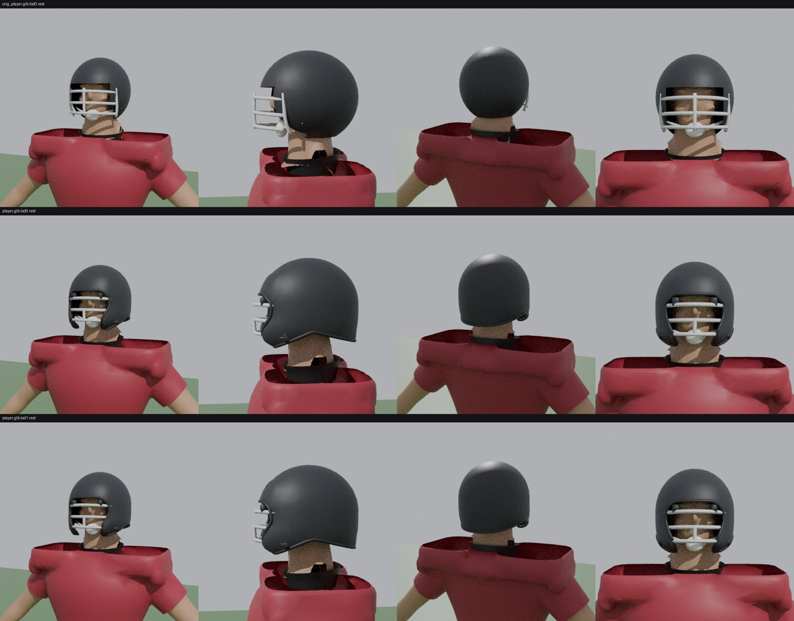

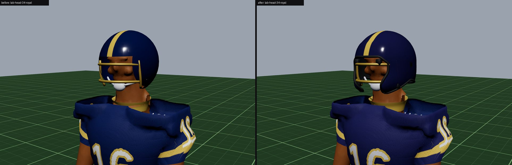

### 2.2 The known bugs

- **Sleeve hem** (`build_character.covered`, `playerMaterial.ts`). The bare arm now runs 3.5 cm up inside the sleeve hem (it was 1 cm). When the arm swung forward, the hem's back edge opened onto the culled skin's ragged edge. The sleeve band's hard `step(0.24, |x|)` ran along the sleeve's inner face near the armpit and cut the band's end ragged; it now has a soft edge.
- **"Number decal" on the pants at the hip.** This was the towel: see gap 5. The towel is rebuilt as cloth (`gear.towel`):
  - 9 cm narrowing to 7.5 cm, hanging 15 cm;
  - a tuck behind the waistband and two lengthwise folds;
  - a slight curl at the free end;
  - its own weights (`build_character.towel_weights`): the pelvis at the tuck, up to 45% left thigh at the free end;
  - terry shading.

  Heavier thigh weights (0.65 quadratic, 0.7 linear) collapsed its faces when the thigh lifted, and the hip gate caught it.
- **Back of the knee** (`build_character.sharpen_knees`). The pants switch from thigh to calf within ±3 cm in front, over the knee pad. Behind the knee they now blend over ±6.5 cm, so the back compresses into a crease instead of folding through itself. Separately, the leg skin runs 7 cm up inside the pants hem (it was 2 cm): at the sprint the hem rode the calf up past the culled sock's ragged top edge.
- **Shoulders overhead** (`tools/blender/lib/corrective.py`, new). This is the corrective that `docs/m65/BODIES.md` section 3 called for. For each LOD:
  1. pose the high point (`catch_high_point` frame 25);
  2. relax the shoulder region of the skinned jersey and skin in place, with Taubin smoothing (a Laplacian step and a negative one, so it keeps its volume). The region is the cap, the lip and the top of the sleeve, and stops before the elbow;
  3. carry each vertex's offset back to rest through the inverse of its own blended skinning matrix;
  4. store the result as shape keys `reach_l` / `reach_r`.

  At runtime, `Player.updateReach` sets each key's weight from that arm's elevation every frame (upper arm against the chest-to-pelvis axis, smoothstep 105° to 160°). The build's skinning gate applies the same weights as it measures (`lib/skin.py`). It runs 24 / 10 / 4 smoothing passes on LOD 0 / 1 / 2, because a coarse LOD moves further per pass; with 40 passes LOD2 over-relaxed and collapsed 5.1%. The weights are zero through nearly every frame of play.

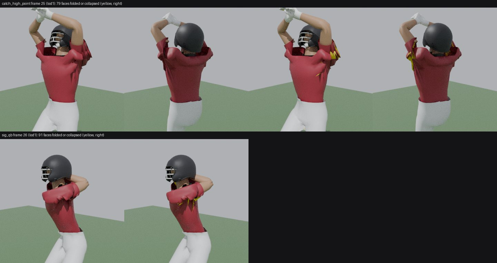
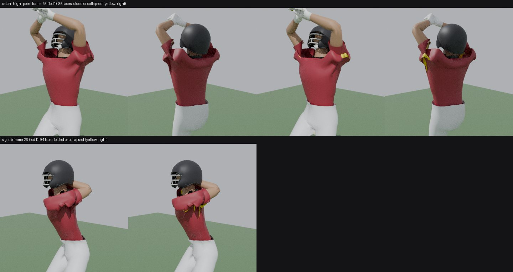

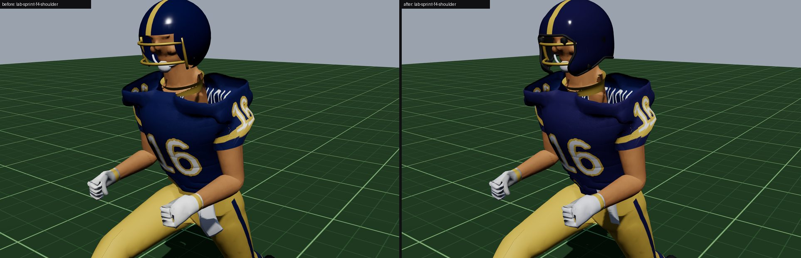

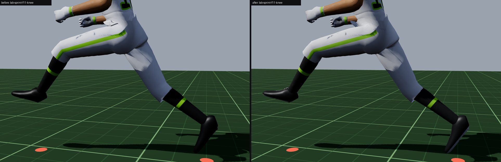

**Skinning gate** (`player.json skinGate`, every player LOD; worst frame of the group's clips; collapsed share, folded share):

| Group | Region | Collapsed | Folded | Limit now |
|---|---|---|---|---|
| speed | shoulder | 1.83% → 1.83% | 9.52% → 9.52% | 2.2% / 11% |
| speed | elbow | 4.68% → 5.41% | 8.45% → 8.11% | 5.5% / 10% |
| speed | hip | 1.49% → 1.38% | 3.21% → 1.93% | 1.8% / 2.5% (was 4%) |
| speed | knee | 4.22% → 2.28% | 15.57% → 3.75% | 3% / 5% (was 5% / 18%) |
| reach | shoulder | 2.56% → 2.20% | 18.32% → 17.58% | 3% / 21% |
| reach | elbow | 4.26% → 4.50% | 12.68% → 10.81% | 5% / 15% |
| reach | hip | 1.26% → 1.17% | 2.41% → 2.00% | 1.6% / 3% |
| reach | knee | 5.42% → 2.28% | 13.93% → 3.26% | 3% / 4.5% (was 6.5% / 17%) |

Cap lift at speed: 2.3 cm, unchanged. What the knee numbers mean:

- With the same faces measured, the knee hand-over alone took speed-knee folding from 15.6% to 7.9%.
- The rest of the drop comes from the extra leg skin inside the hem joining the region. That skin bends well, so it dilutes the share.
- The knee and hip limits are tightened to guard the new numbers.

The speed elbow's collapsed share rose 4.68% → 5.41%, inside its 5.5% limit. Keeping more arm skin inside the sleeve changed how LOD1's 3,000-triangle body budget is spent. It's close to the line and worth a look the next time the arm is touched.

### 2.3 Kit shading under stadium light (`playerMaterial.ts`)

- **Albedo range.** Every part except skin is clamped to 0.022–0.72 linear. White polyester and white paint reflect about 70–80%, black fabric about 2–4%. The skin, eye black and the helmet's inside are left alone.
- **Cloth sheen.** Jersey, pants, socks, towel, collar and the official's shirt brighten toward grazing angles (`1 + 0.4·(1 − N·V)³`). This is the rim a broadcast shows on knit fabric. It costs one multiply per fragment, with no extra light loop; `MeshPhysicalMaterial`'s sheen would add a lobe per light.
- **Skin:** a warm rim, standing in for light scattered under the skin.
- **Jersey knit:** the holes' depth scales with the jersey's brightness (full on black, a third on white). This fixes the M6.6 critique of a field of dark dots on white.
- **Socks:** a ribbed knit bump around the leg, faded out with the pixel footprint so it can't shimmer.
- **Pants:** a belt in the jersey's colour at the waistband, with a stitched edge.
- **Cleats** (also gap 3): a two-tone sole (white under a dark cleat, dark under a light one), a welt line, and laces down the instep.
- **Face** (gap 9): eye sockets shadowed under the brow. Eye black is a new `Variety.eyeBlack` pick: 40% of running backs, receivers and defensive backs, 25% of linebackers, linemen and tight ends, 15% of quarterbacks, 10% of others. It's drawn last, so every existing pick stays what it was.

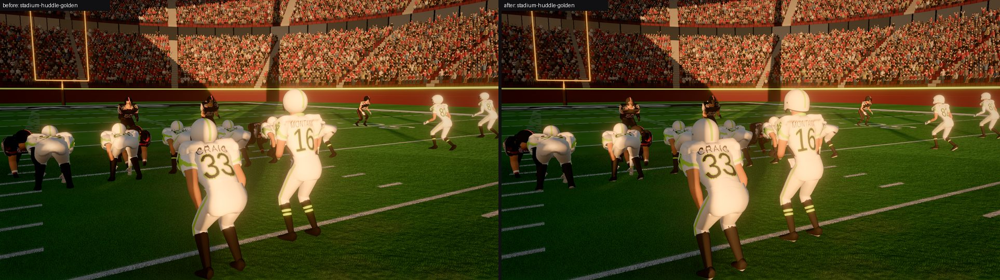
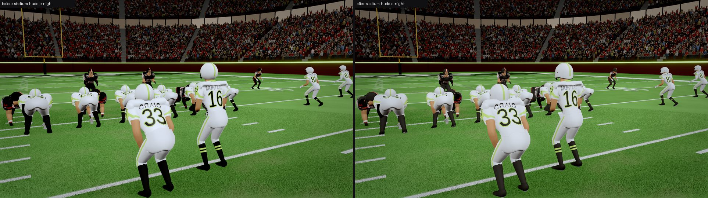
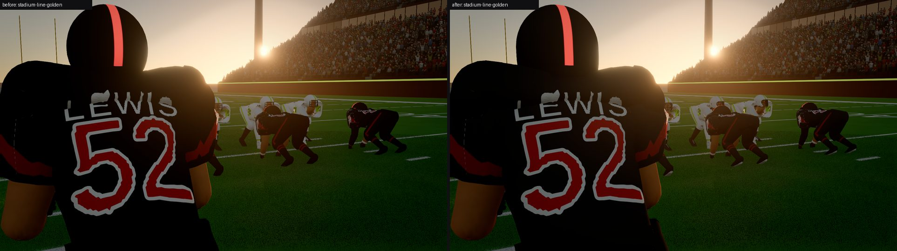
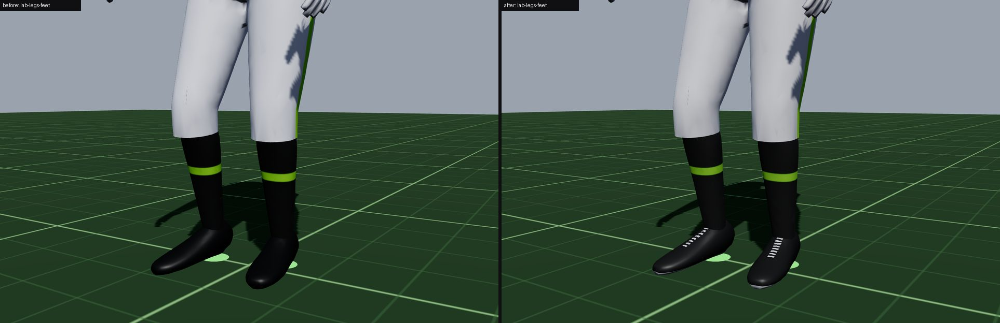

### 2.4 Turf wear (`playerAsset.ts`, `playerMaterial.ts`)

`Player.updateWear` runs once a frame from `updateLod`, or from `Player.tick` in the Lab. It reads only the drawn pose, so the sim is untouched.

- A trip to the ground counts when the pelvis drops under 22% of the player's height above the turf: a tackle, a dive or a pile.
- Each trip adds to the legs (knees, shins, thigh fronts), to the side he landed on, and to helmet scuffs. Which side is decided by the chest's facing: face down dirties the front, on his back dirties the back and seat, on a side gets half of each.
- He has to be back over 40% of his height before the next trip counts.
- About ten trips soak a kit. A back or receiver gets there in a game; a lineman who stays up stays cleaner.

The shader draws soil and grass blotches that spread as wear grows. On dark kits, dried soil reads as dust. A substitution (a new name or number in the kit) comes on clean. `?wear=0..1` presets every kit for screenshots.

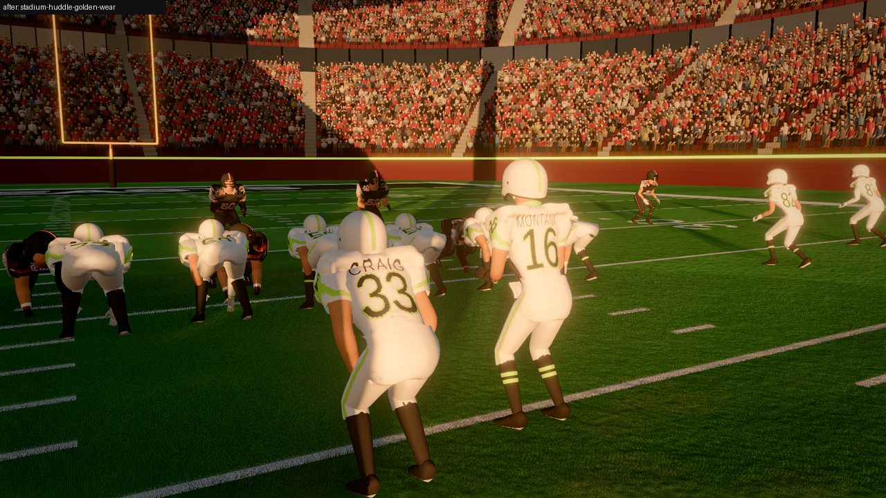
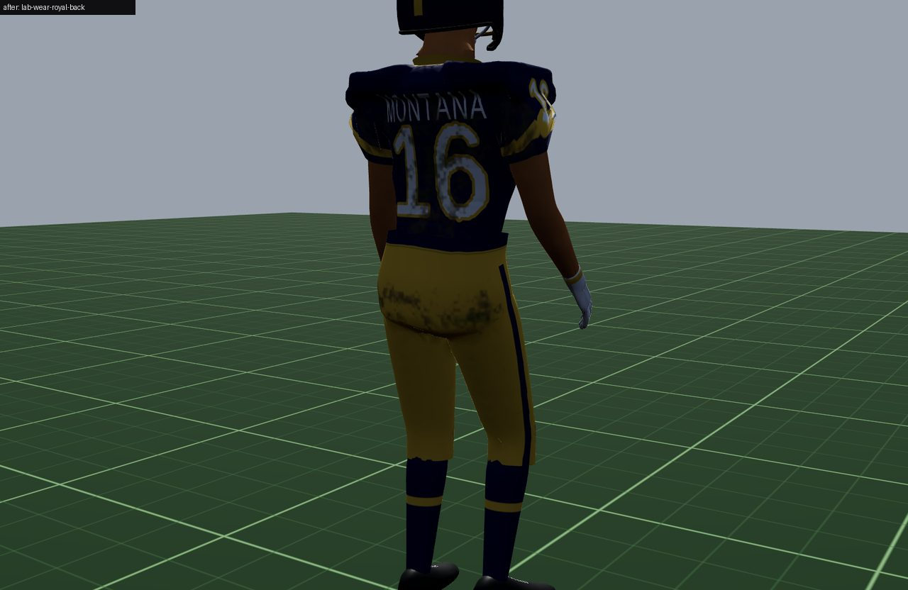

### 2.5 Tools and harness

- `tools/blender/preview_gear.py` (new): close-up stills of the gear in Blender, from any build (`--file`), posed (`--pose clip:frame`), with or without the correctives (`--noreach`).
- `skin_stills.py`: gains `--file`, and applies the correctives as the runtime does (`--noreach` turns them off).
- `build_character.py`:
  - `BTB_PLAYER_OUT` builds somewhere other than `public/` (iterating without touching the shipped file);
  - the manifest lists the correctives.
- `tools/shots/characters.spec.ts` (new, `BTB_CHARS=1`): the stills here and the perf counts. The perf test reads three successive frames, because the far shadow cascades redraw every third frame.
- `playwright.config.ts` (the e2e suite): takes `BTB_PORT` like the shots harness. Another checkout's server held 5174, and `reuseExistingServer` would have tested that checkout's code.

## 3. Performance (counts, not frame times: no GPU here)

**The lineup from the broadcast camera** (`?lineup&perf&cam=-50,14,-13.7,0,0,-11.5,18`): 22 players, Golden Hour, 1920×1080 at dpr 1. Counts are read off the `?perf` screen over three successive frames. The two values per tier are a frame without and with the far-cascade redraw.

| Tier | Draw calls | Triangles before | Triangles after | Δ | Textures | Programs |
|---|---|---|---|---|---|---|
| Medium | 143 / 176 | 1,475,505 / 1,795,491 | 1,510,969 / 1,836,037 | +35,464 / +40,546 (+2.4% / +2.3%) | 99 → 99 | 73 → 73 |
| Ultra | 172 / 178 | 2,064,360 / 2,142,790 | 2,104,906 / 2,183,336 | +40,546 (+2.0%) | 101 → 101 | 74 → 74 |

- **Draw calls: unchanged.** Every new piece (trim, clips, towel) is in the one skinned mesh per player, styled by part id.
- **Triangles per LOD** (`player.json`):

  | LOD | Before | After | Δ |
  |---|---|---|---|
  | High | 24,775 | 26,965 | +2,190 (+8.8%) |
  | Medium | 12,066 | 13,216 | +1,150 (+9.5%) |
  | Low | 3,607 | 3,838 | +231 (+6.4%) |

  From the broadcast camera every player draws Medium or Low, and every player's shadow proxy is the Low LOD in each cascade. Where the Medium LOD's +1,150 goes:
  - the rubber trim, about 690;
  - four mask clips, 256;
  - the shell's extra budget, 200.

  At Low, the trim is 3-sided and there are no clips.
- **Texture memory: no new textures.** Everything is procedural in the existing shader, and the only player texture is still the shared glyph atlas.
- **Morph data.** The player LODs carry 10 morph targets instead of 8 (the two correctives). Three.js keeps them in one morph texture per geometry, shared by all players: about 2.83 MB → 3.86 MB (24,114 vertices × 10 targets × 16 B). The vertex shader skips zero-weight targets, and the correctives are zero almost always.
- **The asset**: `player.glb` grows from 3,462,724 to 3,643,400 bytes (+180 KB, +5.2%).
- **Fragment cost.** Per player pixel there's extra ALU, with no texture reads, no extra lights and no extra passes:
  - one sheen multiply;
  - one value-noise call per stain region, and only where wear > 0;
  - the sock ribs' `atan`;
  - a few `smoothstep`s on the cleats, helmet and pants.

  Players are about 2–4% of the pixels from the broadcast camera. At huddle distance they're a large share, but the cost is a handful of instructions next to the existing knit, muscle and lettering code.
- **Against the M6 gate.** The M6 gate (206 draw calls, 1.71 M triangles mid-game on Ultra, on the owner's M1 Pro) was a different scene: a live play with officials, at 2029×1023. This change adds no draws and about 2% of triangles to a broadcast frame. **Not verified** on the owner's hardware; please re-check the `?perf` screen mid-game on Medium.
- **CPU**: per player per frame, about six bone world positions, an `acos` per arm (the corrective), and a pelvis height check (the wear). A few hundred floating-point operations.

## 4. Before and after, the rest

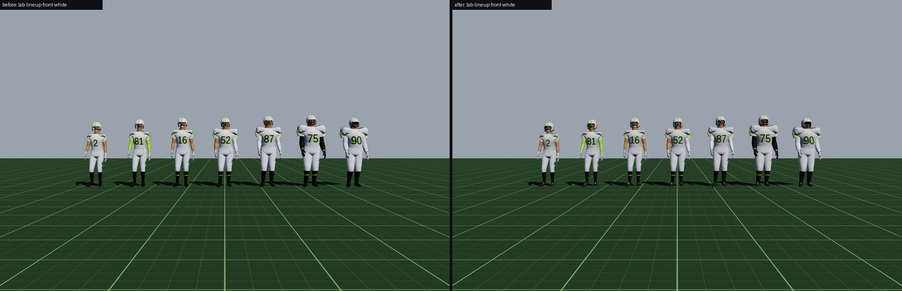
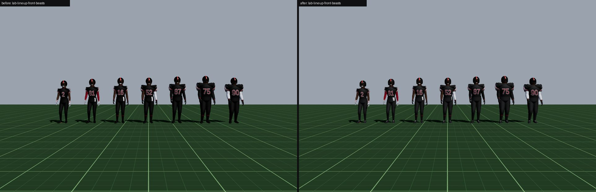
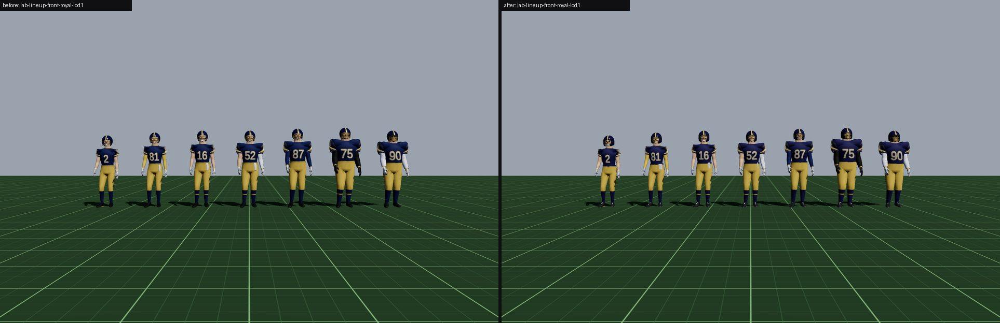
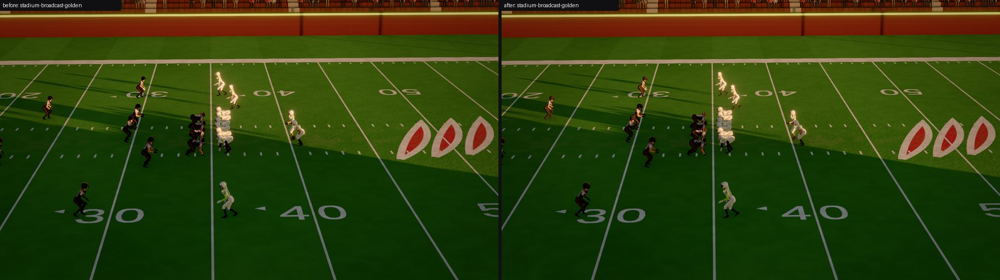
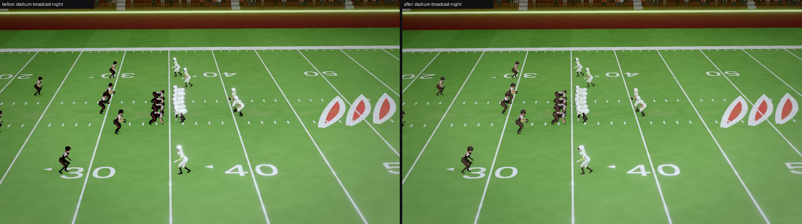
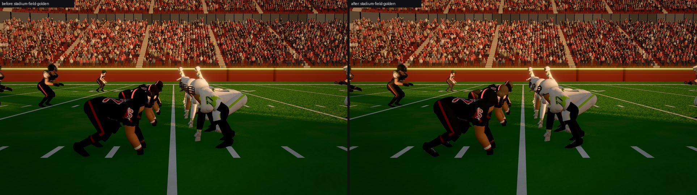
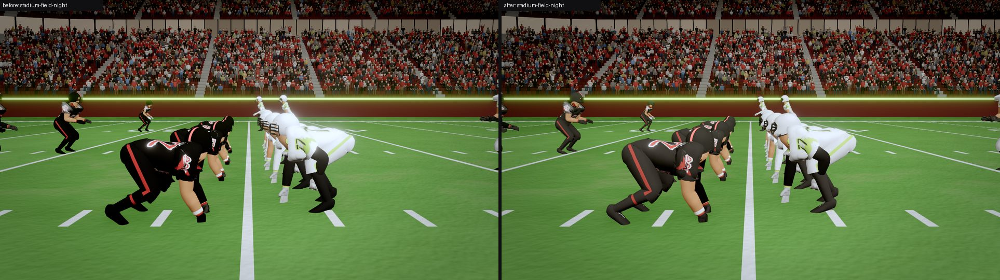
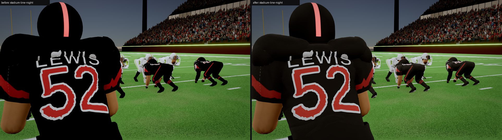
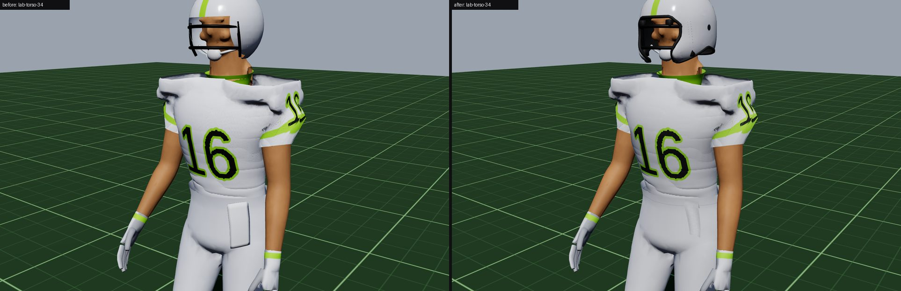
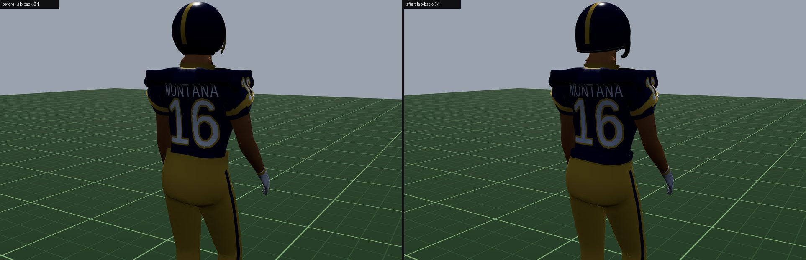
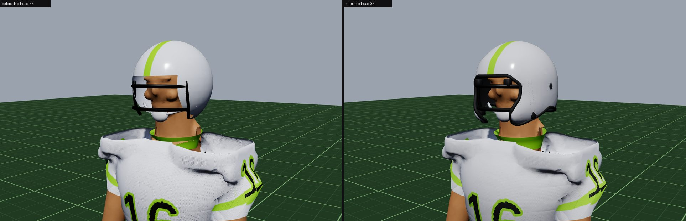
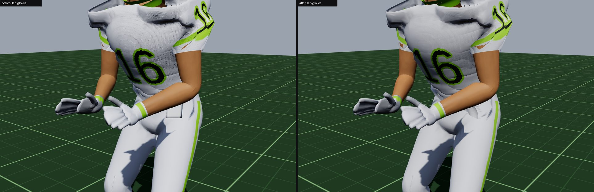
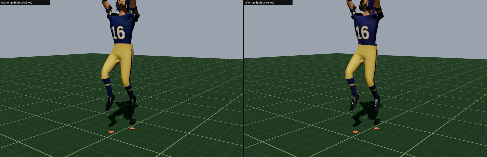

## 5. Honest critique

**What works:**

- **The helmet is the real win.** At huddle distance and in the Lab it now reads as a modern shell: the jaw flaps wrap the face, the dark rubber edge outlines the face opening and the bottom edge, the clips hold the mask on, and the ear hole and black padding show where they should. From behind it's still a dome; at broadcast distance it's a few pixels and you see a slightly longer, lower shell rather than a ball.
- **Wear sells "a game has happened."** At 0.6, soil on the seat, the back and the pads, and grass on the knees, read at huddle distance in Golden Hour. On the Royal kit's gold pants the seat looks properly ground in.
- **Cleats**: the sole line and laces turn a blob into a shoe at huddle distance. The laces are a little bright and regular ("piano keys") up close.
- **The towel no longer reads as a number.** It's a small cloth at the belt.
- **Black kits**: the Beasts' black now shows the pad shapes and folds in the backlit line shot, where before it was a silhouette.

**What doesn't, or not yet:**

- **White kits at broadcast distance in Golden Hour still glow.** The albedo clamp (0.9 → 0.72) gives the shells and jerseys some shading at huddle distance. From the broadcast camera, though, the sunlit white players still carry a bloom halo. That's the Golden Hour preset's bloom threshold reacting to any bright, sunlit surface, which is the lighting's call (not changed here). At Night the whites still read flat.
- **Overhead (LOD2).** The correctives calm the wing beside the helmet at LOD0 and LOD1 (the stills above). LOD2, which the broadcast camera uses for distant players, still shows two small "horns" at the high point: with only 4 smoothing passes on so coarse a mesh, the shape moves little. The folded count at the high point's worst frame barely moved (79 → 85 flagged faces at LOD1, frame 25). This is a visual fix, not a measured one. The real fix is still a deltoid helper bone or a sculpted corrective.
- **The pants hem has a sawtooth at the calf.** It shows before and after, in the stance and at the sprint. It isn't the sock's edge (that's fixed). It looks like the hem ring's vertices being skinned unevenly or the double-sided fabric's inside showing. I didn't get to the bottom of it.
- **Behind the knee at the sprint** a flat, lighter patch remains in the Lab (`lab-sprint-f11-knee`). By the measure the folding is mostly gone, but the shape is still a hinge, not a crease. A knee helper bone or a corrective like the shoulder's would finish it.
- **A small skin flap beside the neck** is still visible in the close-ups. Trimming the keep radius from 0.092 to 0.083 m took off the trapezius flaps, but not this one.
- **Lineman pads balloon**, and the pad arch reads as a hood behind the neck in profile. This is the M6.6 open item: it's the linemen's silhouette, so it's the owner's call.
- **Nameplates break up close.** In `stadium-line-*`, "LEWIS" has a corrupted glyph, and the SDF outlines wobble at a metre's distance. This is pre-existing and the same before and after. It may be the dev server refusing the Bungee font from outside its allow list (this worktree's `node_modules` is a symlink), which would make it a harness artefact rather than the game. Worth a check on a real build.
- **Faces** are one sculpt for everyone. Skin tones are all the default until `data/characterization.json` is filled in, which isn't a model problem.
- **LOD transitions** weren't changed. The 12% hysteresis from M6.5 stands. The Low LOD now has 3-sided trim and no clips, which reads the same at the distance it's used.
- **Build determinism.** `build_character.py` is no longer byte-for-byte reproducible: the corrective's float math (NumPy linear algebra) differs in the last bits from run to run. Geometry, the gate numbers and the manifest are identical.

## 6. What's left

1. A **deltoid helper bone or sculpted corrective** for the overhead shoulder at LOD2. A knee corrective the same way.
2. The **pants hem sawtooth** at the calf.
3. The **lineman pads** (the owner's call) and the pad arch's hood in profile.
4. **Cleat geometry**: a real sole slab with a lip, and studs.
5. **Nameplate glyphs up close**: confirm on a production build first.
6. **The Golden Hour bloom on white kits** from the broadcast camera: a lighting-side threshold, or a kit-aware exposure.
7. Wear from **contact without a fall** (a block held for three seconds dirties a lineman's front). That needs a contact hook from the sim side.
