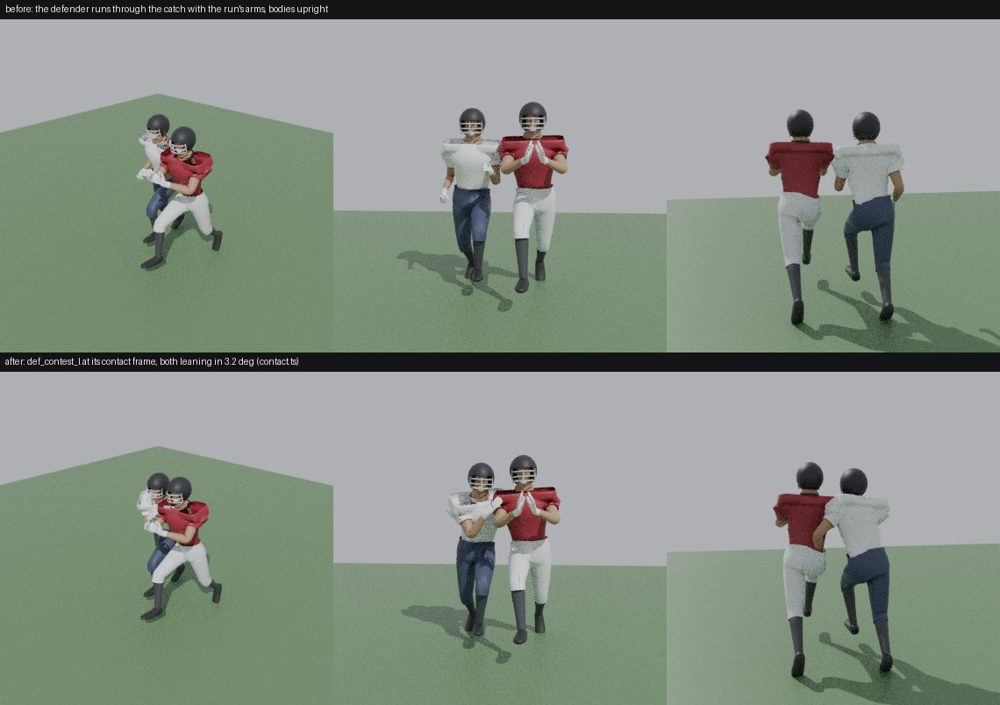
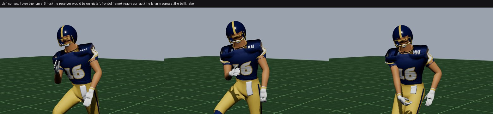
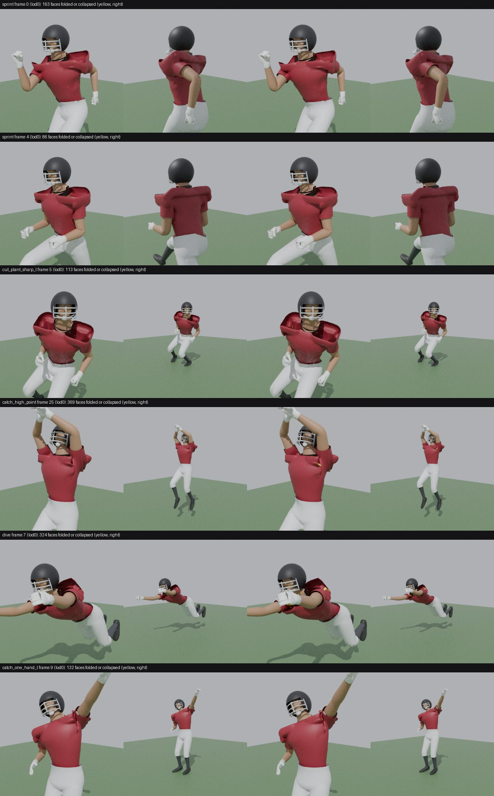
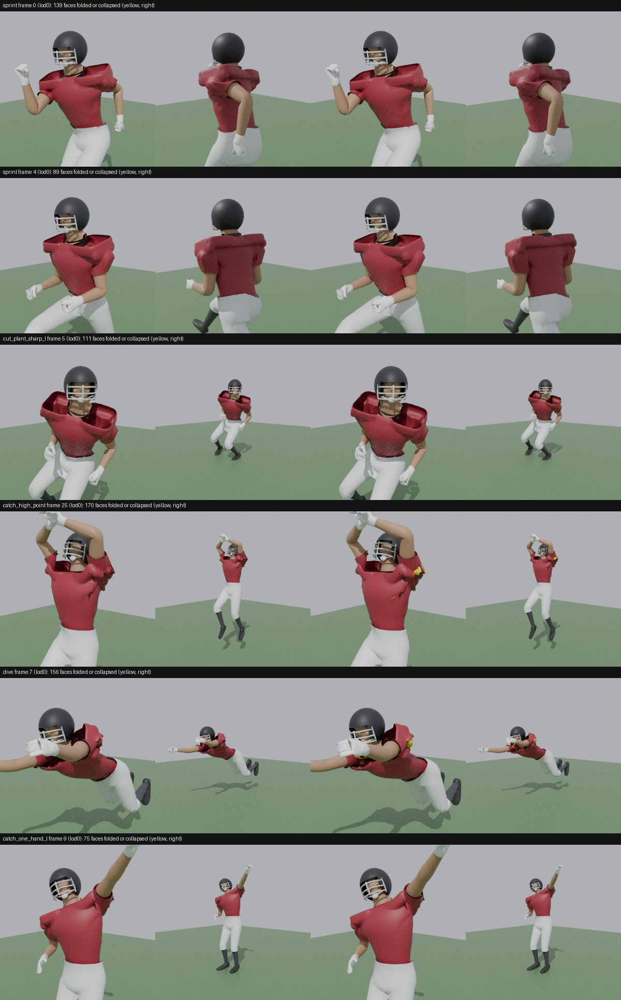
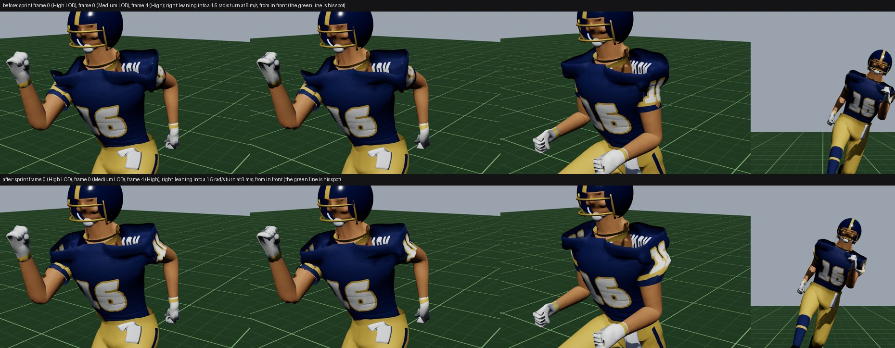

# M6.5 #12, the body side: collision volumes, contact, skinning at speed

Playtest 1 (`docs/PLAYTEST-1.md`, "Tackling and physics") said the collision volumes don't match the models, a receiver (Tyreek) clipped through a defender on a catch, and the mesh deforms in fast movement. This is the body side of item 12: what the drawn bodies measure against the sim's circles, what actually put one body through another, the render-side contact at a contested catch, and the skinning at speed. Nothing in `src/sim` changed; the sim's radius is a proposal below for the session that owns it.

## 1. The model against the sim's circle

The sim treats each player as a circle of `fx.radius = 0.36 + (weight − 200) × 0.0008` yd (`src/sim/effects.ts`, weight = the era-equivalent `weightEq`), and `separate()` holds two players at least `rᵃ + rᵇ` apart.

`tools/blender/measure_bodies.py` poses the shipped `player.glb` (LOD 0) with the keyed clips and shapes it the way the runtime does for each body (`bodyShape.ts`: scale by height, `heavy`/`lean`/`belly` from BMI; `variety.ts` at its seeded spread's centre: the position's `pads`, `neck`, `waist`, `calves`, `arms` shapes and the shoulder-width bone offset). Linear blend skinning is linear in the rest position, so each frame is evaluated once per shape key and every body type is summed from them, exactly. Body types are the roster's median height and weight by position (`data/ratings/ratings.v1.json`) plus a small fast receiver and a big tackle.

Columns: the sim radius in metres; the pad half-width (the widest point across the pad caps and sleeves, standing); the trunk's half-depth at the chest; how far the arms get out to the side through the run and sprint cycles; how far the arms reach in the catch clips (to the side, and ahead of the root); then the overlap of two such bodies at the sim's minimum distance (2r): side by side, pads to pads; the same with one of them in the animator's bank into a turn at its limit (0.35 rad) as it pivoted until now, about the feet; and one reaching to the side for a catch into the other. Negative is air between them.

| Body | Ht, wt (era wt) | Sim radius (m) | Pad half-width | Half-depth | Arms in the run, to the side | Arm reach in the catches | Side by side at 2r | + bank at its limit (feet pivot) | Catch arm into him |
|---|---|---|---|---|---|---|---|---|---|
| WR small | 5'10" 185 (190) | 0.322 | 0.273 | 0.153 | 0.295 | 0.91 side, 1.15 ahead | −9.8 cm | +36.9 cm | +54 cm |
| CB | 6'0" 193 (199) | 0.328 | 0.280 | 0.156 | 0.303 | 0.93 side, 1.18 ahead | −9.6 cm | +38.4 cm | +56 cm |
| WR | 6'0" 195 (200) | 0.329 | 0.281 | 0.157 | 0.303 | 0.93 side, 1.18 ahead | −9.7 cm | +38.3 cm | +56 cm |
| S | 6'1" 200 (207) | 0.334 | 0.284 | 0.159 | 0.307 | 0.95 side, 1.20 ahead | −10.0 cm | +38.7 cm | +56 cm |
| RB | 5'11" 215 (216) | 0.341 | 0.327 | 0.170 | 0.346 | 0.93 side, 1.17 ahead | −2.8 cm | +44.6 cm | +57 cm |
| QB | 6'3" 215 (223) | 0.346 | 0.318 | 0.165 | 0.339 | 0.98 side, 1.23 ahead | −5.7 cm | +44.4 cm | +60 cm |
| LB | 6'2" 235 (239) | 0.358 | 0.357 | 0.181 | 0.376 | 0.97 side, 1.22 ahead | −0.2 cm | +49.1 cm | +61 cm |
| TE | 6'4" 250 (252) | 0.367 | 0.367 | 0.187 | 0.387 | 1.00 side, 1.25 ahead | −0.1 cm | +50.6 cm | +63 cm |
| DE | 6'5" 262 (269) | 0.380 | 0.401 | 0.201 | 0.420 | 1.02 side, 1.27 ahead | +4.3 cm | +55.7 cm | +66 cm |
| DT | 6'4" 292 (306) | 0.407 | 0.405 | 0.216 | 0.423 | 1.01 side, 1.26 ahead | −0.4 cm | +50.3 cm | +60 cm |
| OL | 6'4" 300 (314) | 0.413 | 0.406 | 0.220 | 0.424 | 1.01 side, 1.26 ahead | −1.4 cm | +49.3 cm | +59 cm |
| OL big | 6'6" 340 (345) | 0.435 | 0.416 | 0.241 | 0.435 | 1.04 side, 1.29 ahead | −3.8 cm | +48.2 cm | +58 cm |

What it says:

- **The circle is about right across the pads for the big men and generous for the skill players.** A receiver and a corner held at the sim's minimum are ~10 cm apart pads to pads: air, not contact. A defensive end's pads (lineman pads on a 262 lb frame) are 4 cm wider than his circle. Front to back the circle is far too generous (the trunk is only 0.15-0.24 m deep), but that's the direction a circle can't fit and bodies rarely meet square.
- **The sim's circles weren't what put Tyreek through the defender.** At the ball's arrival the sim's trunks overlap in 0.2% of targets, worst 4 cm (`tools/sim/catchcontact.ts`, 612 arrivals over every pass play against every call; the caller's 0.8% counted circles, not trunks). What moved the drawn body was the animator's **lean into a turn, pivoting at the feet**: a receiver adjusting to the ball in the air turns hard enough to bank at the lean's limit on **one arrival in five** (21%), and 20° about the feet swings his chest ~0.5 m sideways off the sim's spot. With the drawn chests, **3.8% of arrivals overlapped by up to 46 cm**: a torso through a defender. That's the clip the owner saw.
- **The arms reach far past any circle** (0.9-1.0 m to the side, 1.2-1.3 m ahead at the catch): no collision radius can hold them, and none should. Contact at the catch point has to be drawn (section 2), not prevented.

### (a) The sim radius, proposed (not applied: `src/sim` belongs to another session)

Fit the circle to the pad half-width, so two bodies at the sim's minimum are pads on pads. `measure_bodies.py` sweeps each position over its roster range of height and weight (5 heights × 7 weights) and fits `hw = a + b·(lb − 200) + c·(in − 74)`; every fit is within 0.7 cm of the model. In yards:

```
radius (yd) = A[pos] + B[pos] · (weightLb − 200) + C[pos] · (heightIn − 74)

pos       A        B          C
WR      0.3167   0.000172   0.00334
CB      0.3150   0.000202   0.00316
S       0.3145   0.000233   0.00296
RB      0.3662   0.000203   0.00388
QB      0.3424   0.000198   0.00350
LB      0.3824   0.000221   0.00381
TE      0.3836   0.000182   0.00420
DE, DT  0.4145   0.000152   0.00478
OL      0.4167   0.000112   0.00500
```

Use `p.weightLb` and `p.heightIn` (the body the render draws), not `weightEq`: the model is shaped from the listed weight. The position matters more than the weight: linemen wear lineman pads (`variety.ts` `pads` +1) and skill players slim ones (−0.8), a 5 cm difference in half-width at the same weight. At the medians it moves the receivers, corners and safeties in by ~0.05 yd (0.36 → 0.31), leaves linebackers, tight ends and interior linemen where they are, widens a defensive end (0.415 → 0.44) and trims the biggest tackles (0.476 → 0.453). Whoever applies it should rerun the harness: separation at the catch, tackle and block reach (`play.ts` armReach, `ai.ts` ENGAGE_REACH and the pass-set trigger are all sums of radii plus a reach) and the pass-rush lanes all move with it.

## 2. Contact at a contested catch (render side)

`src/render/game/contact.ts` works on what's drawn, never on the sim:

- **Trunks, not circles.** Each body's trunk is an ellipse at the pads: the fitted half-width across and half-depth along his drawn facing (`bodyExtent`, the same fits as above), centred on his chest bone after the clips and the run's lean (`PlayerAnimator.trunk`).
- **No overlap.** Any two standing bodies whose trunks overlap are pushed apart by a render-only offset of the root, split evenly, at most 20 cm, eased in over ~0.1 s and out over ~0.25 s (`ContactSmoother`). The offset is measured without itself, so it can't pump. Bodies that are down, falling or in a lying clip (the tackle, a dive) are left to their clips.
- **Contact at the catch point.** When the ball is 0.45 s out, `choreo.ts contests` looks for a standing defender whose spot at the arrival is within 1.2 yd of the receiver's (`contestFor`). The pair then **leans into each other** (about the feet, which stay planted) by the angle that closes half the gap each at pad height plus 3 cm of press, at most 10°: a shoulder into him, pads meeting. And the defender plays **`def_contest_l`/`_r`**, an overlay over his run keyed in `tools/blender/lib/actions_m65_contact.py`: the near hand goes to the receiver's near hip and back (the hand fight), the trunk turns and leans in, the far arm comes across the front of the receiver's body to the catch point on the clip's `contact` frame (timed to the arrival), then rakes down through the receiver's hands and the arms go back into the run. The pair holds for 0.45 s after the arrival.
- **The lean now pivots at the hips.** `animator.lean` tilts the body into a turn and a burst about a point 0.95 m up (the hips, near the centre of mass) instead of the feet: his mass follows the sim's spot and his feet swing out under the turn, which is how a runner leans. The chest moves 0.17 m off the spot at the bank's limit instead of 0.5 m. Measured the same way, drawn trunks overlap at 1.8% of arrivals by at most 19 cm (was 3.8%, 46 cm), and the push-apart takes those out.

Blender stills of a receiver catching in stride with a corner at his hip, at the sim's minimum distance (`tools/blender/preview_contest.py`; the defender in white): before, the defender runs through it with the run's arms swinging and 10 cm of air between the pads; after, his far arm is across the receiver's front at the ball, his near hand on the receiver's back, and the two lean in until the pads meet.



In the runtime (the Animation Lab, `tools/shots/bodies.spec.ts`), the contest overlay over the run at 6 m/s, reach, contact and rake:



Honest critique:

- It reads as contact in the stills: an arm across and a hand on the back is what a broadcast shows at a contested catch. The first cut of the clip aimed the far hand at a point the right arm can't reach (0.8 m across from the right shoulder); in the Lab it came out low across the belt, reading as nothing. It now aims across the defender's own chest, at the edge of the arm's reach, and meets the receiver's hands in the pair stills.
- In the Lab the near hand hangs low by his side at the contact frame; with a receiver there it's at his hip, but on its own it reads as a dropped arm. It could come up to the receiver's back or near shoulder. The lean is small (3° for two skill players at the sim's minimum) because they only have 10 cm to close; with the proposed radius it will mostly be the press.
- **Not yet watched in a live contested catch from the broadcast camera.** The capture needs a scripted play with a defender at the catch point, and rendering here is seconds per frame; the scripted clips in `src/game/clips.ts` are completions in space. That's the next capture (see "What's left").
- The overlay is one technique for every defender and every catch look. A corner in phase at a go ball plays the ball over the shoulder, a safety driving on a dig plays through the near shoulder, a linebacker on a tight end gets his hands in the chest. The receiver has no contact response of his own beyond the lean (boxing out, the "strong hands" through contact that Gronk should show).
- The push-apart is equal for both bodies; a 340 lb tackle should give less than a 185 lb receiver.

## 3. Skinning at speed

`tools/blender/lib/skin.py` measures the skinned mesh through a clip, per joint region (shoulder, elbow, hip, knee: faces whose vertices blend the two sides of the joint): faces collapsed below 20% of their area, faces folded through themselves (the normal turned more than 120° from where their own bones carry it), and edge stretch. `skin_check.py` prints the worst frames; `skin_stills.py` renders them with those faces painted yellow.

The candidates the brief listed:

- **Dual quaternion vs linear skinning.** Not a cause: three.js skins linearly, and so does Blender's armature modifier without preserve volume, so what the tools measure is what the game draws. Nothing collapses the way DQS/LBS mix-ups do.
- **Skin weights at the shoulders: the cause.** The pad cap's outer third (the epaulet and its lip, |x| 0.22-0.30 m) was 70-95% upper arm (`build_character.pads_rigid` faded the shell to the arm from 0.22). At the sprint's full arm swing that corner travelled 10-13 cm with the arm while the rest of the cap stayed on the chest, and stood up off the shoulder like a fin, every stride, on every player; overhead it collapsed into the neck. Measured as the caps' 95th-percentile distance from where the chest alone carries them (Medium LOD, the broadcast's): **sprint 12.2 cm, run 9.9, sharp cut 8.7**.
- **Extreme joint rotations: the overhead reaches.** An arm overhead (the high point, the dive, the one-hander) put the whole 150-170° in the shoulder joint, with the clavicle still.
- **Hips and knees.** The back of the knee at the sprint's heel recovery (128°) and in the sharp cut folds 15-17% of its faces, and the buttock at the dive; in the stills they're inside the crease and don't show. Left as they are.
- **LOD switching: a contributor.** The broadcast camera puts players at 50-70 px, right across the Medium/Low switch at 64 px, with no hysteresis: a player running across it swapped meshes, and the Low LOD bends differently at the shoulders and knees. It read as the body changing shape.

The fixes:

- **The pad cap is a shell** (`tools/blender/lib/skinfix.py pad_shell`, one line in `build_character.py` after `pads_rigid`): the whole cap out to its lip rides the pad bone (on the chest, with the runtime's bounce spring), blending toward the clavicle at its outer edge; the sleeve hands over to the arm in a 6 cm band under the lip, where the fabric stretches rather than folds. Cap lift at speed: **sprint 12.2 → 2.3 cm, run 9.9 → 1.5, sharp cut 8.7 → 0.0**.
- **The shoulder girdle rises with the arm** (`tools/blender/lib/poses.py shoulder_rhythm`, applied to every keyed pose): past 70° of arm elevation the clavicle rises about one degree for every three of the humerus, up to 28° (the scapulohumeral rhythm: Inman, Saunders & Abbott 1944; McClure et al. 2001), keeping each arm's direction and each IK hand on its target. The cap's outer edge rides the clavicle, so it lifts with the arm overhead (as real pads do) instead of the arm coming up through it. All 166 clips pass their gates; the only numbers that moved are two stance CoM margins by 0.1-0.2 cm.
- **LODs hold near a switch point** (`playerAsset.ts`, 12% hysteresis).
- **A skinning gate in the character build** (`lib/skin.py gate_lods`, written to `player.json skinGate`, the build asserts it): every player LOD through the run, sprint, carrier's sprint and sharp cut ("speed") and the high point and dive ("reach"): collapsed and folded shares per joint region, and the cap lift at speed ≤ 4 cm. Thresholds are the fixed build's numbers with a little room: a regression guard.

Shoulder, before → after (LOD 0 and 1, the worst frame of each clip; collapsed share, folded faces):

| Clip | LOD | Collapsed | Folded | Cap lift (LOD 1, p95) |
|---|---|---|---|---|
| sprint | 0 | 2.6% → 1.0% | 51 → 55 | 12.2 → 2.3 cm |
| sprint | 1 | 2.0% → 1.8% | 33 → 26 | |
| carrier's sprint | 0 | 3.4% → 1.2% | 47 → 48 | |
| sharp cut | 0 | 1.5% → 0.8% | 30 → 38 | 8.7 → 0.0 cm |
| dive | 0 | 5.2% → 0.8% | 241 → 96 | |
| dive | 1 | 4.7% → 2.2% | 118 → 50 | |
| catch dive | 0 | 4.6% → 0.7% | 273 → 97 | |
| high point | 0 | 3.7% → 2.5% | 312 → 107 | |
| high point | 1 | 3.6% → 2.6% | 145 → 44 | |
| one-hand | 0 | 4.1% → 1.0% | 97 → 49 | |

(At the sprint the folded count barely moves: the fold moved from the cap's corner, in plain view, into the armpit crease under the lip, where the stills show nothing.)

Blender, the shipped mesh, worst frames (left: as drawn; right: collapsed and folded faces in yellow). Before:



After:



In the runtime (the Animation Lab, three.js, the Royal kit), the sprint's worst frames at the High and Medium LODs, and the lean into a turn at 8 m/s seen from in front, before and after:



Honest critique:

- **At speed it's fixed where it showed.** The sprint's cap sits on the shoulder through the whole arm swing; the fin is gone at both LODs a broadcast uses.
- **Overhead is better, not good.** The one-hander is clean. The high point's near shoulder now bunches under the lip (the sleeve's hand-over band folds when the arm is vertical), where before it stretched to a spike; the dive's caps rise behind the helmet like a hood. Both are at full extension for a few frames, from the broadcast camera a handful of pixels, but a replay close-up (M7) will show them. The real fix is a corrective shape or a deltoid helper bone driven by arm elevation.
- **The Lab stills show two things that aren't skinning weights and aren't mine**: the sleeve hem has a ragged edge where the arm swings forward (the hem cut and the culled skin under it, `build_character.covered`), and a number decal lands on the pants at the hip. Both belong to the character and kit pass running in parallel; noted for them.
- The pads are wide: a lineman's cap spans 0.81 m across. Every measurement above is against the model as it is.

## Also fixed on the way

- The previews (`tools/blender/lib/preview.py`) and the officials in the game showed every body-shape key at weight 1 (the exporter writes 1 as each key's default, the importers keep it): the Blender contact sheets drew a heavy, lean, bellied body at once, and the officials (no `Variety`) kept the pads, neck, waist, calves and arms shapes on. Previews now start from the base body; `Player.applyShape` sets every key.

## What's left

- **Apply the radius** (section 1a) in `src/sim/effects.ts`, then rerun the harness and the identity pairs.
- **Watch a contested catch live** from the broadcast camera (a scripted play with a defender at the catch point; `tools/shots/catchgame.spec.ts` can take it once such a clip exists in `src/game/clips.ts`), and record it for the video set.
- Receiver-side contact (box out, catch through contact) and defender variants by technique and position; mass-weighted push-apart.
- Overhead shoulders: a corrective shape or a deltoid helper bone (section 3).
- The knee and hip creases: measured and gated, not reworked.

## Tools

| Tool | What it does |
|---|---|
| `python3 tools/blender/measure_bodies.py [out.json]` | The table and fits in section 1 |
| `python3 tools/blender/skin_check.py [--lods 0,1,2] [--clips …] [--gate] [--file old.glb] [--no-rhythm] [--try]` | Worst skinning frames per clip, region and LOD; the build's gate on any `player.glb`; `--try` previews `skinfix.py` on the shipped file without a rebuild |
| `python3 tools/blender/skin_stills.py out.png clip:frame[:view] …` | Stills of those frames, the bad faces in yellow |
| `python3 tools/blender/preview_contest.py out.png` | The contested catch, before and after |
| `node tools/run-ts.mjs tools/sim/catchcontact.ts [seeds]` | The bodies at every ball arrival: distances, the bank, and trunk overlaps at the sim's spots and with the lean about the feet and the hips |
| `BTB_BODIES=1 npx playwright test -c tools/shots/playwright.config.ts` | The runtime stills (`tools/shots/out/bodies/<BTB_BODIES_TAG>`) |
